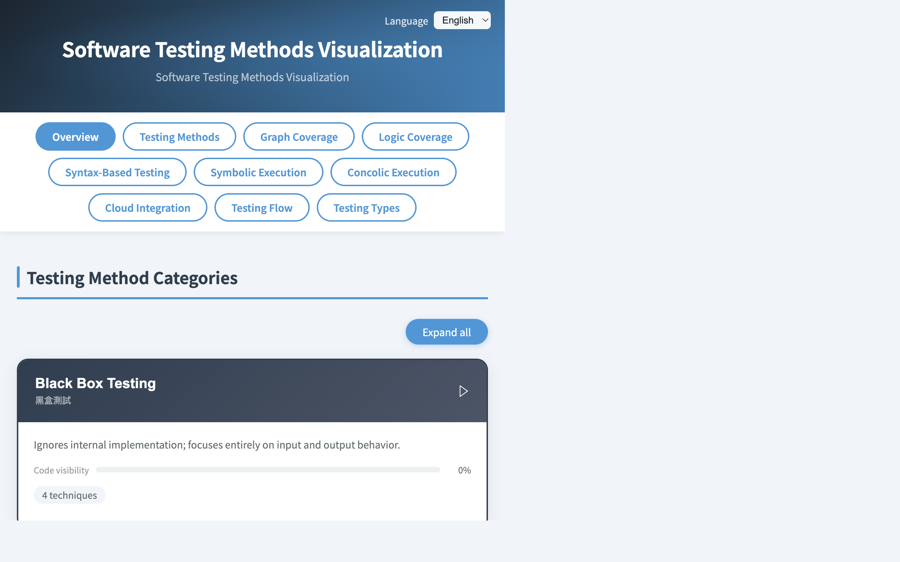
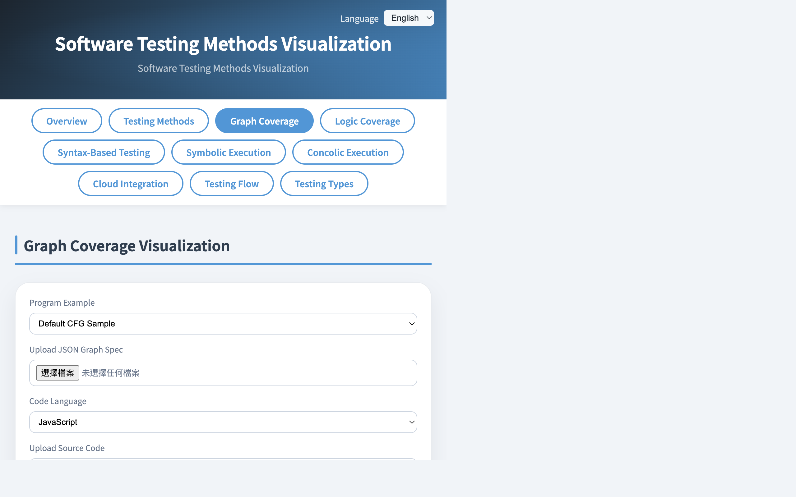
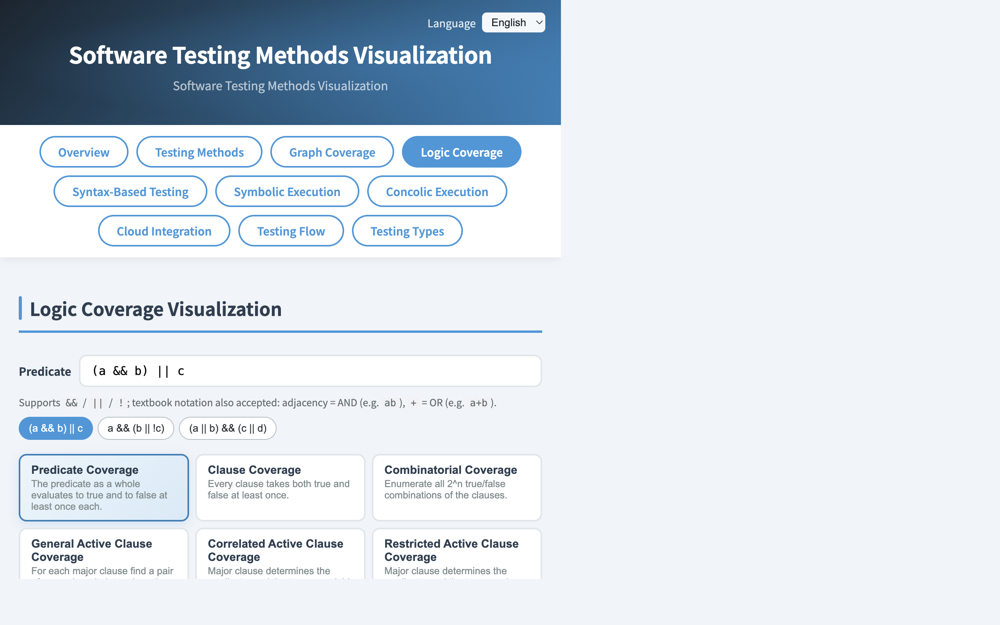
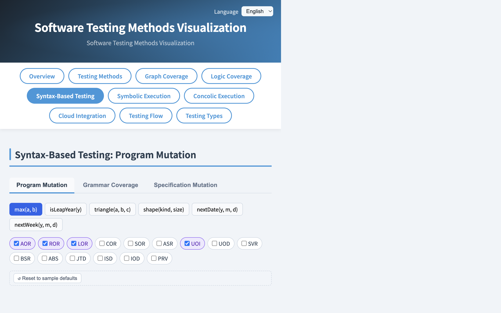
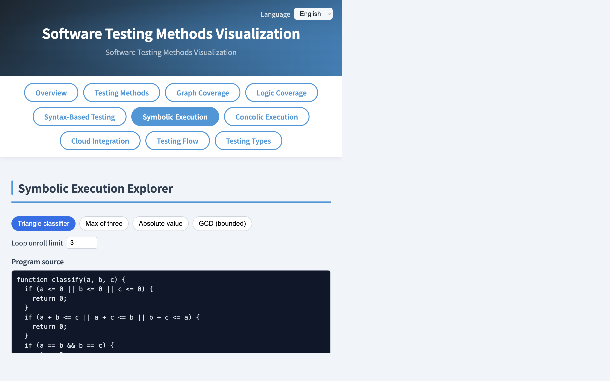
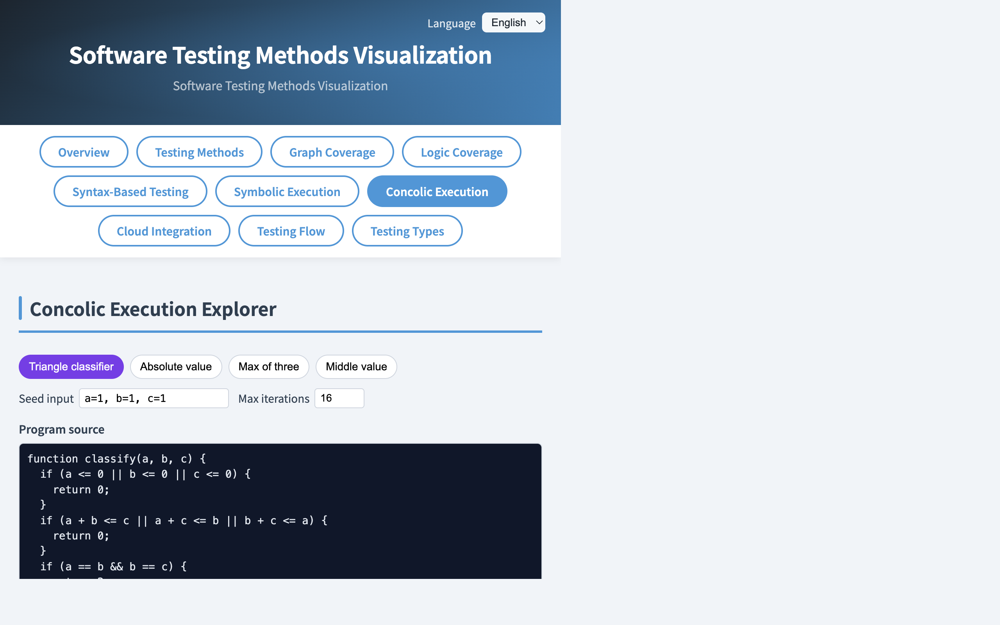
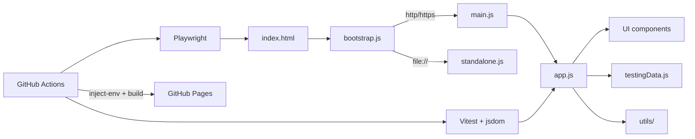

# Software Testing Visualization

[](https://github.com/skhuang/stvisual2/actions/workflows/test.yml)
[](https://github.com/skhuang/stvisual2/actions/workflows/deploy-pages.yml)
[](https://skhuang.github.io/stvisual2/)

An interactive visualization project for software testing — **69 explorers across 7 sections**: foundations, coverage criteria, execution & test generation, black-box design, group-theory testing, AI-assisted research methods (based on the **Meta ACH** paper at FSE 2025, [arXiv 2501.12862](https://arxiv.org/abs/2501.12862)), and system / E2E / acceptance testing.

Live demo: <https://skhuang.github.io/stvisual2/>

Every explorer ships with bilingual UI (English / 繁體中文), a self-test quiz, Lab Reflect / Lab Metric modes, and shareable result URLs. Class results stream to Firestore and surface in a Teacher Dashboard. Every Explorer is also tagged across five dimensions (level / technique / series / difficulty / source) so the Overview supports tag-chip filtering, course-pack presets, and per-Explorer deeplinks (e.g. `?explorer=PairwiseExplorer`).

## Preview

| Overview | Graph Coverage |
|:---:|:---:|
|  |  |

| Logic Coverage | Syntax-Based Testing |
|:---:|:---:|
|  |  |

| Symbolic Execution | Concolic Execution |
|:---:|:---:|
|  |  |

Screenshots above are from the original Foundations + Coverage sections; newer explorers (Group Theory, Risk-Based, Advanced Testing / AI-Assisted) are best seen on the [live demo](https://skhuang.github.io/stvisual2/).

## Feature Highlights

### Unit View (classroom mode)

Every Explorer has a single-window unit view for projection:
`?explorer=graph-coverage` (kebab id) or `?explorer=GraphCoverageExplorer`.
The ⛶ button enters a fullscreen focus mode (Esc or the floating ✕ exits).
The classic integrated page is still available via the Overview and
`?view=all&section=…` links; category-nav dropdowns list every unit.

### Classroom family units (Graph & Logic)

The two densest explorers are split into per-concept **family units** so a
single idea can be projected without the surrounding chrome (editor,
upload, optimization, lab/quiz). Each family is both an integrated-page tab
and its own `?explorer=` unit; the complete explorer is preserved as the
"Complete" tab.

- **Graph** — `graph-structural` (Node, Edge) · `graph-path` (Prime Path,
  Edge-Pair, Complete Path) · `graph-dataflow` (All-Defs, All-Uses,
  All-DU-Paths, with the DFG) · `graph-coverage` (Complete — all 8 + editor/upload/optimization).
- **Logic** — `logic-basic` (PC, CC, CoC) · `logic-active-clause`
  (GACC, CACC, RACC) · `logic-inactive-clause` (GICC, RICC) · `logic-dnf`
  (IC, UTPC, MUTPC, NFPC, MNFPC, CUTPNFP, with K-maps) · `logic-coverage`
  (Complete — all 14).

Family units reuse the full explorers via an additive `preset` mode, so the
complete explorers' behavior is unchanged.

### Example inputs & difficulty (dsvisual-style)

Focus units carry a compact input row — a **`範例 ▾` dropdown** (named
presets + the current-difficulty default + your last 10 inputs, in
localStorage) and a **🎲 random** button. A global **difficulty selector**
(Normal / Special / Edge case / Large) in the unit and integrated headers
drives both the default example and the random generator. Shared modules:
`src/utils/examplesStore.js`, `inputDifficulty.js`, `randomInput.js`, the
per-domain `src/data/{graphCoverageRandom,logicCoverageRandom}.js`
generators, and the `src/components/ExampleControls.js` row.

### Quiz banks and labs

- `quizzes/{en,zh}/<id>.xml` are Moodle-XML question banks;
  `npm run build:quiz` regenerates `src/data/quizRendered.js` (committed).
  Units with a bank show a Quiz button (practice / test modes, recent
  attempts in localStorage).
- Each topic bank ships easy / medium / hard difficulty tiers (15 questions
  each, en+zh) plus a 混和 (mixed) mode that samples 5 from each tier for a
  15-question quiz; `build:quiz` runs `--strict` and fails the build if any
  topic/level is incomplete or en/zh lengths disagree.
- `labs/labs.json` + `labs/<slug>/` define practice labs;
  `npm run build:labs` regenerates `src/data/labRendered.js`. The judge
  button is a "coming soon" placeholder until a judge URL is wired up.
- `npm run serve` (used for e2e/preview) shells out to
  `python3 -m http.server --protocol HTTP/1.1`, which requires Python ≥ 3.11.

### Testing Methods Overview
- Visualizes testing method categories: black-box, white-box, gray-box, and their sub-techniques
- Animates the testing workflow from requirements analysis to defect reporting
- Shows common testing levels: unit, integration, system, and acceptance testing

### Graph Coverage
- Node Coverage, Edge Coverage, Prime Path Coverage, Edge-Pair Coverage, Complete Path Coverage
- Data Flow Graph (DFG) derived from source; DU-pair and all-uses coverage criteria
- Automatically generates test requirements and test path sets
- Greedy set-cover approximation to reduce the selected test path set
- Displays before/after optimization metrics and saved path count
- Lets users edit the graph structure live or upload JSON graph specs / source code
- Supports multiple languages (JavaScript, Python, C, Java)
- Self-test (quiz) mode: select a minimal covering path set and check your answer
- Split into classroom family units: Structural / Path / Data-flow / Complete (see *Classroom family units* above)

### Logic Coverage
- Predicate Coverage (PC), Clause Coverage (CC), Combinatorial Coverage (CoC)
- Active Clause Coverage: GACC / CACC / RACC
- Inactive Clause Coverage: GICC / RICC
- Syntactic (DNF-based) criteria: IC / UTPC / MUTPC / NFPC / MNFPC / CUTPNFP
- Renders truth tables, identifies major / minor clauses, and marks duplicate test rows
- Computes minimized DNF via Quine–McCluskey and renders Karnaugh maps for `f` and `¬f` (n = 1–4)
- Per-implicant coloring, UTP / NFP badges, and paired UTP↔NFP for CUTPNFP
- Supports textbook predicate notation: adjacency for AND (`ab`) and `+` for OR (`a+b`)
- Built-in predicates: triangle classifier, leap year, calendar days, GCD, binary search
- Split into classroom family units: Basic / Active-clause / Inactive-clause / DNF-K-map / Complete (see *Classroom family units* above)

### Syntax-Based Testing (Program Mutation)
- 6 mutation operators (AOR / ROR / LOR / COR / UOI / ABS) over JavaScript expressions
- Editable program body, parameters, and test set; built-in examples (`max`, `isLeapYear`, `triangle`)
- Mutation score progress bar, killed / live / equivalent badges, and per-operator mutant grouping
- Grammar-based testing and specification mutation (SMV) sub-tabs

### Symbolic & Concolic Execution
- Symbolic execution: explores all feasible paths; displays path conditions and variable bindings
- Concolic execution: DART/CUTE-style; starts from concrete input, negates branches to explore new paths
- Both map executed paths onto the CFG with zoomable SVG rendering

### Fuzz Testing & Test Generation
- Mutation-based fuzzing: seed corpus, configurable mutation budget, coverage-guided iteration
- Automated test generation from symbolic paths with download-as-JS export

### Black-Box Test Design
Nine techniques live under a single tabbed section:

| Tab | What it covers |
|-----|----------------|
| **Boundary Value Analysis** | 5-point BVA and Robustness BVA; multi-parameter; self-test quiz |
| **Equivalence Classes** | Weak (WECT) and Strong (SECT) ECP; partition editor; self-test quiz |
| **Decision Table** | Condition/action matrix; T/F/– cells; coverage badge; duplicate detection |
| **State Transition** | SVG state diagram; transition coverage and sequence coverage (BFS paths) |
| **Pairwise** | IPO greedy algorithm; covering matrix; vs full Cartesian product reduction |
| **Cause-Effect Graph** | SVG cause-effect graph; AND/OR/NOT connectors; auto-derived decision table |
| **Metamorphic Testing** | 5 built-in programs × 2–3 relations; generates 8 test pairs; pass/fail table |
| **Exploratory Testing** | Session charter; SFDIPOT heuristics checklist; HICCUPPS oracle reference; countdown timer; observation log with Markdown export |
| **Test Doubles** | Dummy / Stub / Fake / Mock / Spy; 2 runnable scenarios per type; live call-log + assertion results |

### Coverage Criteria — Code Coverage Drill-down
- Statement / Branch / Condition / MC-DC coverage on small JavaScript programs
- Per-line highlighting; subsumption hint (`MC-DC ⊇ Condition ⊇ Branch ⊇ Statement`)
- Built-in programs: `absVal`, `discount(age, isMember)`, `classify`, `maxOf3`
- Self-test: identify the strongest criterion satisfied by the current suite

### Execution & Test Generation
- **Symbolic execution** explores all feasible paths and renders path conditions
- **Concolic execution** (DART/CUTE-style) starts from concrete input and negates branches
- **Fuzz testing** with mutation-based corpus, CFG coverage heat-map
- **Test generation from coverage** with download-as-JS export
- **Integration testing strategies** — Big Bang / Top-down / Bottom-up / Sandwich with step-by-step stub/driver visualization
- **Property-based testing** — QuickCheck-style random input generation, automatic shrinking, counterexample visualization

### Risk-Based Test Prioritization
- Risk matrix (Likelihood × Impact) with heat-map view
- Module ranking by risk score; filter to high-only / high+medium / all
- Lab Metric: complete the ranked test order under a budget constraint

### Group Theory Based Testing
- Three tabs sharing one Boolean formula:
  - **Orbit Explorer** — automorphism group, orbit partition of truth table, MR copy-button
  - **CACC Bridge** — determination pairs from logic predicates, with “must test” vs “derivable by symmetry” classification
  - **Covering Array** — OA(p, k, t) generator over GF(p), full orbit coverage check
- Cross-explorer bridges: Group Theory ↔ Logic Coverage ↔ Metamorphic Testing
- Per-tab self-test and Lab Reflect questions

### Advanced Testing — AI-Assisted (Research)
Five explorers tabbed under a single **Advanced Testing** section, all backed by the Meta ACH paper ([arXiv 2501.12862](https://arxiv.org/abs/2501.12862), FSE 2025):

| Tab | What it teaches |
|-----|------------------|
| **Equivalent Mutants** | Three-stage pipeline (syntactic identity → strip-comments → LLM-as-judge); precision 0.79 → 0.95 and recall 0.47 → 0.96 once comments are stripped |
| **Mutation Score vs Coverage** | Dual line-coverage / mutation-score meters; demonstrates the 49% of ACH tests that kill mutants without adding a single covered line |
| **LLM Test Generation Pipeline** | Three-agent ACH flow (Mutation → Equivalence → Test); prompt templates, sample I/O, failure modes; rule-based vs LLM-guided kill-rate comparison (2.4% → 15%) |
| **Test Quality Review** | Five engineer-acceptance dimensions (Buildable / Non-flaky / Hardening / Relevant / Style) across six annotated scenarios |
| **Fault-Directed Testing** | Blind coverage-driven vs fault-directed mutation across four issue scenarios (null leak, off-by-one, missing cleanup, unchecked exception) |

Every Advanced Testing tab shares the same paper-citation banner (`arXiv 2501.12862 · FSE 2025`) and ends with a quiz plus a reflection prompt.

### Acceptance & E2E Testing
Eight explorers tabbed under a single **Acceptance & E2E** section, filling the upper testing-pyramid (system / E2E / acceptance / non-functional) gap:

| Tab | What it teaches |
|-----|------------------|
| **BDD / Gherkin** | Feature → Scenario → Step parsing with bound/unbound step highlighting; Scenario Outline + Examples table auto-expands to N parameterized cases; bridges to Decision Table |
| **Use Case Derivation** | Jacobson's classic main + alternate + exception flow derivation; coverage meter; bridges exception flows to Risk-Based prioritization |
| **E2E User Journey** | Multi-step journeys tagged per step with one of 5 flakiness sources; deterministic Monte-Carlo simulation of "run 100×" and per-step pass-rate fall-off |
| **Contract Testing (Pact)** | Consumer/Broker/Provider triad with three breakage kinds (missing-required-request, missing-response-field, status-mismatch); consumer × provider verification matrix |
| **Performance Load Profile** | Load / Stress / Spike / Soak sparklines × 3 system presets (gateway / DB-bound / CPU-bound); live Little's Law (L = λ × W); knee-of-the-curve marker |
| **Chaos Engineering** | Steady-state hypothesis vs injected fault on a service-dependency graph; BFS blast-radius propagation; hypothesis-holds verdict box |
| **ATDD Cycle** | Discuss → Distill → Develop → Demo with PO-involvement badges; TDD red-green-refactor inner loop visible inside Develop |
| **Flaky Diagnosis** | 8 sample failure logs across 6 flaky categories; per-source mistake bars expose what the student keeps mis-classifying |

Every tab is K1-tagged for filter/search and K4-routable as `?explorer=<ComponentName>`.

### Lab Modes & Result Sharing
- **Lab Reflect** — open-ended reflection prompts on every explorer; freeform text capture
- **Lab Metric** — pass/fail thresholds (e.g. Mutation Score ≥ 80%, full pairwise coverage)
- **Share Results** button copies a self-contained URL containing the quiz/lab outcome (no server signature, honor system)
- **Result Viewer** renders shared URLs side-by-side with the original explorer

### Tagging, Overview Filter & Deeplinks
Every Explorer carries multi-dimensional metadata in `src/data/explorerTags.js`:

| Dimension | Controlled vocabulary |
|-----------|------------------------|
| `level` | `unit` · `integration` · `system` · `e2e` · `acceptance` · `nonfunctional` · `meta` |
| `technique` | 22 values, e.g. `coverage`, `mutation`, `fuzzing`, `symbolic`, `metamorphic`, `group-theory`, `llm-guided`, `bdd`, `chaos`, `risk`, `process` |
| `series` | `foundations` · `coverage-criteria` · `execution` · `blackbox` · `mutation-spec` · `group-theory` · `ai-assisted` · `acceptance-e2e` |
| `difficulty` | `intro` · `intermediate` · `advanced` · `research` |
| `source` | `textbook`, `paper:<id>`, `standard:<id>` |

The Overview page renders this in two layers:
- **Course packs** (7 presets — Foundations, Coverage Criteria, Black-Box Design, Execution & Test Generation, Mutation Track, Group Theory, AI-Assisted Research). Clicking a pack chip applies its filter and reveals an **⬇ Export Markdown** button that downloads a teaching handout with one row per Explorer, each containing a per-Explorer deeplink.
- **Tag-chip filter** (level / series / difficulty / technique chip rows). AND across dimensions, OR within a dimension; "Showing N of M sections" counter; "Clear all" resets.

### Shareable URLs
Application state is fully encoded in the URL via `src/utils/urlRouter.js` so every view is bookmarkable / shareable:

| URL parameter | Effect |
|---------------|--------|
| `?section=<id>` | Open that section on load |
| `?section=<id>&tab=<id>` | Plus pick the inner tab (for `syntax` / `blackbox` / `advanced` / `flow` / `types`) |
| `?explorer=<ComponentName>` | Single-param deeplink — resolves to section + tab via `EXPLORER_TO_LOCATION`. Example: `?explorer=PairwiseExplorer` |
| `?pack=<id>` | Restore course-pack chip + its filter. Example: `?pack=ai-assisted` |
| `?level=` `?technique=` `?series=` `?difficulty=` | Tag-chip filter dims (comma-separated multi-values) |
| `?lang=zh` (planned) | URL-level locale lock — currently locale lives in `localStorage` |

URL writes use `history.replaceState`, so chip toggles don't pollute the back button. The K3 Markdown exporter emits a `**Open:** <baseUrl>?explorer=<ComponentName>` line per Explorer; `baseUrl` is injectable for self-hosting.

### Cloud Integration & Teacher Dashboard
- Google sign-in via Firebase Authentication
- Firestore sync for predicates, test sets, and mutation data
- Google Drive upload for graph specs and source code
- **Class results**: students enter a class code; every quiz/lab submission is auto-uploaded to `courses/{classCode}/results/`
- **Teacher Dashboard**: load results by class code, filter by explorer, drill into individual student submissions

## Architecture



## Performance

The app renders 69 explorers, so three measures keep load and interaction fast — each fixes a distinct cost (network vs. main-thread execution):

- **Production is a Vite bundle, not raw modules.** GitHub Pages serves a few hashed chunks (~11 requests) instead of the ~235-file unbundled ES-module waterfall. This mainly helps cold load and repeat navigation. (Dev/e2e still serve raw `src/`; the `file://` path uses `src/standalone.js`.)
- **Graph/Logic family-unit tabs are lazy-constructed.** The integrated view builds a preset explorer only when its tab is first clicked, not at page load. Because a preset's first render runs coverage computation that grows with input size, eager construction previously blocked the main thread for seconds at "Large" difficulty (which is persisted in `localStorage`). See `graphTabs`/`logicTabs` in `src/views/integratedView.js`.
- **The "Large" logic predicate is bounded to 4 clauses.** Logic render cost scales with the truth-table row count (2ⁿ), and the criterion tables (especially inactive-clause) are DOM-heavy. Capping at 4 clauses (16 rows, the K-map maximum) keeps every logic tab render well under a frame. Difficulty presets live in `src/data/{graphCoverageRandom,logicCoverageRandom}.js`.

**Rule of thumb when adding explorers:** anything whose construction/first render does work that grows with input (path enumeration, 2ⁿ truth tables) should be lazy-constructed if it sits in an eager list, and its difficulty presets kept small enough to render within a frame.

## Quick Start

### 1. Install dependencies

```bash
npm install
```

### 2. Start the local dev server

```bash
npm run dev
```

Opens <http://localhost:4173> with Vite HMR. Cloud features require a `.env.local` file — see [Environment Variables](#environment-variables) below.

### 3. Open directly from the file system (no server needed)

```bash
open index.html
```

The app detects `file://` and switches to a pre-built `src/standalone.js` bundle that avoids ES-module CORS restrictions.

## Testing

### Unit tests (Vitest + jsdom)

```bash
npm run test:run
```

1187 tests across 121 files — covering every explorer, coverage algorithms, mutation engine, concolic/symbolic execution, group-theory utilities, the five Advanced Testing explorers, the URL router, the tag/course-pack metadata layer, the eight Acceptance & E2E explorers, the family-unit registry, and the example-input/difficulty system.

### Browser E2E tests (Playwright / Chromium)

```bash
npm run test:browser          # headless
npm run test:browser:headed   # with browser window
```

## Environment Variables

Cloud features (Firebase Auth, Firestore, Google Drive) require credentials that are **never committed to the repository**. They live in `src/config/cloudConfig.js` as `__PLACEHOLDER__` tokens and are replaced at build time by `scripts/inject-env.mjs`.

### Variable reference

| Variable | Description |
|----------|-------------|
| `FIREBASE_API_KEY` | Firebase Web API key |
| `FIREBASE_AUTH_DOMAIN` | Firebase Auth domain (`<project>.firebaseapp.com`) |
| `FIREBASE_PROJECT_ID` | Firestore project ID |
| `FIREBASE_STORAGE_BUCKET` | Firebase Storage bucket (`<project>.appspot.com`) |
| `FIREBASE_MESSAGING_SENDER_ID` | FCM sender ID |
| `FIREBASE_APP_ID` | Firebase App ID |
| `FIREBASE_MEASUREMENT_ID` | Google Analytics measurement ID (optional) |
| `DRIVE_UPLOAD_FOLDER_ID` | Google Drive folder ID for file uploads |

### Local development

**Option A — Vite dev server (recommended)**

1. Copy the example file and fill in your values:

   ```bash
   cp .env.example .env.local
   # edit .env.local
   ```

2. Start the dev server — Vite reads `.env.local` automatically via `vite.config.js`:

   ```bash
   npm run dev
   ```

   > `.env.local` is gitignored. Never commit it.

**Option B — Legacy static server**

1. Copy and fill in `.env` (used by `inject-env.mjs`):

   ```bash
   cp .env.example .env
   # edit .env
   ```

2. Inject credentials and serve:

   ```bash
   npm run inject-env   # replaces __PLACEHOLDER__ tokens in cloudConfig.js
   npm run serve        # Python http.server on :4173
   ```

   > After testing, restore the placeholder file so it is not accidentally committed:
   > ```bash
   > git checkout src/config/cloudConfig.js
   > ```

## Deployment

### GitHub Pages (production)

The live site is built and deployed automatically on every push to `main` via the **Deploy GitHub Pages** workflow (`.github/workflows/deploy-pages.yml`).

#### Pipeline

```
push to main
  └─ test job (ubuntu-latest, Node 24)
       ├─ npm ci --legacy-peer-deps
       ├─ npm run test:run              ← full unit suite must pass
       └─ npm run pages:build           ← builds the production bundle → dist/
  └─ deploy job
       └─ actions/deploy-pages@v4       ← uploads dist/ to GitHub Pages
```

#### What `pages:build` produces

`npm run pages:build` runs, in sequence:

| Step | Script | What it does |
|------|--------|--------------|
| 1 | `build:quiz` / `build:labs` / `build:slide-decks` | Regenerate the committed `src/data/*.generated.js` (quiz banks, labs, slide decks) |
| 2 | `inject-env.mjs` | Reads env vars (CI Secrets or `.env.local`), replaces `__PLACEHOLDER__` tokens in `cloudConfig.js` |
| 3 | `vite build` | Bundles the whole app into a few hashed chunks under `dist/` with `base: /stvisual2/` |

The resulting `dist/` is a **bundled** production site (one JS chunk + one CSS chunk + `slide-assets/` + `.nojekyll`), not the raw `src/` tree — this is the performance-critical difference (see [Performance](#performance)). The `file://` path is unaffected: opening the repo `index.html` directly still uses the committed `src/standalone.js` esbuild bundle.

#### One-time GitHub repository setup

1. **Enable GitHub Pages**: go to **Settings → Pages**, set source to **GitHub Actions**.

2. **Create secrets**: go to **Settings → Environments**, create an environment named **`github-pages`**, and add these Environment secrets:

   | Secret | Value |
   |--------|-------|
   | `FIREBASE_API_KEY` | Firebase API key |
   | `FIREBASE_AUTH_DOMAIN` | `<project>.firebaseapp.com` |
   | `FIREBASE_PROJECT_ID` | Firestore project ID |
   | `FIREBASE_STORAGE_BUCKET` | `<project>.appspot.com` |
   | `FIREBASE_MESSAGING_SENDER_ID` | FCM sender ID |
   | `FIREBASE_APP_ID` | Firebase App ID |
   | `FIREBASE_MEASUREMENT_ID` | Analytics measurement ID |
   | `DRIVE_UPLOAD_FOLDER_ID` | Google Drive folder ID |

   > Scoping secrets to the `github-pages` environment means they are only exposed to the deploy workflow — not to pull requests from forks.

3. **Push to `main`** — the workflow triggers automatically.

#### Manual trigger

```bash
gh workflow run deploy-pages.yml
```

Or go to **Actions → Deploy GitHub Pages → Run workflow** in the GitHub UI.

### Self-hosted / other static hosts

`npm run pages:build` produces a `dist/` directory — a bundled static site with no server-side requirements. It can be served from Nginx, Caddy, S3, Netlify, or any CDN:

```bash
# build locally
cp .env.example .env.local && vim .env.local
npm run pages:build          # → dist/ (Vite production bundle)
rsync -av dist/ user@host:/var/www/stvisual/
```

If the app is served under a non-root path (e.g. `https://example.com/stvisual/`), set `GITHUB_PAGES_BASE_PATH=/stvisual` in `.env.local` before running `pages:build`. (The older `npm run pages:prepare` still emits an unbundled `site/` tree for `file://` use, but the bundled `dist/` is preferred for hosting — see [Performance](#performance).)

## GitHub Actions Workflows

| Workflow | File | Triggers | Jobs |
|----------|------|----------|------|
| **Test** | `test.yml` | push / PR to `main` | `unit-test` (Vitest), `browser-test` (Playwright/Chromium) |
| **Deploy GitHub Pages** | `deploy-pages.yml` | push to `main`, manual | `test` → inject-env → build → `deploy` |

Both workflows use **Node.js 24** and `npm ci --legacy-peer-deps`.

## Project Structure

```text
.
├── index.html
├── package.json
├── vite.config.js               # Vite dev server; reads .env.local for credentials
├── vitest.config.js
├── playwright.config.js
├── .env.example                 # credential template (safe to commit)
├── scripts/
│   ├── inject-env.mjs           # replace __PLACEHOLDER__ tokens in cloudConfig.js
│   ├── build-standalone.mjs     # esbuild → src/standalone.js
│   └── prepare-pages.mjs        # assemble site/ for GitHub Pages
├── src/
│   ├── app.js                   # application shell + section/tab wiring
│   ├── bootstrap.js             # http vs file:// entry switch
│   ├── main.js                  # ES-module entry (http/https)
│   ├── standalone.js            # esbuild bundle (file://)
│   ├── styles.css               # @import aggregator for all component CSS
│   ├── components/
│   │   ├── TestingMethodTree        # method taxonomy tree
│   │   ├── TestingFlow              # animated testing workflow
│   │   ├── TestingTypesTable        # unit/integration/system/acceptance
│   │   ├── DefectCostExplorer       # cost-of-defect curve by phase
│   │   ├── VModelExplorer           # V-model with dev/test phase mapping
│   │   ├── PyramidAdjusterExplorer  # interactive test-pyramid trade-offs
│   │   ├── GraphCoverageExplorer    # graph + DFG coverage + self-test quiz
│   │   ├── LogicCoverageExplorer    # predicate/clause coverage + K-maps
│   │   ├── CodeCoverageExplorer     # statement/branch/condition/MC-DC
│   │   ├── SyntaxCoverageExplorer   # program mutation (AOR/ROR/LOR/COR/UOI/ABS)
│   │   ├── GrammarCoverageExplorer  # grammar-based testing
│   │   ├── SpecMutationExplorer     # specification mutation (SMV)
│   │   ├── SymbolicExecutionExplorer
│   │   ├── ConcolicExecutionExplorer
│   │   ├── FuzzTestingExplorer      # mutation-based fuzzing
│   │   ├── TestGenerationExplorer   # path-driven test gen + JS export
│   │   ├── IntegrationTestingExplorer  # Big Bang / Top-down / Bottom-up / Sandwich
│   │   ├── PropertyBasedTestingExplorer # QuickCheck-style shrinking
│   │   ├── RiskBasedTestingExplorer # risk matrix + heat-map + lab metric
│   │   ├── BoundaryValueExplorer    # BVA + Robustness BVA + quiz
│   │   ├── EquivalenceClassExplorer # WECT / SECT + quiz
│   │   ├── DecisionTableExplorer    # condition/action decision tables
│   │   ├── StateTransitionExplorer  # SVG diagram + transition/sequence coverage
│   │   ├── PairwiseExplorer         # IPO greedy covering set
│   │   ├── CauseEffectExplorer      # cause-effect graph + decision-table derivation
│   │   ├── MetamorphicTestingExplorer  # MR test-pair generation
│   │   ├── ExploratoryTestingExplorer  # charter + SFDIPOT + timer + log
│   │   ├── TestDoublesExplorer      # Dummy/Stub/Fake/Mock/Spy + live runner
│   │   ├── GroupTheoryExplorer      # Orbit / CACC Bridge / Covering Array
│   │   ├── EquivalentMutantExplorer       # I1 — 3-stage equivalence pipeline
│   │   ├── MutationScoreExplorer          # I2 — mutation score vs line coverage
│   │   ├── LLMPipelineExplorer            # I3 — 3-agent ACH flow
│   │   ├── TestQualityExplorer            # I4 — 5-dimension quality review
│   │   ├── FaultDirectedTestingExplorer   # I5 — blind vs fault-directed mutation
│   │   ├── BDDGherkinExplorer             # J1 — Feature → Scenario → Step + Outline expansion
│   │   ├── UseCaseDerivationExplorer      # J2 — Jacobson use-case flow derivation
│   │   ├── E2EUserJourneyExplorer         # J3 — multi-step journey + flakiness Monte-Carlo
│   │   ├── ContractTestingExplorer        # J4 — Pact-style consumer/broker/provider triad
│   │   ├── PerformanceLoadProfileExplorer # J5 — Load/Stress/Spike/Soak + Little's Law
│   │   ├── ChaosEngineeringExplorer       # J6 — fault injection + blast radius propagation
│   │   ├── ATDDCycleExplorer              # J7 — 4-D outer loop + TDD inner loop
│   │   ├── FlakyDiagnosisExplorer         # J8 — 6-category flakiness log classification
│   │   ├── CloudStoragePanel        # Firebase Auth + Firestore + Drive + class code
│   │   ├── TeacherDashboard         # class-results dashboard (Firestore-backed)
│   │   ├── ResultViewer             # render shared self-reported result URLs
│   │   ├── TagFilterBar             # K2 — multi-dim chip filter on Overview
│   │   ├── CoursePackBar            # K3 — course-pack chips + Markdown export
│   │   └── quiz.css                 # shared self-test quiz styles
│   ├── config/
│   │   └── cloudConfig.js       # __PLACEHOLDER__ tokens (replaced at build time)
│   ├── data/
│   │   ├── testingData.js       # technique metadata + predicate examples
│   │   ├── explorerTags.js      # K1 — Explorer × 5-dim tag metadata + helpers
│   │   └── courseSeries.js      # K3 — named course packs (filter-driven)
│   ├── i18n/
│   │   ├── index.js             # t(), getLocale(), setLocale(), onLocaleChange()
│   │   └── dict.js              # EN + ZH flat-key dictionary
│   ├── utils/
│   │   ├── graphCoverage.js     # graph coverage algorithms
│   │   ├── programToGraph.js    # source code → CFG + DFG
│   │   ├── dataFlow.js          # def/use analysis + DU-paths
│   │   ├── logicCoverage.js     # predicate/clause coverage engine
│   │   ├── logicBinding.js      # analytic interval solver for clause binding
│   │   ├── karnaughMap.js       # Quine–McCluskey + K-map rendering
│   │   ├── codeCoverage.js      # statement / branch / condition / MC-DC engine
│   │   ├── mutation.js          # mutation operator engine
│   │   ├── grammar.js           # BNF grammar coverage + mutation
│   │   ├── specMutation.js      # specification (boolean) mutation
│   │   ├── specFsm.js           # safety-monitor FSM for SMV-style specs
│   │   ├── symbolicExecution.js
│   │   ├── concolicExecution.js
│   │   ├── fuzzTesting.js       # mutation-based fuzzing engine
│   │   ├── testGeneration.js    # path-driven test generator + JS export
│   │   ├── pathToCfg.js         # branch trace → CFG SVG overlay
│   │   ├── blackboxTesting.js   # BVA / ECP / DT / ST test generators
│   │   ├── pairwise.js          # IPO greedy pairwise covering set
│   │   ├── causeEffect.js       # cause-effect formula → decision table
│   │   ├── metamorphicTesting.js # MR test-pair generation engine
│   │   ├── propertyTesting.js   # QuickCheck-style runner + shrinking
│   │   ├── groupTheory.js       # automorphism / orbit / OA(p,k,t) over GF(p)
│   │   ├── resultExporter.js    # base64 share-URL encoder / decoder
│   │   ├── urlRouter.js         # K4 — ?section / ?tab / ?explorer / ?pack parsing
│   │   ├── coursePackExporter.js # K3+K5 — Markdown handout w/ per-row deeplinks
│   │   └── cloudIntegration.js  # Firebase Auth + Firestore + Drive + class results
│   └── tests/                   # unit tests (Vitest + jsdom); 1187 tests total across the repo
├── e2e/                         # Playwright browser tests
├── site/                        # generated GitHub Pages output (gitignored)
└── .github/workflows/
    ├── test.yml                 # PR/push: unit tests + browser tests
    └── deploy-pages.yml         # production: test → inject-env → build → deploy
```

## TypeScript

New modules should be written in **TypeScript (`.ts`)** for type safety.

- **Existing `.js` files**: leave as-is; no migration needed
- **New files**: create as `.ts` in `src/`; Vite compiles them automatically
- `tsconfig.json` is present for editor support

## License

This project is licensed under the [MIT License](LICENSE).
