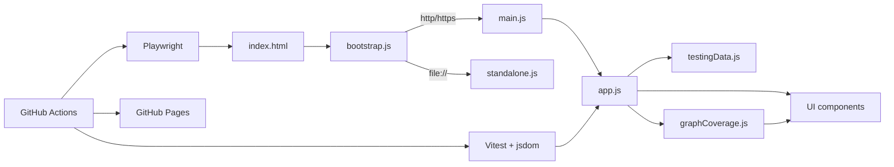

# Software Testing Visualization

[](https://github.com/skhuang/stvisual/actions/workflows/test.yml)
[](https://github.com/skhuang/stvisual/actions/workflows/deploy-pages.yml)
[](https://skhuang.github.io/stvisual/)

An interactive visualization project for software testing concepts, including testing method taxonomy, testing flow, common testing types, graph coverage analysis, logic (predicate / clause) coverage analysis, and syntax-based testing (program mutation).

Live demo: <https://skhuang.github.io/stvisual/>

## Preview


## Why This Project

- Turns software testing concepts into an interactive visual teaching tool
- Demonstrates graph-based coverage criteria with concrete requirements and test paths
- Supports editable graphs so users can see coverage recomputed immediately
- Shows optimization impact by comparing path counts before and after reduction

## Feature Highlights

- Visualizes testing method categories: black-box, white-box, gray-box, and their sub-techniques
- Animates the testing workflow from requirements analysis to defect reporting
- Shows common testing levels: unit, integration, system, and acceptance testing
- Provides graph coverage visualization for:
  - Node Coverage
  - Edge Coverage
  - Prime Path Coverage
  - Edge-Pair Coverage
  - Complete Path Coverage
- Automatically generates test requirements
- Automatically generates test path sets
- Applies a greedy set-cover approximation to reduce the selected test path set
- Displays before/after optimization metrics and saved path count
- Lets users edit the graph structure live with nodes, edges, start node, and end node inputs
- Provides logic coverage visualization for:
  - Predicate Coverage (PC)
  - Clause Coverage (CC)
  - Combinatorial Coverage (CoC)
  - Active Clause Coverage variants: GACC / CACC / RACC
  - Inactive Clause Coverage variants: GICC / RICC
  - Syntactic (DNF-based) criteria: IC / UTPC / MUTPC / NFPC / MNFPC / CUTPNFP
- Renders the truth table, identifies major / minor clauses, and marks duplicate test rows
- Computes a minimized DNF via Quine–McCluskey and renders Karnaugh maps for `f` and `¬f` (n = 1–4)
- On K-maps, colors each prime implicant, marks UTP / NFP cells with framed badges, and pairs UTP↔NFP for CUTPNFP
- Supports textbook predicate notation: adjacency for AND (e.g. `ab`) and `+` for OR (e.g. `a+b`)
- Lets users enter custom predicates and persists recent ones as removable chips (synced to Firestore when signed in)
- Provides syntax-based testing (program mutation) visualization:
  - 6 mutation operators (AOR / ROR / LOR / COR / UOI / ABS) over JavaScript expressions
  - Editable program body, parameters, and test set; built-in examples (`max`, `isLeapYear`, `triangle`)
  - Mutation score progress bar, killed / live / equivalent badges, and per-operator mutant grouping
  - When a mutant is selected, every test row shows the mutant's actual output; rows that killed the mutant are highlighted in red
  - Test sets are persisted per example to `localStorage` and synced to Firestore when signed in

## Architecture



## Showcase Notes

- Deployable to GitHub Pages
- Works directly from `file://` by using a standalone fallback bundle
- Includes both unit tests and real browser tests
- Covers the major graph coverage features with automated tests

## Quick Start

### 1. Install dependencies

```bash
npm install
```

### 2. Start the local static server

```bash
npm run serve
```

Default URL: <http://127.0.0.1:4173>

### 3. Open the app directly from the file system

You can also open `index.html` directly.

The app supports two entry modes:
- `http/https`: uses the modular runtime entry
- `file://`: automatically switches to the standalone fallback to avoid module CORS restrictions

## Testing

### Unit tests

```bash
npm run test:run
```

### Browser E2E tests

```bash
npm run test:browser
```

### Browser tests with UI

```bash
npm run test:browser:headed
```

## GitHub Actions

The repository includes two workflow groups:

- `Test`
  - `unit-test`
  - `browser-test`
- `Deploy GitHub Pages`
  - builds the Pages artifact after tests pass
  - deploys the static site to GitHub Pages automatically

Relevant workflow files:
- `.github/workflows/test.yml`
- `.github/workflows/deploy-pages.yml`

## Graph Coverage Focus

The graph coverage section currently supports:

- requirement generation
- test path generation
- approximate minimal test path selection
- live graph editor recomputation
- UI metrics for optimization before and after path reduction

This project is useful for:
- teaching graph coverage concepts
- comparing different coverage criteria
- observing the mapping between requirements and test paths
- demonstrating path reduction with a set-cover style approximation

## Logic Coverage Focus

The logic coverage section currently supports:

- parsing arbitrary boolean predicates over named clauses (`&&` / `||` / `!` / parentheses), with textbook notation (`ab` = AND, `a+b` = OR) accepted in the same input
- enumerating the full truth table and the determining (active) rows per clause
- generating test requirements and concrete row selections for PC / CC / CoC / GACC / CACC / RACC / GICC / RICC
- DNF-based criteria (IC / UTPC / MUTPC / NFPC / MNFPC / CUTPNFP) with Quine–McCluskey minimization, including implicants of `¬f`
- minimizing the IC test set via greedy set cover and striking through duplicate rows
- rendering Karnaugh maps for `f` and `¬f` (n = 1–4; for n = 3 columns are `ab`, rows are `c`; for n = 4 both rows and columns use Gray code)
- per-implicant coloring with legend, UTP / NFP framed badges, and paired UTP↔NFP for CUTPNFP
- a textbook-style DNF notation (adjacency = AND, `+` = OR, overline = NOT)
- a curated list of built-in predicates plus user-supplied recent predicates (synced to Firestore when signed in)

## Syntax-Based Testing Focus

The syntax-based testing section currently supports:

- Program Mutation visualization for short JavaScript functions
- Six mutation operators: AOR (arithmetic), ROR (relational), LOR / COR (logical), UOI (unary insertion), ABS (absolute value)
- Editable program body, parameters, and test set; built-in examples for `max`, `isLeapYear`, and `triangle`
- Live mutant generation, evaluation, and a mutation score progress bar
- Per-test mutant actual output: rows that killed the selected mutant are highlighted in red, rows that did not are dimmed
- Manual `equivalent` marking and a one-click reset to the example default
- Per-example persistence: `localStorage` for guests; Firestore sync for signed-in users with debounced writes, manual reload, and `pagehide` flush

## GitHub Pages Deployment

To prepare the static site output locally:

```bash
npm run pages:prepare
```

This command:
- regenerates `src/standalone.js`
- builds the `site/` output directory
- prepares the artifact structure used by the GitHub Pages workflow

## Project Structure

```text
.
├── index.html
├── src/
│   ├── app.js
│   ├── bootstrap.js
│   ├── main.js
│   ├── standalone.js
│   ├── data/         # testingData, mutationData
│   ├── utils/        # graphCoverage, programToGraph, logicCoverage, karnaughMap,
│   │                 # mutation, cloudIntegration
│   ├── components/   # TestingMethodTree, TestingFlow, TestingTypesTable,
│   │                 # GraphCoverageExplorer, LogicCoverageExplorer,
│   │                 # SyntaxCoverageExplorer, CloudStoragePanel
│   └── tests/
├── e2e/
├── scripts/
├── docs/
│   └── Specification.zh-TW.md
└── .github/workflows/
```

## License

No license file is currently included. Add a `LICENSE` file if you want to publish the project under an explicit open-source license.
