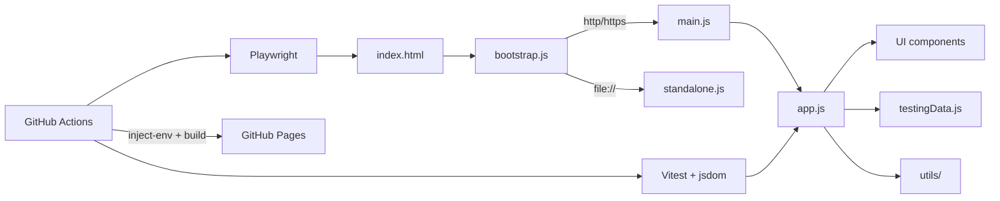

# Software Testing Visualization

[](https://github.com/skhuang/stvisual/actions/workflows/test.yml)
[](https://github.com/skhuang/stvisual/actions/workflows/deploy-pages.yml)
[](https://skhuang.github.io/stvisual/)

An interactive visualization project for software testing concepts — covering graph coverage, logic coverage, syntax-based testing, symbolic/concolic execution, fuzzing, and black-box test design techniques.

Live demo: <https://skhuang.github.io/stvisual/>

## Preview

| Overview | Graph Coverage |
|:---:|:---:|
|  |  |

| Logic Coverage | Syntax-Based Testing |
|:---:|:---:|
|  |  |

| Symbolic Execution | Concolic Execution |
|:---:|:---:|
|  |  |

## Feature Highlights

### Testing Methods Overview
- Visualizes testing method categories: black-box, white-box, gray-box, and their sub-techniques
- Animates the testing workflow from requirements analysis to defect reporting
- Shows common testing levels: unit, integration, system, and acceptance testing

### Graph Coverage
- Node Coverage, Edge Coverage, Prime Path Coverage, Edge-Pair Coverage, Complete Path Coverage
- Data Flow Graph (DFG) derived from source; DU-pair and all-uses coverage criteria
- Automatically generates test requirements and test path sets
- Greedy set-cover approximation to reduce the selected test path set
- Displays before/after optimization metrics and saved path count
- Lets users edit the graph structure live or upload JSON graph specs / source code
- Supports multiple languages (JavaScript, Python, C, Java)
- Self-test (quiz) mode: select a minimal covering path set and check your answer

### Logic Coverage
- Predicate Coverage (PC), Clause Coverage (CC), Combinatorial Coverage (CoC)
- Active Clause Coverage: GACC / CACC / RACC
- Inactive Clause Coverage: GICC / RICC
- Syntactic (DNF-based) criteria: IC / UTPC / MUTPC / NFPC / MNFPC / CUTPNFP
- Renders truth tables, identifies major / minor clauses, and marks duplicate test rows
- Computes minimized DNF via Quine–McCluskey and renders Karnaugh maps for `f` and `¬f` (n = 1–4)
- Per-implicant coloring, UTP / NFP badges, and paired UTP↔NFP for CUTPNFP
- Supports textbook predicate notation: adjacency for AND (`ab`) and `+` for OR (`a+b`)
- Built-in predicates: triangle classifier, leap year, calendar days, GCD, binary search

### Syntax-Based Testing (Program Mutation)
- 6 mutation operators (AOR / ROR / LOR / COR / UOI / ABS) over JavaScript expressions
- Editable program body, parameters, and test set; built-in examples (`max`, `isLeapYear`, `triangle`)
- Mutation score progress bar, killed / live / equivalent badges, and per-operator mutant grouping
- Grammar-based testing and specification mutation (SMV) sub-tabs

### Symbolic & Concolic Execution
- Symbolic execution: explores all feasible paths; displays path conditions and variable bindings
- Concolic execution: DART/CUTE-style; starts from concrete input, negates branches to explore new paths
- Both map executed paths onto the CFG with zoomable SVG rendering

### Fuzz Testing & Test Generation
- Mutation-based fuzzing: seed corpus, configurable mutation budget, coverage-guided iteration
- Automated test generation from symbolic paths with download-as-JS export

### Black-Box Test Design
All seven techniques live under a single tabbed section:

| Tab | What it covers |
|-----|----------------|
| **Boundary Value Analysis** | 5-point BVA and Robustness BVA; multi-parameter; self-test quiz |
| **Equivalence Classes** | Weak (WECT) and Strong (SECT) ECP; partition editor; self-test quiz |
| **Decision Table** | Condition/action matrix; T/F/– cells; coverage badge; duplicate detection |
| **State Transition** | SVG state diagram; transition coverage and sequence coverage (BFS paths) |
| **Metamorphic Testing** | 5 built-in programs × 2–3 relations; generates 8 test pairs; pass/fail table |
| **Exploratory Testing** | Session charter; SFDIPOT heuristics checklist; HICCUPPS oracle reference; countdown timer; observation log with Markdown export |
| **Test Doubles** | Dummy / Stub / Fake / Mock / Spy; 2 runnable scenarios per type; live call-log + assertion results |

### Cloud Integration
- Google sign-in via Firebase Authentication
- Firestore sync for predicates, test sets, and mutation data
- Google Drive upload for graph specs and source code

## Architecture



## Quick Start

### 1. Install dependencies

```bash
npm install
```

### 2. Start the local dev server

```bash
npm run dev
```

Opens <http://localhost:4173> with Vite HMR. Cloud features require a `.env.local` file — see [Environment Variables](#environment-variables) below.

### 3. Open directly from the file system (no server needed)

```bash
open index.html
```

The app detects `file://` and switches to a pre-built `src/standalone.js` bundle that avoids ES-module CORS restrictions.

## Testing

### Unit tests (Vitest + jsdom)

```bash
npm run test:run
```

346 tests across 34 files — covering all explorers, coverage algorithms, mutation engine, concolic/symbolic execution, and integration utilities.

### Browser E2E tests (Playwright / Chromium)

```bash
npm run test:browser          # headless
npm run test:browser:headed   # with browser window
```

## Environment Variables

Cloud features (Firebase Auth, Firestore, Google Drive) require credentials that are **never committed to the repository**. They live in `src/config/cloudConfig.js` as `__PLACEHOLDER__` tokens and are replaced at build time by `scripts/inject-env.mjs`.

### Variable reference

| Variable | Description |
|----------|-------------|
| `FIREBASE_API_KEY` | Firebase Web API key |
| `FIREBASE_AUTH_DOMAIN` | Firebase Auth domain (`<project>.firebaseapp.com`) |
| `FIREBASE_PROJECT_ID` | Firestore project ID |
| `FIREBASE_STORAGE_BUCKET` | Firebase Storage bucket (`<project>.appspot.com`) |
| `FIREBASE_MESSAGING_SENDER_ID` | FCM sender ID |
| `FIREBASE_APP_ID` | Firebase App ID |
| `FIREBASE_MEASUREMENT_ID` | Google Analytics measurement ID (optional) |
| `DRIVE_UPLOAD_FOLDER_ID` | Google Drive folder ID for file uploads |

### Local development

**Option A — Vite dev server (recommended)**

1. Copy the example file and fill in your values:

   ```bash
   cp .env.example .env.local
   # edit .env.local
   ```

2. Start the dev server — Vite reads `.env.local` automatically via `vite.config.js`:

   ```bash
   npm run dev
   ```

   > `.env.local` is gitignored. Never commit it.

**Option B — Legacy static server**

1. Copy and fill in `.env` (used by `inject-env.mjs`):

   ```bash
   cp .env.example .env
   # edit .env
   ```

2. Inject credentials and serve:

   ```bash
   npm run inject-env   # replaces __PLACEHOLDER__ tokens in cloudConfig.js
   npm run serve        # Python http.server on :4173
   ```

   > After testing, restore the placeholder file so it is not accidentally committed:
   > ```bash
   > git checkout src/config/cloudConfig.js
   > ```

## Deployment

### GitHub Pages (production)

The live site is built and deployed automatically on every push to `main` via the **Deploy GitHub Pages** workflow (`.github/workflows/deploy-pages.yml`).

#### Pipeline

```
push to main
  └─ test job (ubuntu-latest, Node 20)
       ├─ npm ci --legacy-peer-deps
       ├─ npm run test:run              ← 346 unit tests must pass
       ├─ inject-env                    ← reads GitHub Secrets, writes cloudConfig.js
       ├─ build:standalone              ← esbuild bundles src/ → standalone.js
       └─ prepare-pages                 ← copies src tree → site/
  └─ deploy job
       └─ actions/deploy-pages@v4       ← uploads site/ to GitHub Pages
```

#### What `pages:prepare` produces

`npm run pages:prepare` runs three scripts in sequence:

| Step | Script | What it does |
|------|--------|--------------|
| 1 | `inject-env.mjs` | Reads env vars (CI Secrets or `.env`), replaces `__PLACEHOLDER__` tokens in `cloudConfig.js` |
| 2 | `build-standalone.mjs` | Uses esbuild to bundle the full app into `src/standalone.js` |
| 3 | `prepare-pages.mjs` | Copies `src/` tree, `index.html`, and writes `site/.nojekyll` |

The resulting `site/` directory:

```
site/
├── index.html
├── .nojekyll
└── src/
    ├── bootstrap.js      ← detects http vs file:// and picks entry point
    ├── main.js           ← ES-module entry (used over http/https)
    ├── standalone.js     ← esbuild bundle (used from file://)
    ├── app.js
    ├── styles.css
    ├── App.css
    ├── components/       ← all explorer JS + CSS files
    ├── data/
    ├── config/           ← cloudConfig.js with real credentials injected
    ├── utils/
    └── i18n/
```

#### One-time GitHub repository setup

1. **Enable GitHub Pages**: go to **Settings → Pages**, set source to **GitHub Actions**.

2. **Create secrets**: go to **Settings → Environments**, create an environment named **`github-pages`**, and add these Environment secrets:

   | Secret | Value |
   |--------|-------|
   | `FIREBASE_API_KEY` | Firebase API key |
   | `FIREBASE_AUTH_DOMAIN` | `<project>.firebaseapp.com` |
   | `FIREBASE_PROJECT_ID` | Firestore project ID |
   | `FIREBASE_STORAGE_BUCKET` | `<project>.appspot.com` |
   | `FIREBASE_MESSAGING_SENDER_ID` | FCM sender ID |
   | `FIREBASE_APP_ID` | Firebase App ID |
   | `FIREBASE_MEASUREMENT_ID` | Analytics measurement ID |
   | `DRIVE_UPLOAD_FOLDER_ID` | Google Drive folder ID |

   > Scoping secrets to the `github-pages` environment means they are only exposed to the deploy workflow — not to pull requests from forks.

3. **Push to `main`** — the workflow triggers automatically.

#### Manual trigger

```bash
gh workflow run deploy-pages.yml
```

Or go to **Actions → Deploy GitHub Pages → Run workflow** in the GitHub UI.

### Self-hosted / other static hosts

The `site/` directory is a plain static site with no server-side requirements. It can be served from Nginx, Caddy, S3, Netlify, or any CDN:

```bash
# build locally
cp .env.example .env && vim .env
npm run pages:prepare        # → site/
rsync -av site/ user@host:/var/www/stvisual/
```

If the app is served under a non-root path (e.g. `https://example.com/stvisual/`), set `GITHUB_PAGES_BASE_PATH=/stvisual` in `.env` before running `pages:prepare`.

## GitHub Actions Workflows

| Workflow | File | Triggers | Jobs |
|----------|------|----------|------|
| **Test** | `test.yml` | push / PR to `main` | `unit-test` (Vitest), `browser-test` (Playwright/Chromium) |
| **Deploy GitHub Pages** | `deploy-pages.yml` | push to `main`, manual | `test` → inject-env → build → `deploy` |

Both workflows use **Node.js 24** and `npm ci --legacy-peer-deps`.

## Project Structure

```text
.
├── index.html
├── package.json
├── vite.config.js               # Vite dev server; reads .env.local for credentials
├── vitest.config.js
├── playwright.config.js
├── .env.example                 # credential template (safe to commit)
├── scripts/
│   ├── inject-env.mjs           # replace __PLACEHOLDER__ tokens in cloudConfig.js
│   ├── build-standalone.mjs     # esbuild → src/standalone.js
│   └── prepare-pages.mjs        # assemble site/ for GitHub Pages
├── src/
│   ├── app.js                   # application shell + section/tab wiring
│   ├── bootstrap.js             # http vs file:// entry switch
│   ├── main.js                  # ES-module entry (http/https)
│   ├── standalone.js            # esbuild bundle (file://)
│   ├── styles.css               # @import aggregator for all component CSS
│   ├── components/
│   │   ├── TestingMethodTree        # method taxonomy tree
│   │   ├── TestingFlow              # animated testing workflow
│   │   ├── TestingTypesTable        # unit/integration/system/acceptance
│   │   ├── GraphCoverageExplorer    # graph + DFG coverage + self-test quiz
│   │   ├── LogicCoverageExplorer    # predicate/clause coverage + K-maps
│   │   ├── SyntaxCoverageExplorer   # program mutation (AOR/ROR/LOR/COR/UOI/ABS)
│   │   ├── GrammarCoverageExplorer  # grammar-based testing
│   │   ├── SpecMutationExplorer     # specification mutation (SMV)
│   │   ├── SymbolicExecutionExplorer
│   │   ├── ConcolicExecutionExplorer
│   │   ├── FuzzTestingExplorer      # mutation-based fuzzing
│   │   ├── TestGenerationExplorer   # path-driven test gen + JS export
│   │   ├── CloudStoragePanel        # Firebase Auth + Firestore + Drive
│   │   ├── BoundaryValueExplorer    # BVA + Robustness BVA + quiz
│   │   ├── EquivalenceClassExplorer # WECT / SECT + quiz
│   │   ├── DecisionTableExplorer    # condition/action decision tables
│   │   ├── StateTransitionExplorer  # SVG diagram + transition/sequence coverage
│   │   ├── MetamorphicTestingExplorer  # MR test-pair generation
│   │   ├── ExploratoryTestingExplorer  # charter + SFDIPOT + timer + log
│   │   ├── TestDoublesExplorer      # Dummy/Stub/Fake/Mock/Spy + live runner
│   │   └── quiz.css                 # shared self-test quiz styles
│   ├── config/
│   │   └── cloudConfig.js       # __PLACEHOLDER__ tokens (replaced at build time)
│   ├── data/
│   │   └── testingData.js       # technique metadata + predicate examples
│   ├── i18n/
│   │   ├── index.js             # t(), getLocale(), setLocale(), onLocaleChange()
│   │   └── dict.js              # EN + ZH flat-key dictionary
│   ├── utils/
│   │   ├── graphCoverage.js     # graph coverage algorithms
│   │   ├── programToGraph.js    # source code → CFG + DFG
│   │   ├── logicCoverage.js     # predicate/clause coverage engine
│   │   ├── karnaughMap.js       # Quine–McCluskey + K-map rendering
│   │   ├── mutation.js          # mutation operator engine
│   │   ├── symbolicExecution.js
│   │   ├── concolicExecution.js
│   │   ├── pathToCfg.js         # branch trace → CFG SVG overlay
│   │   ├── blackboxTesting.js   # BVA / ECP / DT / ST test generators
│   │   ├── metamorphicTesting.js # MR test-pair generation engine
│   │   └── cloudIntegration.js  # Firebase Auth + Firestore + Drive
│   └── tests/                   # 34 test files, 346 tests (Vitest + jsdom)
├── e2e/                         # Playwright browser tests
├── site/                        # generated GitHub Pages output (gitignored)
└── .github/workflows/
    ├── test.yml                 # PR/push: unit tests + browser tests
    └── deploy-pages.yml         # production: test → inject-env → build → deploy
```

## TypeScript

New modules should be written in **TypeScript (`.ts`)** for type safety.

- **Existing `.js` files**: leave as-is; no migration needed
- **New files**: create as `.ts` in `src/`; Vite compiles them automatically
- `tsconfig.json` is present for editor support

## License

This project is licensed under the [MIT License](LICENSE).
