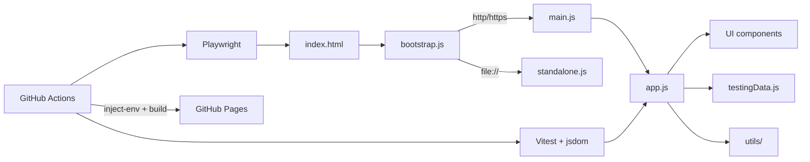

# Software Testing Visualization

[](https://github.com/skhuang/stvisual/actions/workflows/test.yml)
[](https://github.com/skhuang/stvisual/actions/workflows/deploy-pages.yml)
[](https://skhuang.github.io/stvisual/)

An interactive visualization project for software testing concepts, covering testing method taxonomy, graph coverage, logic coverage, syntax-based testing (program mutation), symbolic execution, concolic execution, and cloud-synced persistence.

Live demo: <https://skhuang.github.io/stvisual/>

## Preview

| Overview | Graph Coverage |
|:---:|:---:|
|  |  |

| Logic Coverage | Syntax-Based Testing |
|:---:|:---:|
|  |  |

| Symbolic Execution | Concolic Execution |
|:---:|:---:|
|  |  |

## Why This Project

- Turns software testing concepts into an interactive visual teaching tool
- Demonstrates graph-based coverage criteria with concrete requirements and test paths
- Supports editable graphs so users can see coverage recomputed immediately
- Shows optimization impact by comparing path counts before and after reduction
- Provides hands-on symbolic and concolic execution with path-to-CFG mapping

## Feature Highlights

### Testing Methods Overview
- Visualizes testing method categories: black-box, white-box, gray-box, and their sub-techniques
- Animates the testing workflow from requirements analysis to defect reporting
- Shows common testing levels: unit, integration, system, and acceptance testing

### Graph Coverage
- Node Coverage, Edge Coverage, Prime Path Coverage, Edge-Pair Coverage, Complete Path Coverage
- Automatically generates test requirements and test path sets
- Applies a greedy set-cover approximation to reduce the selected test path set
- Displays before/after optimization metrics and saved path count
- Lets users edit the graph structure live or upload JSON graph specs / source code
- Supports multiple code languages (JavaScript, Python, C, Java)

### Logic Coverage
- Predicate Coverage (PC), Clause Coverage (CC), Combinatorial Coverage (CoC)
- Active Clause Coverage: GACC / CACC / RACC
- Inactive Clause Coverage: GICC / RICC
- Syntactic (DNF-based) criteria: IC / UTPC / MUTPC / NFPC / MNFPC / CUTPNFP
- Renders truth tables, identifies major / minor clauses, and marks duplicate test rows
- Computes minimized DNF via Quine–McCluskey and renders Karnaugh maps for `f` and `¬f` (n = 1–4)
- Per-implicant coloring, UTP / NFP badges, and paired UTP↔NFP for CUTPNFP
- Supports textbook predicate notation: adjacency for AND (`ab`) and `+` for OR (`a+b`)

### Syntax-Based Testing (Program Mutation)
- 6 mutation operators (AOR / ROR / LOR / COR / UOI / ABS) over JavaScript expressions
- Editable program body, parameters, and test set; built-in examples (`max`, `isLeapYear`, `triangle`)
- Mutation score progress bar, killed / live / equivalent badges, and per-operator mutant grouping
- Per-test mutant output with kill-highlighting

### Symbolic Execution
- Explores all feasible paths through a program symbolically
- Displays symbolic state (path condition, variable bindings) at each step
- Maps executed paths onto the Graph Coverage CFG with zoomable SVG rendering
- Built-in examples with selectable paths and iterations

### Concolic Execution
- DART/CUTE-style concrete + symbolic execution engine
- Starts from a concrete input, collects path constraints, and negates branches to explore new paths
- Maps each iteration's path onto the CFG with zoomable SVG rendering
- Displays concrete values alongside symbolic constraints per iteration

### Cloud Integration
- Google sign-in via Firebase Authentication
- Firestore sync for predicates, test sets, and mutation data
- Google Drive upload for graph specs and source code

## Architecture



## Showcase Notes

- Deployable to GitHub Pages with CI/CD (secrets injected at build time)
- Works directly from `file://` by using a standalone fallback bundle
- 202 unit tests (Vitest + jsdom) across 21 test files
- E2E browser tests via Playwright
- Bilingual UI (English / 中文) with i18n support

## Quick Start

### 1. Install dependencies

```bash
npm install
```

### 2. Start the local static server

```bash
npm run serve
```

Default URL: <http://127.0.0.1:4173>

### 3. Open the app directly from the file system

You can also open `index.html` directly.

The app supports two entry modes:
- `http/https`: uses the modular runtime entry
- `file://`: automatically switches to the standalone fallback to avoid module CORS restrictions

## Testing

### Unit tests

```bash
npm run test:run
```

### Browser E2E tests

```bash
npm run test:browser
```

### Browser tests with UI

```bash
npm run test:browser:headed
```

## Environment Variables

Firebase and Drive credentials are stored as `__PLACEHOLDER__` tokens in
`src/config/cloudConfig.js` and injected at build time.

### Local development

Create a `.env` file (see `.env.example`) and run:

```bash
npm run inject-env
```

### CI / GitHub Pages

Add the 8 secrets (`FIREBASE_API_KEY`, `FIREBASE_AUTH_DOMAIN`, etc.) under
**Settings → Environments → github-pages → Environment secrets**.
The deploy workflow reads them automatically.

## GitHub Actions

Two workflows:

| Workflow | Triggers | Steps |
|----------|----------|-------|
| **Test** | push / PR | `npm ci` → `npm run test:run` → Playwright |
| **Deploy GitHub Pages** | push to `main` | test → `inject-env` → `build:standalone` → `prepare-pages` → deploy |

Workflow files: `.github/workflows/test.yml`, `.github/workflows/deploy-pages.yml`

## Project Structure

```text
.
├── index.html
├── package.json
├── scripts/
│   ├── build-standalone.mjs    # esbuild bundler → standalone.js
│   ├── inject-env.mjs          # replace __PLACEHOLDER__ tokens
│   └── prepare-pages.mjs       # assemble site/ for GitHub Pages
├── src/
│   ├── app.js                  # main application shell
│   ├── bootstrap.js            # http vs file:// entry switch
│   ├── main.js                 # ES module entry
│   ├── standalone.js           # bundled fallback for file://
│   ├── components/
│   │   ├── TestingMethodTree       # method taxonomy tree
│   │   ├── TestingFlow             # animated testing workflow
│   │   ├── TestingTypesTable       # unit/integration/system/acceptance
│   │   ├── GraphCoverageExplorer   # graph coverage visualization
│   │   ├── LogicCoverageExplorer   # predicate/clause coverage + K-maps
│   │   ├── SyntaxCoverageExplorer  # program mutation
│   │   ├── SymbolicExecutionExplorer
│   │   ├── ConcolicExecutionExplorer
│   │   ├── CloudStoragePanel       # sign-in + Firestore/Drive
│   │   ├── SpecMutationExplorer    # specification mutation (SMV)
│   │   └── GrammarCoverageExplorer # grammar-based testing
│   ├── config/
│   │   └── cloudConfig.js      # Firebase/Drive config (placeholder tokens)
│   ├── data/
│   │   └── testingData.js      # technique metadata + examples
│   ├── i18n/
│   │   ├── index.js            # t(), getLocale(), setLocale()
│   │   └── dict.js             # EN + ZH flat-key dictionary
│   ├── utils/
│   │   ├── graphCoverage.js    # graph coverage algorithms
│   │   ├── programToGraph.js   # source code → CFG
│   │   ├── logicCoverage.js    # predicate/clause coverage engine
│   │   ├── karnaughMap.js      # Quine–McCluskey + K-map rendering
│   │   ├── mutation.js         # mutation operator engine
│   │   ├── symbolicExecution.js
│   │   ├── concolicExecution.js
│   │   ├── pathToCfg.js        # map branch traces → CFG SVG
│   │   └── cloudIntegration.js # Firebase Auth + Firestore + Drive
│   └── tests/                  # 21 test files, 202 tests
├── e2e/                        # Playwright browser tests
├── site/                       # generated GitHub Pages output
└── .github/workflows/
```

## License

This project is licensed under the [MIT License](LICENSE).
