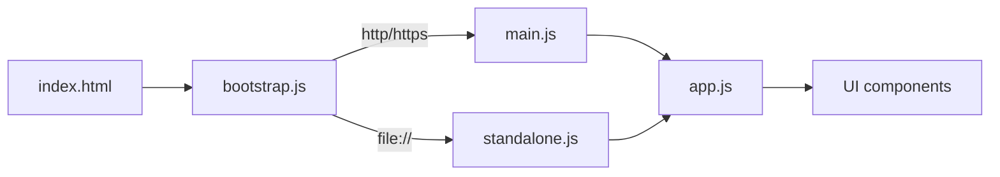

# stvisual 完整規格文件

最後更新：2026-05-11

本文件為 stvisual（軟體測試方法視覺化）專案的完整規格說明，包含產品定位、UI 章節、Graph Coverage / Logic Coverage 演算法與資料結構、Karnaugh Map 視覺化規則、雲端整合、測試與佈署流程，以及最新加入的 Fuzz Testing / Symbolic Execution / Concolic Execution 三個執行式測試章節（§15–§17）。

---

## 1. 專案總覽

| 項目 | 內容 |
| --- | --- |
| 名稱 | stvisual（Software Testing Visualization） |
| 目的 | 將軟體測試理論（測試方法分類、Graph Coverage、Logic Coverage 等）轉成可互動、可驗證的視覺化教學平台 |
| Live Demo | <https://skhuang.github.io/stvisual/> |
| Repository | <https://github.com/skhuang/stvisual> |
| 主要技術 | 純 HTML + JavaScript（ES Module）、Firebase（Auth/Firestore/Drive）、esbuild、Vitest、Playwright |

### 1.1 部署形式

- **HTTP / HTTPS 模式**：[index.html](../index.html) → [src/bootstrap.js](../src/bootstrap.js) → [src/main.js](../src/main.js) → [src/app.js](../src/app.js)，使用原生 ES Module。
- **`file://` 模式（離線）**：bootstrap 偵測到 `file:` protocol 時改載入預先 bundle 的 [src/standalone.js](../src/standalone.js)（IIFE），避免 module CORS 限制。
- **GitHub Pages**：由 [scripts/prepare-pages.mjs](../scripts/prepare-pages.mjs) 把 `src/` 與 `index.html` 複製到 `site/`，由 `.github/workflows/deploy-pages.yml` 部署。

### 1.2 進入點協定切換



---

## 2. UI 章節（Top-level Features）

`app.js` 依序組裝下列章節，每節皆為一個 `create*()` 工廠函式回傳的 DOM 子樹。

| # | 章節 | Component | 主要資料來源 | testid |
| --- | --- | --- | --- | --- |
| 2.1 | 測試方法分類 | [TestingMethodTree.js](../src/components/TestingMethodTree.js) | `testingMethods` | `testing-method-tree` |
| 2.2 | 測試流程 | [TestingFlow.js](../src/components/TestingFlow.js) | `testingFlow` | `testing-flow` |
| 2.3 | 常見測試類型 | [TestingTypesTable.js](../src/components/TestingTypesTable.js) | `testingTypes` | `testing-types` |
| 2.4 | Graph Coverage | [GraphCoverageExplorer.js](../src/components/GraphCoverageExplorer.js) | `graphCoverageCriteria`, `graphCoverageGraph`, `graphCoverageProgramExamples` | `graph-coverage` |
| 2.5 | Logic Coverage | [LogicCoverageExplorer.js](../src/components/LogicCoverageExplorer.js) | `logicCoverageCriteria`, `logicCoveragePredicates` | `logic-coverage` |
| 2.6 | 雲端整合 | [CloudStoragePanel.js](../src/components/CloudStoragePanel.js) | `cloudConfig.js` + Firebase | `cloud-storage-panel` |
| 2.7 | Symbolic Execution（§16） | [SymbolicExecutionExplorer.js](../src/components/SymbolicExecutionExplorer.js) | `symbolicExecutionExamples` + `symbolicExecution.js` | `symbex-explorer` |
| 2.8 | Concolic Execution（§17） | [ConcolicExecutionExplorer.js](../src/components/ConcolicExecutionExplorer.js) | `concolicExecutionExamples` + `concolicExecution.js` | `concolic-explorer` |
| 2.9 | Fuzz Testing（§15） | [FuzzTestingExplorer.js](../src/components/FuzzTestingExplorer.js) | `fuzzTestingExamples` + `fuzzTesting.js` + `pathToCfg.js` | `fuzz-explorer` |

### 2.1 測試方法分類

- 黑盒：BVA、EP、CEG、STT
- 白盒：Statement、Branch、Graph、Logic、Path、Prime Path、Condition、Multiple Conditions
- 灰盒：結合黑/白盒、部分代碼可見

互動：每張卡可單獨展開／收合（`method-card-btn-{id}`）、整體 Expand/Collapse All（`toggle-all-btn`），並以可視性條（`visibility-fill`）顯示「程式碼可見度 0–100%」。

### 2.2 測試流程

六個步驟：需求分析 → 測試計劃 → 測試設計 → 測試執行 → 結果分析 → 缺陷報告。
支援自動播放（1800 ms / 步）、暫停、跳步；步驟間以箭頭與進度條串接（`flow-progress-fill`）。

### 2.3 常見測試類型

倒置金字塔：Unit（30%） → Integration（55%） → System（80%） → Acceptance（100%），下方搭配卡片陣列說明目的、時機。

### 2.4 Graph Coverage Explorer

詳見第 3 節。

### 2.5 Logic Coverage Explorer

詳見第 4–5 節。

### 2.6 Cloud Storage Panel

詳見第 6 節。

---

## 3. Graph Coverage 規格

主要實作位於 [src/utils/graphCoverage.js](../src/utils/graphCoverage.js)、[src/utils/programToGraph.js](../src/utils/programToGraph.js)、[src/components/GraphCoverageExplorer.js](../src/components/GraphCoverageExplorer.js)。

### 3.1 支援的覆蓋準則

| id | 名稱 | 說明 |
| --- | --- | --- |
| `node` | Node Coverage | 每個節點至少被走訪一次 |
| `edge` | Edge Coverage | 每條有向邊至少被走訪一次 |
| `prime-path` | Prime Path Coverage | 涵蓋所有 prime path（最大不可延伸的簡單路徑、含環） |
| `edge-pair` | Edge-Pair Coverage | 每對相鄰邊都至少被走過 |
| `complete-path` | Complete Path Coverage | 在有限深度下列舉所有可行 start→end 路徑 |

### 3.2 圖資料模型

```ts
type Graph = {
  nodes: { id: string; label?: string; x?: number; y?: number }[];
  edges: { id: string; from: string; to: string; via?: { x: number; y: number } }[];
  start: string;
  end: string;
};
```

CFG 編輯器以 CSV 文字輸入 nodes / edges，解析後即時重算 requirements 與 paths。

### 3.3 主要 API

- `getCoverageRequirements(graph, criterionId)`：依據 criterion 派發到下列函式之一。
  - `getNodeRequirements(graph)`、`getEdgeRequirements(graph)`、`getEdgePairRequirements(graph)`、`getPrimePathRequirements(graph)`、`getCompletePathRequirements(graph)`。
- `enumerateSimplePaths(graph)`：以 DFS 自每節點出發列舉簡單路徑（除起點外不重複造訪節點），並偵測環。
- `getPrimePaths(graph)`：對 `enumerateSimplePaths` 的結果以「兩端不可延伸」過濾出 prime path（環一律視為 prime）。
- `buildTestPathSetForRequirements(graph, requirements)`：列舉候選路徑後呼叫 `greedySetCover`。
- `greedySetCover(pathRecords, requirements)`：每次選覆蓋最多剩餘 requirement 的路徑，回傳選用集合與未滿足項目。

### 3.4 程式碼上傳（Code → CFG）

`generateControlFlowGraphFromProgram(source, language)` 位於 [programToGraph.js](../src/utils/programToGraph.js)：

- 支援 JavaScript 與 Pseudocode；可辨識 `if/else`、`switch/case`、`for/while`、`break/continue`、`return`。
- 產生節點：start、end、decision、normal；節點帶有原始行號以供 source mapping。
- UI 切到不同 requirement 時會反白對應原始碼行號。

### 3.5 主要 testid

`graph-criterion-select`、`graph-example-{id}`、`graph-requirements-list`、`graph-paths-before`、`graph-paths-after`、`graph-source-line-{n}`。

---

## 4. Logic Coverage 規格

主要實作位於 [src/utils/logicCoverage.js](../src/utils/logicCoverage.js)、[src/utils/karnaughMap.js](../src/utils/karnaughMap.js)、[src/components/LogicCoverageExplorer.js](../src/components/LogicCoverageExplorer.js)。

### 4.1 完整覆蓋準則清單

| 群組 | id | 英文 | 中文 | 描述 |
| --- | --- | --- | --- | --- |
| 語意 | `pc` | Predicate Coverage | Predicate Coverage | predicate 至少各取 T/F 一次 |
| 語意 | `cc` | Clause Coverage | 子句覆蓋 | 每個 clause 各取 T/F 一次 |
| 語意 | `coc` | Combinatorial Coverage | 組合覆蓋 | 列舉 2ⁿ 種子句真假組合 |
| 語意 | `gacc` | General Active Clause Coverage | GACC | 主子句決定 predicate（次子句不限） |
| 語意 | `cacc` | Correlated Active Clause Coverage | CACC | 主子句決定 predicate，且兩列產生不同 predicate 值 |
| 語意 | `racc` | Restricted Active Clause Coverage | RACC | 主子句決定 predicate，兩列次子句完全相同 |
| 語意 | `gicc` | General Inactive Clause Coverage | GICC | 主子句不決定 predicate，覆蓋 (c=T/F)×(P=T/F) 共 4 組合 |
| 語意 | `ricc` | Restricted Inactive Clause Coverage | RICC | 同 GICC，且兩列次子句完全相同 |
| 語法（DNF） | `ic` | Implicant Coverage | IC | f 與 ¬f 的每個 prime implicant 至少有一個 row 滿足（最小化測試列） |
| 語法（DNF） | `utpc` | Unique True Point Coverage | UTPC | 列出每個 implicant 的所有 unique true points |
| 語法（DNF） | `mutpc` | Multiple Unique True Point Coverage | MUTPC | 為每個 implicant 挑一組 UTPs，使每個次子句至少各出現一次 T 與 F |
| 語法（DNF） | `nfpc` | Near False Point Coverage | NFPC | 為每個 implicant×literal 找一個翻轉後使 P 為 F 的 row |
| 語法（DNF） | `mnfpc` | Multiple Near False Point Coverage | MNFPC | 為每個 implicant×literal 挑一組 NFPs，使每個次子句至少各出現一次 T 與 F |
| 語法（DNF） | `cutpnfp` | Corresponding UTP + NFP Pair Coverage | CUTPNFP | 為每個 implicant×literal 挑一對僅在該 literal 不同的 UTP/NFP |

### 4.2 Predicate 文法

支援程式風格與教科書記號可自由混用：

| 記號 | 含義 | 範例 |
| --- | --- | --- |
| `&&` 或相鄰（juxtaposition） | AND | `a && b` 或 `ab` |
| `\|\|` 或 `+` | OR | `a \|\| b` 或 `a+b` |
| `!` | NOT | `!a` |
| `(` `)` | 群組 | `(a+b)(c+d)` |
| identifier | 子句名稱 | 單字母可選跟數字，如 `a`、`b`、`c1`、`x2` |

Tokenizer：

```js
const TOKEN_REGEX = /\s*(?:(\()|(\))|(&&)|(\|\|)|(\+)|(!)|([A-Za-z][0-9]*))/y;
```

Parser 採遞迴下降，優先級為 OR < AND < NOT < Atom；`parseAnd` 在下一個 token 為 `(`、`!` 或 ident 時自動視為 juxtaposition AND。

### 4.3 真值表

`buildTruthTable(parsed)` 為每個 minterm 產生：

```ts
type TruthRow = {
  index: number;                          // minterm 編號 (MSB = clauses[0])
  values: Record<string, boolean>;        // 每個 clause 的真值
  predicate: boolean;                     // AST 評估結果
  determines: Record<string, boolean>;    // 翻轉 c 後 predicate 是否改變
};
```

`determines[c] = evaluateAst(ast, {...values, [c]: !values[c]}) !== predicate`，用於計算 ACC / ICC 系列的 active / inactive 列。

### 4.4 DNF 與 Quine–McCluskey

- `toDNF(ast)`：直接由 AST 遞迴展開（NOT 翻極性、AND cross-product、OR concat）。
- `minimalDNF(rows, clauses, target)`：
  1. 收集 minterms（predicate === target）。
  2. 反覆合併「僅差一位」的群組，產生 prime implicants。
  3. 找出 essential primes（只被一個 prime 覆蓋的 minterm）。
  4. 對剩餘 minterms 以 greedy 演算法選出最少 prime 加入。
- 結果 term：`Array<{ name: string; negated: boolean }>`。

### 4.5 各 buildXSet 演算法摘要

| 函式 | 演算法概要 |
| --- | --- |
| `buildPredicateCoverageSet(rows)` | 各取一個 P=T 與 P=F 的 row |
| `buildClauseCoverageSet(rows, clauses)` | 對每個 clause 各取一個 T、一個 F |
| `buildCombinatorialCoverageSet(rows)` | 全部 2ⁿ 列 |
| `buildGACCSet`/`buildCACCSet`/`buildRACCSet` | `pickPair(rows, clause, mode)`：以 `determines` 為前提，依 mode 對「次子句限制」決定是否需相同 |
| `buildGICCSet`/`buildRICCSet` | 在 `determines[c]=false` 的 row 中列舉 (c, P) 的 4 種組合，RICC 額外要求次子句相同 |
| `buildImplicantCoverageSet(rows, dnf, negDnf)` | 每個 implicant 候選列為「滿足 term 且 predicate 對應極性」的 rows；先 essential、再 greedy 取最小 row 集合 |
| `buildUTPCSet(rows, dnf)` | 列出每個 implicant 的所有 unique true points（僅該 implicant 為真） |
| `buildMUTPCSet(rows, clauses, dnf)` | 對每 implicant，從其 UTPs 中 greedy 取最少使每個次子句的 (T,F) 都出現 |
| `buildNFPCSet(rows, dnf)` | 對每 implicant×literal，找一個 NFP（翻該 literal 後 implicant 假、P 假），同時記錄成對的 UTP |
| `buildMNFPCSet(rows, clauses, dnf)` | 對每 implicant×literal，從其 NFPs 中 greedy 取最少使每個次子句的 (T,F) 都出現 |
| `buildCUTPNFPSet(rows, dnf)` | 對每 implicant×literal，挑一對 (UTP, NFP) 僅在該 literal 不同 |

### 4.6 `buildAllCoverageSets(parsed)` 統一介面

```ts
type Analysis = {
  rows: TruthRow[];
  clauses: string[];
  dnf: Term[];        // f 的最小 DNF
  negDnf: Term[];     // ¬f 的最小 DNF
  sets: {
    pc; cc; coc;
    gacc; cacc; racc; gicc; ricc;
    ic; utpc; mutpc; nfpc; mnfpc; cutpnfp;
  };
};
```

每個 set 的形狀為：

```ts
type CoverageSet = {
  id: string;
  name: string;
  description: string;
  tests: Array<{
    id: string;
    row: TruthRow;
    label: string;
    implicantIndex?: number;
    implicantIndices?: number[];
    polarity?: 'pos' | 'neg';     // IC：屬於 f 或 ¬f
    role?: 'utp' | 'nfp';         // CUTPNFP
    literal?: { name: string; negated: boolean };
    pairedRowIndex?: number;      // CUTPNFP / NFPC
    pairedTruePointIndex?: number;
  }>;
  requirementCount: number;
  unsatisfied?: string[];
};
```

### 4.7 最近 predicate 持久化

| 儲存 | 路徑/Key | 內容 |
| --- | --- | --- |
| localStorage | `stvisual.logic.recentPredicates` | JSON 陣列（≤ 8 筆）|
| Firestore | `users/{uid}/settings/logicCoverage.recentPredicates` | 同上，附 `updatedAt` |

流程：使用者按 Enter 或 blur → `rememberCurrentExpression` 將表達式塞到陣列前端 → 寫 localStorage、若已登入則 `pushRecentToCloud`；登入時遠端與本地會以「先遠端、再本地」順序合併去重後再回寫。

---

## 5. Karnaugh Map 視覺化規格

### 5.1 K-map 排版（[karnaughMap.js](../src/utils/karnaughMap.js)）

| n | rowVars | colVars | rowOrder | colOrder |
| --- | --- | --- | --- | --- |
| 1 | — | `c₀` | — | `[0,1]` |
| 2 | `c₀` | `c₁` | `[0,1]` | `[0,1]` |
| 3 | `c₂` | `c₀c₁` | `[0,1]` | `[0,1,3,2]`（Gray）|
| 4 | `c₂c₃` | `c₀c₁` | `[0,1,3,2]` | `[0,1,3,2]` |

n > 4 時 `buildKMap` 回傳 `{ unsupported: true, n }`，UI 顯示提示文字。

### 5.2 Cell 顯示元素

`renderKMap(rows, clauses, target, title, options)` 中 `options` 可含：

| 欄位 | 用途 |
| --- | --- |
| `highlightedMinterms: Set<number>` | 該 minterm 加 ★ 與橘色外框 |
| `implicantGroups: Group[]` | 為每個 implicant 配色，cell 右下角畫對應顏色圓點 |
| `nfpMarks: Map<minterm, {color, label}>` | 紅虛線外框 + 左上 `NFP` 邊框標籤 |
| `ntpMarks: Map<minterm, {color, label}>` | 綠實線外框 + 左上 `UTP` 彩色標籤 |
| `highlightLabel: string` | tooltip 上顯示的星號意義（`UTP`、`MUTP`、`test`…） |

`buildImplicantGroups(rows, terms, target, paletteOffset, testsForPolarity)` 為每個 term 計算覆蓋的 minterms，並彙整由 `tests[].implicantIndex(es)` 對應的 test row indices，方便 legend 顯示 `tests: m{n}, …`。

### 5.3 各 criterion 的 K-map 對應

| Criterion | 顯示的 K-map | 標示 |
| --- | --- | --- |
| `ic` | f 與 ¬f 各一張 | implicant 圓點 + legend；test row 加 ★ |
| `utpc` | 僅 f | 所有 UTP cell 加 ★ |
| `mutpc` | 僅 f | implicant 圓點 + legend；選用 MUTP cell 加 ★ |
| `nfpc` | 僅 f | implicant 圓點 + legend；NFP 紅虛框 / UTP 綠實框 |
| `mnfpc` | 僅 f | 同 NFPC，但每對 implicant×literal 可有多個 NFP cell |
| `cutpnfp` | 僅 f | implicant 圓點；UTP/NFP 成對標示；test case 加 ★ |
| 其他語意系列 | 無 K-map | 僅顯示真值表 |

### 5.4 教科書式 DNF 文字

`termToCompactHtml(term)` 將 term 渲染為「相鄰 = AND、`+` = OR、上方橫線 = NOT」的文字，例：`a̅bc + ac̅`。Logic Coverage 區塊在 IC/UTPC/MUTPC/NFPC/MNFPC/CUTPNFP 摘要內同時顯示 ASCII 與教科書式記號。

---

## 6. 雲端整合（Firebase）

### 6.1 設定

[src/config/cloudConfig.js](../src/config/cloudConfig.js) 為預設 config，runtime 可由 `globalThis.STVISUAL_CLOUD_CONFIG` 覆寫：

```ts
type CloudConfig = {
  firebase: { apiKey; authDomain; projectId; storageBucket; messagingSenderId; appId; measurementId };
  drive: { uploadFolderId };
};
```

`createCloudIntegrationClient()`（[cloudIntegration.js](../src/utils/cloudIntegration.js)）會做下列前置檢查：

1. `file://` 協定 → 回傳 stub（含 `originWarning`）。
2. 缺少 Firebase config 鍵 → 回傳 stub（含 `missingKeys`）。
3. Firebase compat SDK 尚未注入 → 回傳 stub（含 `sdkMessage`）。

### 6.2 API 介面

| 類別 | 函式 | 說明 |
| --- | --- | --- |
| Auth | `subscribeAuthState(cb)` | 訂閱使用者；回傳 `unsubscribe` |
| Auth | `signInWithGoogle()` | Google OAuth；要求 `drive.file` scope |
| Auth | `signOutGoogle()` | 登出並清除 Drive token |
| Settings | `loadSettings(uid)` | 讀 `users/{uid}/settings/default` |
| Settings | `saveSettings(uid, data)` | merge-set，含 `updatedAt` |
| Logic | `loadLogicRecent(uid)` | 讀 `users/{uid}/settings/logicCoverage.recentPredicates` |
| Logic | `saveLogicRecent(uid, list)` | 同上寫入 |
| Drive | `uploadFileToDrive(file, options?)` | multipart 上傳到 Drive；可指定 `folderId` |

### 6.3 消費端

- `LogicCoverageExplorer`：`subscribeAuthState` + `saveLogicRecent` / `loadLogicRecent`。
- `CloudStoragePanel`：完整面板（settings CRUD、檔案上傳、登入登出、原點警告）。

---

## 7. 測試策略

### 7.1 Vitest（單元測試）

`src/tests/` 目前共 10 個檔案、123 個測試（含 `karnaughMap.test.js` 6 個測試）：

| 檔案 | 重點 |
| --- | --- |
| `logicCoverage.test.js` | 解析器、真值表、DNF、各 buildXSet |
| `karnaughMap.test.js` | n = 1–4 的 K-map 排版 |
| `graphCoverage.test.js` | path 列舉、prime path、requirement、greedy set cover |
| `programToGraph.test.js` | JS / Pseudocode → CFG |
| `cloudIntegration.test.js` | stub client 行為 |
| `testingData.test.js` | 資料結構驗證 |
| `TestingMethodTree.test.jsx` | 元件展開/收合、動畫 |
| `TestingFlow.test.jsx` | 流程播放與步進 |
| `TestingTypesTable.test.jsx` | 金字塔與卡片 |
| `GraphCoverageExplorer.test.jsx` | 編輯器、criterion 切換、metrics |

執行：`npm run test:run`、`npm run test:coverage`。

### 7.2 Playwright（瀏覽器 E2E）

`e2e/` 對 `http://127.0.0.1:4173`（`npm run serve`）執行：

| 檔案 | 場景 |
| --- | --- |
| `code-upload.spec.js` | 上傳程式碼、解析 CFG |
| `graph-coverage.spec.js` | 切換 criterion、產生 requirements/paths、最佳化 |
| `logic-coverage.spec.js` | 解析 predicate、切換 criterion、驗證真值表與 K-map |
| `path-optimization-metrics.spec.js` | 最佳化前後指標 |

執行：`npm run test:browser`、`npm run test:browser:headed`。

---

## 8. 建置與 CI/CD

### 8.1 NPM scripts

```json
{
  "serve": "python3 -m http.server 4173",
  "build:standalone": "node scripts/build-standalone.mjs",
  "pages:prepare": "npm run build:standalone && node scripts/prepare-pages.mjs",
  "test": "vitest",
  "test:run": "vitest run",
  "test:coverage": "vitest run --coverage",
  "test:browser": "playwright test",
  "test:browser:headed": "playwright test --headed"
}
```

### 8.2 Build 腳本

- [scripts/build-standalone.mjs](../scripts/build-standalone.mjs)：esbuild 將 `src/main.js` 與所有依賴打包成 IIFE → `src/standalone.js`。
- [scripts/prepare-pages.mjs](../scripts/prepare-pages.mjs)：清空 `site/`，複製 `index.html`、`src/{main,bootstrap,standalone,app,styles,App}.{js,css}`、以及 `src/{components,data,config,utils}/`，並寫入 `.nojekyll`。

### 8.3 GitHub Actions

| Workflow | 任務 |
| --- | --- |
| `.github/workflows/test.yml` | `unit-test`（Vitest）+ `browser-test`（Playwright） |
| `.github/workflows/deploy-pages.yml` | 測試通過後執行 `pages:prepare`，把 `site/` 部署到 GitHub Pages |

---

## 9. 專案目錄結構

```
stvisual/
├── index.html
├── package.json
├── vitest.config.js
├── playwright.config.js
├── README.md
├── Plan.md
│
├── src/
│   ├── bootstrap.js          # protocol-aware loader
│   ├── main.js               # http/https 入口
│   ├── app.js                # 章節組裝
│   ├── standalone.js         # （由 build:standalone 產出）file:// 用 IIFE
│   ├── styles.css / App.css
│   ├── components/
│   │   ├── TestingMethodTree.{js,css}
│   │   ├── TestingFlow.{js,css}
│   │   ├── TestingTypesTable.{js,css}
│   │   ├── GraphCoverageExplorer.{js,css}
│   │   ├── LogicCoverageExplorer.{js,css}
│   │   └── CloudStoragePanel.{js,css}
│   ├── data/testingData.js
│   ├── config/cloudConfig.js
│   ├── utils/
│   │   ├── graphCoverage.js
│   │   ├── programToGraph.js
│   │   ├── logicCoverage.js
│   │   ├── karnaughMap.js
│   │   └── cloudIntegration.js
│   └── tests/                # Vitest
│
├── site/                     # （產出）GitHub Pages artifact
├── e2e/                      # Playwright
├── scripts/
│   ├── build-standalone.mjs
│   └── prepare-pages.mjs
├── docs/
│   ├── Specification.zh-TW.md     # 本檔
│   ├── Presentation-*.md
│   └── assets/
└── .github/workflows/{test,deploy-pages}.yml
```

---

## 10. 未來工作（Roadmap）

- 擴充 `programToGraph` 支援更多語言與更深層語法（try/catch、async/await、class methods）。
- Graph Coverage 與 Logic Coverage 的雙向導航（K-map cell ↔ 真值表 row ↔ predicate token）。
- 匯出覆蓋報告（Markdown / JSON / PDF）供教學評量使用。
- Cloud：將 Graph Coverage 編輯器內容也納入 Firestore 同步；提供分享連結。
- 加入更多教科書 predicate 範例（重用 `logicCoveragePredicates`）。

---

## 11. 雙語介面與雲端程式碼來源（2026-05-06 更新）

本節記錄此次（2026-05-06）導入的兩大功能：(A) 全系統 i18n（英文/繁中切換）、(B) 將 Google Drive 上的程式碼載入 Mutation Test / Graph Coverage 區塊。

### 11.1 i18n 雙語切換

| 項目 | 內容 |
| --- | --- |
| 預設語系 | `en`（英文） |
| 支援語系 | `en`, `zh` |
| 儲存位置 | `localStorage['stvisual.locale']` |
| 切換 UI | 頁首右上 `<select id="app-lang-select">` |
| 觸發方式 | `setLocale(locale)` → `onLocaleChange(callback)` → `app.js paint()` 全頁重繪 |

新增模組：

- [src/i18n/index.js](../src/i18n/index.js)
  - `getLocale()` / `setLocale(locale)` / `getSupportedLocales()` / `onLocaleChange(callback)`
  - `t(key, params)`：依 key 查詢字典；`{name}` 風格的字串內插（regex `/\{(\w+)\}/g`）。
  - `tx(value)`：可接受 `{ en, zh }` 物件或純字串。
  - `pickField(item, base)`：在資料物件中挑選 `base` 或 `baseEn` 欄位（如 `name` / `nameEn`）。
  - 同步設定 `<html lang>` 屬性方便輔助技術讀取。
- [src/i18n/dict.js](../src/i18n/dict.js)：扁平 key 字典，覆蓋 app shell、所有 8 大區塊、common、cloud、methods、types、flow、graph、logic、syntax 等命名空間。

資料層雙語策略：

- 多筆物件資料（`testingMethods` / `testingFlow` / `testingTypes` / `graphCoverageCriteria` / `logicCoverageCriteria` / `mutationOperators` / `programExamples` 等）採「兄弟欄位」設計，例如 `name` / `nameEn`、`description` / `descriptionEn`、`label` / `labelEn`，元件透過 `pickField` 取值。
- 元件內所有訊息字串改以 `t('key', { ... })` 取得。

測試相容：[src/setupTests.js](../src/setupTests.js) 在每次測試啟動時呼叫 `setLocale('zh')`，確保現有以中文字串為斷言的測試不會破壞。

### 11.2 Mutation Test 新增 OO 與更多 Procedural Operators

[src/utils/mutation.js](../src/utils/mutation.js) 與 [src/data/mutationData.js](../src/data/mutationData.js) 擴充至 15 個 operator：

| 類別 | Operator | 說明 |
| --- | --- | --- |
| Procedural（新增） | SOR | shift operator replacement（`<<` `>>` `>>>`） |
| Procedural（新增） | ASR | assignment operator replacement（`+=` `-=` `*=` … `^=`） |
| Procedural（新增） | UOI | unary operator insertion |
| Procedural（新增） | UOD | unary operator deletion（避開 `!=`/`--` 等情境） |
| Procedural（新增） | SVR | scalar variable replacement |
| Procedural（新增） | BSR | bomb statement replacement |
| Object-Oriented（新增） | JTD | this 關鍵字刪除 |
| Object-Oriented（新增） | ISD | super(...) 呼叫刪除 |
| Object-Oriented（新增） | IOD | 覆寫方法（override）刪除 |
| Object-Oriented（新增） | PRV | new ClassA → new ClassB |

並新增 `Shape / Square / Circle` 類別範例（含 `area()` 與 `describe()`）作為 OO operator 演示，4 個對應單元測試補入 [src/tests/mutation.test.js](../src/tests/mutation.test.js)。

### 11.3 Cloud Storage：登入後 UX

- 登入後，原本的「Google 登入」按鈕替換為綠色徽章 `✓ 已登入 / ✓ Signed in`，避免重複登入按下。
- CSS：`.cloud-signed-in` 新增於 [src/components/CloudStoragePanel.css](../src/components/CloudStoragePanel.css)。

### 11.4 Cloud Storage：上傳檔案 → 指派給 Mutation / Graph Coverage

新流程：

1. 使用者於 Cloud Storage 區塊選擇 `.js` 檔案，按 **Upload to Google Drive**。
2. 上傳成功後，列表中每個檔案顯示兩顆動作鈕：
   - **Use for Mutation Test** → 將該檔內容送入 Syntax-Based Testing 編輯器。
   - **Use for Graph Coverage** → 將該檔內容轉成 CFG 顯示。
3. 點擊任一鈕後，頁面平滑捲動至對應區塊。

上傳時優先以 `File.text()` 讀取內容；若不可用則以 `FileReader.readAsText` 後備。如果上傳當下無法取得內容，按下動作鈕時會以快取的 `File` 物件再次嘗試。

### 11.5 Cloud Storage：列出 Drive 既有檔案

- [src/utils/cloudIntegration.js](../src/utils/cloudIntegration.js) 新增方法：
  - `listDriveFiles({ pageSize?, folderId? })`：以 `drive.file` scope 透過 `https://www.googleapis.com/drive/v3/files` 列出最近 30 筆，依 `modifiedTime desc` 排序；若 `cloudConfig.drive.uploadFolderId` 有值則以 `'<folder>' in parents` 過濾。
  - `downloadDriveFile(fileId)`：透過 `?alt=media` 下載文字內容。
- 面板新增 **Refresh Drive list** 按鈕與 `cloud-drive-list`，每個檔案同樣可選擇送至 Mutation Test 或 Graph Coverage。
- 登入完成時自動嘗試載入一次（失敗保持靜默，使用者可手動 refresh）。

### 11.6 Mutation Test：上傳的程式建立新範例（不覆蓋既有）

從 Cloud Storage 指派到 Mutation Test 時，[src/components/SyntaxCoverageExplorer.js](../src/components/SyntaxCoverageExplorer.js) 不再覆蓋目前選中的 `max(a, b)` 等內建範例，而是：

1. 以 `uploaded-<timestamp>` 為新 id 建立 `customExamples` 條目。
2. 嘗試以 `parseFunctionSource()`（自動花括號平衡）解析 `function name(params) { body }`：
   - 解析成功 → `params` 與 `body` 分別填入編輯器。
   - 解析失敗 → 整段內容當作 body，params 留空。
3. 將新範例追加在原有範例按鈕列之後並設為 active；測試列表預設為空。
4. 寫入 `state.programs[id]` 並 `persistCurrent()`，確保重新整理後仍存在。

### 11.7 跨元件事件協定

新自訂事件：

```text
window.dispatchEvent(new CustomEvent('stvisual:load-program-source', {
  detail: { target: 'mutation' | 'graph', name: string, content: string }
}));
```

- `SyntaxCoverageExplorer` 與 `GraphCoverageExplorer` 各自監聽，並以 `root.isConnected` 守護避免語言切換重繪後遺留的舊 instance 收到事件。
- 對應 dict keys：`cloud.useForMutation` / `cloud.useForGraph` / `cloud.sentToMutation` / `cloud.sentToGraph` / `cloud.refreshDriveFiles` / `cloud.driveListed` / `cloud.driveListError` / `cloud.downloading` / `cloud.readError` / `cloud.noContent`。

### 11.8 OAuth Scope 注意事項

Drive 列表只會顯示「本應用程式建立或使用者透過本應用程式開啟」的檔案，因為 OAuth scope 是 `https://www.googleapis.com/auth/drive.file`（最小授權原則）。若日後需要列出整個 Drive，需要切換到 `drive.readonly`。

### 11.9 測試與佈署驗證

- `npm run test:run` → 142/142 通過（含新增的 4 個 OO mutation 測試）。
- `node scripts/build-standalone.mjs` → `Built standalone bundle at src/standalone.js`，供 `file://` 模式使用。

---

## 12. Grammar-Based Testing（2026-05-06，第二階段）

第二階段擴充教學內容：在 Syntax-Based Testing 區塊下方加入 **Grammar Coverage Explorer**，提供 BNF 文法輸入、衍生字串、Production / Terminal 覆蓋與 Grammar Mutation 演示，呼應 Ammann/Offutt 教科書 §9 的 Grammar-Based Testing 章節。

### 12.1 模組與檔案

- [src/utils/grammar.js](../src/utils/grammar.js)
  - `parseGrammar(text)`：BNF 解析器；非終端 `<X>`、終端 `"x"`、`|` 為 alternative、`#` / `//` 開頭為註解。
  - `generateDerivations(grammar, { maxStrings, maxDepth, maxStringLen })`：左推導 BFS，支援字串/深度/長度上限；回傳 `[{ string, productionsUsed, depth }]`。
  - `computeCoverage(derivations, grammar)`：回傳 `{ pdc, tsc }` 兩組 `{ covered, all, ratio }`。
  - `recognizes(grammar, input)`：教學用遞迴下降辨識器（記憶化、深度上限），不是完整 CYK，但對課堂級文法夠用。
  - `generateGrammarMutants(grammar, opIds)`：`TR` Terminal Replacement、`PR` Production Replacement、`SD` Symbol Deletion、`DUP` Symbol Duplication 四個 operator。
  - `evaluateMutantsAgainstStrings(orig, mutants, strings)`：以「字串在 orig 與 mutant 中是否同樣被接受」決定是否被 killed。
- [src/data/grammarData.js](../src/data/grammarData.js)：3 個內建文法 `arith`（算術運算式）、`json-tiny`（迷你 JSON）、`palindrome`（回文）。
- [src/components/GrammarCoverageExplorer.js](../src/components/GrammarCoverageExplorer.js)：UI 元件，包含文法選擇按鈕列、BNF textarea、字串/深度上限、額外測試字串、產生規則高亮（covered 變綠）、Terminals 籌碼、衍生字串列表、PDC / TSC 指標、Operator 切換、Mutant 列表（killed/live 顏色）、Mutant 細節面板。
- [src/components/GrammarCoverageExplorer.css](../src/components/GrammarCoverageExplorer.css)：對應樣式。
- [src/tests/grammar.test.js](../src/tests/grammar.test.js)：7 個 Vitest 單元測試。

### 12.2 mounting

[src/app.js](../src/app.js) 把 `createGrammarCoverageExplorer()` 直接 append 進 `data-slot="syntax"`，與 `SyntaxCoverageExplorer` 同屬 Syntax-Based Testing section 但獨立卡片。語言切換時兩者會一起重繪（`paint()`）。

### 12.3 從 Cloud Storage 載入文法

延伸既有的跨元件事件協定：

```text
window.dispatchEvent(new CustomEvent('stvisual:load-program-source', {
  detail: { target: 'mutation' | 'graph' | 'grammar', name, content }
}));
```

CloudStoragePanel 為每個檔案（含上傳清單與 Drive 既有檔案）多加一顆 **Use for Grammar Coverage** 按鈕，按下即捲動到 Syntax 區塊並建立 `uploaded-grammar-<ts>` 的 custom example。

### 12.4 i18n

新增 dict keys：
- 介面：`grammar.kicker / title / subtitle / bnfEditor / maxStrings / maxDepth / extraTests / extraTestsHint / productions / derivations / noDerivations / mutations / noMutants / killed / live / killedBy / liveHint / selectMutantHint / scoreLabel / origAccepts / origRejects / mutAccepts / mutRejects`
- 雲端：`cloud.useForGrammar / cloud.sentToGrammar`

### 12.5 部署

`scripts/prepare-pages.mjs` 補上 `src/i18n/` 的 recursive 複製，避免 GitHub Pages 缺檔（與 §11 i18n 一同上線）。

### 12.6 驗證

- `npm run test:run` → **149/149**（在 §11 的 142 之上 +7 grammar tests）。
- `npx playwright test` → **9/9**（e2e 已 pin locale=zh，不受新增功能影響）。
- `node scripts/build-standalone.mjs` → 重新產出 `src/standalone.js`。

## 13. Mutation on Strings / BNF Mutation（2026-05-06，第三階段）

延續第二階段（Grammar Coverage / Grammar Mutants），第三階段把目標從**修改 grammar**轉為**修改由 grammar 產生的字串**。對應 Ammann/Offutt §9.2 之「mutation on ground strings」：以一個合法字串為種子，套用簡單的字元層級突變運算子，再用同一個 recognizer 判定突變後字串是否仍屬於該語言。

### 13.1 運算子

實作於 `src/utils/grammar.js` 的 `STRING_MUTATION_OPERATORS = ['REP','DEL','DUP','INS','SWP']`：

| Op  | 說明 |
| --- | --- |
| REP | 將某一位置的字元換成 alphabet 中的其他字元 |
| DEL | 刪除一個字元 |
| DUP | 重複一個字元 |
| INS | 在某位置插入 alphabet 中的字元 |
| SWP | 交換兩個相鄰且不同的字元 |

每個運算子可設 `maxPerOp`（預設 12，UI 上限 50）以控制突變數量。Alphabet 由 `deriveAlphabet(grammar, derivations)` 萃取：將文法所有 terminal 拆解為單字元，再聯集所有衍生字串中的字元。

### 13.2 分類

`classifyStringMutants(grammar, mutants)` 對每個 mutant 計算 `origAccepts` / `mutAccepts` / `kind`：
- `kind === 'positive'`：mutant 仍屬於語言，可作為**正向測試**（壓力測試 parser 的 happy path）。
- `kind === 'negative'`：mutant 不屬於語言，可作為**負向測試**（檢查 parser 的錯誤處理）。

`flipped` 旗標指出 mutant 是否與種子在語言歸屬上相反；對於從合法字串衍生而來的 mutant，`flipped` 等同於 `kind === 'negative'`。

### 13.3 UI

`GrammarCoverageExplorer` 在 Grammar Mutants 區塊下方新增 **Mutation on Strings** 區塊（`data-testid="grammar-string-block"`）：

- 種子下拉：列出目前 derivations，使用者選擇要突變的字串。
- 每運算子最大 mutants 數欄位（1–50）。
- 5 個運算子 checkbox（預設 REP / DEL）。
- 表格：Op / Mutated / Result（綠勾＝in language，紅叉＝not in language）。
- 統計列：positive / negative 數量。
- 細節面板：原字串、突變字串、是否翻轉語言歸屬。

### 13.4 測試

`src/tests/grammar.test.js` 新增 `describe('string mutation (Phase 3)')`：
- 運算子常數 / 多運算子產生不重複 mutant / DEL 與 DUP 的長度不變式。
- 以 arithmetic 文法分類 mutants：每個 mutant 必有 `origAccepts === true`，且 `mutAccepts === (kind === 'positive')`。
- `deriveAlphabet` 對 multi-char terminal（`"true"` / `"false"`）正確展開。

### 13.5 驗證

- `npm run test:run` → **153/153**（§12 的 149 之上 +4 string-mutation tests）。
- `node scripts/build-standalone.mjs` → 重新產出 `src/standalone.js`。

## 14. Specification-Based Mutation（2026-05-07，第四階段）

延續第二／三階段（grammar mutants、string mutants），第四階段把 Ammann/Offutt §9.4「specification mutation」實作出來：把一個 Boolean 規格（precondition、invariant、guard）視為待測規格，套用結構性突變運算子，再用真值表搜尋能區分原 predicate 與 mutant 的 assignment（killer test）。

### 14.1 運算子（`SPEC_MUTATION_OPERATORS`）

定義於 `src/utils/specMutation.js`：

| Op  | 名稱                              | 說明 |
| --- | --------------------------------- | --- |
| ENF | Expression Negation Failure       | 對整個 predicate 取反 |
| BCR | Boolean Constant Replacement      | 將某個 clause 換成 `true` 或 `false` |
| CRR | Clause Reference Replacement      | 將某個 clause 換成 predicate 中其他 clause |
| LRO | Logical Operator Replacement      | `&&` ↔ `||` |
| UOI | Unary Operator Insertion          | 在某 clause 外加上 NOT |
| MCR | Missing Clause Replacement        | 從 `&&` 或 `||` 節點刪除一邊運算元 |

實作要點：
- 重用 `logicCoverage.parsePredicate`，因此語法與 Logic Coverage 區塊一致（支援 `&&`、`||`、`!`、juxtaposition、`+`）。
- AST 內部以新增的 `const` 節點容納 `true` / `false`，`evaluateAst` 與 `astToString` 一同支援。
- `walkWithReplacers` 提供 `(node, replace)` 配對的 pre-order 遍歷，每次套用運算子都重新建構整棵樹，確保 mutants 互不影響。

### 14.2 評分

`evaluateSpecMutants(parsed, mutants, tests)` 回傳每個 mutant 的 `killed` 與 `killers`（每個 killer 紀錄 assignment、原值、mutant 值）。`buildAssignmentSpace(clauses)` 產生完整真值表（$2^n$ 列），作為預設測試集合。

### 14.3 UI

新增 `src/components/SpecMutationExplorer.{js,css}`，置於 Syntax-Based Testing 區塊（與 Mutation Test、Grammar Coverage 為兄弟）：

- 預設範例：Guard `(a || b) && c`、Leap year、Triangle inequality。
- 單行 predicate 編輯器（input），即時顯示解析後的 clauses 與 canonical 字串。
- 6 個運算子 toggle，預設啟用 ENF / BCR / LRO / UOI。
- Mutants 列表：顯示 `text`（mutant predicate）、operator、killed/live；可點選查看 killer assignments。
- 上方有 Mutation Score（killed / total）。

狀態（predicate、operator 集合）寫入 `localStorage['stvisual.specMutation.v1']`。

### 14.4 i18n

新增 16 組 `spec.*` 鍵（EN + 繁中），其中 `spec.op.{ENF,BCR,CRR,LRO,UOI,MCR}` 用作運算子按鈕的 tooltip。

### 14.5 測試

`src/tests/specMutation.test.js` 共 6 個案例：
- 運算子常數正確匯出。
- `astToString` 與 `parsePredicate` 在語意上 round-trip。
- `(a || b) && c` 對 6 個運算子各會產生至少一個 mutant。
- 真值表上 ≥ 90% 的 mutants 被 kill。
- LRO 對 `a && b` 產生唯一 mutant `a || b`，且被 `a=T,b=F` 殺死。
- BCR 對 `a` 同時產生 `true` 與 `false` mutants。

### 14.6 驗證

- `npm run test:run` → **159/159**（§13 的 153 之上 +6 spec-mutation tests）。
- `node scripts/build-standalone.mjs` → 重新產出 `src/standalone.js`。

---

## 15. Fuzz Testing（2026-05-11）

第五階段把測試範式從「分析」轉到「執行行為觀察」：把待測函式塞進隨機輸入器，邊跑邊紀錄分支 trace，最後彙整 CFG 覆蓋。對應 Ammann/Offutt 教科書沒有獨立章節（fuzz 屬於 Random Testing 家族），但工程實務上是現代 fuzzer（AFL、libFuzzer、ClusterFuzz）的核心心智。

### 15.1 模組與檔案

- [src/utils/fuzzTesting.js](../src/utils/fuzzTesting.js)（192 行）
  - `parseFunctionSignature(sourceCode)`：以 regex 抽出 `function name(params) { body }`；body 經 `instrumentBranches` 改寫；最後以 `new Function('__b__', ...paramNames, instrumented)` 包成可呼叫物件。
  - `instrumentBranches(body)`：把 `if (cond)` 改寫成 `if ((__b__.push({ taken: !!(cond) }), __b__[...].taken))`；`while` 額外加 `++__lcN__ <= 10000` 迭代上限，避免 NaN 或無限迴圈造成 UI 卡死。
  - `generateRandomValue(_index)`：70% 機率產整數 `[-100, 100]`，30% 機率產 boolean。**刻意不產字串**——避免 `a + b` 變成字串串接、條件永真而 hang。
  - `fuzzTest(sourceCode, maxTests = 200)`：跑 N 個輸入，回傳 `{ totalTests, passedTests, failedTests, crashes, testCases, uniqueErrors, averageDuration, truncated }`。每個 `testCase` 含 `{ input, output, error, crashed, duration, branches }`。
  - `formatInput(input)` / `formatOutput(output)` 為 UI 顯示輔助。
- [src/utils/pathToCfg.js](../src/utils/pathToCfg.js)（197 行）
  - `mapBranchesToCfg(cfg, branches)`：把每次 fuzz 跑的 `branches[]` trace 對應到 CFG 的 nodes/edges；偵測迴圈頭以正確處理多次造訪。
  - `renderCfgSvg(cfg, highlight, options)`：產出帶高亮的 SVG，被 Fuzz / Symbex / Concolic 三個 explorer 共用。
- [src/components/FuzzTestingExplorer.js](../src/components/FuzzTestingExplorer.js)（435 行）
  - 編輯器、6 個範例 chips、test count 輸入、Run 按鈕、結果摘要、CFG 與測試案例列表。
- [src/data/testingData.js → fuzzTestingExamples](../src/data/testingData.js)：6 個內建範例 `triangle-classifier`、`gcd-function`、`absolute-value`、`quadratic-formula`、`array-sum`、`max-value`。

### 15.2 演算法

```js
function fuzzTest(sourceCode, maxTests) {
  const parsed = parseFunctionSignature(sourceCode);   // 注入 __b__
  for (let i = 0; i < maxTests; i++) {
    const args = paramNames.map(generateRandomValue);
    const branches = [];
    try { output = parsed.func(branches, ...args); }
    catch (err) { crashed = true; uniqueErrors.set(err.message, ...); }
    testCases.push({ input, output, error, crashed, branches, duration });
  }
}
```

UI 端把每個 testCase 的 `branches` 餵 `mapBranchesToCfg` 計算 per-case 覆蓋，再對全部 testCases 取聯集得到整體 node / edge coverage（顯示在 `fuzz-node-cov` / `fuzz-edge-cov` badge）。

### 15.3 主要 testid

| testid | 用途 |
| --- | --- |
| `fuzz-explorer` | 根容器 |
| `fuzz-example-{id}` | 6 個範例切換按鈕 |
| `fuzz-source` | 程式碼 textarea |
| `fuzz-test-count-input` | 1–200 整數輸入 |
| `fuzz-run-btn` | 觸發 fuzz |
| `fuzz-summary`、`fuzz-test-count`、`fuzz-passed-count`、`fuzz-crash-count` | 摘要 |
| `fuzz-node-cov`、`fuzz-edge-cov` | 即時覆蓋率 badge |
| `fuzz-cfg`、`fuzz-cfg-selected`、`fuzz-cfg-zoom-{in,out,reset}` | CFG 視圖 |
| `fuzz-cases`、`fuzz-case-{id}` | 測試案例列表 |

### 15.4 持久化

- `localStorage['stvisual.fuzz.v1']` 儲存 `{ sourceCode, exampleId, testCount, cfgZoom }`。
- 未串接 Firestore（與 #9 簡報「未來工作」一致）。

### 15.5 限制與設計考量

1. **不產字串**：`generateRandomValue` 排除 string 是刻意設計——`a + b` 在 JS 中對字串變串接，會讓 while 條件永真。
2. **`MAX_LOOP_ITERATIONS = 10000`**：instrument 時注入的安全網；超過會擲 error，UI 標為 crash。
3. **CFG 共用**：與 §3 / §16 / §17 共用 `programToGraph` + `pathToCfg`——對 try/catch、destructuring 不支援時 CFG 為空，coverage 無法計算。
4. **沒有持久學習**：每次 Run 從零亂數開始，不像 AFL/libFuzzer 有 corpus minimization。

### 15.6 測試

| 檔案 | 測試數 | 重點 |
| --- | --- | --- |
| [src/tests/pathToCfg.test.js](../src/tests/pathToCfg.test.js) | 4 | trace → CFG 對應、迴圈頭偵測 |

`fuzzTesting.js` 透過 explorer 的瀏覽器端使用驗證；單元測試目前覆蓋 `pathToCfg`，是 Fuzz / Symbex / Concolic 三者的共用核心。

---

## 16. Symbolic Execution（2026-05-11）

教學等級的符號執行引擎：接受小 JS 子集，列舉所有路徑、累積 path condition、用 bounded brute-force solver 求 witness。對應 Ammann/Offutt §10 與 King (1976) 的經典 symbex 模型，但**不依賴 SMT solver**——以 [-5, 12] 整數枚舉取代，方便教學與離線執行。

### 16.1 模組與檔案

- [src/utils/symbolicExecution.js](../src/utils/symbolicExecution.js)（570 行，self-contained）
  - **Tokeniser + parser**：手寫遞迴下降；KEYWORDS = `{function, let, var, const, if, else, while, return, true, false}`；PUNCT2 = `{==, !=, <=, >=, &&, ||}`。
  - **AST 評估器**：`evalExpr(node, env)` 支援 `num/bool/ident/unary/binary`；`substitute(node, env)` 把 ident 換成符號表達式。
  - `symbolicExecute(programSource, options)`：核心 entry，回傳 `{ function: { name, params }, paths: [...], truncated }`。
  - `findWitness(pc, params, domain)`：對 path condition 暴力枚舉求解。
  - 同檔以 `parse`/`evalExpr`/`substitute`/`negate`/`findWitness`/`exprToString` 對外 re-export，被 §17 重用。
- [src/components/SymbolicExecutionExplorer.js](../src/components/SymbolicExecutionExplorer.js)（318 行）
- [src/data/testingData.js → symbolicExecutionExamples](../src/data/testingData.js)：4 個範例 `triangle`、`max3`、`abs`、`gcd`。

### 16.2 演算法

```
1. parse(sourceCode) → AST { name, params, body }
2. walk(stmts, idx, env, pc, branches):
     let/assign        → env[x] = substitute(value, env)
     if(cond)          → fork:
                            walk(then, ..., pc+cond, ...)
                            walk(else, ..., pc+!cond, ...)
     while(cond)       → unroll up to maxLoopUnroll；每輪 fork 兩條
                         （進迴圈 vs 離開）；超過上限強制離開
     return expr       → record(env, pc, branches, retExpr)
3. record() 為每條 path 呼叫 findWitness(pc, params, domain)：
     枚舉 domain^|params| 組合，找一組使所有 pc[i] 為 true 的具體輸入；
     若找到 → feasible: true，並 evalExpr(retExpr, witness) 取具體回傳值
     若找不到 → feasible: false（infeasible path）
4. 回傳 { function, paths, truncated }
```

### 16.3 預設選項

```ts
const DEFAULT_OPTIONS = {
  maxLoopUnroll: 3,                     // 每個 while 上限展開次數
  maxPaths: 64,                         // 整體路徑上限
  searchDomain: { min: -5, max: 12 },   // 18 個整數，3 參數 → 5832 組合
};
```

`paths.length >= maxPaths` 時設 `truncated = true`、UI 顯示「結果可能不完整」。

### 16.4 Path 物件結構

```ts
type Path = {
  id: string;                                // 'path-{n}'
  branches: Array<{ line: string; taken: boolean; loop?: boolean }>;
  pathCondition: string[];                   // pc 的 ASCII 顯示
  returnExpression: string | null;
  feasible: boolean;
  witness: Record<string, number> | null;
  concreteEnv: Record<string, number> | null;
  concreteReturn: number | boolean | null;
};
```

### 16.5 主要 testid

| testid | 用途 |
| --- | --- |
| `symbex-explorer` | 根容器 |
| `symbex-example-{id}` | 4 個範例切換按鈕 |
| `symbex-source` | 程式碼 textarea |
| `symbex-max-unroll` | 1–10 整數輸入 |
| `symbex-summary`、`symbex-path-count`、`symbex-feasible-count` | 摘要 |
| `symbex-paths`、`symbex-{path-id}` | 路徑列表 |
| `symbex-cfg`、`symbex-cfg-selected`、`symbex-cfg-zoom-{in,out,reset}` | CFG 視圖 |

`data-symbex-path` 用於點選 path 後同步高亮 CFG。

### 16.6 持久化

- `localStorage['stvisual.symbex.v1']` 儲存 `{ sourceCode, exampleId, maxUnroll, cfgZoom }`（與 Fuzz / Concolic 一致的結構）。

### 16.7 限制與設計考量

1. **語法子集**：不支援 for/do-while、function call、object/array、try/catch；遇到不認得的 statement 直接報 parse error。
2. **沒有 SMT solver**：bounded brute force 在 `searchDomain = [-5, 12]`、≤ 4 參數時夠用；遇到 `a == 12345` 這種精確值會直接 infeasible。
3. **Path explosion**：n 個分支 → 2ⁿ 路徑；用 `maxPaths = 64` 截斷，並標 `truncated`。
4. **與 §17 Concolic 的共用基底**：Concolic 從這支 module 直接 import `parseProgram, evalExpr, substitute, negate, findWitness, exprToString`——兩者共享 AST 與 solver。

### 16.8 測試

| 檔案 | 測試數 | 重點 |
| --- | --- | --- |
| [src/tests/symbolicExecution.test.js](../src/tests/symbolicExecution.test.js) | 7 | parser、`if`/`while` 列舉、witness solver、infeasible path、`abs` 兩條路徑、`gcd` unroll、truncated |

---

## 17. Concolic Execution（2026-05-11）

接續 §16，把 symbex 從「全 symbolic fork」換成「**concrete run + 翻最後一個分支**」——對應 DART (Godefroid et al. 2005) 與 CUTE (Sen et al. 2005)。每輪具體跑一次程式、紀錄符號 trace、從後往前找未走過的分支翻轉、用 solver 求新輸入。

### 17.1 模組與檔案

- [src/utils/concolicExecution.js](../src/utils/concolicExecution.js)（240 行）
  - **parser/solver 不重寫**：從 `symbolicExecution.js` 直接 import `parseProgram, evalExpr, substitute, negate, findWitness, exprToString`。
  - `runConcolicOnce(fn, concreteInputs)`：跑一次具體執行，同時旁邊維護 `symbolicEnv` 紀錄每個 `if/while` 的符號條件；回傳 `{ branches, returnValue, returnExpression }`。
  - `concolicExecute(programSource, options)`：worklist BFS 主迴圈。
- [src/components/ConcolicExecutionExplorer.js](../src/components/ConcolicExecutionExplorer.js)（373 行）
- [src/data/testingData.js → concolicExecutionExamples](../src/data/testingData.js)：4 個範例 `triangle`、`abs`、`max3`、`middle`（DART benchmark）。

### 17.2 主迴圈

```js
worklist = [seed]
seenInputs = { inputKey(seed) }
seenPaths = ∅
while (worklist.length && iterations < maxIterations) {
  inputs = worklist.shift();
  trace = runConcolicOnce(fn, inputs);  // 具體 + 符號 trace
  seenPaths.add(pathKey(trace.branches));
  // 從後往前找第一條「prefix + 翻轉」未走過的分支
  for (i = trace.branches.length - 1; i >= 0; i--) {
    constraint = prefix_symbolic(i) ∧ ¬trace.branches[i].symbolic;
    if (seenPaths.has(candidateKey)) continue;
    witness = findWitness(constraint, params, domain);
    if (witness && !seenInputs.has(inputKey(witness))) {
      worklist.push(witness); break;
    }
  }
  iterations.push({ id, inputs, branches, pathCondition, returnValue, nextInput, negatedAt });
}
```

### 17.3 預設選項

```ts
const DEFAULT_OPTIONS = {
  maxIterations: 16,
  searchDomain: { min: -5, max: 12 },
};
```

可額外提供 `initialInputs`（種子 input map）；未指定的參數預設為 0。

### 17.4 Iteration 物件結構

```ts
type Iteration = {
  id: string;                                // 'iter-{n}'
  inputs: Record<string, number>;
  branches: Array<{
    index: number;
    condition: string;                       // 符號條件
    taken: boolean;
    loop: boolean;
    negated: boolean;                        // 此分支被本輪翻轉
  }>;
  pathCondition: string[];
  pathKey: string;                           // 'TFTF...' 的 T/F 串
  returnValue: number | boolean | null;
  returnExpression: string | null;           // 符號回傳式
  runtimeError: string | null;
  nextInput: Record<string, number> | null;
  negatedAt: number | null;
  negatedNewKey: string | null;
};
```

### 17.5 主要 testid

| testid | 用途 |
| --- | --- |
| `concolic-explorer` | 根容器 |
| `concolic-example-{id}` | 4 個範例切換按鈕 |
| `concolic-source` | 程式碼 textarea |
| `concolic-seed` | 種子輸入文字框 |
| `concolic-max-iter` | 1–32 整數輸入 |
| `concolic-summary`、`concolic-iter-count`、`concolic-path-count` | 摘要 |
| `concolic-iters`、`concolic-{iter-id}` | 迭代列表 |
| `concolic-cfg`、`concolic-cfg-selected`、`concolic-cfg-zoom-{in,out,reset}` | CFG 視圖 |

`data-concolic-iter` 用於點選 iteration 後同步高亮 CFG。

### 17.6 持久化

- `localStorage['stvisual.concolic.v1']` 儲存 `{ sourceCode, exampleId, seed, maxIter, cfgZoom }`。

### 17.7 與 §16 Symbolic 的差異

| 維度 | §16 Symbex | §17 Concolic |
| --- | --- | --- |
| Fork 時機 | 在 symbex walker 內 fork（兩條都走） | 不 fork——只走具體那一邊 |
| Loop 處理 | `maxLoopUnroll` 強制截斷 | 跟具體 trace 自然停（有 256 次硬上限） |
| 不可達路徑 | 會被 enumerate 為 `feasible: false` | 不會出現（只走實際走過的） |
| 路徑成長 | 指數（路徑爆炸） | 線性（每輪 +1 條） |
| 求解器 | 同一個 `findWitness` | 同一個 `findWitness` |

兩個 explorer 在 UI 上互相對照，學生可直接觀察兩種搜尋策略對相同程式產出的路徑集合差異。

### 17.8 測試

| 檔案 | 測試數 | 重點 |
| --- | --- | --- |
| [src/tests/concolicExecution.test.js](../src/tests/concolicExecution.test.js) | 4 | 從 seed 出發、翻分支、收斂、`triangle`/`abs`/`max3` 覆蓋 |

### 17.9 驗證（§15–§17 共同）

- `npm run test:run` → **202/202**（§14 的 159 之上 +43：包含 fuzz / symbex / concolic / pathToCfg / data flow / spec FSM 等所有新增功能的測試）。
- 三個 explorer 與 §3 CFG、§16 ↔ §17 解析器共用——任何 [src/utils/programToGraph.js](../src/utils/programToGraph.js) 或 [src/utils/symbolicExecution.js](../src/utils/symbolicExecution.js) 的變更皆需同時跑全部測試確認。
- `node scripts/build-standalone.mjs` → 重新產出 `src/standalone.js`（含全部新模組）。
