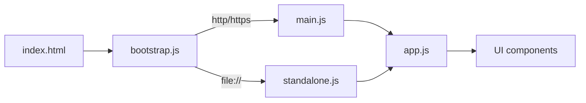

# stvisual 完整規格文件

最後更新：2026-05-06

本文件為 stvisual（軟體測試方法視覺化）專案的完整規格說明，包含產品定位、UI 章節、Graph Coverage / Logic Coverage 演算法與資料結構、Karnaugh Map 視覺化規則、雲端整合、測試與佈署流程。

---

## 1. 專案總覽

| 項目 | 內容 |
| --- | --- |
| 名稱 | stvisual（Software Testing Visualization） |
| 目的 | 將軟體測試理論（測試方法分類、Graph Coverage、Logic Coverage 等）轉成可互動、可驗證的視覺化教學平台 |
| Live Demo | <https://skhuang.github.io/stvisual/> |
| Repository | <https://github.com/skhuang/stvisual> |
| 主要技術 | 純 HTML + JavaScript（ES Module）、Firebase（Auth/Firestore/Drive）、esbuild、Vitest、Playwright |

### 1.1 部署形式

- **HTTP / HTTPS 模式**：[index.html](../index.html) → [src/bootstrap.js](../src/bootstrap.js) → [src/main.js](../src/main.js) → [src/app.js](../src/app.js)，使用原生 ES Module。
- **`file://` 模式（離線）**：bootstrap 偵測到 `file:` protocol 時改載入預先 bundle 的 [src/standalone.js](../src/standalone.js)（IIFE），避免 module CORS 限制。
- **GitHub Pages**：由 [scripts/prepare-pages.mjs](../scripts/prepare-pages.mjs) 把 `src/` 與 `index.html` 複製到 `site/`，由 `.github/workflows/deploy-pages.yml` 部署。

### 1.2 進入點協定切換



---

## 2. UI 章節（Top-level Features）

`app.js` 依序組裝下列章節，每節皆為一個 `create*()` 工廠函式回傳的 DOM 子樹。

| # | 章節 | Component | 主要資料來源 | testid |
| --- | --- | --- | --- | --- |
| 2.1 | 測試方法分類 | [TestingMethodTree.js](../src/components/TestingMethodTree.js) | `testingMethods` | `testing-method-tree` |
| 2.2 | 測試流程 | [TestingFlow.js](../src/components/TestingFlow.js) | `testingFlow` | `testing-flow` |
| 2.3 | 常見測試類型 | [TestingTypesTable.js](../src/components/TestingTypesTable.js) | `testingTypes` | `testing-types` |
| 2.4 | Graph Coverage | [GraphCoverageExplorer.js](../src/components/GraphCoverageExplorer.js) | `graphCoverageCriteria`, `graphCoverageGraph`, `graphCoverageProgramExamples` | `graph-coverage` |
| 2.5 | Logic Coverage | [LogicCoverageExplorer.js](../src/components/LogicCoverageExplorer.js) | `logicCoverageCriteria`, `logicCoveragePredicates` | `logic-coverage` |
| 2.6 | 雲端整合 | [CloudStoragePanel.js](../src/components/CloudStoragePanel.js) | `cloudConfig.js` + Firebase | `cloud-storage-panel` |

### 2.1 測試方法分類

- 黑盒：BVA、EP、CEG、STT
- 白盒：Statement、Branch、Graph、Logic、Path、Prime Path、Condition、Multiple Conditions
- 灰盒：結合黑/白盒、部分代碼可見

互動：每張卡可單獨展開／收合（`method-card-btn-{id}`）、整體 Expand/Collapse All（`toggle-all-btn`），並以可視性條（`visibility-fill`）顯示「程式碼可見度 0–100%」。

### 2.2 測試流程

六個步驟：需求分析 → 測試計劃 → 測試設計 → 測試執行 → 結果分析 → 缺陷報告。
支援自動播放（1800 ms / 步）、暫停、跳步；步驟間以箭頭與進度條串接（`flow-progress-fill`）。

### 2.3 常見測試類型

倒置金字塔：Unit（30%） → Integration（55%） → System（80%） → Acceptance（100%），下方搭配卡片陣列說明目的、時機。

### 2.4 Graph Coverage Explorer

詳見第 3 節。

### 2.5 Logic Coverage Explorer

詳見第 4–5 節。

### 2.6 Cloud Storage Panel

詳見第 6 節。

---

## 3. Graph Coverage 規格

主要實作位於 [src/utils/graphCoverage.js](../src/utils/graphCoverage.js)、[src/utils/programToGraph.js](../src/utils/programToGraph.js)、[src/components/GraphCoverageExplorer.js](../src/components/GraphCoverageExplorer.js)。

### 3.1 支援的覆蓋準則

| id | 名稱 | 說明 |
| --- | --- | --- |
| `node` | Node Coverage | 每個節點至少被走訪一次 |
| `edge` | Edge Coverage | 每條有向邊至少被走訪一次 |
| `prime-path` | Prime Path Coverage | 涵蓋所有 prime path（最大不可延伸的簡單路徑、含環） |
| `edge-pair` | Edge-Pair Coverage | 每對相鄰邊都至少被走過 |
| `complete-path` | Complete Path Coverage | 在有限深度下列舉所有可行 start→end 路徑 |

### 3.2 圖資料模型

```ts
type Graph = {
  nodes: { id: string; label?: string; x?: number; y?: number }[];
  edges: { id: string; from: string; to: string; via?: { x: number; y: number } }[];
  start: string;
  end: string;
};
```

CFG 編輯器以 CSV 文字輸入 nodes / edges，解析後即時重算 requirements 與 paths。

### 3.3 主要 API

- `getCoverageRequirements(graph, criterionId)`：依據 criterion 派發到下列函式之一。
  - `getNodeRequirements(graph)`、`getEdgeRequirements(graph)`、`getEdgePairRequirements(graph)`、`getPrimePathRequirements(graph)`、`getCompletePathRequirements(graph)`。
- `enumerateSimplePaths(graph)`：以 DFS 自每節點出發列舉簡單路徑（除起點外不重複造訪節點），並偵測環。
- `getPrimePaths(graph)`：對 `enumerateSimplePaths` 的結果以「兩端不可延伸」過濾出 prime path（環一律視為 prime）。
- `buildTestPathSetForRequirements(graph, requirements)`：列舉候選路徑後呼叫 `greedySetCover`。
- `greedySetCover(pathRecords, requirements)`：每次選覆蓋最多剩餘 requirement 的路徑，回傳選用集合與未滿足項目。

### 3.4 程式碼上傳（Code → CFG）

`generateControlFlowGraphFromProgram(source, language)` 位於 [programToGraph.js](../src/utils/programToGraph.js)：

- 支援 JavaScript 與 Pseudocode；可辨識 `if/else`、`switch/case`、`for/while`、`break/continue`、`return`。
- 產生節點：start、end、decision、normal；節點帶有原始行號以供 source mapping。
- UI 切到不同 requirement 時會反白對應原始碼行號。

### 3.5 主要 testid

`graph-criterion-select`、`graph-example-{id}`、`graph-requirements-list`、`graph-paths-before`、`graph-paths-after`、`graph-source-line-{n}`。

---

## 4. Logic Coverage 規格

主要實作位於 [src/utils/logicCoverage.js](../src/utils/logicCoverage.js)、[src/utils/karnaughMap.js](../src/utils/karnaughMap.js)、[src/components/LogicCoverageExplorer.js](../src/components/LogicCoverageExplorer.js)。

### 4.1 完整覆蓋準則清單

| 群組 | id | 英文 | 中文 | 描述 |
| --- | --- | --- | --- | --- |
| 語意 | `pc` | Predicate Coverage | Predicate Coverage | predicate 至少各取 T/F 一次 |
| 語意 | `cc` | Clause Coverage | 子句覆蓋 | 每個 clause 各取 T/F 一次 |
| 語意 | `coc` | Combinatorial Coverage | 組合覆蓋 | 列舉 2ⁿ 種子句真假組合 |
| 語意 | `gacc` | General Active Clause Coverage | GACC | 主子句決定 predicate（次子句不限） |
| 語意 | `cacc` | Correlated Active Clause Coverage | CACC | 主子句決定 predicate，且兩列產生不同 predicate 值 |
| 語意 | `racc` | Restricted Active Clause Coverage | RACC | 主子句決定 predicate，兩列次子句完全相同 |
| 語意 | `gicc` | General Inactive Clause Coverage | GICC | 主子句不決定 predicate，覆蓋 (c=T/F)×(P=T/F) 共 4 組合 |
| 語意 | `ricc` | Restricted Inactive Clause Coverage | RICC | 同 GICC，且兩列次子句完全相同 |
| 語法（DNF） | `ic` | Implicant Coverage | IC | f 與 ¬f 的每個 prime implicant 至少有一個 row 滿足（最小化測試列） |
| 語法（DNF） | `utpc` | Unique True Point Coverage | UTPC | 列出每個 implicant 的所有 unique true points |
| 語法（DNF） | `mutpc` | Multiple Unique True Point Coverage | MUTPC | 為每個 implicant 挑一組 UTPs，使每個次子句至少各出現一次 T 與 F |
| 語法（DNF） | `nfpc` | Near False Point Coverage | NFPC | 為每個 implicant×literal 找一個翻轉後使 P 為 F 的 row |
| 語法（DNF） | `mnfpc` | Multiple Near False Point Coverage | MNFPC | 為每個 implicant×literal 挑一組 NFPs，使每個次子句至少各出現一次 T 與 F |
| 語法（DNF） | `cutpnfp` | Corresponding UTP + NFP Pair Coverage | CUTPNFP | 為每個 implicant×literal 挑一對僅在該 literal 不同的 UTP/NFP |

### 4.2 Predicate 文法

支援程式風格與教科書記號可自由混用：

| 記號 | 含義 | 範例 |
| --- | --- | --- |
| `&&` 或相鄰（juxtaposition） | AND | `a && b` 或 `ab` |
| `\|\|` 或 `+` | OR | `a \|\| b` 或 `a+b` |
| `!` | NOT | `!a` |
| `(` `)` | 群組 | `(a+b)(c+d)` |
| identifier | 子句名稱 | 單字母可選跟數字，如 `a`、`b`、`c1`、`x2` |

Tokenizer：

```js
const TOKEN_REGEX = /\s*(?:(\()|(\))|(&&)|(\|\|)|(\+)|(!)|([A-Za-z][0-9]*))/y;
```

Parser 採遞迴下降，優先級為 OR < AND < NOT < Atom；`parseAnd` 在下一個 token 為 `(`、`!` 或 ident 時自動視為 juxtaposition AND。

### 4.3 真值表

`buildTruthTable(parsed)` 為每個 minterm 產生：

```ts
type TruthRow = {
  index: number;                          // minterm 編號 (MSB = clauses[0])
  values: Record<string, boolean>;        // 每個 clause 的真值
  predicate: boolean;                     // AST 評估結果
  determines: Record<string, boolean>;    // 翻轉 c 後 predicate 是否改變
};
```

`determines[c] = evaluateAst(ast, {...values, [c]: !values[c]}) !== predicate`，用於計算 ACC / ICC 系列的 active / inactive 列。

### 4.4 DNF 與 Quine–McCluskey

- `toDNF(ast)`：直接由 AST 遞迴展開（NOT 翻極性、AND cross-product、OR concat）。
- `minimalDNF(rows, clauses, target)`：
  1. 收集 minterms（predicate === target）。
  2. 反覆合併「僅差一位」的群組，產生 prime implicants。
  3. 找出 essential primes（只被一個 prime 覆蓋的 minterm）。
  4. 對剩餘 minterms 以 greedy 演算法選出最少 prime 加入。
- 結果 term：`Array<{ name: string; negated: boolean }>`。

### 4.5 各 buildXSet 演算法摘要

| 函式 | 演算法概要 |
| --- | --- |
| `buildPredicateCoverageSet(rows)` | 各取一個 P=T 與 P=F 的 row |
| `buildClauseCoverageSet(rows, clauses)` | 對每個 clause 各取一個 T、一個 F |
| `buildCombinatorialCoverageSet(rows)` | 全部 2ⁿ 列 |
| `buildGACCSet`/`buildCACCSet`/`buildRACCSet` | `pickPair(rows, clause, mode)`：以 `determines` 為前提，依 mode 對「次子句限制」決定是否需相同 |
| `buildGICCSet`/`buildRICCSet` | 在 `determines[c]=false` 的 row 中列舉 (c, P) 的 4 種組合，RICC 額外要求次子句相同 |
| `buildImplicantCoverageSet(rows, dnf, negDnf)` | 每個 implicant 候選列為「滿足 term 且 predicate 對應極性」的 rows；先 essential、再 greedy 取最小 row 集合 |
| `buildUTPCSet(rows, dnf)` | 列出每個 implicant 的所有 unique true points（僅該 implicant 為真） |
| `buildMUTPCSet(rows, clauses, dnf)` | 對每 implicant，從其 UTPs 中 greedy 取最少使每個次子句的 (T,F) 都出現 |
| `buildNFPCSet(rows, dnf)` | 對每 implicant×literal，找一個 NFP（翻該 literal 後 implicant 假、P 假），同時記錄成對的 UTP |
| `buildMNFPCSet(rows, clauses, dnf)` | 對每 implicant×literal，從其 NFPs 中 greedy 取最少使每個次子句的 (T,F) 都出現 |
| `buildCUTPNFPSet(rows, dnf)` | 對每 implicant×literal，挑一對 (UTP, NFP) 僅在該 literal 不同 |

### 4.6 `buildAllCoverageSets(parsed)` 統一介面

```ts
type Analysis = {
  rows: TruthRow[];
  clauses: string[];
  dnf: Term[];        // f 的最小 DNF
  negDnf: Term[];     // ¬f 的最小 DNF
  sets: {
    pc; cc; coc;
    gacc; cacc; racc; gicc; ricc;
    ic; utpc; mutpc; nfpc; mnfpc; cutpnfp;
  };
};
```

每個 set 的形狀為：

```ts
type CoverageSet = {
  id: string;
  name: string;
  description: string;
  tests: Array<{
    id: string;
    row: TruthRow;
    label: string;
    implicantIndex?: number;
    implicantIndices?: number[];
    polarity?: 'pos' | 'neg';     // IC：屬於 f 或 ¬f
    role?: 'utp' | 'nfp';         // CUTPNFP
    literal?: { name: string; negated: boolean };
    pairedRowIndex?: number;      // CUTPNFP / NFPC
    pairedTruePointIndex?: number;
  }>;
  requirementCount: number;
  unsatisfied?: string[];
};
```

### 4.7 最近 predicate 持久化

| 儲存 | 路徑/Key | 內容 |
| --- | --- | --- |
| localStorage | `stvisual.logic.recentPredicates` | JSON 陣列（≤ 8 筆）|
| Firestore | `users/{uid}/settings/logicCoverage.recentPredicates` | 同上，附 `updatedAt` |

流程：使用者按 Enter 或 blur → `rememberCurrentExpression` 將表達式塞到陣列前端 → 寫 localStorage、若已登入則 `pushRecentToCloud`；登入時遠端與本地會以「先遠端、再本地」順序合併去重後再回寫。

---

## 5. Karnaugh Map 視覺化規格

### 5.1 K-map 排版（[karnaughMap.js](../src/utils/karnaughMap.js)）

| n | rowVars | colVars | rowOrder | colOrder |
| --- | --- | --- | --- | --- |
| 1 | — | `c₀` | — | `[0,1]` |
| 2 | `c₀` | `c₁` | `[0,1]` | `[0,1]` |
| 3 | `c₂` | `c₀c₁` | `[0,1]` | `[0,1,3,2]`（Gray）|
| 4 | `c₂c₃` | `c₀c₁` | `[0,1,3,2]` | `[0,1,3,2]` |

n > 4 時 `buildKMap` 回傳 `{ unsupported: true, n }`，UI 顯示提示文字。

### 5.2 Cell 顯示元素

`renderKMap(rows, clauses, target, title, options)` 中 `options` 可含：

| 欄位 | 用途 |
| --- | --- |
| `highlightedMinterms: Set<number>` | 該 minterm 加 ★ 與橘色外框 |
| `implicantGroups: Group[]` | 為每個 implicant 配色，cell 右下角畫對應顏色圓點 |
| `nfpMarks: Map<minterm, {color, label}>` | 紅虛線外框 + 左上 `NFP` 邊框標籤 |
| `ntpMarks: Map<minterm, {color, label}>` | 綠實線外框 + 左上 `UTP` 彩色標籤 |
| `highlightLabel: string` | tooltip 上顯示的星號意義（`UTP`、`MUTP`、`test`…） |

`buildImplicantGroups(rows, terms, target, paletteOffset, testsForPolarity)` 為每個 term 計算覆蓋的 minterms，並彙整由 `tests[].implicantIndex(es)` 對應的 test row indices，方便 legend 顯示 `tests: m{n}, …`。

### 5.3 各 criterion 的 K-map 對應

| Criterion | 顯示的 K-map | 標示 |
| --- | --- | --- |
| `ic` | f 與 ¬f 各一張 | implicant 圓點 + legend；test row 加 ★ |
| `utpc` | 僅 f | 所有 UTP cell 加 ★ |
| `mutpc` | 僅 f | implicant 圓點 + legend；選用 MUTP cell 加 ★ |
| `nfpc` | 僅 f | implicant 圓點 + legend；NFP 紅虛框 / UTP 綠實框 |
| `mnfpc` | 僅 f | 同 NFPC，但每對 implicant×literal 可有多個 NFP cell |
| `cutpnfp` | 僅 f | implicant 圓點；UTP/NFP 成對標示；test case 加 ★ |
| 其他語意系列 | 無 K-map | 僅顯示真值表 |

### 5.4 教科書式 DNF 文字

`termToCompactHtml(term)` 將 term 渲染為「相鄰 = AND、`+` = OR、上方橫線 = NOT」的文字，例：`a̅bc + ac̅`。Logic Coverage 區塊在 IC/UTPC/MUTPC/NFPC/MNFPC/CUTPNFP 摘要內同時顯示 ASCII 與教科書式記號。

---

## 6. 雲端整合（Firebase）

### 6.1 設定

[src/config/cloudConfig.js](../src/config/cloudConfig.js) 為預設 config，runtime 可由 `globalThis.STVISUAL_CLOUD_CONFIG` 覆寫：

```ts
type CloudConfig = {
  firebase: { apiKey; authDomain; projectId; storageBucket; messagingSenderId; appId; measurementId };
  drive: { uploadFolderId };
};
```

`createCloudIntegrationClient()`（[cloudIntegration.js](../src/utils/cloudIntegration.js)）會做下列前置檢查：

1. `file://` 協定 → 回傳 stub（含 `originWarning`）。
2. 缺少 Firebase config 鍵 → 回傳 stub（含 `missingKeys`）。
3. Firebase compat SDK 尚未注入 → 回傳 stub（含 `sdkMessage`）。

### 6.2 API 介面

| 類別 | 函式 | 說明 |
| --- | --- | --- |
| Auth | `subscribeAuthState(cb)` | 訂閱使用者；回傳 `unsubscribe` |
| Auth | `signInWithGoogle()` | Google OAuth；要求 `drive.file` scope |
| Auth | `signOutGoogle()` | 登出並清除 Drive token |
| Settings | `loadSettings(uid)` | 讀 `users/{uid}/settings/default` |
| Settings | `saveSettings(uid, data)` | merge-set，含 `updatedAt` |
| Logic | `loadLogicRecent(uid)` | 讀 `users/{uid}/settings/logicCoverage.recentPredicates` |
| Logic | `saveLogicRecent(uid, list)` | 同上寫入 |
| Drive | `uploadFileToDrive(file, options?)` | multipart 上傳到 Drive；可指定 `folderId` |

### 6.3 消費端

- `LogicCoverageExplorer`：`subscribeAuthState` + `saveLogicRecent` / `loadLogicRecent`。
- `CloudStoragePanel`：完整面板（settings CRUD、檔案上傳、登入登出、原點警告）。

---

## 7. 測試策略

### 7.1 Vitest（單元測試）

`src/tests/` 目前共 10 個檔案、123 個測試（含 `karnaughMap.test.js` 6 個測試）：

| 檔案 | 重點 |
| --- | --- |
| `logicCoverage.test.js` | 解析器、真值表、DNF、各 buildXSet |
| `karnaughMap.test.js` | n = 1–4 的 K-map 排版 |
| `graphCoverage.test.js` | path 列舉、prime path、requirement、greedy set cover |
| `programToGraph.test.js` | JS / Pseudocode → CFG |
| `cloudIntegration.test.js` | stub client 行為 |
| `testingData.test.js` | 資料結構驗證 |
| `TestingMethodTree.test.jsx` | 元件展開/收合、動畫 |
| `TestingFlow.test.jsx` | 流程播放與步進 |
| `TestingTypesTable.test.jsx` | 金字塔與卡片 |
| `GraphCoverageExplorer.test.jsx` | 編輯器、criterion 切換、metrics |

執行：`npm run test:run`、`npm run test:coverage`。

### 7.2 Playwright（瀏覽器 E2E）

`e2e/` 對 `http://127.0.0.1:4173`（`npm run serve`）執行：

| 檔案 | 場景 |
| --- | --- |
| `code-upload.spec.js` | 上傳程式碼、解析 CFG |
| `graph-coverage.spec.js` | 切換 criterion、產生 requirements/paths、最佳化 |
| `logic-coverage.spec.js` | 解析 predicate、切換 criterion、驗證真值表與 K-map |
| `path-optimization-metrics.spec.js` | 最佳化前後指標 |

執行：`npm run test:browser`、`npm run test:browser:headed`。

---

## 8. 建置與 CI/CD

### 8.1 NPM scripts

```json
{
  "serve": "python3 -m http.server 4173",
  "build:standalone": "node scripts/build-standalone.mjs",
  "pages:prepare": "npm run build:standalone && node scripts/prepare-pages.mjs",
  "test": "vitest",
  "test:run": "vitest run",
  "test:coverage": "vitest run --coverage",
  "test:browser": "playwright test",
  "test:browser:headed": "playwright test --headed"
}
```

### 8.2 Build 腳本

- [scripts/build-standalone.mjs](../scripts/build-standalone.mjs)：esbuild 將 `src/main.js` 與所有依賴打包成 IIFE → `src/standalone.js`。
- [scripts/prepare-pages.mjs](../scripts/prepare-pages.mjs)：清空 `site/`，複製 `index.html`、`src/{main,bootstrap,standalone,app,styles,App}.{js,css}`、以及 `src/{components,data,config,utils}/`，並寫入 `.nojekyll`。

### 8.3 GitHub Actions

| Workflow | 任務 |
| --- | --- |
| `.github/workflows/test.yml` | `unit-test`（Vitest）+ `browser-test`（Playwright） |
| `.github/workflows/deploy-pages.yml` | 測試通過後執行 `pages:prepare`，把 `site/` 部署到 GitHub Pages |

---

## 9. 專案目錄結構

```
stvisual/
├── index.html
├── package.json
├── vitest.config.js
├── playwright.config.js
├── README.md
├── Plan.md
│
├── src/
│   ├── bootstrap.js          # protocol-aware loader
│   ├── main.js               # http/https 入口
│   ├── app.js                # 章節組裝
│   ├── standalone.js         # （由 build:standalone 產出）file:// 用 IIFE
│   ├── styles.css / App.css
│   ├── components/
│   │   ├── TestingMethodTree.{js,css}
│   │   ├── TestingFlow.{js,css}
│   │   ├── TestingTypesTable.{js,css}
│   │   ├── GraphCoverageExplorer.{js,css}
│   │   ├── LogicCoverageExplorer.{js,css}
│   │   └── CloudStoragePanel.{js,css}
│   ├── data/testingData.js
│   ├── config/cloudConfig.js
│   ├── utils/
│   │   ├── graphCoverage.js
│   │   ├── programToGraph.js
│   │   ├── logicCoverage.js
│   │   ├── karnaughMap.js
│   │   └── cloudIntegration.js
│   └── tests/                # Vitest
│
├── site/                     # （產出）GitHub Pages artifact
├── e2e/                      # Playwright
├── scripts/
│   ├── build-standalone.mjs
│   └── prepare-pages.mjs
├── docs/
│   ├── Specification.zh-TW.md     # 本檔
│   ├── Presentation-*.md
│   └── assets/
└── .github/workflows/{test,deploy-pages}.yml
```

---

## 10. 未來工作（Roadmap）

- 擴充 `programToGraph` 支援更多語言與更深層語法（try/catch、async/await、class methods）。
- Graph Coverage 與 Logic Coverage 的雙向導航（K-map cell ↔ 真值表 row ↔ predicate token）。
- 匯出覆蓋報告（Markdown / JSON / PDF）供教學評量使用。
- Cloud：將 Graph Coverage 編輯器內容也納入 Firestore 同步；提供分享連結。
- 加入更多教科書 predicate 範例（重用 `logicCoveragePredicates`）。
