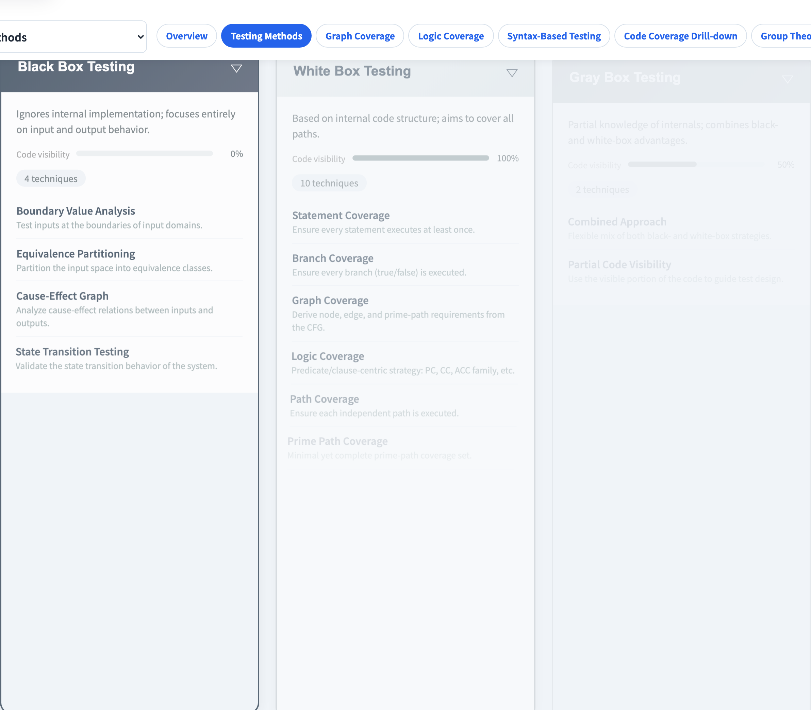
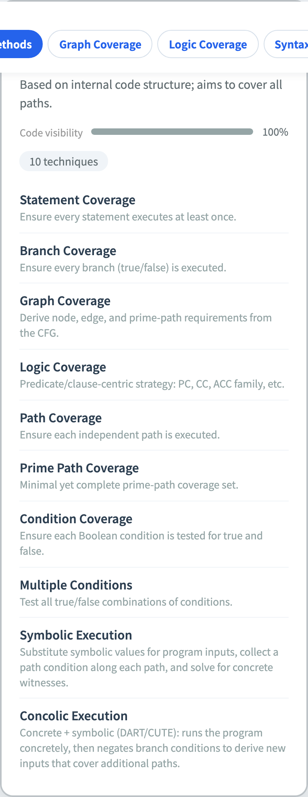

# Software Testing Visualization
### Lecture #1 — Course Intro & Testing Method Classification

Software Testing Visualization, Lecture #1
Tool: `/section-methods` ([TestingMethodTree](../../src/components/TestingMethodTree.js))

<!-- Welcome students. This series has 13 lectures, each paired with a browser-based interactive tool designed to turn abstract test criteria into measurable engineering practice. -->
---

## Course goal

Turn abstract test-criteria definitions into **operable, verifiable** visual teaching:

- Beyond definitions — click around the tool and watch requirements / metrics update live.
- One CFG / predicate / program threads through several criteria for side-by-side comparison.
- Every lecture comes with a **worked example**, a **tool demo**, and **exercises**.

> Main thread: **from theory to quantifiable engineering practice**.

<!-- Emphasize "hands-on": every requirement is a clickable item in the tool and students see coverage metrics update in real time, rather than just memorizing definitions. -->
---

## Course map (8 lectures)

| # | Topic | Spec section |
| --- | --- | --- |
| **1** | **Course intro & method classification** | §1, §2 |
| 2 | Testing flow & testing pyramid | §2.B |
| 3 | Graph Coverage (structural) | §3 |
| 4 | Data Flow Coverage | §15 |
| 5 | Logic Coverage (14 criteria) | §4–5 |
| 6 | Program Mutation (15 operators) | §11.2, §17.3 |
| 7 | Grammar + String Mutation | §12, §13 |
| 8 | Specification Mutation + SMV + FSM | §14, §16 |

<!-- The course has expanded to 13 lectures (adding Data Flow #4 and Logic Binding #13). Three main threads: graph (#3–#4), logic (#5, #13), and mutation (#6–#8). -->
---

## Learning dependencies

```
   #1 Intro
       │
       ▼
   #2 Testing flow
       │
       ├──► #3 Graph Coverage ──► #4 Data Flow Coverage
       │
       ├──► #5 Logic Coverage  ◄── shares parsePredicate ──► #8 Spec Mutation
       │
       └──► #6 Program Mutation ──► #7 Grammar Mutation ──► #8 Spec Mutation
```

> Three sub-threads (graph, logic, mutation) converge at #8.

<!-- The three threads can be taken in any order, but Graph Coverage is a prerequisite for Data Flow. Ask: which thread are you currently on? -->
---

## Three categories, organised by code visibility

| Category | Visibility | Perspective |
| --- | --- | --- |
| **Black box** | 0% | Only input / output behaviour |
| **Gray box** | ~50% | Some internal information assists test design |
| **White box** | 100% | Full source code + control flow / data flow |

> The tool’s `visibility-fill` is a progress bar that visualises this 0–100% spectrum.

<!-- "Code visibility" is the core classification axis. Ask students which category their daily testing falls into — the answer is usually gray-box. -->
---

## Black-box techniques (4)

| Technique | Use |
| --- | --- |
| **BVA** Boundary Value Analysis | Test boundary values (incl. boundary ±1) |
| **EP** Equivalence Partitioning | Split inputs into equivalence classes, one sample each |
| **CEG** Cause-Effect Graph | Reason about input → output causes |
| **STT** State Transition Testing | Validate state-machine transitions |

> Common trait: no source code required; can start during the requirements phase.

<!-- BVA is the most commonly underestimated but highly effective technique. All four black-box techniques need no source code and can be designed at the requirements review stage. -->
---

## White-box techniques (10, the core of this series)

| Technique | Lecture |
| --- | --- |
| Statement / Branch Coverage | #3 |
| Graph Coverage / Prime Path | #3 |
| Path Coverage | #3 |
| Condition / Multiple Conditions | #5 |
| **Logic Coverage** (PC/CC/ACC/IC…) | #5 |
| **Symbolic Execution** | Future #9 |
| **Concolic Execution** | Future #9 |

> Slogan: **any structure → a coverage criterion**.

<!-- Core idea for white-box: "structure defines criterion." Each subsequent lecture dives into one structure (graph, logic, mutation) as a concrete realization. -->
---

## Gray-box techniques (2)

| Pattern | Example |
| --- | --- |
| **Combined Approach** | Design with white-box, verify with black-box |
| **Partial Code Visibility** | Only API / spec visible → use it to inform tests |

> In practice nearly every project is gray box (no one can read 100% of their dependencies’ source).

<!-- Ask: has anyone ever seen all their dependencies' source code? This question usually makes everyone realize that almost all real-world testing is gray-box. -->
---

## Tool: testing method tree



- Three cards (`method-card-{blackbox, whitebox, graybox}`), each with a `visibility-fill` bar at 0% / 50% / 100%.
- Click `method-card-btn-{id}` to expand a category, or hit `toggle-all-btn` to expand / collapse everything.
- Every technique (`technique-{id}`) carries a bilingual name + description.

<!-- Open the tool live. Click toggle-all-btn to expand all 16 techniques, then ask students to find the visibility-fill bar and state that black-box is 0%. -->
---

## Tool: white-box card expanded



- All 10 white-box techniques are listed, highlighting which ones this series covers in depth.
- The latest additions `symbex` / `concolic` are present — they correspond to textbook **symbolic execution** and DART/CUTE-style **concolic execution**.
- After this lecture students can answer: “Which category does my current test belong to? Which criterion measures its coverage?”

<!-- Core idea for white-box: "structure defines criterion." Each subsequent lecture dives into one structure (graph, logic, mutation) as a concrete realization. -->
---

## Three core mental models

Used throughout the course:

1. **Abstraction** — turn the program into a graph, predicate, grammar, or spec.
2. **Coverage** — define an “at-least-once” criterion on that abstraction.
3. **Mutation** — inject faults into the subject and watch whether the test set catches them.

> Lectures #3–#5 develop (1) + (2); #6–#8 apply (3) to program / grammar / spec subjects.

<!-- These three mental models (abstract, cover, mutate) are the skeleton of the entire series. Every criterion fits into one of them. -->
---

## Summary

- Three categories by visibility: **black (0%) → gray (50%) → white (100%)**.
- 4 black-box, 10 white-box, 2 gray-box techniques — all surfaced in the tool.
- The next seven lectures take every criterion from definition to a visual demo.
- Tool design principle: **change one input → every metric re-computes instantly**.

<!-- This lecture is an overview — no need to memorize everything. Awareness of the landscape matters; each subsequent lecture will go deep into one criterion. -->
---

## Exercises

1. Open `/section-methods` and hit `toggle-all-btn` to expand all 16 techniques. Pick 3 you have **never used** and read their descriptions.
2. Within the white-box list, which two techniques belong to the “symbolic execution family”? What is the difference?
3. Imagine you’re testing a third-party API (OpenAPI doc only, no source). Which category? Which techniques?
4. Compare EP with Combinatorial Coverage (#5) on “number of test rows”. Why is the black-box approach so much cheaper?

<!-- Reserve 10–15 minutes for hands-on tool exploration. Exercise 1 is the most essential; exercises 3–4 make good take-home discussion topics. -->
---

## Further reading

- Ammann & Offutt, *Introduction to Software Testing* — Ch. 1–2 (overall framework).
- Implementation:
  - [src/components/TestingMethodTree.js](../../src/components/TestingMethodTree.js) — tree expansion + visibility bar.
  - [src/data/testingData.js](../../src/data/testingData.js) — bilingual data for 16 techniques.
- Spec §1–§2: [docs/Specification.zh-TW.md](../Specification.zh-TW.md).
- Next → **Lecture #2 — Testing flow & testing pyramid**.

<!-- Students wanting depth can read A&O §1–2. The full tool specification is in docs/Specification.zh-TW.md. -->
