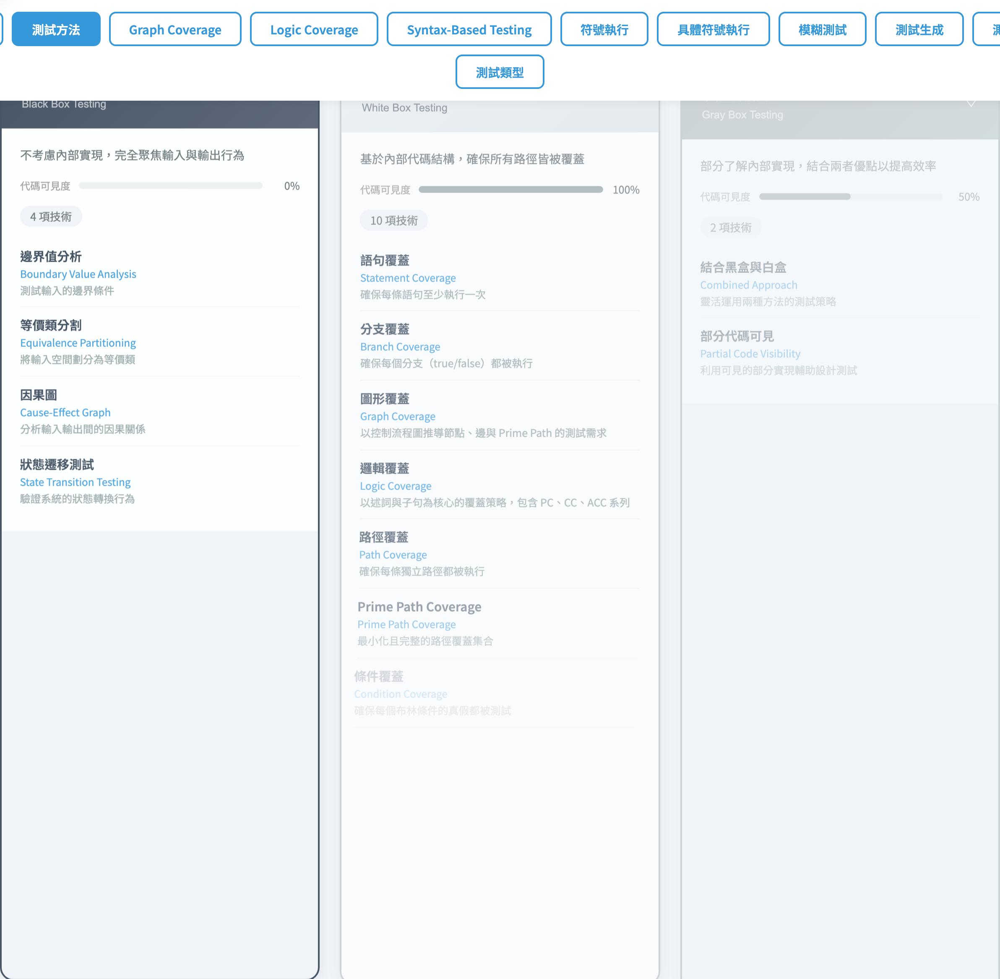
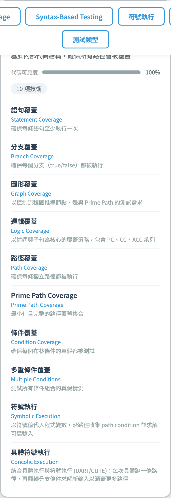

# 軟體測試視覺化系列
### #1 課程概觀 & 測試方法分類

第 1 講
搭配工具：`/section-methods`（[TestingMethodTree](../../src/components/TestingMethodTree.js)）

<!-- 歡迎學生。本系列共 13 講，每講都有一個可在瀏覽器直接操作的互動工具，目標是讓抽象準則變成可量化的工程實踐。 -->
---

## 課程目標

把抽象的「測試準則」變成**可操作、可驗證**的視覺化教學流程：

- 不止講定義 — 動手在工具裡按按鈕、看 requirements / metrics 即時變化
- 同一份 CFG / predicate / program 串起多個準則，方便交叉對照
- 每講都附**手算範例**、**工具演示**、**課堂練習**

> 主軸：**從理論到可量化的工程實踐**。

<!-- 強調「動手做」：每個 requirement 是工具裡可點選的項目，學生能即時看到覆蓋率數字如何變化，而不只是背定義。 -->
---

## 課程地圖（8 講）

| # | 主題 | 對應 spec |
| --- | --- | --- |
| **1** | **課程概觀 & 測試方法分類** | §1, §2 |
| 2 | 測試流程 & 測試金字塔 | §2.B |
| 3 | Graph Coverage（結構性） | §3 |
| 4 | Data Flow Coverage | §15 |
| 5 | Logic Coverage（14 準則）| §4–5 |
| 6 | Program Mutation（15 operators） | §11.2, §17.3 |
| 7 | Grammar + String Mutation | §12, §13 |
| 8 | Specification Mutation + SMV + FSM | §14, §16 |

<!-- 課程現已擴展為 13 講（含 Data Flow #4 與 Logic Binding #13）。三條主線：圖（#3–#4）、邏輯（#5、#13）、突變（#6–#8）。 -->
---

## 學習依賴關係

```
   #1 課程概觀
       │
       ▼
   #2 測試流程
       │
       ├──► #3 Graph Coverage ──► #4 Data Flow Coverage
       │
       ├──► #5 Logic Coverage  ◄── 共用 parsePredicate ──► #8 Spec Mutation
       │
       └──► #6 Program Mutation ──► #7 Grammar Mutation ──► #8 Spec Mutation
```

> 三條子線（圖、邏輯、突變）最後在 #8 收斂。

<!-- 三條子線可不按順序修，但 Graph Coverage 是 Data Flow 的前置知識。可問學生：你目前在哪一條路線上？ -->
---

## 三大分類：以「程式碼可見度」為軸

| 分類 | 可見度 | 觀點 |
| --- | --- | --- |
| **黑盒** | 0% | 只看 input / output 行為 |
| **灰盒** | ~50% | 部分內部資訊輔助設計 |
| **白盒** | 100% | 完整看到原始碼 + 控制流 / 資料流 |

> 工具的 `visibility-fill` 用一條進度條視覺化這個 0–100% 的差異。

<!-- 「程式碼可見度」是本課分類的核心軸。問學生日常測試屬於哪一類——往往答案是灰盒，引導他們思考為什麼。 -->
---

## 黑盒測試（4 種技巧）

| 技巧 | 用途 |
| --- | --- |
| **BVA** Boundary Value Analysis | 測試邊界值（含邊界 ±1） |
| **EP** Equivalence Partitioning | 把輸入空間切成等價類，每類選一個 |
| **CEG** Cause-Effect Graph | 分析 input → output 因果 |
| **STT** State Transition Testing | 驗證狀態轉換行為 |

> 共同特徵：不需要看程式碼，可在需求階段就開始設計。

<!-- BVA 最容易被低估但效果顯著。強調這四種技巧不需要看原始碼，可以在需求評審會議就開始設計測試。 -->
---

## 白盒測試（10 種技巧，本系列核心）

| 技巧 | 對應簡報 |
| --- | --- |
| Statement / Branch Coverage | #3 |
| Graph Coverage / Prime Path | #3 |
| Path Coverage | #3 |
| Condition / Multiple Conditions | #5 |
| **Logic Coverage**（PC/CC/ACC/IC…） | #5 |
| **Symbolic Execution** | 未來的 #9 |
| **Concolic Execution** | 未來的 #9 |

> 白盒的核心是「**有結構就能定義 coverage criterion**」。

<!-- 白盒的核心心智：「有結構就能定義覆蓋準則」。後續每講深入一種結構（圖、邏輯、突變），這些技巧都是這句話的具體化。 -->
---

## 灰盒測試（2 種樣態）

| 樣態 | 範例 |
| --- | --- |
| **Combined Approach** | 用白盒設計、用黑盒驗收 |
| **Partial Code Visibility** | 只能看 API / spec，用之輔助測試設計 |

> 在實務上幾乎所有專案都是灰盒（誰能 100% 看到所有 dependency 原始碼？）。

<!-- 問學生：有沒有人完整看過所有 dependency 的原始碼？這個問題通常讓大家意識到現實中幾乎都是灰盒。 -->
---

## 工具：測試方法樹



- 三張卡（`method-card-{blackbox, whitebox, graybox}`），各帶 `visibility-fill` 顯示 0% / 50% / 100%。
- 點 `method-card-btn-{id}` 展開該分類的所有技巧；或按 `toggle-all-btn` 一次展開／收合。
- 每個技巧（`technique-{id}`）有自己的 name + description（雙語）。

<!-- 現場打開工具，先按 toggle-all-btn 展開全部 16 種技巧，再請學生找到 visibility-fill 進度條並說出黑盒是 0%。 -->
---

## 工具：白盒展開後



- 列出所有 10 種白盒技巧 — 標出哪些是本系列會深入講解的。
- 已加入最新的 `symbex` / `concolic`：對應教科書的「符號執行」與 DART/CUTE 風格的具體符號執行。
- 學生看完此講就能回答：「我目前的測試屬於哪一類？覆蓋率該用哪條準則度量？」

<!-- 白盒的核心心智：「有結構就能定義覆蓋準則」。後續每講深入一種結構（圖、邏輯、突變），這些技巧都是這句話的具體化。 -->
---

## 觀念支點

整個課程的三條核心心智模型：

1. **抽象**：把程式變成圖、predicate、grammar、規格
2. **覆蓋**：在抽象上定義一個「至少 X 一次」的準則
3. **突變**：對 subject 注入錯誤，看測試集會不會抓到

> #3–#5 講 1 + 2；#6–#8 把 3 套用在 program / grammar / spec 三種 subject。

<!-- 這三個心智模型（抽象、覆蓋、突變）是整個系列的骨架。每個準則都能歸入其中一類，這是整理知識的好框架。 -->
---

## 小結

- 三大分類由可見度區分：**黑（0%）→ 灰（50%）→ 白（100%）**。
- 黑盒 4 種、白盒 10 種、灰盒 2 種 — 工具裡都有對應卡片。
- 後續七講會把每個準則從定義帶到可演示的視覺化操作。
- 工具設計原則：**改一處輸入 → 全部 metrics 即時重算**。

<!-- 本講是概覽，不需要全部記住。重要的是知道「有這些分類和工具存在」，後續各講會逐一深入每個準則。 -->
---

## 課堂練習

1. 開 `/section-methods`，按 `toggle-all-btn` 展開全部 16 種技巧。挑 3 種你**從未使用過**的，查它的 description。
2. 在白盒類中找出哪兩種技巧屬於「符號執行家族」？它們的差異是什麼？
3. 想像你正在測一個第三方 API（只有 OpenAPI 文件、無原始碼）— 屬於哪一類？應該用哪些技巧？
4. 比較 EP 與 Combinatorial Coverage（#5 會看到）在「測試列數」上的差距 — 為什麼黑盒比較省？

<!-- 預留 10–15 分鐘操作工具。練習 1 最基本（找技巧），練習 3 適合作課後討論（灰盒 API 測試）。 -->
---

## 進一步閱讀

- Ammann & Offutt, *Introduction to Software Testing* — 全書架構的章節 1–2
- 工具實作：
  - [src/components/TestingMethodTree.js](../../src/components/TestingMethodTree.js) — 樹狀展開、可見度條
  - [src/data/testingData.js](../../src/data/testingData.js) — 16 種技巧的雙語資料
- 規格文件 §1–§2：[docs/Specification.zh-TW.md](../Specification.zh-TW.md)
- 下一講 → **#2 測試流程 & 測試金字塔**

<!-- 有興趣的同學可讀 A&O §1–2。工具完整設計決策在 docs/Specification.zh-TW.md。 -->
