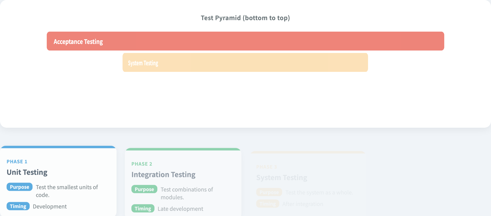

# Testing Flow & Testing Pyramid
### Two classic high-level mental models

Software Testing Visualization, Lecture #2
Tool: `/section-flow` ([TestingFlow](../../src/components/TestingFlow.js)) + `/section-types` ([TestingTypesTable](../../src/components/TestingTypesTable.js))

<!-- This lecture connects two complementary views: flow tells you "what to do when," and pyramid tells you "the right proportion for each layer." -->
---

## Two parallel threads

| Thread | Question | Tool |
| --- | --- | --- |
| **Testing flow** | From requirements to defect reports — **when** do I test? | TestingFlow |
| **Testing pyramid** | How many **unit / integration / system / acceptance** tests should I write? | TestingTypesTable |

> One is horizontal (timeline); the other vertical (layer distribution) — both visualised.

<!-- Both views are needed. Flow gives the engineering lifecycle; pyramid gives the resource allocation ratio. Neither alone is sufficient. -->
---

## Testing flow: six steps

```
Requirements ──► Test Plan ──► Test Design ──► Execution ──► Analysis ──► Defect Report
     📋             📝            ✏️              ▶️              🔍              📊
```

| # | Step | Primary output |
| --- | --- | --- |
| 1 | Requirements | Test goals and scope |
| 2 | Test Plan | Strategy, resources, schedule |
| 3 | Test Design | Test cases, scripts, data |
| 4 | Execution | Actual / expected results |
| 5 | Analysis | Defect list, coverage |
| 6 | Defect Report | Fix-tracking status |

<!-- This lecture connects two complementary views: flow tells you "what to do when," and pyramid tells you "the right proportion for each layer." -->
---

## Tool: auto-play flow


- The six steps form a chain of icons (`flow-step-{id}` + `flow-arrow-{idx}`).
- Click `flow-play-btn` → the tool auto-advances every 1800 ms.
- The progress bar `flow-progress-fill` reflects the current step (0–100%).
- Hover any step → `flow-tooltip-{id}` shows the full description.

<!-- Open the tool and click auto-play to cycle through the six steps. Ask students to find the step they most commonly skip in their own projects. -->
---

## Why this flow still matters

Even in the agile / CI era:
- **Requirements analysis** is still the root of coverage — you can’t test what you don’t understand.
- **Test design** ≠ **execution** — design is consistently under-estimated.
- **Analysis** is the feedback loop — without it, “tests ran” is meaningless.
- **Defect reporting** is where quality and engineering culture meet.

> Teaching tip: animating the flow is what makes students remember that “test design” is a separate stage.

<!-- Even with CI/CD, this six-step logic still holds. CI/CD automates the flow; it does not eliminate it. -->
---

## Another angle: the testing pyramid

```
              ┌────────────────────────────┐
              │      Acceptance (100%)     │  ◄── end-to-end, slow, expensive
              ├──────────────────────┐
              │   System (80%)       │
              ├────────────────┐
              │ Integration (55%) │
              ├──────────┐
              │ Unit (30%) │  ◄── fast, cheap, plentiful
              └──────────┘
```

> The tool draws an **inverted pyramid** (widening left → right) — the meaning is not “Unit is smallest” but “**scope** widens from narrow to broad”.

<!-- The pyramid's most important insight: unit tests should be most numerous, E2E tests fewest, because of the speed and cost difference. -->
---

## Four testing layers

| Layer | Scope | When | Speed |
| --- | --- | --- | --- |
| **Unit** | A single function / class | Development | milliseconds |
| **Integration** | Module combinations | Late dev | seconds |
| **System** | Whole system | After integration | minutes |
| **Acceptance** | Verify requirements | Before release | hours |

> Moving up: **slower + more expensive**. Moving down: **narrower + less confidence**. Balance both ends.

<!-- Ask students: what does your project's pyramid look like? Is it an inverted triangle (lots of E2E, few unit tests)? -->
---

## Tool: pyramid + cards



- The top `pyramid` visualises layer widths (30% / 55% / 80% / 100%).
- The bottom `types-grid` adds a card per layer (`type-card-{id}`): type + purpose + timing.
- The colour scale (blue → green → orange → red) maps to the “fast → slow” intuition.

<!-- The pyramid in the tool is interactive — clicking each layer expands a detail card. Ask students to click and read the examples for each layer. -->
---

## Classic guidance: Mike Cohn’s Test Pyramid

```
       △    Acceptance (few)
      △△    System
     △△△    Integration
    △△△△△   Unit (many)
```

“Many unit tests, few acceptance tests” is the classic recipe, but **modern CI has lowered the cost of higher layers**:
- Docker → integration tests are no longer expensive to set up.
- Playwright / Cypress → e2e can run reasonably fast.

> The pyramid still applies; **the exact ratio can adapt to tooling**.

<!-- Mike Cohn's pyramid principle is widely cited, but many teams invert it. Ask why E2E tests shouldn't be the backbone of the test suite. -->
---

## Two common anti-pyramids

```
  ▽▽▽▽▽   Acceptance   ◄── overly reliant on e2e
   ▽▽▽    System
    ▽▽    Integration
     ▽    Unit
```

or

```
     △    Acceptance
    △△    System       ◄── system-only, skipping integration + unit
   △△△    Integration
  △△△△△   Unit
```

> Both appear often. The first is the “ice-cream cone”; the second is “missing unit tests”. This tool won’t fix them — but it lets you **see the shape you actually have**.

<!-- The ice-cream cone and hourglass are common anti-patterns. Ask students which shape their project is, and discuss how to improve it. -->
---

## Combining the two views

| Flow step | Layers usually involved |
| --- | --- |
| Requirements → design | Planning across all layers |
| Execution (CI-triggered) | Unit every commit, integration every PR, system nightly, acceptance pre-release |
| Analysis | Unit gives fast feedback; acceptance gates releases |
| Defect report | Aggregated across layers |

> Both axes matter: **when to test** (flow) and **how much to test** (pyramid).

<!-- Key connection: "Test Design" in the six steps corresponds to the pyramid layer decision — choose the layer first, then design the test cases. -->
---

## Summary

- Two complementary high-level models:
  - **Flow**: 6 steps on a timeline, visualised via auto-play.
  - **Pyramid**: 4 layers vertically distributed, visualised with widths + colours.
- They are not “testing methods” themselves (that was Lecture #1) — they are the **engineering organisation** around testing.
- The next seven lectures dive into the criteria that live inside the “test design” step.

<!-- The core message: flow makes testing orderly, pyramid makes resource allocation rational. Both are essential. -->
---

## Exercises

1. Open `/section-flow`, click `flow-play-btn`, and watch a full cycle. Try to describe each step in one sentence without using the tooltip.
2. Pick a test suite you currently use (any language). Estimate its pyramid ratio (unit:int:sys:acc). Does it lean toward an ice-cream cone?
3. What automation layers should run in your CI pipeline? When do you still need manual acceptance?
4. Read the colour intensity of `pyramid-row-{id}` in the tool — does darker mean **slower** or **broader scope**? Which interpretation does the designer intend?

<!-- Exercise 1 (draw your own pyramid) is the most important. Exercise 3 (CI/CD discussion) guides students to think about the limits of automation. -->
---

## Further reading

- Mike Cohn, *Succeeding with Agile* — the classic Test Pyramid.
- Martin Fowler, “TestPyramid”: <https://martinfowler.com/bliki/TestPyramid.html>
- Google Testing Blog, “Just Say No to More End-to-End Tests”.
- Implementation:
  - [src/components/TestingFlow.js](../../src/components/TestingFlow.js) — auto-play + progress bar.
  - [src/components/TestingTypesTable.js](../../src/components/TestingTypesTable.js) — pyramid + cards.
  - [src/data/testingData.js](../../src/data/testingData.js) — `testingFlow` and `testingTypes`.
- Spec §2.B: [docs/Specification.zh-TW.md](../Specification.zh-TW.md).
- Next → **Lecture #3 — Graph Coverage (structural)**.

<!-- Fowler's blog post "TestPyramid" is the best secondary resource for this concept — short and precise. -->
