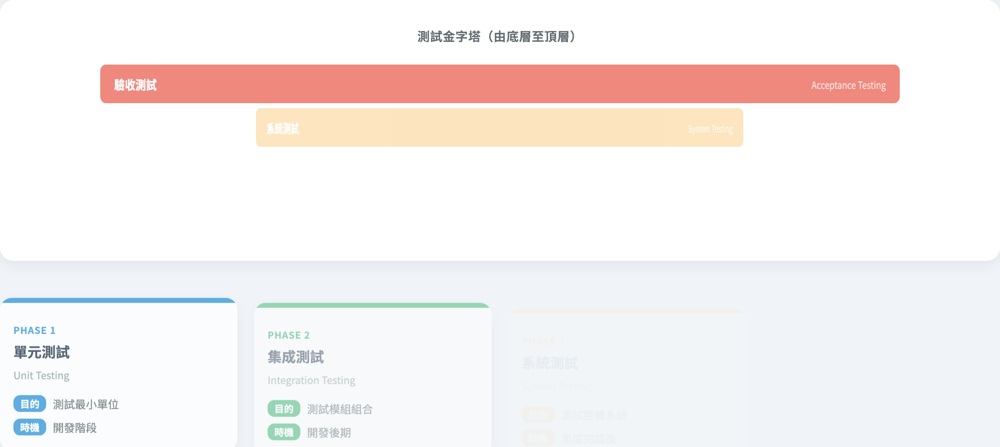

# 測試流程 & 測試金字塔
### 兩個經典的高層次心智模型

軟體測試視覺化系列 #2
搭配工具：`/section-flow`（[TestingFlow](../../src/components/TestingFlow.js)）+ `/section-types`（[TestingTypesTable](../../src/components/TestingTypesTable.js)）

---

## 兩條主線

| 主線 | 問題 | 工具 |
| --- | --- | --- |
| **測試流程** | 從需求到缺陷報告 — 我**何時**做測試？ | TestingFlow |
| **測試金字塔** | 我該**做多少**單元 / 整合 / 系統 / 驗收測試？ | TestingTypesTable |

> 一個橫向（時間軸），一個縱向（層級分布）— 都用視覺化呈現。

---

## 測試流程：六個步驟

```
需求分析 ──► 測試計劃 ──► 測試設計 ──► 測試執行 ──► 結果分析 ──► 缺陷報告
   📋          📝            ✏️            ▶️            🔍            📊
```

| # | 步驟 | 主要產出 |
| --- | --- | --- |
| 1 | 需求分析 | 測試目標與範圍 |
| 2 | 測試計劃 | 策略、資源、進度 |
| 3 | 測試設計 | 測試用例、腳本、資料 |
| 4 | 測試執行 | 實際 / 預期結果 |
| 5 | 結果分析 | 缺陷清單、覆蓋率 |
| 6 | 缺陷報告 | 修復狀態追蹤 |

---

## 工具：自動播放流程


- 六步驟以圖示串接（`flow-step-{id}`，箭頭 `flow-arrow-{idx}`）。
- 按 `flow-play-btn` → 自動每 1800 ms 推進一步。
- 上方進度條 `flow-progress-fill` 顯示當前進度（0–100%）。
- 滑鼠移到任一步驟 → `flow-tooltip-{id}` 顯示完整 description。

---

## 為什麼這條流程仍重要？

即使在敏捷 / CI 時代：
- **需求分析**仍是測試覆蓋的根 — 看不懂需求，就寫不出對的測試
- **測試設計** ≠ **測試執行** — 設計常被低估
- **結果分析**才是測試集回饋的閉環 — 不分析就只是「跑過了」
- **缺陷報告**是品質與工程文化的銜接點

> 教學心得：把流程做成動畫，學生才會記得「測試設計」是一個獨立階段。

---

## 換個觀點：測試金字塔

```
              ┌────────────────────────────┐
              │      Acceptance (100%)     │  ◄── 端到端、慢、昂貴
              ├──────────────────────┐
              │   System (80%)       │
              ├────────────────┐
              │ Integration (55%) │
              ├──────────┐
              │ Unit (30%) │  ◄── 快、便宜、量大
              └──────────┘
```

> 工具裡是**倒置金字塔**（左→右拉長）— 並非說 Unit 最少，而是說「**範圍**從窄到寬」。

---

## 四層測試類型

| 類型 | 範圍 | 時機 | 速度 |
| --- | --- | --- | --- |
| **Unit** | 單一函式 / 類別 | 開發階段 | 毫秒級 |
| **Integration** | 多模組組合 | 開發後期 | 秒級 |
| **System** | 整體系統 | 集成完成後 | 分鐘級 |
| **Acceptance** | 對需求驗收 | 部署前 | 小時級 |

> 越往下，**速度↓ + 成本↑**；越往上，**範圍↓ + 信心↓**。要在兩端之間找平衡。

---

## 工具：金字塔 + 卡片



- 上方 `pyramid` 視覺化四層的「寬度」差異（30% / 55% / 80% / 100%）。
- 下方 `types-grid` 為每一層展開一張卡片（`type-card-{id}`）：類型 + 目的 + 時機。
- 配色由淺到深（藍 → 綠 → 橙 → 紅），呼應「快 → 慢」的速度直覺。

---

## 經典原則：Test Pyramid（Mike Cohn）

```
       △    Acceptance（少）
      △△    System
     △△△    Integration
    △△△△△   Unit（多）
```

「Unit 多、Acceptance 少」是經典建議，但**現代 CI 把整合與系統測試的成本拉低**：
- Docker 一鍵起依賴 → integration 不再很貴
- Playwright / Cypress → e2e 也能跑得相對快

> 結論：金字塔仍然有用，但**比例可以隨工具能力動態調整**。

---

## 兩種反金字塔陷阱

```
  ▽▽▽▽▽   Acceptance   ◄── 過度依賴 e2e 測試
   ▽▽▽    System
    ▽▽    Integration
     ▽    Unit
```

或

```
     △    Acceptance
    △△    System       ◄── 只做 system，整合與單元都跳過
   △△△    Integration
  △△△△△   Unit
```

> 兩種都常見。前者「ice cream cone」，後者「missing unit test」。本工具不解決這個 — 但它讓你**看到自己的 pyramid 是什麼形狀**。

---

## 把兩個視角連在一起

| 測試流程步驟 | 通常涉及的層級 |
| --- | --- |
| 需求分析 → 測試設計 | 規劃所有層級 |
| 測試執行（CI 觸發） | Unit 每次 commit、Integration 每次 PR、System 定時、Acceptance 上線前 |
| 結果分析 | Unit 快回饋、Acceptance 慢但決定 release |
| 缺陷報告 | 跨層級彙整 |

> 「**何時測**」（流程）與「**測多少**」（金字塔）兩條軸都不可少。

---

## 小結

- 兩條互補的高層次模型：
  - **流程**：6 步驟橫向時間軸，工具用自動播放呈現
  - **金字塔**：4 層縱向分布，工具用顏色 + 寬度呈現
- 它們不是「測試方法」本身（那是 #1）— 而是**測試的工程組織**。
- 接下來七講會聚焦在**「測試設計」步驟**裡的各種準則。

---

## 課堂練習

1. 打開 `/section-flow`，按 `flow-play-btn` 看完一輪。試著用一句話描述每個步驟（不看 tooltip）。
2. 找一個你目前在用的測試套件（任何語言皆可），估算它的金字塔比例（unit:int:sys:acc）。是否傾向 ice cream cone？
3. CI 流程通常包含哪些自動化測試層級？人工驗收又該何時做？
4. 在工具中對照 `pyramid-row-{id}` 的顏色 — 顏色越深代表測試**速度越慢**還是**範圍越大**？哪一個是設計意圖？

---

## 進一步閱讀

- Mike Cohn, *Succeeding with Agile* — 經典測試金字塔來源
- Martin Fowler, “TestPyramid”：<https://martinfowler.com/bliki/TestPyramid.html>
- Google Testing Blog 的 “Just Say No to More End-to-End Tests”
- 工具實作：
  - [src/components/TestingFlow.js](../../src/components/TestingFlow.js) — 自動播放、進度條
  - [src/components/TestingTypesTable.js](../../src/components/TestingTypesTable.js) — 金字塔 + 卡片
  - [src/data/testingData.js](../../src/data/testingData.js) — `testingFlow` 與 `testingTypes`
- 規格文件 §2.B：[docs/Specification.zh-TW.md](../Specification.zh-TW.md)
- 下一講 → **#3 Graph Coverage（結構性）**
