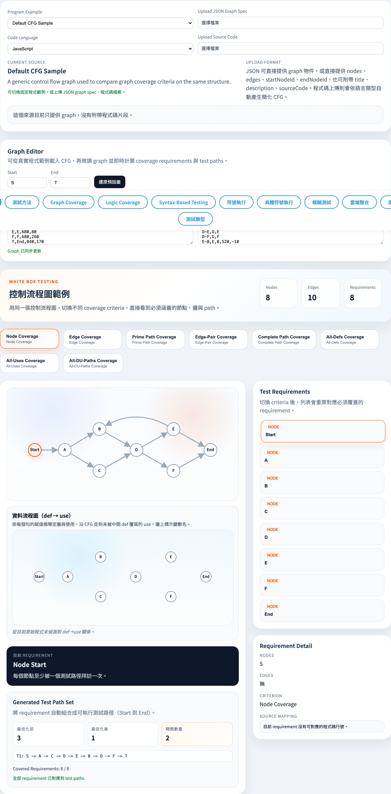
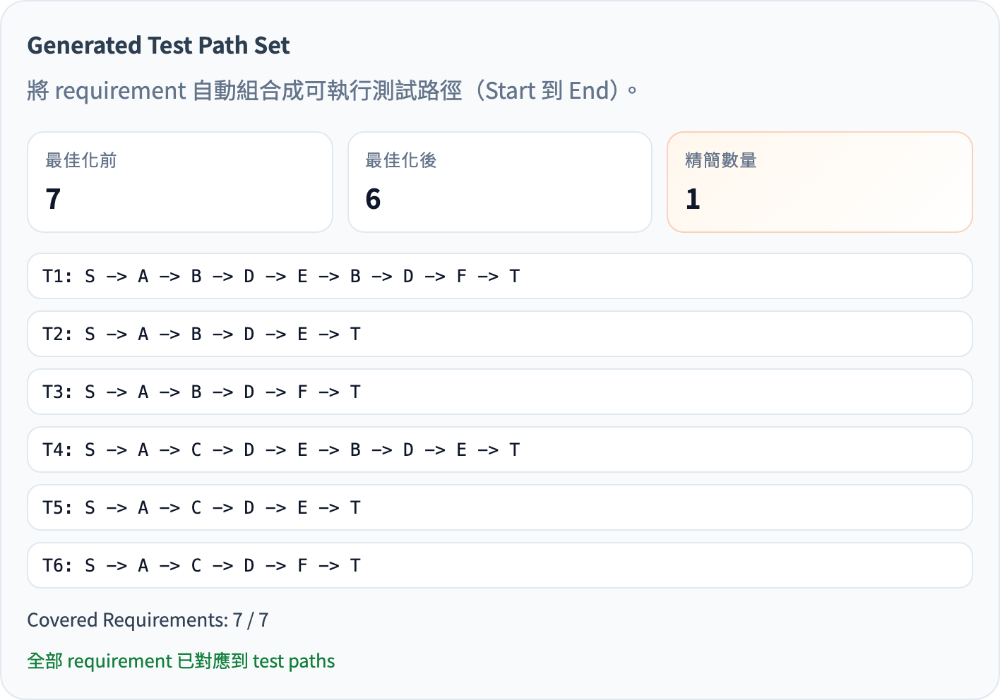
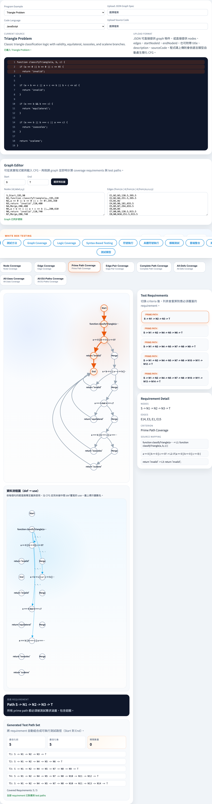
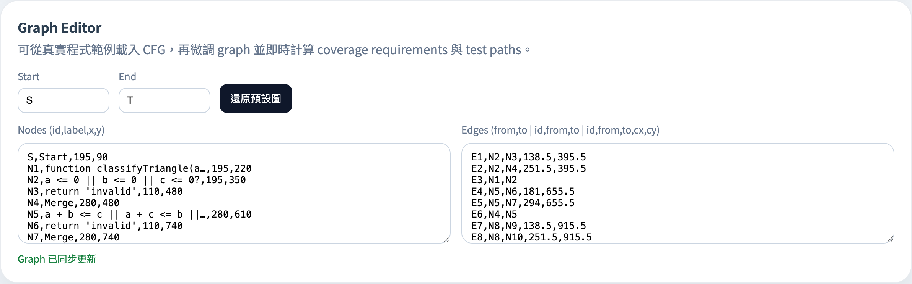

# Graph Coverage
### 從控制流程圖推導測試需求

軟體測試視覺化系列 #3
搭配工具：`/section-graph`（[GraphCoverageExplorer](../../src/components/GraphCoverageExplorer.js)）

---

## 為什麼是 Graph Coverage？

- 把「測試」變成可量化的命題：**每個 X 至少被走過一次**
  - X = 節點 / 邊 / 邊對 / Prime Path / 完整路徑
- 與覆蓋率工具（Istanbul、JaCoCo）對應 — 但更精細
- 一個共同的框架可同時表達：
  - **結構性**：今天介紹的 5 條
  - **資料流**：後續 #4 講的 3 條（同一個 CFG）

> 觀念支點：先把程式抽象成圖，再在圖上談覆蓋。

---

## 抽象：什麼是 CFG？

```
G = (N, E, n_s, n_f)
```

| 元素 | 意義 |
| --- | --- |
| `N` | 節點集合（基本區塊 / 陳述） |
| `E ⊆ N × N` | 有向邊（控制流轉移） |
| `n_s ∈ N` | 起始節點 |
| `n_f ∈ N` | 結束節點 |

**Test path** = 從 `n_s` 走到 `n_f` 的一條路徑。
**Test requirement** = 圖上某個必須被覆蓋的子結構。

---

## 五條結構性覆蓋準則

| id | 名稱 | 需求型態 |
| --- | --- | --- |
| `node` | Node Coverage (NC) | 每個節點 |
| `edge` | Edge Coverage (EC) | 每條有向邊 |
| `edge-pair` | Edge-Pair Coverage (EPC) | 相鄰兩邊 (a→b→c) |
| `prime-path` | Prime Path Coverage (PPC) | 不可再延伸的簡單路徑（含環）|
| `complete-path` | Complete Path Coverage (CPC) | 所有 `n_s ⤳ n_f` 路徑 |

> 在工具中以 `criterion-{id}` testid 對應左側按鈕。

---

## Subsumption 關係

```
CPC  ──►  PPC  ──►  EPC  ──►  EC  ──►  NC
```

> 「A → B」表示「滿足 A 必然滿足 B」。

- 最便宜：NC，最完整：CPC。
- PPC 是課堂的甜蜜點：包含 EPC、處理迴圈、但通常仍可手算。
- CPC 只在無環或限定深度下可行（工具裡有 `maxDepth`）。

---

## 教科書範例：sample CFG

工具內建範例 [`graphCoverageGraph`](../../src/data/testingData.js)：

- `nodes` = { S, A, B, C, D, E, F, T }
- `edges` = { S-A, A-B, A-C, B-D, C-D, D-E, D-F, E-B, E-T, F-T }
- 起 = S，終 = T
- **關鍵**：`E-B` 形成迴圈 B → D → E → B

```
        ┌─► B ─┐         ┌─► E ─┐
S ─► A ─┤      ├─► D ─►──┤      ├─► T
        └─► C ─┘         └─► F ─┘
                              ▲
              (back-edge E ──► B)
```

---

## 手算：Node Coverage

需覆蓋 8 個節點：`{S, A, B, C, D, E, F, T}`

兩條測試路徑就夠：

| Test | 路徑 |
| --- | --- |
| TP₁ | S → A → B → D → E → T |
| TP₂ | S → A → C → D → F → T |

> NC 不要求覆蓋所有 edge — `E-B` 完全沒走也算過。
> 這正是 NC 比 EC 弱的地方。

---

## 手算：Edge Coverage

10 條邊：`{S-A, A-B, A-C, B-D, C-D, D-E, D-F, E-B, E-T, F-T}`

TP₁、TP₂ 加起來漏掉 `E-B`，需要第三條：

| Test | 路徑 |
| --- | --- |
| TP₁ | S → A → B → D → E → T |
| TP₂ | S → A → C → D → F → T |
| TP₃ | S → A → B → D → E → **B** → D → F → T |

> 看到沒：**引入迴圈才能滿足 EC**。NC 不會逼你做這件事。
> 工具切到 `criterion-edge` 即可看到 10 條 requirements 與覆蓋它們的測試集。

---

## 手算：Prime Path Coverage

Prime path = 簡單路徑（節點不重複，端點除外）且**兩端都不能再延伸**。

部分 prime paths（不完全列舉）：

- `[S, A, B, D, E, T]`
- `[S, A, B, D, E, B]`（端點同 → cycle，視為 prime）
- `[S, A, C, D, F, T]`
- `[E, B, D, E]`（cycle 也是 prime path）
- ...

> PPC 一定涵蓋 EPC（每對相鄰邊都包在某個 prime path 中）。
> 工具會自動列舉與最小化測試路徑集合。

---

## 工具演示：選 criterion



1. 預設載入 sample CFG（左側 SVG 畫布 `graph-canvas`）。
2. 按鈕列切換 5 個 criterion（`criterion-{id}`）。
3. 右側 `requirement-list` 即時更新；點任一 requirement，畫布對應節點/邊變紅。

---

## 工具演示：metrics 與 greedy set cover



Sample CFG + Prime Path Coverage：baseline **7** → optimized **6**，省 1 條，7/7 requirements 全覆蓋。

> 演算法位於 [`graphCoverage.js → greedySetCover`](../../src/utils/graphCoverage.js)：每次挑能覆蓋最多剩餘 requirement 的路徑。
> 工程意義：把「全部走遍」化簡為「足夠」。

---

## 工具演示：上傳程式碼



- 從 `program-example-select` 選 `Triangle Problem`（或上傳 JS / pseudocode）
- [`programToGraph.js`](../../src/utils/programToGraph.js) 把程式轉成 CFG
- 切換 requirement 時，左下 `program-source-code` 同步反白對應原始碼行
- 已內建範例：`triangle-problem`、`next-date`、`commission-problem`、`next-date-leap-year`、`calendar-days`、`quadrilateral-problem`、`next-week`

---

## 即時編輯 CFG



| 欄位 | 意義 |
| --- | --- |
| `graph-start-input` / `graph-end-input` | 起 / 終節點 id |
| `graph-nodes-input` | 一行一個節點：`id,label,x,y,kind` |
| `graph-edges-input` | 一行一條邊：`id,from,to[,viaX,viaY]` |

修改後立刻重算 requirements 與 paths。`graph-reset-btn` 還原。

---

## 小結

- 五條準則由弱到強：**NC → EC → EPC → PPC → CPC**
- 越強的準則需要越多測試路徑，但能逼出更多 bug
- 工具把三件事自動化：
  1. 由 CFG 算 **requirements**
  2. 列舉候選 **test paths**
  3. 用 greedy set cover **最佳化** 測試集合
- 同一 CFG 之後可直接被 **#4 Data Flow Coverage** 使用

---

## 課堂練習

1. 在工具裡開 `Triangle Problem`，記下 NC 與 PPC 的 `optimized-path-count`，差幾條？哪幾條？
2. 在 sample CFG 中刪掉 back-edge `E-B` 後重算 EC — 為什麼測試路徑數變少？
3. 自編一個 3-節點圖（含自迴圈 `A → A`），確認自迴圈是不是 prime path（提示：cycle 端點同 → prime）。
4. 比較 `Next Date` 在 EPC 與 PPC 下 `optimized-path-count` 的差距，並解釋為什麼差距小。

---

## 進一步閱讀

- Ammann & Offutt, *Introduction to Software Testing*, Ch. 7（Graph Coverage Criteria）
- 工具實作：
  - 演算法：[src/utils/graphCoverage.js](../../src/utils/graphCoverage.js)
  - Code → CFG：[src/utils/programToGraph.js](../../src/utils/programToGraph.js)
  - UI：[src/components/GraphCoverageExplorer.js](../../src/components/GraphCoverageExplorer.js)
- 規格文件 §3：[docs/Specification.zh-TW.md](../Specification.zh-TW.md)
- 下一講 → **#4 Data Flow Coverage**（同一個 CFG，引入 def / use）
