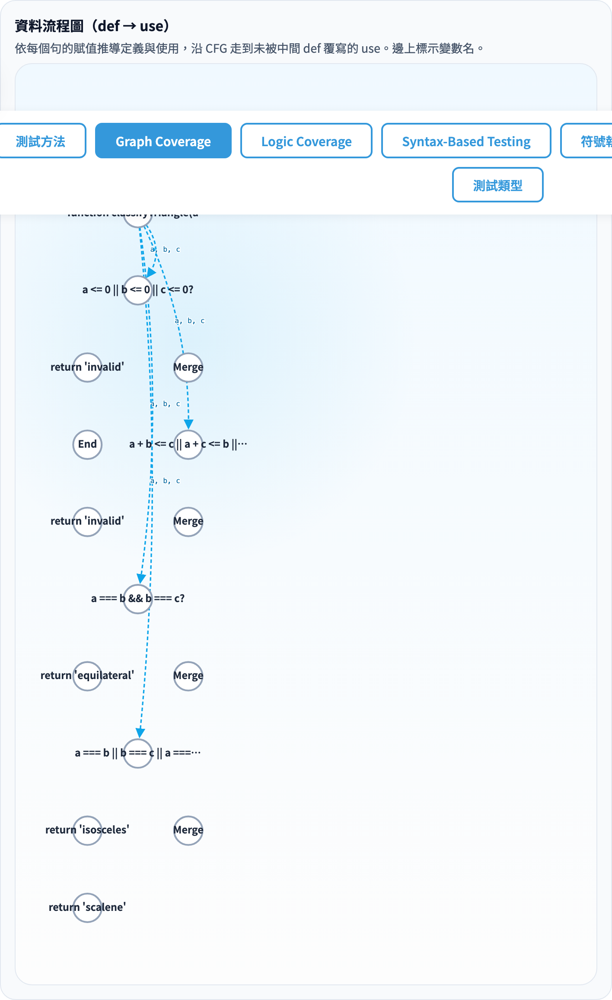
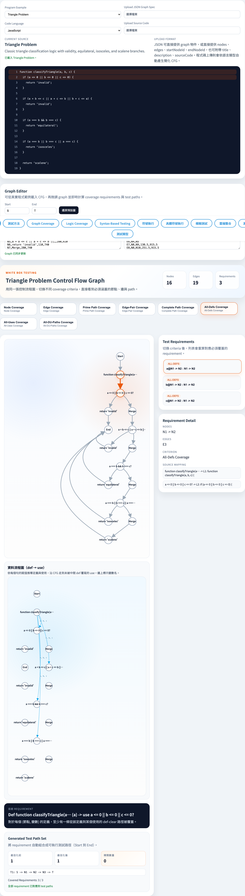
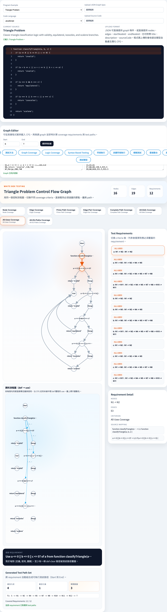
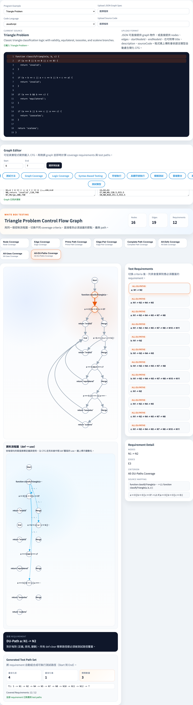
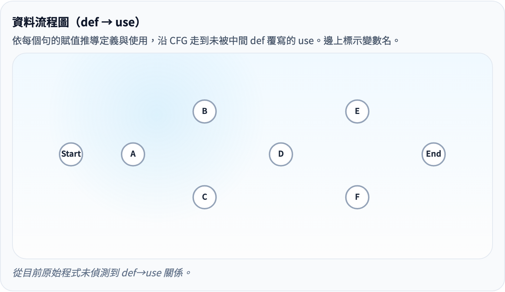

# Data Flow Coverage
### 在 CFG 之上追蹤變數的定義與使用

軟體測試視覺化系列 #4
搭配工具：`/section-graph`（[GraphCoverageExplorer](../../src/components/GraphCoverageExplorer.js) + [dataFlow.js](../../src/utils/dataFlow.js)）

<!-- 本講把 CFG 延伸到「資料流」，從結構走到語意。掌握 def/use 對的定義是整個講次的核心。 -->
---

## 從結構走到資料

| 上一講（#3） | 本講（#4） |
| --- | --- |
| 用節點 / 邊定義 requirements | 用 **(def, use, variable)** 三元組定義 requirements |
| 只看「走了哪裡」 | 也看「資料從哪來、到哪去」 |
| Bug：未走到的分支 | Bug：未初始化、用錯變數、過期數值 |

> 同一張 CFG，多一層語意：**每個節點帶有 defs / uses 集合**。

<!-- CFG 只看「走哪條邊」，DFC 還要看「變數在哪裡被賦值、在哪裡被使用」。這讓測試能捕捉更多語意錯誤。 -->
---

## 三個核心概念

| 概念 | 定義 |
| --- | --- |
| **def(n, v)** | 節點 `n` 對變數 `v` 賦值 |
| **use(n, v)** | 節點 `n` 讀取變數 `v`（條件、return、RHS、call 引數 …） |
| **def-clear path** | 從某 def 走到某 use，中間沒有再 def 同一變數 |

把這些統合在 CFG 上 → 形成「**資料流圖（DFG）**」：edges 是 `(defNode, useNode, variable)`。

<!-- def-clear path 是最重要的概念：從 def 到 use 的路徑上，如果變數沒有被重新賦值，才算是有效的 def-use 對。 -->
---

## 三條資料流覆蓋準則

| id | 名稱 | 需求型態 |
| --- | --- | --- |
| `all-defs` | All-Defs Coverage | 每個 (defNode, variable)：至少一條 def-clear 路徑到任一個 use |
| `all-uses` | All-Uses Coverage | 每對 (defNode, useNode, variable)：至少一條 def-clear 路徑 |
| `all-du-paths` | All-DU-Paths Coverage | 每對 (defNode, useNode, variable)：**所有** def-clear 簡單路徑 |

> 在工具裡分別對應 `criterion-all-defs` / `criterion-all-uses` / `criterion-all-du-paths`。

<!-- All-Defs < All-Uses < All-DU-Paths 的強弱順序。All-Uses 是最常在實務中被採用的準則。 -->
---

## Subsumption（結構 + 資料流）

```
All-DU-Paths ──►  All-Uses ──►  All-Defs
                       │
                       └─►  Edge Coverage  ──►  Node Coverage
```

- **All-Uses 蘊含 Edge Coverage**（前提：每條邊都有 def→use 經過；通常於有適度賦值的程式成立）
- 教學常見搭配：先 EC 做結構性骨架，再 All-Uses 做變數正確性。

<!-- 資料流覆蓋和結構覆蓋的 subsumption 關係交錯。All-Uses 包含 Edge Coverage，這是個重要但不直觀的結論。 -->
---

## 教科書範例：來自 Triangle Problem

```js
function classifyTriangle(a, b, c) {
  if (a <= 0 || b <= 0 || c <= 0) return 'invalid';
  if (a + b <= c || a + c <= b || b + c <= a) return 'invalid';
  if (a === b && b === c) return 'equilateral';
  if (a === b || b === c || a === c) return 'isosceles';
  return 'scalene';
}
```

- start 節點保留函式 header → **a, b, c 三個參數同時被 def**（commit `9e4c3fc` 之後的行為）。
- 沒有任何重新賦值 → 所有 use 都是「def-clear from start」。

<!-- Triangle Problem 是 Ammann & Offutt 的標準範例。讓學生先手工找出所有 def/use 對，再與工具比對。 -->
---

## def / use 抽取規則

[`dataFlow.js → extractDefUse(node)`](../../src/utils/dataFlow.js)：

| 句型 | def | use |
| --- | --- | --- |
| `function f(a, b)` / `(a, b) =>` | `{a, b}` | — |
| `let x = a + b` | `{x}` | `{a, b}` |
| `x += y` | `{x}` | `{x, y}` |
| `x++` / `y--` | `{x}` | `{x}` |
| `for (i = 0; i < n; i++)` | init/update 的 lvalue | cond 內所有識別字 |
| 其他（return / call / 條件）| — | 所有非關鍵字識別字 |

> 是個刻意保守的啟發式解析器：不認得的句子 → 全當 use，避免漏掉 use 而出現假覆蓋。

<!-- 可賦值語句（=）和函式參數是最常見的 def 點；條件判斷和運算元是最常見的 use 點。 -->
---

## 工具演示：DFG 視圖



- 切到 `Triangle Problem` 後，CFG 卡片下方出現 **Data Flow Graph** 卡片（`graph-dfg-card`）。
- 邊就是 def→use 關係，**邊上標記攜帶的變數名**。
- 從 `Start` 出發的多條邊代表參數 a/b/c 從 start 流出。

<!-- 工具的 DFG 視圖把 CFG 的每個 node 展開成 def 點和 use 點。讓學生觀察箭頭如何連接 def 到 use。 -->
---

## 工具演示：All-Defs



- 點 `criterion-all-defs` → 右側 `requirement-list` 列出每個 (defNode, variable) 的代表性 def-clear 路徑（最短）。
- 對 Triangle Problem：3 個參數 × 1 個 def 點 = 3 條 requirements，分別走到第一個讀到它的 decision 節點。

<!-- All-Defs 只需要每個 def 至少走到一個 use。這是最弱的資料流準則，通常需求數最少。 -->
---

## 工具演示：All-Uses



- 點 `criterion-all-uses` → 每個 (def, use, var) 三元組都有一條 requirement。
- Triangle Problem 中參數 `a`、`b`、`c` 各被多個 decision 使用 → requirements 數量爆增。
- 點 requirement，CFG 與 DFG 對應節點同步反白。

<!-- All-Uses 要求每個 def-use 對都被測試。可以問：如果一個 def 有 5 個 use，需要幾條 test path？ -->
---

## 工具演示：All-DU-Paths



- 點 `criterion-all-du-paths` → 每對 (def, use, var) **所有** def-clear 簡單路徑都列為一條 requirement。
- 為避免爆炸，[`enumerateDefClearPaths`](../../src/utils/graphCoverage.js) 設了路徑長度上限：`max(8, |V| × 2)`。
- 對 Triangle Problem（線性流程、無 loop）：路徑數仍可控；換成含 loop 的範例會立刻增多。

<!-- All-DU-Paths 是最強的資料流準則，需要覆蓋每個 def-use 對的每一條 def-clear path。通常測試集很大。 -->
---

## DFG 為何可能是空的？



- 預設 sample CFG 的節點只有抽象 label（S/A/B/...），沒有 `sourceText`。
- `extractDefUse` 看不到變數名 → DFG 邊數為 0。
- 工具顯示 `graph-dfg-empty` 提示：「從目前原始程式未偵測到 def→use 關係。」
- 解法：選任一個程式範例，或上傳自己的 JS 程式碼。

<!-- 如果函式沒有變數賦值（只有 return 語句），DFG 會是空的。這是工具的設計選擇，不是 bug。 -->
---

## 演算法摘要

1. `extractDefUse(node)` 對每個節點抽 defs / uses（§ 工具演示）。
2. `collectDefUsePairs(graph, defUseMap)` 找出有 def-clear 路徑相通的三元組（用 `shortestDefClearPath` 過濾）。
3. 三個 `getAllX...Requirements()` 根據準則產生 requirement 物件，皆含 `path: string[]`。
4. `requirementCoveredByRecord` 對 `all-defs/all-uses/all-du-paths` 改用 `containsNodePath(record.path, requirement.path)` 判定。
5. `buildTestPathSetForRequirements` 與結構準則共用同一個 greedy set cover → 同樣產出 baseline / optimised / saved 三個指標。

<!-- def/use 抽取用 AST 分析，DU-pair 枚舉用 BFS/DFS，def-clear 路徑用可達性分析。 -->
---

## 小結

- 三條準則由弱到強：**All-Defs → All-Uses → All-DU-Paths**
- 同一份 CFG + 同一個 greedy set cover → 端對端跟 #3 結構準則一致
- 對教學最關鍵的是 **def-clear path** 的觀念：
  - 中間若再 def 同變數 → 「殺掉」前一個 def 對此 use 的影響
  - 工具的 predecessor BFS 走法直接體現這條規則

> 若沒有 source code → 看不到 def/use → 直接用 sample CFG **無法**示範本講內容（這是設計上的選擇，不是 bug）。

<!-- Data Flow Coverage 能捕捉 structure-only 準則漏掉的語意錯誤。掌握 def/use 對是後續所有資料流討論的基礎。 -->
---

## 課堂練習

1. 開 `Triangle Problem`，記下 All-Defs / All-Uses / All-DU-Paths 的 `optimized-path-count`。為什麼 All-DU-Paths 最大？
2. 自寫一段含 loop 的程式（`while`/`for`）上傳。比較有無 loop 對 All-DU-Paths 的 `baseline-path-count` 影響。
3. 在自寫程式中加一行 `x = x + 1`（再 def 同變數），觀察 DFG 中對應變數的邊是否被「截斷」。
4. 把 sample CFG 的某節點 label 改成 `x = 1` 等帶變數的字串（即使非可執行語法），觀察 DFG 是否從空 → 出現邊（提示：`extractDefUse` 只看文字）。

<!-- 練習 1（手工找 def/use 對）是最核心的技能訓練。練習 3（比較 coverage 強度）適合作討論。 -->
---

## 進一步閱讀

- Ammann & Offutt, *Introduction to Software Testing*, Ch. 7.3（Data Flow Coverage）
- 工具實作：
  - [src/utils/dataFlow.js](../../src/utils/dataFlow.js)（def/use 抽取、DFG 構建）
  - [src/utils/graphCoverage.js](../../src/utils/graphCoverage.js)（`getAllDefs/All-Uses/All-DU-Paths` + def-clear 路徑列舉）
- 規格文件 §15：[docs/Specification.zh-TW.md](../Specification.zh-TW.md)
- 下一講 → **#5 Logic Coverage**（真值表、ACC/ICC、DNF、Karnaugh map）

<!-- A&O §15 有完整的資料流理論。工具實作在 src/utils/dataFlow.js。 -->
