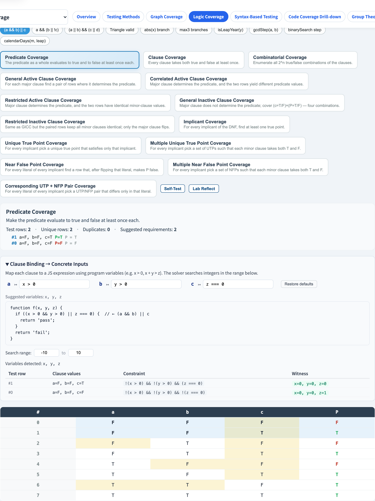
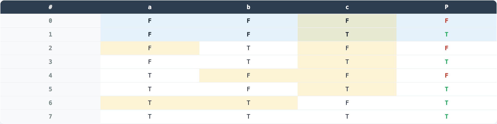
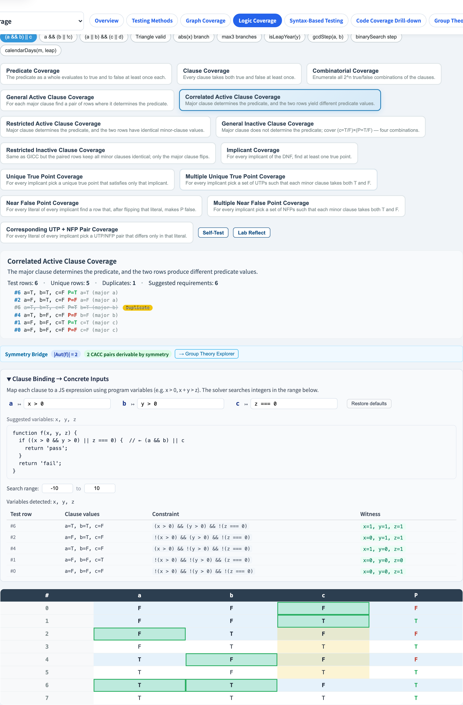
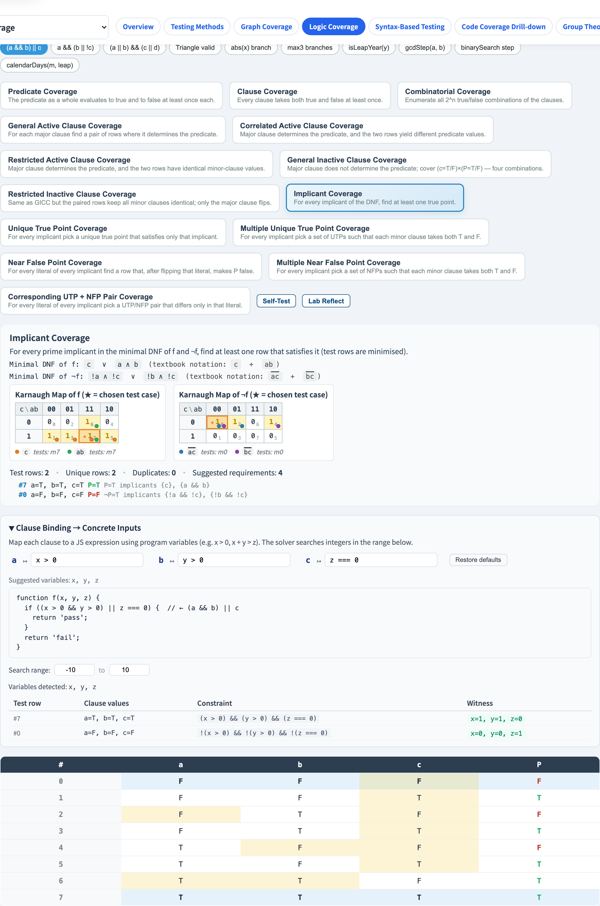
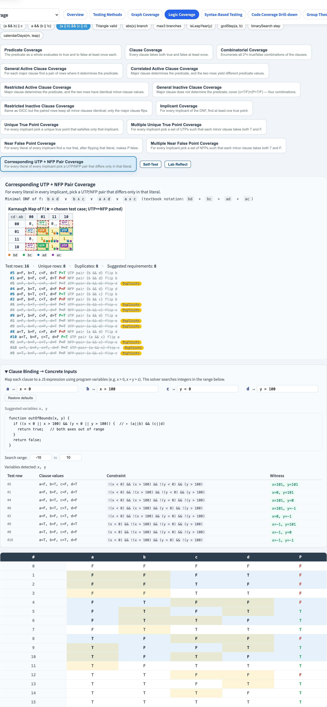

# Logic Coverage
### Coverage Criteria for Predicates and Clauses

Software Testing Visualization, Lecture #5
Tool: `/section-logic` ([LogicCoverageExplorer](../../src/components/LogicCoverageExplorer.js) + [logicCoverage.js](../../src/utils/logicCoverage.js))

<!-- This is the most theory-dense lecture in the series. 14 criteria take time to absorb. Suggested split: first session covers basic criteria, second covers DNF/IC/UTP. -->
---

## From graphs into logic

| Previous lectures (#3, #4) | This lecture (#5) |
| --- | --- |
| Focus: CFG structure and data flow | Focus: **inside a single Boolean condition** |
| Units: nodes, edges, defs / uses | Unit: **clauses** (atomic Boolean sub-expressions) |
| Bug shape: unreached / variable misuse | Bug shape: **wrong condition** (`&&` vs `\|\|`, missing clause, flipped polarity) |

> Pivot: decompose each decision into clauses and require every clause to be tested at the moment it matters.

<!-- Starting from CFG branch conditions: if (a && b) has two clauses. Logic Coverage requires testing at the clause level, not just the branch level. -->
---

## Terminology

| Term | Definition | Example |
| --- | --- | --- |
| Predicate `P` | The whole Boolean expression | `(a && b) \|\| c` |
| Clause `c` | An atomic, indivisible proposition | `a`, `b`, `c` |
| Active row (for `c`) | Flipping `c` flips `P` → `c` **determines** `P` | rows where `determines[c] = true` |
| DNF | An OR of implicants | `ab + c` |

> “Determines” is the cornerstone of the Active Clause family: the tool computes `determines[c]` per row.

<!-- Clarify the predicate/clause/binding hierarchy: predicate is the whole boolean expression; clause is an atomic (indivisible) sub-condition. -->
---

## Truth table

`buildTruthTable(parsed)` produces, for each minterm:

```ts
type TruthRow = {
  index: number;                       // minterm index (MSB = clauses[0])
  values: Record<string, boolean>;     // each clause's truth value
  predicate: boolean;                  // result of evaluating P
  determines: Record<string, boolean>; // does flipping c flip P?
};
```

> `determines[c] = evaluateAst(ast, {...values, [c]: !values[c]}) !== predicate`
> This separates `c`’s **active** rows from its **inactive** rows.

<!-- Each truth table row has corresponding DNF analysis and clause values. Have students find which row can "determine the predicate solely by changing a." -->
---

## Predicate grammar (program-style + textbook-style)

| Token | Meaning | Example |
| --- | --- | --- |
| `&&` or juxtaposition | AND | `a && b` or `ab` |
| `\|\|` or `+` | OR | `a \|\| b` or `a+b` |
| `!` | NOT | `!a` |
| `(` `)` | Grouping | `(a+b)(c+d)` |
| identifier | Clause name | `a`, `b1`, `x2` |

```js
const TOKEN_REGEX = /\s*(?:(\()|(\))|(&&)|(\|\|)|(\+)|(!)|([A-Za-z][0-9]*))/y;
```

> Recursive-descent parser; precedence OR < AND < NOT < Atom. `parseAnd` treats a following `(` / `!` / ident as a juxtaposition AND.

<!-- The tool accepts JavaScript boolean expressions: &&, ||, !, (), ===, !==, and comparisons. -->
---

## 14 criteria, semantic family

| id | Name | Summary |
| --- | --- | --- |
| `pc` | Predicate Coverage | P takes T and F at least once |
| `cc` | Clause Coverage | every clause takes T and F |
| `coc` | Combinatorial Coverage | enumerate all $2^n$ combinations |
| `gacc` | General Active Clause Coverage | `c` is active; minor clauses unrestricted |
| `cacc` | Correlated Active Clause Coverage | `c` is active; the two rows produce different P |
| `racc` | Restricted Active Clause Coverage | `c` is active; the two rows have identical minor clauses |
| `gicc` | General Inactive Clause Coverage | `c` is **inactive**; cover all 4 of (c, P) |
| `ricc` | Restricted Inactive Clause Coverage | as GICC, plus identical minor clauses |

<!-- The semantic series (PC/CC/CoC/GACC/CACC/RACC/GICC/RICC/IC) focuses on "how clauses determine predicate value." -->
---

## 14 criteria, DNF (syntactic) family

| id | Name | Summary |
| --- | --- | --- |
| `ic` | Implicant Coverage | every prime implicant of f and ¬f has at least one row (minimised) |
| `utpc` | Unique True Point Coverage | list every UTP for every implicant |
| `mutpc` | Multiple UTPC | pick a UTP subset per implicant so that every minor clause takes T and F |
| `nfpc` | Near False Point Coverage | per (implicant, literal) find one NFP |
| `mnfpc` | Multiple NFPC | the “multiple” version of NFPC |
| `cutpnfp` | Corresponding UTP + NFP Pair Coverage | per (implicant, literal) pair (UTP, NFP) differing only in that literal |

<!-- The DNF series (UTPC/MUTPC/NFPC/MNFPC) focuses on "coverage of DNF implicants" — an algebraic perspective. -->
---

## Subsumption (semantic family)

```
CoC ──► RACC ──► CACC ──► GACC ──► CC ──► PC
                   │
                   └──► RICC ──► GICC
```

- Strongest: CoC (all $2^n$ rows)
- Weakest: PC (P must take T and F)
- The ACC trio differ in **how tightly minor clauses are constrained**.

<!-- The semantic series (PC/CC/CoC/GACC/CACC/RACC/GICC/RICC/IC) focuses on "how clauses determine predicate value." -->
---

## Worked example: `(a && b) || c`

8-row truth table (n=3):

| # | a | b | c | P | det(a) | det(b) | det(c) |
| - | - | - | - | - | - | - | - |
| 0 | F | F | F | **F** | – | – | – |
| 1 | F | F | T | **T** | – | – | ✓ |
| 2 | F | T | F | F | – | – | – |
| 3 | F | T | T | T | – | – | ✓ |
| 4 | T | F | F | F | – | – | – |
| 5 | T | F | T | T | – | – | ✓ |
| 6 | T | T | F | **T** | ✓ | ✓ | ✓ |
| 7 | T | T | T | T | – | – | – |

> The tool computes `determines[c]` automatically and colour-codes active rows.

<!-- This three-clause example can fully illustrate all 14 criteria. The paired row structure in CACC is the basis for the tool's color highlighting design. -->
---

## By hand: PC / CC

**PC**: P must take T and F at least once.

| Test | a | b | c | P |
| - | - | - | - | - |
| t₁ | F | F | F | F |
| t₂ | F | F | T | T |

**CC**: every clause must take T and F at least once → two rows can satisfy both simultaneously.

> Satisfying PC frequently satisfies CC for free — CC implies PC’s requirement on P.

<!-- PC requires predicate true and false at least once each; CC requires each clause true and false (regardless of other clauses). -->
---

## By hand: CACC (with `a` as the major clause)

We need two rows where `determines[a] = true` and where P differs.

From the table: row 6 (`a=T, b=T, c=F`, P=T) and its flip (`a=F, b=T, c=F`, P=F).

| Test | a | b | c | P | Role |
| - | - | - | - | - | - |
| t₁ | T | T | F | T | a active, P=T |
| t₂ | F | T | F | F | a active, P=F |

> RACC adds “minor clauses must match”: in this pair, b and c are already equal → this also satisfies RACC.
> The tool runs `pickPair(rows, clause, mode)` to perform this selection.

<!-- CACC requires: fixing other clauses' values such that the major clause's truth determines the predicate's truth — this is what "deterministic" means. -->
---

## DNF and Quine–McCluskey

[`logicCoverage.js → minimalDNF(rows, clauses, target)`](../../src/utils/logicCoverage.js):

1. Collect minterms where `predicate === target`.
2. Repeatedly merge groups differing in exactly one bit → prime implicants.
3. Find essential primes (minterms covered by only one prime).
4. Greedily fill the remaining minterms.

> For `(a && b) || c` → minimal DNF of f is `ab + c`;
> minimal DNF of ¬f is `!a!c + !b!c`.

<!-- Quine-McCluskey is the standard DNF minimization algorithm. The tool uses it to compute implicants for UTPC/MUTPC criteria. -->
---

## IC, UTP, NFP

| Concept | Definition |
| --- | --- |
| Implicant `i` | A product term in the DNF (covers a set of minterms) |
| Unique True Point (UTP) of `i` | A row where **only** `i` is true; all other implicants are false |
| Near False Point (NFP) of `i, ℓ` | A UTP of `i` with literal `ℓ` flipped → `i` becomes false and P becomes false |

> Pedagogical framing: UTPs say “this implicant is irreplaceable”; NFPs say “this literal is irreplaceable”.

<!-- IC is the strongest semantic criterion; UTPC is the most basic DNF criterion. Each has advantages in different scenarios. -->
---

## CUTPNFP intuition

For each implicant × literal, pick a pair `(UTP, NFP)` that differs in only that literal.

```
implicant  ab     literal a
UTP  a=T b=T c=F   → P=T (implicant ab is true)
NFP  a=F b=T c=F   → P=F (flipping a kills ab, and c is also false)
```

The two rows share b and c; they only differ on `a` → exactly the “necessity of clause `a`” argument.
The tool frames this pair on the K-map with a matching colour.

<!-- CUTPNFP = UTPC ∩ NFP — a composite criterion satisfying both clause coverage and DNF implicant coverage simultaneously. -->
---

## Karnaugh maps (n = 1–4)

| n | rowVars | colVars | rowOrder | colOrder |
| --- | --- | --- | --- | --- |
| 1 | — | c₀ | — | [0,1] |
| 2 | c₀ | c₁ | [0,1] | [0,1] |
| 3 | c₂ | c₀c₁ | [0,1] | [0,1,3,2] (Gray) |
| 4 | c₂c₃ | c₀c₁ | [0,1,3,2] | [0,1,3,2] |

> For n > 4, `buildKMap` returns `{ unsupported: true, n }` and the UI shows an “unsupported” hint.

<!-- K-maps visually represent truth tables, especially useful for showing which minterms are required by each criterion. -->
---

## K-map cell markers

`renderKMap(rows, clauses, target, title, options)`:

| Marker | Use |
| --- | --- |
| Coloured dot (bottom-right) | Implicant colour (matches legend) |
| ★ | The cell is a selected test (UTP / MUTP, etc.) |
| Red dashed frame + `NFP` corner badge | NFP cell |
| Green solid frame + `UTP` corner badge | UTP cell |
| Tooltip | Minterm index, clause truth values, test role |

> For CUTPNFP, the matched UTP / NFP cells under the same (implicant, literal) share a colour.

<!-- The tool's K-map uses colors to distinguish: cells required by the criterion (requirement rows) vs. cells already covered by tests. -->
---

## Tool demo: pick an example and input



- Built-in example chips: `logic-example-simple-and-or` / `logic-example-guarded-exit` / `logic-example-four-clause`.
- `logic-expression-input` accepts program-style (`&& \|\| !`) or textbook-style (juxtaposition / `+`).
- Recent inputs appear as removable chips in `logic-recent` (synced to Firestore when signed in).

<!-- Select (a && b) || c live, have students follow along switching criteria and observing how the requirement list changes. -->
---

## Tool demo: truth table



- `logic-truth-table` renders the full $2^n$ table.
- `logic-row-{i}` is colour-coded by P value and active-clause status.
- After picking a criterion, the selected test rows are echoed on the right (`logic-test-{id}`) with their role.

<!-- Each truth table row has corresponding DNF analysis and clause values. Have students find which row can "determine the predicate solely by changing a." -->
---

## Tool demo: CACC criterion



- Click `logic-criterion-cacc` → for each clause the tool picks a pair of “active, P-differing” rows.
- Duplicate test rows are struck through (`logic-test-item duplicate`).
- The summary (`logic-summary`) shows requirement count, actual test count, and duplicate count.

<!-- CACC requires: fixing other clauses' values such that the major clause's truth determines the predicate's truth — this is what "deterministic" means. -->
---

## Tool demo: IC + DNF + K-map



- `logic-criterion-ic` → display the minimal DNF for f and ¬f (`logic-dnf` / `logic-dnf-neg`).
- Both K-maps appear side-by-side: `logic-kmap-f` and `logic-kmap-not-f`.
- Each implicant has a coloured dot + legend entry; selected test rows are marked with ★.

<!-- IC usually has the most requirements. The K-map synchronously highlights the minterms required by IC. -->
---

## Tool demo: CUTPNFP K-map



- `logic-criterion-cutpnfp` → one (UTP, NFP) pair per (implicant, literal).
- On the K-map: UTPs use a green solid frame, NFPs use a red dashed frame; matched pairs share a colour.
- Pedagogical payoff: “why this literal is necessary” becomes a **visual, geometric** statement.

<!-- CUTPNFP = UTPC ∩ NFP — a composite criterion satisfying both clause coverage and DNF implicant coverage simultaneously. -->
---

## Textbook-style DNF rendering

`termToCompactHtml(term)` renders a term as:
- Juxtaposition = AND
- `+` = OR
- Overline = NOT

Example: `a̅bc + ac̅`

> In the IC / UTPC / MUTPC / NFPC / MNFPC / CUTPNFP summaries the tool shows both ASCII (`!a b c + a !c`) and textbook form, making it easy to align with the textbook.

<!-- The textbook-style DNF rendering uses ¬ and ∧/∨ notation, matching A&O §4–5 exactly. Useful for students working alongside the textbook. -->
---

## Persistence

| Store | Path / Key | Content |
| --- | --- | --- |
| `localStorage` | `stvisual.logic.recentPredicates` | JSON array (≤ 8 entries) |
| Firestore | `users/{uid}/settings/logicCoverage.recentPredicates` | same, plus `updatedAt` |

Flow: user presses Enter / blur → `rememberCurrentExpression` pushes the expression to the front → write to localStorage and (if signed in) `pushRecentToCloud`. On sign-in, the remote and local lists merge “remote-first, local-second” and are deduplicated.

<!-- The tool persists the predicate and binding settings across sessions, so students can continue where they left off. -->
---

## Summary

- **14 criteria**, two families:
  - Semantic: PC, CC, CoC, (G/C/R)ACC, (G/R)ICC
  - Syntactic (DNF): IC, UTPC, MUTPC, NFPC, MNFPC, CUTPNFP
- Core data structure: **truth table + `determines`**; every ACC / ICC criterion derives from it.
- DNF derivation: **Quine–McCluskey minimisation + K-map visualisation**.
- The tool is an **active object**: editing the predicate re-computes all 14 criteria immediately.

<!-- 14 criteria can seem overwhelming at first. Remind students that CACC is the practical standard, and the others exist to understand the theoretical landscape. -->
---

## Exercises

1. Enter `(a && b) || c` in the tool. Compare the number of test rows for PC, CC, CACC, and RACC.
2. Switch to `(a || b) && (c || d)` and inspect the 4×4 K-map: how many prime implicants are there for f and ¬f?
3. In the CUTPNFP view, which (UTP, NFP) pair matches the rows you selected manually for CACC? If none does, why?
4. The tool does not support XOR directly. Rewrite `a^b` as `(a && !b) || (!a && b)` and compare its IC analysis.

<!-- Exercise 1 (truth table by hand) is the most foundational. Exercise 4 (CACC with 4 clauses) is the most challenging. -->
---

## Further reading

- Ammann & Offutt, *Introduction to Software Testing*, Ch. 8 (Logic Coverage Criteria).
- Implementation:
  - Parser / truth table / DNF / buildXSet: [src/utils/logicCoverage.js](../../src/utils/logicCoverage.js)
  - K-map: [src/utils/karnaughMap.js](../../src/utils/karnaughMap.js)
  - UI: [src/components/LogicCoverageExplorer.js](../../src/components/LogicCoverageExplorer.js)
- Spec §4–5: [docs/Specification.zh-TW.md](../Specification.zh-TW.md).
- Next → **Lecture #6 — Syntax-Based Testing: Program Mutation**.
