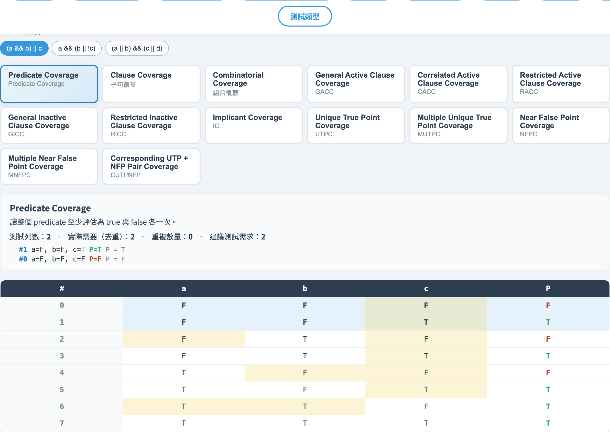
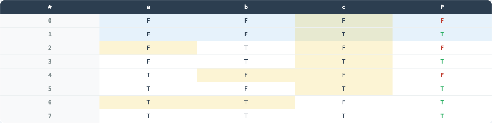
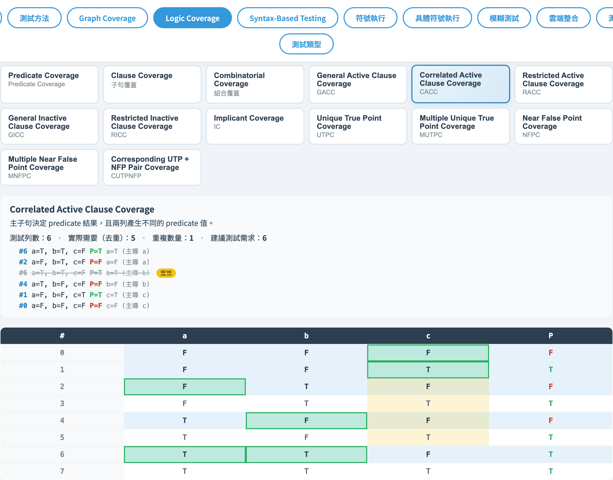
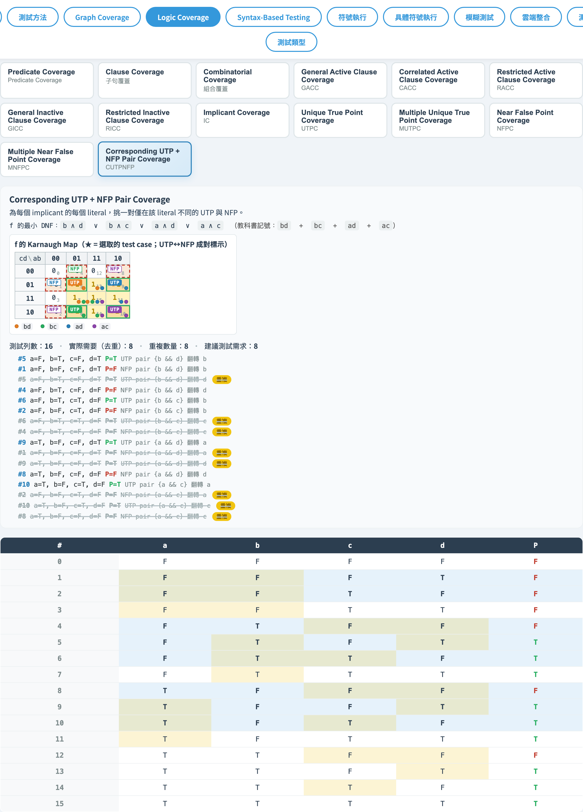

# Logic Coverage
### 預測子（Predicate）與子句（Clause）的覆蓋準則

軟體測試視覺化系列 #5
搭配工具：`/section-logic`（[LogicCoverageExplorer](../../src/components/LogicCoverageExplorer.js) + [logicCoverage.js](../../src/utils/logicCoverage.js)）

---

## 從圖走進邏輯

| 上一講（#3、#4） | 本講（#5） |
| --- | --- |
| 焦點：CFG 結構與資料流 | 焦點：**單一布林條件**內部 |
| 單位：節點、邊、def/use | 單位：**clauses**（原子布林子句） |
| Bug：未走到、變數誤用 | Bug：**條件寫錯**（`&&` vs `\|\|`、子句漏判、極性反） |

> 觀念支點：把每個 decision 拆成 clauses，並要求每個 clause 在「重要時刻」都被測到。

---

## 術語

| 名詞 | 定義 | 例 |
| --- | --- | --- |
| Predicate `P` | 整段布林表達式 | `(a && b) \|\| c` |
| Clause `c` | 不可再拆的原子命題 | `a`、`b`、`c` |
| Active row（對 c）| 翻轉 `c` 後 `P` 也翻轉 → c **決定** P | 真值表上 `determines[c] = true` 的列 |
| DNF | 一組 implicants 的 OR | `ab + c` |

> 「determines」是 active clause 系列的核心：工具會在每列計算 `determines[c]`。

---

## 真值表（Truth Table）

`buildTruthTable(parsed)` 對每個 minterm 產生：

```ts
type TruthRow = {
  index: number;                       // minterm 編號（MSB = clauses[0]）
  values: Record<string, boolean>;     // 各 clause 真值
  predicate: boolean;                  // P 評估結果
  determines: Record<string, boolean>; // 翻 c → P 變？
};
```

> `determines[c] = evaluateAst(ast, {...values, [c]: !values[c]}) !== predicate`
> 用來區分一列是「c 的 active row」還是「inactive row」。

---

## 預測子文法（程式風格 + 教科書風格混用）

| 記號 | 含義 | 範例 |
| --- | --- | --- |
| `&&` 或相鄰（juxtaposition）| AND | `a && b` 或 `ab` |
| `\|\|` 或 `+` | OR | `a \|\| b` 或 `a+b` |
| `!` | NOT | `!a` |
| `(` `)` | 群組 | `(a+b)(c+d)` |
| identifier | clause 名 | `a`、`b1`、`x2` |

```js
const TOKEN_REGEX = /\s*(?:(\()|(\))|(&&)|(\|\|)|(\+)|(!)|([A-Za-z][0-9]*))/y;
```

> Parser 採遞迴下降；優先級 OR < AND < NOT < Atom。`parseAnd` 看到下一個 token 為 `(`/`!`/ident 時自動視為 juxtaposition AND。

---

## 14 條準則總表（語意系列）

| id | 全名 | 摘要 |
| --- | --- | --- |
| `pc` | Predicate Coverage | P 各取 T/F 一次 |
| `cc` | Clause Coverage | 每個 clause 各取 T/F |
| `coc` | Combinatorial Coverage | 列舉所有 $2^n$ 組合 |
| `gacc` | General Active Clause Coverage | c 是 active；次子句不限 |
| `cacc` | Correlated Active Clause Coverage | c 是 active；兩列 P 值不同 |
| `racc` | Restricted Active Clause Coverage | c 是 active；兩列次子句相同 |
| `gicc` | General Inactive Clause Coverage | c 是 **inactive**；覆蓋 4 組 (c, P) |
| `ricc` | Restricted Inactive Clause Coverage | 同 GICC，且次子句相同 |

---

## 14 條準則總表（DNF / 語法系列）

| id | 全名 | 摘要 |
| --- | --- | --- |
| `ic` | Implicant Coverage | f 與 ¬f 的每個 prime implicant 至少一列滿足（minimised） |
| `utpc` | Unique True Point Coverage | 列出每個 implicant 的所有 UTP |
| `mutpc` | Multiple Unique True Point Coverage | 對每 implicant 挑一組 UTPs 讓次子句 T/F 都齊 |
| `nfpc` | Near False Point Coverage | 對每 implicant×literal 找一個 NFP |
| `mnfpc` | Multiple NFP Coverage | 同 NFPC 的「多重」版 |
| `cutpnfp` | Corresponding UTP + NFP Pair Coverage | 對每 implicant×literal 挑一對 (UTP, NFP) 僅在該 literal 不同 |

---

## Subsumption（語意系列）

```
CoC ──► RACC ──► CACC ──► GACC ──► CC ──► PC
                   │
                   └──► RICC ──► GICC
```

- 最強：CoC（要全部 $2^n$ 列）
- 最弱：PC（只要 P 取到 T/F）
- ACC 三兄弟差別在「對非主子句的限制有多嚴」。

---

## 教科書範例：`(a && b) || c`

8 列真值表（n=3）：

| # | a | b | c | P | det(a) | det(b) | det(c) |
| - | - | - | - | - | - | - | - |
| 0 | F | F | F | **F** | – | – | – |
| 1 | F | F | T | **T** | – | – | ✓ |
| 2 | F | T | F | F | – | – | – |
| 3 | F | T | T | T | – | – | ✓ |
| 4 | T | F | F | F | – | – | – |
| 5 | T | F | T | T | – | – | ✓ |
| 6 | T | T | F | **T** | ✓ | ✓ | ✓ |
| 7 | T | T | T | T | – | – | – |

> 工具會自動算出 `determines[c]` 並用顏色標示 active row。

---

## 手算：PC / CC

**PC**：P 至少取一次 T、一次 F。

| Test | a | b | c | P |
| - | - | - | - | - |
| t₁ | F | F | F | F |
| t₂ | F | F | T | T |

**CC**：每個 clause 各取一次 T、一次 F → 兩列即可同時滿足。

> PC 過、CC 也順便過了 — 因為 CC 蘊含 PC 的 P 值變化。

---

## 手算：CACC（對 a 為主子句）

需要 `determines[a]=true` 的兩列，且 P 值不同。

從前面真值表 → row 6（`a=T, b=T, c=F`, P=T）和把 a 翻成 F（`a=F, b=T, c=F`, P=F）。

| Test | a | b | c | P | 角色 |
| - | - | - | - | - | - |
| t₁ | T | T | F | T | a active, P=T |
| t₂ | F | T | F | F | a active, P=F |

> RACC 對「次子句相同」加嚴格約束：上例兩列的 b、c 都已相同 → 同時是 RACC。
> 工具會自動跑 `pickPair(rows, clause, mode)` 做這種挑選。

---

## DNF 與 Quine–McCluskey

[`logicCoverage.js → minimalDNF(rows, clauses, target)`](../../src/utils/logicCoverage.js)：

1. 收集 `predicate === target` 的 minterms。
2. 反覆合併「僅差一位」的群組 → prime implicants。
3. 找 essential primes（只被一個 prime 覆蓋的 minterm）。
4. 剩餘 minterms 以 greedy 補齊。

> 對 `(a && b) || c` → f 的最小 DNF 為 `ab + c`；
> ¬f 的最小 DNF 為 `!a!c + !b!c`。

---

## IC、UTP、NFP

| 概念 | 定義 |
| --- | --- |
| Implicant `i` | DNF 中的一個乘積項（covers 一群 minterms） |
| Unique True Point (UTP) of `i` | 一列：**只有** `i` 為真、其他 implicants 皆假 |
| Near False Point (NFP) of `i, ℓ` | UTP of `i` 翻轉 literal `ℓ` 後使 `i` 變假、P 變假 |

> 教學脈絡：UTP 強化「這個 implicant 不能少」、NFP 強化「這個 literal 不能反」。

---

## CUTPNFP 直觀

對每個 implicant × literal：挑一對 (UTP, NFP) 僅在該 literal 上不同。

```
implicant  ab     literal a
UTP  a=T b=T c=F   → P=T （在 implicant ab 為真）
NFP  a=F b=T c=F   → P=F （翻 a 後 ab 變假，且 c 也假）
```

兩列 b、c 相同，只在 a 翻轉 → 完美對應「a 的存在必要性」。
工具會在 K-map 上把這對 cell 用同色框出來。

---

## Karnaugh Map（n = 1–4）

| n | rowVars | colVars | rowOrder | colOrder |
| --- | --- | --- | --- | --- |
| 1 | — | c₀ | — | [0,1] |
| 2 | c₀ | c₁ | [0,1] | [0,1] |
| 3 | c₂ | c₀c₁ | [0,1] | [0,1,3,2] (Gray) |
| 4 | c₂c₃ | c₀c₁ | [0,1,3,2] | [0,1,3,2] |

> n > 4 → `buildKMap` 回傳 `{ unsupported: true, n }`，UI 顯示「不支援」提示。

---

## K-map cell 顯示元素

`renderKMap(rows, clauses, target, title, options)`：

| 標記 | 用途 |
| --- | --- |
| 右下角圓點 | implicant 顏色（legend 一致） |
| ★ | 該列為 selected test（如 UTP / MUTP） |
| 紅虛線外框 + `NFP` 角標 | NFP cell |
| 綠實線外框 + `UTP` 角標 | UTP cell |
| Tooltip | minterm 編號、clause 真值、test 用途 |

> CUTPNFP 會額外為「同 implicant × literal 的成對 cell」連起來標示。

---

## 工具演示：選範例與輸入



- 內建範例按鈕：`logic-example-simple-and-or` / `logic-example-guarded-exit` / `logic-example-four-clause`。
- `logic-expression-input` 接受程式風格（`&& \|\| !`）或教科書風格（相鄰 / `+`）。
- 最近輸入會以可移除 chip 出現在 `logic-recent`（並同步 Firestore）。

---

## 工具演示：真值表



- `logic-truth-table` 顯示完整 $2^n$ 列。
- `logic-row-{i}` 帶顏色：P=T / P=F、active row 高亮。
- 選 criterion 後，被選用的測試列會在右側 `logic-test-{id}` 重複列出，並標示其角色。

---

## 工具演示：CACC criterion



- 點 `logic-criterion-cacc` → 對每個 clause 各挑 1 對「active 且 P 值不同」的列。
- 重複的測試列以刪除線標示（`logic-test-item duplicate`）。
- 摘要區（`logic-summary`）顯示需求數、實際測試數、重複數。

---

## 工具演示：IC + DNF + K-map


- `logic-criterion-ic` → 顯示 f 與 ¬f 的最小 DNF（`logic-dnf` / `logic-dnf-neg`）。
- 同時繪出兩張 K-map：`logic-kmap-f` / `logic-kmap-not-f`。
- 每個 implicant 在 K-map 中用同色圓點 + legend；test row 加 ★。

---

## 工具演示：CUTPNFP K-map



- `logic-criterion-cutpnfp` → 每個 implicant×literal 一對 (UTP, NFP)。
- K-map 上：UTP 綠實線、NFP 紅虛線；同一對以同色標示。
- 教學重點：把「為什麼這個 literal 必要」**用視覺幾何**呈現。

---

## 教科書式 DNF 文字

`termToCompactHtml(term)` 把 term 渲染為：
- 相鄰 = AND
- `+` = OR
- 上方橫線 = NOT

例：`a̅bc + ac̅`

> Logic Coverage 區塊在 IC / UTPC / MUTPC / NFPC / MNFPC / CUTPNFP 的摘要中同時顯示 ASCII（`!a b c + a !c`）與教科書式記號，方便對照課本。

---

## 持久化

| 儲存 | 路徑 / Key | 內容 |
| --- | --- | --- |
| `localStorage` | `stvisual.logic.recentPredicates` | JSON 陣列（≤ 8 筆） |
| Firestore | `users/{uid}/settings/logicCoverage.recentPredicates` | 同上，附 `updatedAt` |

流程：使用者按 Enter / blur → `rememberCurrentExpression` 插入陣列前端 → 寫 localStorage + （已登入時）`pushRecentToCloud`；登入時遠端與本地以「先遠端、再本地」合併去重後回寫。

---

## 小結

- **14 條準則**分兩家族：
  - 語意：PC、CC、CoC、(G/C/R)ACC、(G/R)ICC
  - 語法（DNF）：IC、UTPC、MUTPC、NFPC、MNFPC、CUTPNFP
- 核心資料結構：**真值表 + determines**；其上派生所有 ACC/ICC。
- DNF 派生：**Quine–McCluskey 最小化 + K-map 可視化**。
- 工具是一個 **active object**：改 predicate → 全部 14 條準則即時重算。

---

## 課堂練習

1. 在工具中輸入 `(a && b) || c`，比對 PC、CC、CACC、RACC 的測試列數差異。
2. 切到 `(a || b) && (c || d)` 看 4×4 K-map：找出 f 與 ¬f 的 prime implicants 各幾個？
3. CUTPNFP 視圖中，哪一對 UTP/NFP 與你用 CACC 挑到的列相符？沒有的話為什麼？
4. 自訂 predicate `a^b`（XOR）— 工具不直接支援 XOR，請改寫成 `(a && !b) || (!a && b)` 並比較 IC 結果。

---

## 進一步閱讀

- Ammann & Offutt, *Introduction to Software Testing*, Ch. 8（Logic Coverage Criteria）
- 工具實作：
  - 解析器 / 真值表 / DNF / buildXSet：[src/utils/logicCoverage.js](../../src/utils/logicCoverage.js)
  - K-map：[src/utils/karnaughMap.js](../../src/utils/karnaughMap.js)
  - UI：[src/components/LogicCoverageExplorer.js](../../src/components/LogicCoverageExplorer.js)
- 規格文件 §4–5：[docs/Specification.zh-TW.md](../Specification.zh-TW.md)
- 下一講 → **#6 Syntax-Based Testing: Program Mutation**
