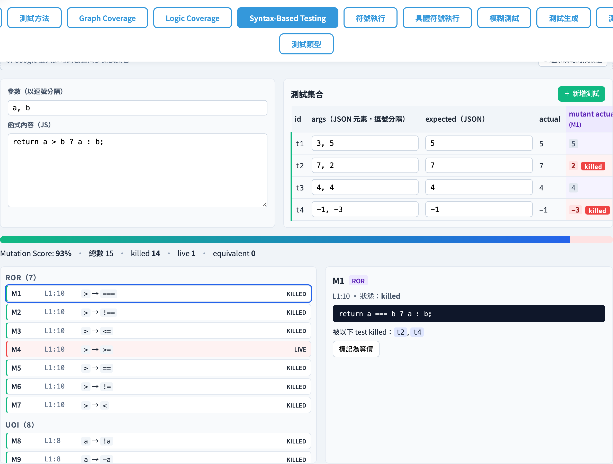
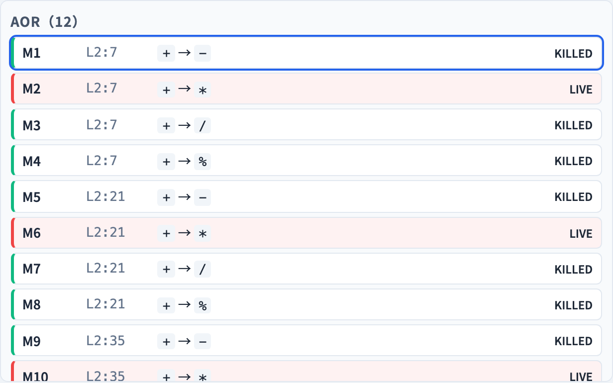
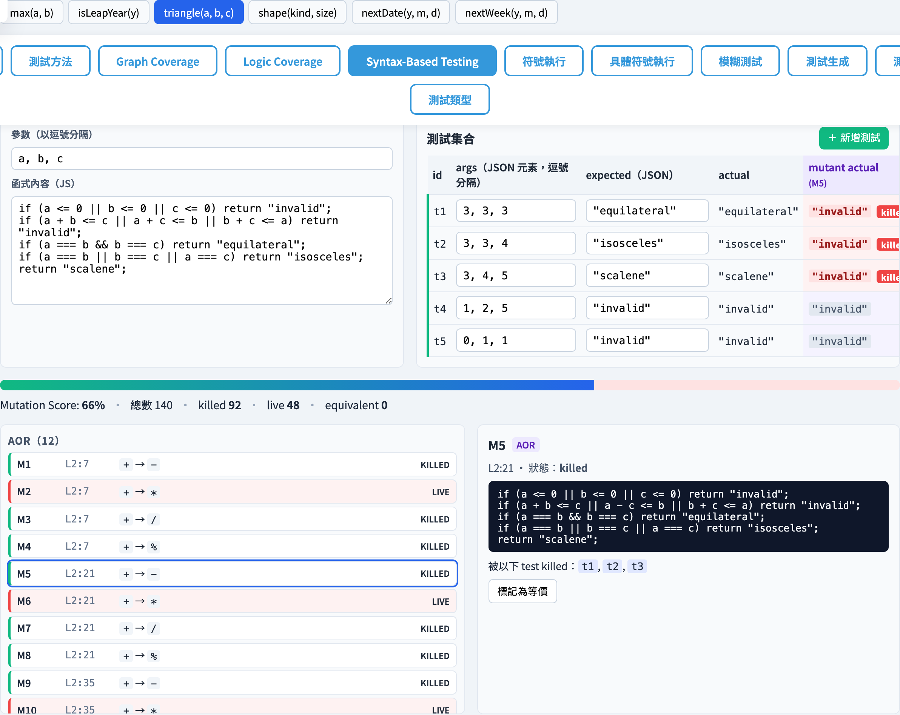

# Program Mutation
### Syntax-Based Testing #1 — Break the code, see if your tests notice

Software Testing Visualization, Lecture #6
Tool: `/section-syntax → Program Mutation` ([SyntaxCoverageExplorer](../../src/components/SyntaxCoverageExplorer.js) + [mutation.js](../../src/utils/mutation.js))

<!-- This lecture shifts perspective: instead of testing the program, we test the test suite itself. Mutation score is an objective metric for test suite quality. -->
---

## A shift in perspective: test the tests

| Lectures 1–5 | This lecture |
| --- | --- |
| Does the program get covered? | **Does the test set actually catch bugs?** |
| Find bugs, but is the suite strong enough? | Inject small faults into the program, see if tests spot them |
| Subject: the program | Subject: **the test set** |

> Pivot: a good test set must kill a large fraction of plausible-but-wrong program variants.

<!-- Traditional testing answers "is the program correct?"; mutation testing answers "how strong is my test suite?" — a meta-question. -->
---

## Mutation testing in three steps

```
Program  P  ─┐
              │ apply mutation operator
              ▼
             P′  ──►  run on test set T
                        │
                        ▼
              ┌─ any test differs?     ──► killed ✅
              ├─ all tests identical   ──► live ❌
              └─ manually equivalent  ──► equivalent ⚪
```

> **Mutation Score** = killed ÷ (total − equivalent)

<!-- Three steps: generate mutants → run test suite against each mutant → compute mutation score. Numerator = killed; denominator = all non-equivalent mutants. -->
---

## Why “killed”?

For a test `t` and a mutant `P′`:

- `P(t) ≠ P′(t)` → `t` kills `P′`
- `P(t) = P′(t)` for every `t` → `P′` is live (weak suite, or `P′` is equivalent)

Teaching points:
- **Live mutants** are the next opportunity to improve the test suite — ask why no test caught it.
- **Equivalent mutants** are undecidable in general — they must be marked manually.
---

## 15 operators (11 procedural)

| Op | Name | Action |
| --- | --- | --- |
| AOR | Arithmetic Operator Replacement | swap `+ - * / %` |
| ROR | Relational Operator Replacement | swap `< <= > >= == != === !==` |
| LOR | Logical Operator Replacement | swap `&&` ↔ `\|\|` |
| COR | Conditional Operator Replacement | same set as LOR |
| SOR | Shift Operator Replacement | swap `<<` `>>` `>>>` |
| ASR | Assignment Operator Replacement | swap `+= -= *= /= %= …` |
| UOI | Unary Operator Insertion | insert `!` or `-` before an identifier |
| UOD | Unary Operator Deletion | delete `! - + ~` |
| SVR | Scalar Variable Replacement | swap identifiers within scope |
| BSR | Bomb Statement Replacement | replace a whole line with `throw` |
| ABS | Absolute Value Insertion | wrap `x` as `Math.abs(x)` / `-(x)` |

<!-- AOR (arithmetic operator replacement) and ROR (relational operator replacement) are the most common operators and easiest to compute by hand. -->
---

## 15 operators (4 object-oriented)

| Op | Name | Action |
| --- | --- | --- |
| JTD | OO: `this` Deletion | drop the `this.` prefix |
| ISD | OO: `super` Call Deletion | replace `super(...)` with `undefined` |
| IOD | OO: Overriding Method Deletion | delete an overriding subclass method → fall back to the parent |
| PRV | OO: Reference Type Change | `new ClassA(...)` → `new ClassB(...)` from the same file |

> OO operators require a `class`-based example. The built-in `shapeHierarchy` (Square / Circle inheriting Shape) is designed for this.

<!-- OO operators target class inheritance and polymorphism, especially important in Java/C++ programs. The current tool implements 11 procedural operators. -->
---

## Worked example: AOR on max(a, b)

```js
function max(a, b) {
  if (a > b) return a;       // AOR: no arithmetic → no mutants
  return b;
}
```

Test set:
```js
[3,5]→5  [7,2]→7  [4,4]→4  [-1,-3]→-1
```

- AOR produces no mutants on max() — there is no `+ - * / %`.
- ROR is the interesting operator: `a > b` mutates to `a >= b`, `a < b`, `a === b`, …

<!-- For hand calculation: replace a > b with a + b, a - b, a * b, etc. Ask which mutant is easiest to kill. -->
---

## Worked example: ROR on max(a, b)

| Mutant | Expression | Behaviour at t₃=[4,4] |
| --- | --- | --- |
| original | `a > b` | not taken; returns `b=4` |
| `a >= b` | taken; returns `a=4` | still 4 |
| `a < b` | not taken; returns `b=4` | still 4 |
| `a === b` | taken; returns `a=4` | still 4 |

- t₃ is too weak — it cannot distinguish behaviours when `a = b`.
- Adding t₅=[5,5]→5 does not help: the return value is the same regardless.
- **You need a test where `a ≠ b` and only one side matches** to kill all ROR mutants.

<!-- a > b changed to a >= b is the most subtle ROR mutant — it differs only when a == b, so tests need to include this boundary case. -->
---

## Equivalent mutants: the hard part

```js
function isZero(x) {
  return x === 0;          // original
}
function isZero(x) {       // mutant: UOI inserts -
  return -x === 0;
}
```

- Because `-0 === 0` is true, the two functions behave identically for every `x`.
- No test will ever kill it → **equivalent mutant**.
- The tool offers a “mark as equivalent” button so it is removed from the denominator — otherwise the mutation score is misleadingly capped below 100%.

<!-- Equivalent mutants are mutation testing's biggest challenge — no test can kill them because they are semantically identical to the original program. -->
---

## Tool: overview



- Built-in examples: `syntax-example-{max, isLeapYear, triangle, shapeHierarchy, nextDate, nextWeek}`.
- `syntax-operators` is a row of 15 toggles, all multi-selectable.
- Edit the program with `syntax-params` / `syntax-body`; edit the test set with `syntax-test-table`.

<!-- Left side: program input and test suite. Right side: mutant list and killed/alive statistics. Suggest students look at the summary numbers first. -->
---

## Tool: execution flow

Every change to program / tests / operators kicks off a three-step pipeline:

1. **Compile**: wrap `params` + `body` into `new Function(params, body)` and dry-run once.
2. **Mutate**: apply the 15 operators across the AST / token stream and enumerate candidates.
3. **Evaluate**: run every mutant against every test, compare against `expected`, mark killed / live.

> All in-browser (Workers are unnecessary — JS function calls are cheap).

<!-- Clicking "Run Mutation" triggers: parse program → generate all mutants → run all tests against each mutant → compute score. -->
---

## Tool: mutant list



- Grouped by operator (`syntax-mutant-group-{op}`); killed are green, live red, equivalent grey.
- Each row shows `L<line>:<col>` and `original → mutated`.
- Click any mutant → `syntax-mutant-detail` on the right shows the full mutated source plus the killer test IDs.

<!-- Each mutant can be expanded to see the diff — which operator applied to which token made what replacement. -->
---

## Tool: per-test results



- After selecting a mutant, `syntax-test-table` gains a column with **the mutant’s actual output for each test**.
- Rows that kill the mutant are highlighted red; rows that do not are dimmed.
- Pedagogical payoff: you can immediately see “why this test failed to catch the mutant”.

<!-- The mutant detail page shows which tests killed it and which didn't. This helps students understand why one test is stronger than another. -->
---

## OO showcase: shapeHierarchy

```js
class Shape { area() { return 0; } describe() { return 'shape:' + this.area(); } }
class Square extends Shape { constructor(s){ super(); this.s=s; } area(){ return this.s*this.s; } }
class Circle extends Shape { constructor(r){ super(); this.r=r; } area(){ return this.r*this.r*3; } }
```

| Operator | Effect |
| --- | --- |
| `JTD` | `this.area()` → `area()` (ReferenceError) |
| `IOD` | Delete `Square.area()`, fall back to parent → returns 0 |
| `ISD` | `super()` → `undefined`, breaks inherited initialisation |
| `PRV` | `new Square(s)` → `new Circle(s)` |

<!-- The shapeHierarchy example shows OO mutation: replacing subclass instances, modifying polymorphic calls, etc. Good for students with OO background. -->
---

## Persistence: test sets and cloud sync

| Store | Key | Content |
| --- | --- | --- |
| `localStorage` | `stvisual.syntax.<exampleId>` | the example’s params / body / tests |
| Firestore | `users/{uid}/settings/syntax.<exampleId>` | same, plus `updatedAt` |

Behaviour:
- Signed out → localStorage only.
- Signed in → debounced writes to Firestore; the panel offers `syntax-cloud-reload` to fetch fresh.
- A `pagehide` listener flushes the last write so closing the tab does not lose data.

<!-- The tool supports cloud sync of test sets, making it easy for students to share the same mutant list for group discussion. -->
---

## Algorithm peek: mutate pipeline

Core of [`mutation.js`](../../src/utils/mutation.js):

1. **Tokenise** `body` (regex-based, with position info).
2. **Find candidates**: each operator implements `match(token)` + `mutate(token)`.
3. **Generate mutant id** = `<op>:<line>:<col>:<seq>` to avoid collisions at the same site.
4. **Deduplicate** using `<op>|<text>` so identical mutants are listed once.

> The OO operators (JTD / ISD / IOD / PRV) work at source-level via pattern matching — regex is easier than tokens for class structure.

<!-- AST transformation is the core technique for generating mutants. The tool has a corresponding AST visitor for each operator. -->
---

## Common pitfalls

1. **Too many equivalent mutants**: especially `UOI` (`!a` vs `!!a`) and `ABS` on constants → habit: triage live first, mark equivalent only when proven.
2. **`BSR` inflates the denominator**: a thrown statement is always killed → consider running once with `BSR` disabled for a cleaner baseline.
3. **Slow runs**: complex mutants × big test sets is `O(M × T)`. The built-in examples are tiny; when you upload your own, keep tests under ~50.
4. **Cloud race**: simultaneous debounce + reload → the tool follows the “last successful write wins” rule; click `syntax-reload-btn` if you’re unsure.

<!-- High coverage ≠ high mutation score. Example: 100% coverage but tests only assert "no crash" → mutation score can be very low. -->
---

## Summary

- Program Mutation measures suite quality via **“break the code, the suite should catch it”**.
- The tool implements **15 operators** (11 procedural + 4 OO); all are independent toggles.
- Mutation score = killed / (total − equivalent) — a single health metric for the test set.
- The tool offers both **per-mutant** and **per-test** views — find “the unkilled mutant” and “the useless test” in one place.

<!-- Mutation score is an objective measure of test suite strength. The goal is not 100% (impossible with equivalent mutants) but approaching 80–90%. -->
---

## Exercises

1. On `max`, add **one** test so every ROR mutant is killed. Hint: pick a case where `a ≠ b`.
2. Open `isLeapYear` and note the live count for LOR. Modify a single test so the count drops to zero.
3. Switch to `shapeHierarchy`. Which OO operator generates the most equivalent mutants? Why?
4. Upload a short function (≤ 10 lines) of your own. Which operator produces the most mutants?

<!-- Exercise 1 (compute AOR mutants by hand) is the most important foundational skill. Exercise 3 (equivalent mutant judgment) works for advanced students. -->
---

## Further reading

- Ammann & Offutt, *Introduction to Software Testing*, Ch. 9.2 (Program Mutation).
- Implementation:
  - [src/utils/mutation.js](../../src/utils/mutation.js) — token- and source-level logic for all 15 operators.
  - [src/data/mutationData.js](../../src/data/mutationData.js) — 6 built-in examples + operator metadata.
  - [src/components/SyntaxCoverageExplorer.js](../../src/components/SyntaxCoverageExplorer.js) — UI / cloud sync.
- Spec §11.2 / §17.3: [docs/Specification.zh-TW.md](../Specification.zh-TW.md).
- Next → **Lecture #7 — Grammar-Based Testing + Mutation on Strings**.

<!-- A&O §11.2 has complete mutation operator definitions. PIT is the most widely used Java mutation testing tool in industry. -->
