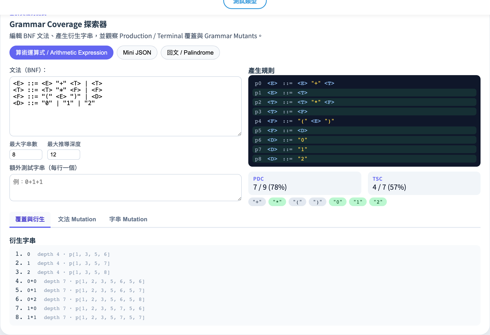
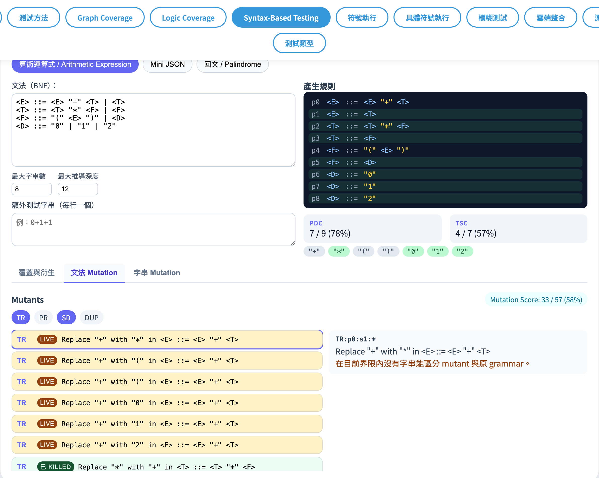
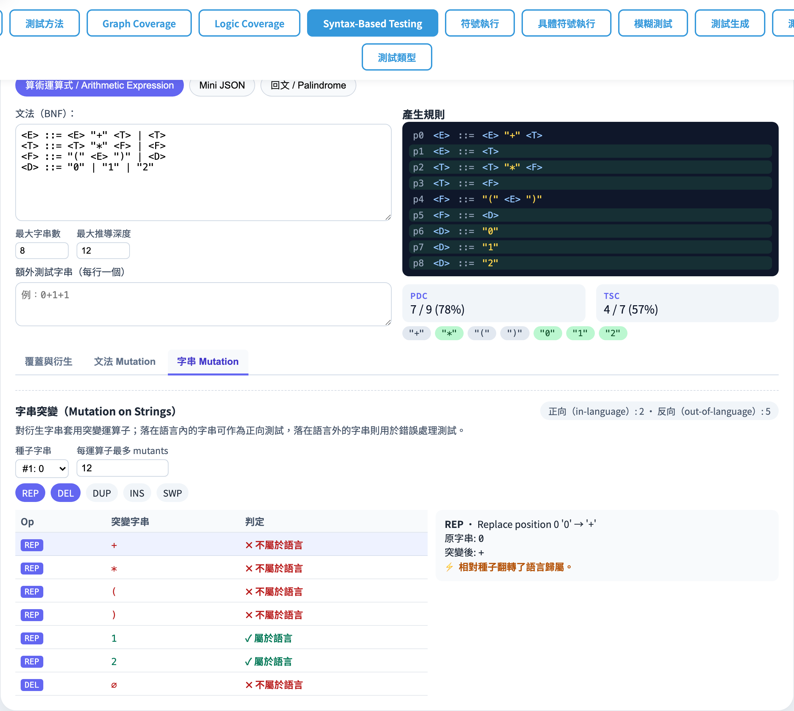

# Grammar-Based Testing
### From grammars to inputs, from grammars to mutants

Software Testing Visualization, Lecture #7
Tool: `/section-syntax → Grammar Coverage` ([GrammarCoverageExplorer](../../src/components/GrammarCoverageExplorer.js) + [grammar.js](../../src/utils/grammar.js))

<!-- This lecture treats grammar as the test subject, not the test tool. Grammar defines valid input structure; coverage criteria require generating tests that cover the grammar. -->
---

## Why grammar-based testing?

Many inputs are **structured strings**:
- Config files (JSON / YAML / TOML)
- Query languages (SQL / GraphQL)
- DSLs (regex, Markdown, shell commands)

> Generate from a grammar → exercise both **syntax-error detection** and the **happy path**.
> Mutate the grammar → check whether the spec itself is tight enough.

<!-- This lecture treats grammar as the test subject, not the test tool. Grammar defines valid input structure; coverage criteria require generating tests that cover the grammar. -->
---

## Two teaching tracks

| Track | Subject | What gets mutated |
| --- | --- | --- |
| **Grammar Coverage** | Generate legal strings from BNF | — |
| **Grammar Mutation** | Change the grammar itself | grammar |
| **Mutation on Strings** | Change a legal string produced by the grammar | string |

All three share the same tool card; the `grammar-subtab-row` switches between them.

<!-- This lecture covers Grammar Coverage (covering BNF productions) and String Mutation (mutating individual strings to find boundaries) — complementary approaches. -->
---

## BNF refresher

```
<E> ::= <E> "+" <T> | <T>
<T> ::= <T> "*" <F> | <F>
<F> ::= "(" <E> ")" | <D>
<D> ::= "0" | "1" | "2"
```

| Symbol | Meaning |
| --- | --- |
| `<X>` | Non-terminal |
| `"x"` | Terminal — string literal |
| `\|` | Alternative |
| `#` / `//` | Comments (supported by the tool) |

> Tool parser: `parseGrammar(text)` → `{ rules, productions, terminals, start }`.

<!-- BNF's ::=, |, *, + syntax is the language of grammar testing. The tool accepts standard BNF format and automatically derives strings. -->
---

## Built-in grammars

| id | Name | Key terminals |
| --- | --- | --- |
| `arith` | Arithmetic expression | `+`, `*`, `(`, `)`, `0`, `1`, `2` |
| `json-tiny` | Mini JSON | `{`, `}`, `[`, `]`, `:`, `,`, `"a"`, `"b"`, `0`, `1` |
| `palindrome` | a/b palindrome | `a`, `b` |

> All three are deliberately small (≤ 10 productions) so derivations and mutants stay legible.

<!-- Three built-in grammars: arithmetic, URL, JSON. Start with arithmetic — observe how the derivation tree expands. -->
---

## Derivation: BFS, left-most

`generateDerivations(grammar, { maxStrings, maxDepth, maxStringLen })`:

1. Start from the start symbol.
2. Each step: replace the left-most non-terminal with one of its productions.
3. When every symbol is a terminal → success.
4. Three caps (max strings / depth / string length) keep the BFS bounded.

Returns `[{ string, productionsUsed, depth }]`.

<!-- BFS left derivation ensures shortest derivations appear first, allowing the tool to find the minimum test set in reasonable time. -->
---

## Two coverage metrics

| id | Name | Definition |
| --- | --- | --- |
| **PDC** | Production Coverage | Every production is used by at least one derivation |
| **TSC** | Terminal Symbol Coverage | Every terminal appears in at least one derivation |

> Covered productions turn green (`grammar-prod covered`); covered terminal chips change colour.
> Both display as `covered / all (ratio%)`.

<!-- PDC (Production Coverage): each production used at least once; TSC (Terminal Symbol Coverage): each terminal appears at least once. -->
---

## Tool: overview



- Example chips: `grammar-example=arith / json-tiny / palindrome`.
- `grammar-text` textarea takes free-form BNF; `grammar-parse-error` reports problems live.
- The middle panel lists every production (number + RHS); the bottom row is the terminal chip set.

<!-- Input grammar on the left, see derivation list and coverage statistics on the right. Start with the default grammar, then switch to a custom one. -->
---

## Tool: derivations + PDC / TSC


- Switch to the `derivations` tab → see the generated strings, their depth, and the productions they used.
- The `grammar-pdc` / `grammar-tsc` metrics update live.
- Use `grammar-extra-tests` (one legal string per line) to plug holes in coverage manually.

<!-- BFS left derivation ensures shortest derivations appear first, allowing the tool to find the minimum test set in reasonable time. -->
---

## Grammar mutation: 4 operators

[`GRAMMAR_OPERATORS = ['TR', 'PR', 'SD', 'DUP']`](../../src/utils/grammar.js)

| Op | Name | Action |
| --- | --- | --- |
| `TR` | Terminal Replacement | Replace one terminal with another |
| `PR` | Production Replacement | Swap a production for another with the same LHS |
| `SD` | Symbol Deletion | Drop a symbol from a production’s RHS |
| `DUP` | Symbol Duplication | Duplicate one RHS symbol |

> Grammar-level mutation — what changes is the **rule**, not the string.

<!-- Operators target the grammar itself: substitute, delete, insert non-terminal, modify quantifier. These mutants simulate "grammar errors." -->
---

## Kill criterion (grammar mutation)

For a mutant grammar `G′`:
- Pick a set of teaching test strings (derivations + user-supplied extras).
- Run `recognizes(...)` on both the original `G` and the mutant `G′`.
- Any string that “accepts in `G` and rejects in `G′`” (or vice versa) → mutant is **killed**.

`evaluateMutantsAgainstStrings(orig, mutants, strings)` does the full pass.

<!-- A test kills a grammar mutant if it accepts strings from the original grammar but rejects strings from the mutant grammar (or vice versa). -->
---

## Tool: grammar mutants



- 4 operator checkboxes: `data-grammar-op=TR/PR/SD/DUP`.
- `grammar-mutation-score` shows killed / total.
- Each row lists the operation description, killed/live status, and the distinguishing string (when killed).

> Teaching cue: many live mutants → the grammar is too loose; ask students to add productions or tighten terminals.

<!-- The tool lists all grammar mutants and their kill status. Ask: which operator type produces the hardest-to-kill mutants? -->
---

## Pivot to strings: Mutation on Strings (Ammann/Offutt §9.2)

A different angle: **keep the grammar, mutate the string.**

```
Pick a legal seed string  s
                │
                │ apply 5 character-level operators
                ▼
              s′
                │
                │ use the same recognizer to classify
                ▼
          ┌─ s′ still legal → positive test
          └─ s′ now illegal → negative test
```

<!-- String Mutation is character-level mutation testing — not modifying the grammar, but mutating individual string inputs to find boundary cases. -->
---

## 5 string-mutation operators

[`STRING_MUTATION_OPERATORS = ['REP','DEL','DUP','INS','SWP']`](../../src/utils/grammar.js)

| Op | Action |
| --- | --- |
| `REP` | Replace one character with another from the alphabet |
| `DEL` | Delete one character |
| `DUP` | Duplicate one character |
| `INS` | Insert one character at some position |
| `SWP` | Swap two adjacent, different characters |

> The alphabet is derived by `deriveAlphabet(grammar, derivations)` — the union of every character in any grammar terminal and any derivation.

<!-- AOR/LCR/SOR/UOI/COR have character-level counterparts: insert, delete, substitute characters, etc. -->
---

## Why split positive / negative?

| kind | Use |
| --- | --- |
| **positive** | Stress-test the parser’s happy path (still legal input) |
| **negative** | Exercise the parser’s error-handling path (now illegal) |

`classifyStringMutants(grammar, mutants)`:
- `origAccepts` is always `true` (the seed must be legal).
- `mutAccepts === (kind === 'positive')`.
- `flipped` flag → `kind === 'negative'`.

<!-- Positive tests should pass (grammatically correct input); negative tests should fail (deliberately incorrect input). Both must be designed. -->
---

## Tool: string mutation



- Seed dropdown: pick any legal string from the current derivations.
- 5 operator checkboxes (REP / DEL on by default) + a per-operator cap (1–50).
- `grammar-string-mutant-table`: Op / Mutated / Result (green tick = in language, red cross = not in language).
- `grammar-string-stats`: positive / negative counts.

<!-- The string mutant list shows positive/negative classification, helping students verify the expected behavior of each mutant. -->
---

## Algorithm peek

Key functions in [`grammar.js`](../../src/utils/grammar.js):

1. `parseGrammar(text)` — BNF parser.
2. `generateDerivations(g, opts)` — left-most BFS, three caps to prevent divergence.
3. `computeCoverage(derivations, grammar)` — PDC / TSC.
4. `recognizes(grammar, input)` — teaching-grade recursive-descent recogniser (memoised, depth-capped).
5. `generateGrammarMutants` + `evaluateMutantsAgainstStrings`.
6. `generateStringMutants` + `classifyStringMutants` + `deriveAlphabet`.

<!-- BFS derivation uses recursive expansion + deduplication. Grammar mutation applies operator substitution to the grammar's AST. -->
---

## Loading a grammar from the cloud

The tool listens for a cross-component event from Cloud Storage:

```js
window.dispatchEvent(new CustomEvent('stvisual:load-program-source', {
  detail: { target: 'grammar', name, content }
}));
```

- CloudStoragePanel adds a **Use for Grammar Coverage** button to every Drive file.
- Clicking it scrolls into the syntax section, switches to the `grammar` subtab, and creates an `uploaded-grammar-<ts>` example.
- BNF, derivations, and mutants all recompute live afterwards.

<!-- Cloud loading lets students share custom grammars. Good for group work: each group designs a grammar, then tests each other's. -->
---

## Summary

- Three stacked layers:
  1. **Grammar Coverage** — two objective metrics: PDC / TSC.
  2. **Grammar Mutation** — 4 operators on the rules to test the suite’s sensitivity.
  3. **String Mutation** — 5 character-level operators on a legal string to harvest positive / negative tests.
- A single grammar threads through all three: one BNF edit → derivations, coverage, and mutants all re-compute.
- Same mental model as Lecture #6 Program Mutation: **“break it; the tests should notice”** — only the subject changes (grammar / string instead of code).

<!-- Grammar is both the specification of test inputs and can itself be the test subject. PDC/TSC help ensure all "paths" through the grammar are tested. -->
---

## Exercises

1. On `arith`, drop `maxStrings` from its default down to 4. Which metric falls first — PDC or TSC? Why?
2. On `palindrome`, enable `SD` (symbol deletion). Which mutants remain legal grammars, and which become “accept nothing”?
3. Switch to `Mutation on Strings`, take `aba` as the seed, and enable only `SWP`. Can it produce a negative test? Why or why not?
4. On `json-tiny`, enable `INS`. Inserting `{` or `,` in the wrong place — does the recogniser flag it as a negative test?

<!-- Exercise 1 (manual derivation) is the most basic skill. Exercise 3 (JSON grammar coverage) works well as an advanced assignment. -->
---

## Further reading

- Ammann & Offutt, *Introduction to Software Testing*, Ch. 9.1–9.2 (Grammar-Based Testing / Mutation on Ground Strings).
- Implementation:
  - [src/utils/grammar.js](../../src/utils/grammar.js) — BNF parser, derivation, coverage, grammar mutation, string mutation.
  - [src/data/grammarData.js](../../src/data/grammarData.js) — 3 built-in grammars.
  - [src/components/GrammarCoverageExplorer.js](../../src/components/GrammarCoverageExplorer.js) — UI (with sub-tabs).
- Spec §12 / §13: [docs/Specification.zh-TW.md](../Specification.zh-TW.md).
- Next → **Lecture #8 — Specification Mutation + SMV + Safety Monitor FSM**.

<!-- A&O §12–13 has the complete grammar-based testing theory. -->
