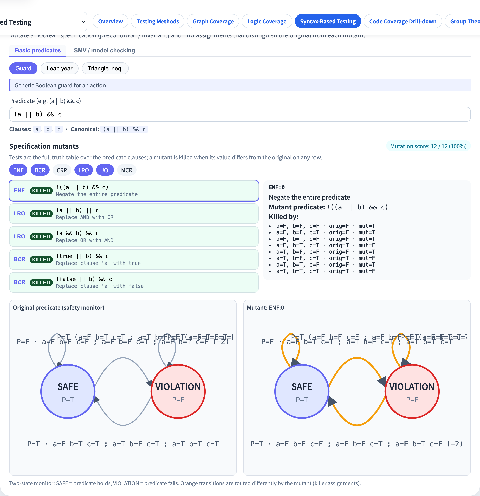
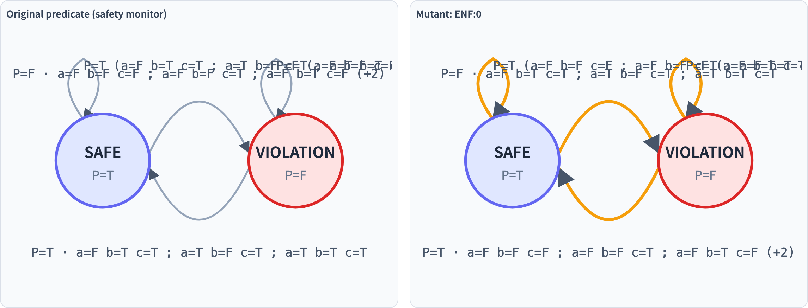
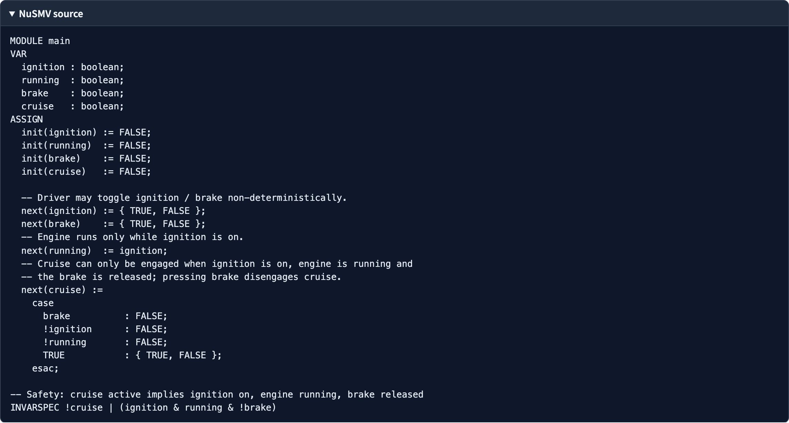

# Specification Mutation
### Mutate the spec itself — paired with SMV examples and a Safety Monitor FSM

Software Testing Visualization, Lecture #8
Tool: `/section-syntax → Specification Mutation` ([SpecMutationExplorer](../../src/components/SpecMutationExplorer.js) + [specMutation.js](../../src/utils/specMutation.js) + [specFsm.js](../../src/utils/specFsm.js))

<!-- This lecture is the final stop of the mutation series: shifting the mutation target from source code to specifications (predicates) and state machines (FSMs). -->
---

## Comparing three mutation lectures

| # | Subject | Kill condition |
| --- | --- | --- |
| #6 Program Mutation | **Source code** | any test produces a different output |
| #7 Grammar / String Mutation | **grammar / string** | language membership flips |
| **#8 Specification Mutation** | **Spec predicate** | any assignment yields a different truth value |

> Pivot: treat the predicate as a “spec under test” and look for an assignment in the truth table that distinguishes it from each mutant.

<!-- Lecture #6 mutates programs; #7 mutates grammars; this lecture mutates specifications (predicates) and state machines (FSMs). -->
---

## What is specification mutation?

**Ammann & Offutt §9.4** — treat a precondition / postcondition / loop invariant as a Boolean specification:

```
Original predicate  P  ─┐
                         │ apply 6 structural mutation operators
                         ▼
                        P′  ──►  evaluate on 2^n assignments
                                  │
                                  ▼
                  ┌─ ∃ a with P(a) ≠ P′(a) → killed
                  └─ ∀ a, P(a) = P′(a)     → equivalent
```

> Unlike #6: the subject is the **spec**, and assignments replace the “test set”.

<!-- This lecture is the final stop of the mutation series: shifting the mutation target from source code to specifications (predicates) and state machines (FSMs). -->
---

## The 6 operators

[`SPEC_MUTATION_OPERATORS = ['ENF', 'BCR', 'CRR', 'LRO', 'UOI', 'MCR']`](../../src/utils/specMutation.js)

| Op | Name | Action |
| --- | --- | --- |
| `ENF` | Expression Negation Failure | Negate the whole predicate |
| `BCR` | Boolean Constant Replacement | Replace a clause with `true` or `false` |
| `CRR` | Clause Reference Replacement | Replace a clause with another clause |
| `LRO` | Logical Operator Replacement | `&&` ↔ `\|\|` |
| `UOI` | Unary Operator Insertion | Wrap a clause with NOT |
| `MCR` | Missing Clause Replacement | Drop one operand of `&&` or `\|\|` |

> Shares `parsePredicate` with Lecture #5 Logic Coverage — same surface syntax (`&& \|\| !` + juxtaposition + `+`).

<!-- AOR/ROR/LCR/MOR/AOD/COD are the six specification mutation operators. LCR (&&↔||) and ROR (>↔>=) are the most common. -->
---

## Two example categories: basic vs SMV

The tool exposes two segmented categories:

| Category | Purpose | Examples |
| --- | --- | --- |
| `basic` | Teaching starters | `guard`, `leap`, `triangle` |
| `smv` | Real model-checking invariants | `smv-mutex`, `smv-cruise`, `smv-sis`, `smv-train`, `smv-elevator`, `smv-garage`, `smv-wiper` |

> Every SMV example bundles a full NuSMV module; expand the `spec-smv-source` `<details>` to view it.

<!-- Basic operators directly replace operators; SMV (Safety Monitor Violation) operators are designed for safety-monitoring patterns. -->
---

## SMV example table

| id | Safety | predicate |
| --- | --- | --- |
| `smv-mutex` | Two-process mutual exclusion | `!(c1 && c2)` |
| `smv-cruise` | Cruise control | `!cruise \|\| (ignition && running && !brake)` |
| `smv-sis` | Safety Injection (Parnas) | `(si && pressure && !override) \|\| (!si && (!pressure \|\| override))` |
| `smv-train` | Train-gate controller | `!train \|\| (gate && signal)` |
| `smv-elevator` | Elevator door | `!moving \|\| !door` |
| `smv-garage` | Garage door controller | `(!u \|\| !t) && (!d \|\| !o)` |
| `smv-wiper` | Windshield wiper | `!w \|\| (i && (l \|\| h))` |

> All seven are extracted from a NuSMV `INVARSPEC`; the original module is viewable inside the tool.

<!-- SMV is especially important in formal verification contexts, such as aerospace and automotive safety specifications. -->
---

## Example: `(a || b) && c` under the 6 operators

| Op | Representative mutant | killer assignment |
| --- | --- | --- |
| ENF | `!((a \|\| b) && c)` | any P=T row |
| BCR | `(true \|\| b) && c` | e.g. `a=F b=F c=T` |
| CRR | `(a \|\| a) && c` | any row with `a ≠ b` and `c=T` |
| LRO | `(a && b) && c` | `a=F b=T c=T` |
| UOI | `(a \|\| !b) && c` | any row that flips with `b=T` |
| MCR | `a && c` | `a=F b=T c=T` |

> The tool enumerates every position-expanded mutant grouped by operator.

<!-- AOR/ROR/LCR/MOR/AOD/COD are the six specification mutation operators. LCR (&&↔||) and ROR (>↔>=) are the most common. -->
---

## Kill algorithm

[`evaluateSpecMutants(parsed, mutants, tests)`](../../src/utils/specMutation.js):

```js
const originalValues = tests.map(t => evaluateAst(parsed.ast, t));
mutants.map(m => {
  const killers = [];
  for (let i = 0; i < tests.length; i++) {
    const mutValue = evaluateAst(m.ast, tests[i]);
    if (mutValue !== originalValues[i])
      killers.push({ test: tests[i], orig: originalValues[i], mut: mutValue });
  }
  return { ...m, killed: killers.length > 0, killers };
});
```

By default, `tests = buildAssignmentSpace(clauses)` → the full truth table.

<!-- Kill condition: the original predicate and the mutant predicate produce different outputs on some input. The test suite must include such an input. -->
---

## Safety Monitor FSM

Treat the predicate as a **memoryless safety monitor**:

```
       P=T (assignment)
       ┌───────────────┐
       ▼               │
   ┌───────┐         ┌─────────────┐
   │ SAFE  │◄────────┤  VIOLATION  │
   │ P=T   │  P=T    │  P=F        │
   └───┬───┘ assign  └──────▲──────┘
       │ P=F                │
       └─assignment────────┘
                 P=F
```

Two states:
- `SAFE` (P=T) — spec holds
- `VIOLATION` (P=F) — spec violated

Four transitions: two self-loops plus two cross-edges.

<!-- FSM (finite state machine) is another form of specification. The tool shows side-by-side comparison of original and mutant FSMs. -->
---

## Why memoryless?

`buildMonitor(ast, clauses)`:
- Evaluates the predicate on the full assignment space ($2^n$).
- Sorts assignments into two buckets: `trueSet` / `falseSet`.
- The next state depends only on the new assignment’s P value → independent of the source state.

So teaching-wise the four transitions collapse to: “new assignment evaluates to T → enter SAFE; to F → enter VIOLATION.”

<!-- Most FSMs are memoryless (Markov property): the next state depends only on the current state and input, not on history. -->
---

## diff = killer set

[`diffMonitors(origAst, mutAst, clauses)`](../../src/utils/specFsm.js):

```js
const flipped = [];
for (const a of assignments) {
  if (evaluateAst(origAst, a) !== evaluateAst(mutAst, a))
    flipped.push(a);
}
return flipped;
```

> `flipped` is exactly the set of killer assignments — the two FSMs send them to **different** target states.
> The tool draws those transitions as **orange dashed arcs**.

<!-- The difference set (diff) of two FSMs is precisely the test set that kills the FSM mutant. The tool computes and displays this diff directly. -->
---

## Tool: overview


- Top: segmented control `spec-category-row` (basic / smv).
- Middle: example buttons (`data-spec-example`) and the example caption (`spec-example-caption`).
- `spec-text` is a single-line predicate input (parsed live); the parsed clauses and canonical form are shown beneath.

<!-- Three sections: left for predicate input, middle for mutant list, right for side-by-side FSM view. -->
---

## Tool: mutants and score



- 6 operator checkboxes (default: ENF / BCR / LRO / UOI).
- `spec-mutant-list`: mutant text / operator / killed or live.
- `spec-mutation-score`: killed / total (%).
- Click a mutant → the right panel lists its killer assignments (e.g. `a=T b=F c=T`).

<!-- The tool shows kill status for both predicate and FSM mutants, plus the overall mutation score. -->
---

## Tool: dual FSM



- `spec-fsm-grid`: left = original predicate, right = selected mutant.
- Each side draws the two states (SAFE / VIOLATION) plus four transitions.
- Edge labels: `P=T · {assignments}` or `N / 2^n assignments` (graceful fallback when clauses > 4).
- **Orange dashed transitions are killers**: the two FSMs route those assignments to different target states.

<!-- The side-by-side view lets students directly see which state transition differs between original and mutant FSM. -->
---

## Tool: SMV source



- Pick the `smv` category and any example → a `spec-smv-source` `<details>` block appears.
- Shows the full NuSMV module (MODULE / VAR / ASSIGN / INVARSPEC …).
- Teaching arc: start with the NuSMV invariant → extract a Boolean predicate → mutate it → inspect the resulting Safety Monitor FSM.

<!-- The tool shows the SMV-format specification, helping students understand how formal verification tools (like NuSMV) interpret these specs. -->
---

## Persistence

| Store | Key | Content |
| --- | --- | --- |
| `localStorage` | `stvisual.specMutation.v1` | `{ category, exampleId, text, operators, ... }` |

Behaviour:
- The predicate, operator set, selected example, and category are all persisted.
- Unlike Logic Coverage / Program Mutation, **Spec Mutation does not sync to Firestore** today — that is a future extension.

<!-- The tool saves the most recent predicate and FSM, enabling cross-session continuation of work. -->
---

## Algorithm summary

| Module | Function | Purpose |
| --- | --- | --- |
| [`specMutation.js`](../../src/utils/specMutation.js) | `parsePredicate` (re-exported from logicCoverage) | Parse the predicate |
| | `generateSpecMutants(parsed, opIds)` | Apply the 6 operators and enumerate mutants |
| | `evaluateSpecMutants(parsed, mutants, tests)` | Compute killed / killers |
| | `buildAssignmentSpace(clauses)` | Full truth table |
| [`specFsm.js`](../../src/utils/specFsm.js) | `buildMonitor(ast, clauses)` | Bucketise into trueSet / falseSet |
| | `diffMonitors(origAst, mutAst, clauses)` | Extract the killer set |
| | `renderMonitorSvg(opts)` | Emit a 280×200 SVG |

<!-- Predicate mutation substitutes AST operators; FSM mutation adds/removes/changes state transition table entries; diff uses BFS. -->
---

## Connections to other lectures

| Link | Why |
| --- | --- |
| #5 Logic Coverage | Shares `parsePredicate` / `evaluateAst` — same Boolean DSL |
| #6 Program Mutation | Same “break it → tests should notice” mental model, different subject |
| #4 Data Flow | No direct relation (data flow vs spec logic) |
| Spec §14 / §16 | Full implementation details |

> Course punchline: lectures #6, #7, #8 walk the **subject** of mutation through code → grammar / string → spec, covering Ammann & Offutt Ch. 9 end-to-end.

<!-- Specification Mutation connects formal verification (§16) and Logic Coverage (§4–5). This is the most theory-heavy lecture in the series. -->
---

## Summary

- **6 operators** (ENF / BCR / CRR / LRO / UOI / MCR) apply structural mutations to a Boolean specification.
- Kill uses the **full $2^n$ truth table** — no separate test set is needed.
- The **Safety Monitor FSM** materialises a predicate as a two-state automaton; the dual view makes killer assignments visually obvious.
- The **7 SMV examples** connect the textbook to real model-checking models — from cruise control to garage door safety.

<!-- Specification Mutation tests whether the specification itself is precise enough. A strong test suite should kill all non-equivalent specification mutants. -->
---

## Exercises

1. Take `(a || b) && c` and enable only `MCR`. List the mutants and their killer assignments. Which mutant is equivalent (if any)?
2. Switch to `smv-mutex` (`!(c1 && c2)`). Compare mutation scores for ENF vs LRO. Why is ENF always killed?
3. In the dual-FSM view, pick one killer transition and map it back to a truth-table row. Verify by hand that the original and mutant evaluate to different P values there.
4. Write your own invariant (≤ 4 clauses), enable all six operators, and predict how many equivalent mutants you expect. Compare against the tool.

<!-- Exercise 1 (compute LCR mutants by hand) is the most basic. Exercise 3 (FSM diff) suits students with automata theory background. -->
---

## Further reading

- Ammann & Offutt, *Introduction to Software Testing*, Ch. 9.4–9.5 (Specification Mutation / SMV).
- NuSMV: <https://nusmv.fbk.eu/> — Symbolic Model Verifier.
- Implementation:
  - [src/utils/specMutation.js](../../src/utils/specMutation.js) — 6 operators + evaluation.
  - [src/utils/specFsm.js](../../src/utils/specFsm.js) — Safety Monitor FSM renderer.
  - [src/components/SpecMutationExplorer.js](../../src/components/SpecMutationExplorer.js) — UI (SMV `<details>`, dual FSM).
- Spec §14 / §16: [docs/Specification.zh-TW.md](../Specification.zh-TW.md).
- End of the series — full course index in [docs/slides/](../slides/).

<!-- A&O §14, §16 has the complete specification mutation and FSM theory. -->
