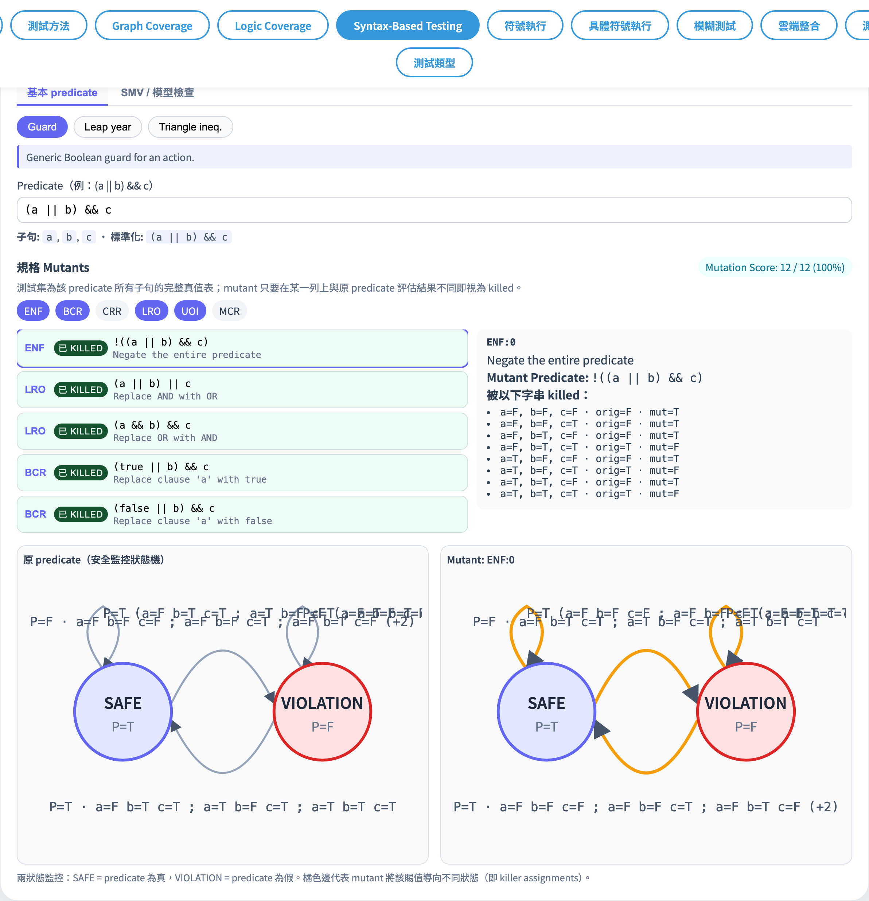
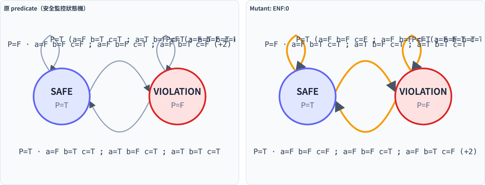
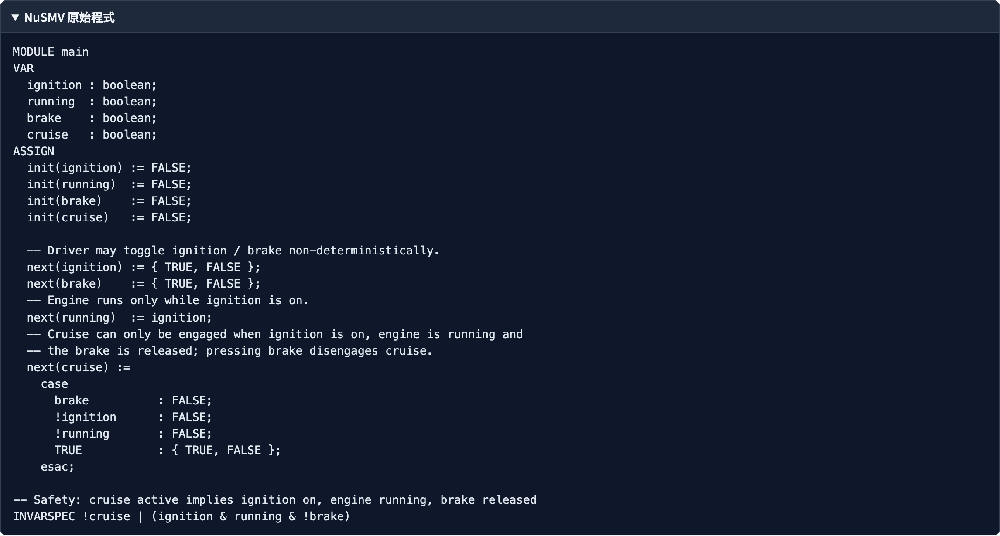

# Specification Mutation
### 對「規格」本身做突變 — 配上 SMV 範例與安全監視 FSM

軟體測試視覺化系列 #8
搭配工具：`/section-syntax → Specification Mutation`（[SpecMutationExplorer](../../src/components/SpecMutationExplorer.js) + [specMutation.js](../../src/utils/specMutation.js) + [specFsm.js](../../src/utils/specFsm.js)）

---

## 三講對照

| # | 突變對象 | Kill 條件 |
| --- | --- | --- |
| #6 Program Mutation | **程式碼** | 任一 test 輸出不同 |
| #7 Grammar/String Mutation | **grammar / 字串** | 語言歸屬翻轉 |
| **#8 Specification Mutation** | **規格 predicate** | 任一 assignment 評估值不同 |

> 觀念支點：把 predicate 視為待測「規格」，看真值表上有沒有 assignment 能區分它與 mutant。

---

## Specification Mutation 是什麼？

**Ammann/Offutt §9.4** — 把 precondition / postcondition / loop invariant 視為布林規格：

```
原 predicate  P  ─┐
                   │ 套用 6 個結構性 mutation operators
                   ▼
                  P′  ──►  在 2^n 個 assignments 上跑
                              │
                              ▼
                  ┌─ ∃ a 使 P(a) ≠ P′(a)  → killed
                  └─ ∀ a P(a) = P′(a)    → equivalent
```

> 與 #6 不同：subject 是 **規格**而不是程式；assignments 取代了「test 集」。

---

## 6 個 Operators

[`SPEC_MUTATION_OPERATORS = ['ENF', 'BCR', 'CRR', 'LRO', 'UOI', 'MCR']`](../../src/utils/specMutation.js)

| Op | 全名 | 動作 |
| --- | --- | --- |
| `ENF` | Expression Negation Failure | 對整個 predicate 取反 |
| `BCR` | Boolean Constant Replacement | 把 clause 換成 `true` 或 `false` |
| `CRR` | Clause Reference Replacement | 把 clause 換成另一個 clause |
| `LRO` | Logical Operator Replacement | `&&` ↔ `\|\|` |
| `UOI` | Unary Operator Insertion | 在 clause 外加 NOT |
| `MCR` | Missing Clause Replacement | 從 `&&` 或 `\|\|` 刪掉一邊 |

> 與 #5 Logic Coverage **共用** `parsePredicate`：語法（`&& \|\| !` + juxtaposition + `+`）完全一致。

---

## 範例分類：basic vs SMV

工具上有兩個 segmented control 分類：

| 分類 | 用途 | 範例 |
| --- | --- | --- |
| `basic` | 教學起手式 | `guard`、`leap`、`triangle` |
| `smv` | 對應真實 SMV 模型 | `smv-mutex`、`smv-cruise`、`smv-sis`、`smv-train`、`smv-elevator`、`smv-garage`、`smv-wiper` |

> SMV 範例附完整 NuSMV 模組原始碼，按 `spec-smv-source` 摺疊區可展開。

---

## SMV 範例對照表

| id | 安全性 | predicate |
| --- | --- | --- |
| `smv-mutex` | 雙程序互斥 | `!(c1 && c2)` |
| `smv-cruise` | 巡航控制 | `!cruise \|\| (ignition && running && !brake)` |
| `smv-sis` | 安全注水（Parnas）| `(si && pressure && !override) \|\| (!si && (!pressure \|\| override))` |
| `smv-train` | 平交道控制 | `!train \|\| (gate && signal)` |
| `smv-elevator` | 電梯門 | `!moving \|\| !door` |
| `smv-garage` | 車庫門控制器 | `(!u \|\| !t) && (!d \|\| !o)` |
| `smv-wiper` | 雨刷控制 | `!w \|\| (i && (l \|\| h))` |

> 7 條皆從 NuSMV `INVARSPEC` 抽出，可在工具裡看原始 SMV 模組。

---

## 範例：`(a || b) && c` 對 6 個 operator

| Op | 一個典型 mutant | killer assignment |
| --- | --- | --- |
| ENF | `!((a \|\| b) && c)` | 任一 P=T 列 |
| BCR | `(true \|\| b) && c` | `a=F b=F c=T` 等 |
| CRR | `(a \|\| a) && c` | 任一 a≠b 且 c=T 列 |
| LRO | `(a && b) && c` | `a=F b=T c=T` |
| UOI | `(a \|\| !b) && c` | b=T 時翻轉 |
| MCR | `a && c` | `a=F b=T c=T` |

> 工具會列出每個位置展開後的全部 mutants（按 operator 分組）。

---

## Kill 演算法

[`evaluateSpecMutants(parsed, mutants, tests)`](../../src/utils/specMutation.js)：

```js
const originalValues = tests.map(t => evaluateAst(parsed.ast, t));
mutants.map(m => {
  const killers = [];
  for (let i = 0; i < tests.length; i++) {
    const mutValue = evaluateAst(m.ast, tests[i]);
    if (mutValue !== originalValues[i])
      killers.push({ test: tests[i], orig: originalValues[i], mut: mutValue });
  }
  return { ...m, killed: killers.length > 0, killers };
});
```

預設 `tests = buildAssignmentSpace(clauses)` → 完整真值表。

---

## Safety Monitor FSM

把 predicate 視為 **memoryless 安全監視器**：

```
       P=T (assignment)
       ┌───────────────┐
       ▼               │
   ┌───────┐         ┌─────────────┐
   │ SAFE  │◄────────┤  VIOLATION  │
   │ P=T   │  P=T    │  P=F        │
   └───┬───┘ assign  └──────▲──────┘
       │ P=F                │
       └─assignment────────┘
                 P=F
```

兩態：
- `SAFE` (P=T) — 規格成立
- `VIOLATION` (P=F) — 規格違反

四條轉移：兩自迴圈 + 兩雙向。

---

## 為什麼是 memoryless？

`buildMonitor(ast, clauses)`：
- 對完整 assignment space（$2^n$）evaluate predicate。
- 結果只分兩桶：`trueSet` / `falseSet`。
- 下個狀態只看新 assignment 的 P 值 → **與起點無關**。

所以教學上四條轉移簡化為：「新 assignment 算出 T → 進 SAFE；算出 F → 進 VIOLATION」。

---

## diff = killer set

[`diffMonitors(origAst, mutAst, clauses)`](../../src/utils/specFsm.js)：

```js
const flipped = [];
for (const a of assignments) {
  if (evaluateAst(origAst, a) !== evaluateAst(mutAst, a))
    flipped.push(a);
}
return flipped;
```

> `flipped` 就是 killer assignments — 雙 FSM 在這些 assignment 上「跑去不同的目標狀態」。
> 工具把這些轉移畫成**橘色虛線**。

---

## 工具：總覽



- 上方 segmented control：`spec-category-row`（basic / smv）。
- 中段：範例按鈕（`data-spec-example`）+ 範例描述（`spec-example-caption`）。
- `spec-text` 是單行 predicate input（即時解析）；下方顯示 clauses 與 canonical 字串。

---

## 工具：mutants 與 score


- 6 個 operator checkbox（預設 ENF / BCR / LRO / UOI）。
- `spec-mutant-list`：mutant 文字 / operator / killed 或 live。
- `spec-mutation-score`：killed / total（%）。
- 點任一 mutant → 右側顯示 killer assignments（如 `a=T b=F c=T`）。

---

## 工具：雙 FSM 並列



- `spec-fsm-grid`：左是原 predicate，右是 selected mutant。
- 兩張各畫 SAFE / VIOLATION 二態 + 四條轉移。
- 轉移標籤格式：`P=T · {assignments}` 或 `N / 2^n assignments`（clauses > 4 時退化）。
- **橘色虛線轉移 = killer**：兩 FSM 在那些 assignment 上的目標狀態不同。

---

## 工具：SMV 原始碼



- 選 `smv` 分類 + 任一範例 → 上方多一個 `spec-smv-source` 摺疊區。
- 顯示完整 NuSMV 模組（MODULE / VAR / ASSIGN / INVARSPEC ...）。
- 教學脈絡：先看 NuSMV invariant → 再看抽成 Boolean predicate 後做 mutation → 對應的 SAFE/VIOLATION FSM。

---

## 持久化

| 儲存 | Key | 內容 |
| --- | --- | --- |
| `localStorage` | `stvisual.specMutation.v1` | `{ category, exampleId, text, operators, ... }` |

行為：
- predicate、operator 集合、選擇的範例與分類都會保存。
- 不同於 Logic Coverage / Mutation Test，**SpecMutation 目前不接 Firestore** — 未來可擴充。

---

## 演算法總覽

| 模組 | 函式 | 用途 |
| --- | --- | --- |
| [`specMutation.js`](../../src/utils/specMutation.js) | `parsePredicate` (re-export from logicCoverage) | 解析 predicate |
| | `generateSpecMutants(parsed, opIds)` | 套 6 個 operator 列舉 mutants |
| | `evaluateSpecMutants(parsed, mutants, tests)` | 計算 killed / killers |
| | `buildAssignmentSpace(clauses)` | 完整真值表 |
| [`specFsm.js`](../../src/utils/specFsm.js) | `buildMonitor(ast, clauses)` | 兩桶分類 trueSet / falseSet |
| | `diffMonitors(origAst, mutAst, clauses)` | 取出 killer set |
| | `renderMonitorSvg(opts)` | 輸出 280×200 SVG |

---

## 與其他章節的關聯

| 連結 | 用途 |
| --- | --- |
| #5 Logic Coverage | 共用 `parsePredicate` / `evaluateAst` — 同樣的 Boolean DSL |
| #6 Program Mutation | 同樣「變壞 → 測試該抓到」心智模型，subject 不同 |
| #4 Data Flow | 無直接關聯（資料流 vs 規格邏輯） |
| Spec §14 / §16 | 完整實作說明 |

> 課程結尾的「合題」：六、七、八三講把 mutation 的 subject 從**程式**走到**規格 / 文法 / 字串**，覆蓋 Ammann/Offutt §9 全章。

---

## 小結

- **6 個 operators**（ENF / BCR / CRR / LRO / UOI / MCR）對 Boolean 規格做結構性突變。
- Kill 用完整 $2^n$ 真值表，無需測試集 — 直接看「哪個 assignment 在 original 與 mutant 評估出不同值」。
- **Safety Monitor FSM** 把 predicate 具象化為兩態自動機，雙 FSM 並列直接看出 killer assignments。
- **7 個 SMV 範例**串起教科書與真實模型檢驗 — 從 cruise control 到車庫門皆有對應。

---

## 課堂練習

1. 開 `(a || b) && c`，只啟用 `MCR`，列出 mutants 與 killer assignments。哪個 mutant 是 equivalent？
2. 切到 `smv-mutex`（`!(c1 && c2)`），對 ENF / LRO 觀察 mutation score 有何差？為什麼 ENF 一定被殺？
3. 雙 FSM 視圖中找一條 killer 轉移：把它對應到真值表的哪一列？並驗證在 original 與 mutant 上預測子值的確不同。
4. 寫一個你自己的 invariant（≤ 4 clauses），全開 6 個 operator，估算「會出現多少 equivalent mutants」並用工具驗證。

---

## 進一步閱讀

- Ammann & Offutt, *Introduction to Software Testing*, Ch. 9.4–9.5（Specification Mutation / SMV）
- NuSMV：<https://nusmv.fbk.eu/> — Symbolic Model Verifier
- 工具實作：
  - [src/utils/specMutation.js](../../src/utils/specMutation.js) — 6 個 operator + 評估
  - [src/utils/specFsm.js](../../src/utils/specFsm.js) — 安全監視 FSM 渲染
  - [src/components/SpecMutationExplorer.js](../../src/components/SpecMutationExplorer.js) — UI（含 SMV 摺疊區、雙 FSM）
- 規格文件 §14 / §16：[docs/Specification.zh-TW.md](../Specification.zh-TW.md)
- 本系列結尾 — 完整課程目錄請見 [docs/slides/](../slides/)
