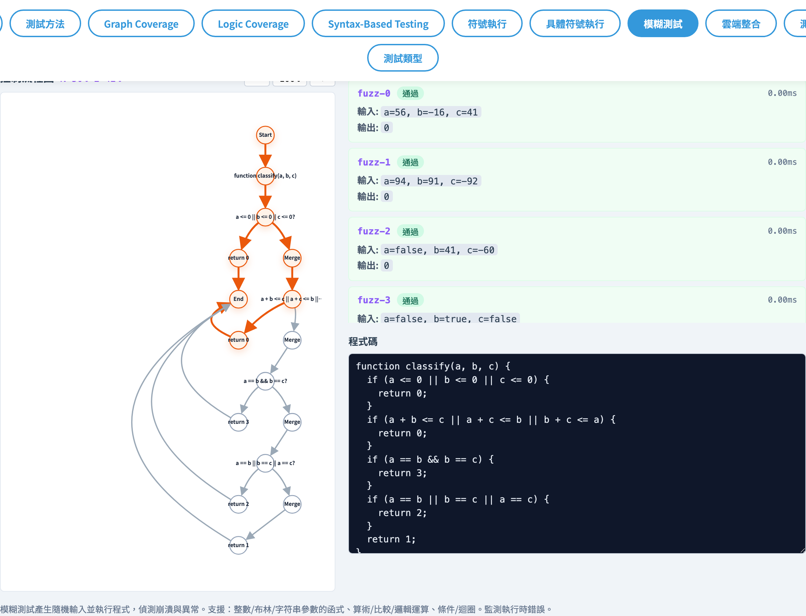
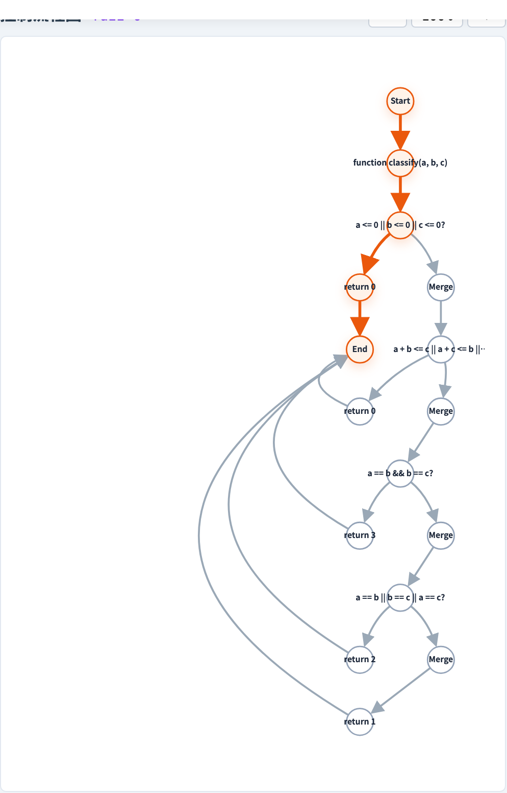

# Fuzz Testing
### 用隨機輸入快速逼出未覆蓋的分支

軟體測試視覺化系列 #9
搭配工具：`/section-fuzz`（[FuzzTestingExplorer](../../src/components/FuzzTestingExplorer.js) + [fuzzTesting.js](../../src/utils/fuzzTesting.js)）

---

## 觀念定位

| 前面的講法 | 本講 |
| --- | --- |
| 我**設計**測試用例（手寫 / coverage 推導） | 我**亂丟**輸入，看 oracle / crash 抓得到什麼 |
| 主動列 requirements（#3–#5） | 被動觀察行為（crash / 分支命中） |
| 對象：靜態結構 | 對象：**程式的執行行為** |

> 觀念支點：**隨機性是最便宜的搜尋方法**。配合分支追蹤就能反映出真實覆蓋。

---

## 何時用 fuzz？

- 早期沒測試集 → 一鍵跑 100 次找 crash
- 補強既有套件 → 抓到「該想到但沒想到」的輸入組合
- Regression smoke：每次 commit 順手跑一次
- 黑盒接口（parser / API）：丟亂數看是否回 crash

> 真實系統的歷史里程碑：AFL、libFuzzer、ClusterFuzz；本工具是教學等級「概念展示」版。

---

## Fuzz 三步驟

```
function f(...) {...}
       │
       ▼ ① generate
input₁, input₂, …, inputₙ
       │
       ▼ ② run（每個 input 各跑一次）
{ output, error, crashed, branches[] }
       │
       ▼ ③ aggregate
node coverage、edge coverage、unique error 列表
```

每筆 testCase 都會帶 `branches`（每個 `if/while` 分支 taken 與否）。

---

## 技術核心：分支 instrumentation

[`fuzzTesting.js → instrumentBranches(body)`](../../src/utils/fuzzTesting.js)：

把 source 裡每個 `if(cond) {...}` 改寫成

```js
if ((__b__.push({ taken: !!(cond) }), __b__[__b__.length-1].taken))
```

`while` 加上 `++__lcN__ <= 10000` 的迭代上限避免無限迴圈。

> 整段函式被 `new Function('__b__', ...paramNames, instrumented)` 包成可呼叫物件。
> 每次 fuzz 跑會傳入新的 `branches=[]` 陣列收集 trace。

---

## 從 trace 到 CFG 覆蓋

每筆 testCase 拿到 `branches[]` 後：

1. 透過 [`programToGraph.generateControlFlowGraphFromProgram`](../../src/utils/programToGraph.js) 把同一段 source 轉成 CFG。
2. [`pathToCfg.mapBranchesToCfg(cfg, branches)`](../../src/utils/pathToCfg.js) 把 trace 對應回 CFG 的 nodes / edges。
3. 將所有 testCases 的 nodes/edges 取聯集 → 即時計算 `N%`（node coverage）與 `E%`（edge coverage）。

> 點選任一 testCase → CFG 高亮**該次執行**走過的節點與邊。

---

## 內建 6 個範例

| id | 函式 | 重點 |
| --- | --- | --- |
| `triangle-classifier` | `classify(a, b, c)` | 經典多分支 |
| `gcd-function` | `gcd(a, b)` | while 迴圈 |
| `absolute-value` | `abs(x)` | 最小範例 |
| `quadratic-formula` | 二次方程式 | 算術 + 分支 |
| `array-sum` | 加總 | 簡單線性 |
| `max-value` | `max3(...)` | 嵌套 if |

> 6 個都是純整數 / 布林輸入 — 避免字串造成 NaN-based 無限迴圈。

---

## 工具：總覽



- 上方範例列：`fuzz-example-{id}`。
- `fuzz-source` 是程式碼編輯器；`fuzz-test-count-input` 可設 1–200。
- `fuzz-run-btn` 觸發一次 fuzz；`fuzz-summary` 顯示 tests / passed / crashes。
- 右上 `fuzz-node-cov` / `fuzz-edge-cov` 是 N% / E% 即時 badge。

---

## 工具：testCases 與 CFG



- 中段 `fuzz-cfg` 同時顯示 CFG，受 `fuzz-cfg-zoom-{in,out,reset}` 控制縮放。
- 下方 `fuzz-cases` 列表 — 每個 `fuzz-case-{id}` 顯示 input、output、是否 crash。
- 點某筆 testCase → 該次的 path 在 CFG 上加深色標示。
- `fuzz-cfg-selected` 顯示目前選中的 testCase id。

---

## 工具：crash 偵測

每筆 testCase 若拋例外：
- `crashed = true`、`error` 是錯誤訊息字串。
- 工具會把 `crashes` 計數器標紅（`highlight-crash` class）。
- `uniqueErrors: Map<message, count>` — 同樣的錯訊只記一次（便於 triage）。

> Triangle Classifier 在 `a + b <= c` 不檢查整數溢位 → 對大數很容易 crash，是教學常用的「找 bug」範例。

---

## 隨機輸入策略

[`generateRandomValue`](../../src/utils/fuzzTesting.js)：

```js
if (Math.random() < 0.7) {
  return integer in [-100, 100];
}
return boolean;
```

- 70% 整數 / 30% 布林。
- 整數範圍 `MAX_INT_VALUE = 100`。
- **不產字串** — 否則 `a + b` 變字串串接 → 條件永真 → while 進入無限迴圈。

> 教學側重「分支搜尋」而非「邊界值精準」 — 用 BVA 配合即可彌補。

---

## Fuzz 的本質限制

1. **沒有方向性**：純隨機，可能千百次都打不到深層分支。
2. **沒有形變（grammar-aware fuzz）**：本工具只丟原子值，不會生 JSON / SQL。
3. **覆蓋上限**：當分支條件太精確（`a == 12345`），隨機幾乎不可能命中。
4. **沒有持久學習**：每次重跑都從零開始，不像 AFL/libFuzzer 有 corpus minimization。

> 這是 fuzz 的「天花板」— 後面 #10/#11 講的 symbex/concolic 就是補這四個短板。

---

## 常見陷阱

- **NaN 無限迴圈**：本工具刻意排除字串避免；但若你上傳 source，記得自己防護。
- **`MAX_LOOP_ITERATIONS = 10000`**：上限被觸發 → 看似 crash，但其實是 instrumentation 護欄。
- **`branches[]` 空陣列**：表示函式沒有 if/while → 任何 testCase 走的都是同一條路徑。
- **CFG mapping 失敗**：source 含工具 parser 不支援的語法（try/catch、destructuring）→ CFG 為空，覆蓋率算不出來。

---

## 演算法窺探

```js
function fuzzTest(sourceCode, maxTests) {
  const parsed = parseFunctionSignature(sourceCode);  // 注入 __b__
  for (let i = 0; i < maxTests; i++) {
    const args = paramNames.map(generateRandomValue);
    const branches = [];
    try {
      output = parsed.func(branches, ...args);
    } catch (err) { crashed = true; ... }
    testCases.push({ input, output, error, crashed, branches });
  }
  return { totalTests, passedTests, crashes, testCases, uniqueErrors };
}
```

> 簡單到單頁可讀完 — 但已能展示業界 fuzzer 的核心心智。

---

## 小結

- Fuzz testing = **隨機輸入 + 行為觀察 + 覆蓋聚合**。
- 工具用 source-level **instrumentation** 取 trace，再透過 CFG mapping 算 node/edge coverage。
- 6 個內建範例覆蓋常見分支型態；可即時改 source / test count 重算。
- 是現代測試的「第一道防線」— 但有方向性、無形變、精確命中三大短板。

---

## 課堂練習

1. 開 `triangle-classifier`，把 `fuzz-test-count-input` 設為 10, 50, 200。觀察 N% / E% 達到 100% 需要幾次？
2. 切到 `gcd-function`，把 `fuzz-cases` 排序找出**最慢**的一筆（`duration` 最大）。為什麼那個輸入比較慢？
3. 自寫一個有 4 層巢狀 if 的函式，估算純隨機能達到的最大 edge coverage。
4. 哪個範例在 200 次中最容易出現 crash？crash 都集中在哪個 error message？

---

## 進一步閱讀

- Miller et al., *An Empirical Study of the Reliability of UNIX Utilities*（1990）— fuzzing 元祖
- AFL: <https://lcamtuf.coredump.cx/afl/>
- libFuzzer: <https://llvm.org/docs/LibFuzzer.html>
- 工具實作：
  - [src/utils/fuzzTesting.js](../../src/utils/fuzzTesting.js) — 192 行 instrumentation + runner
  - [src/utils/pathToCfg.js](../../src/utils/pathToCfg.js) — branches → CFG mapping
  - [src/components/FuzzTestingExplorer.js](../../src/components/FuzzTestingExplorer.js) — UI
- 下一講 → **#10 Symbolic Execution**（沒方向 → 用 path condition 做精準搜尋）
