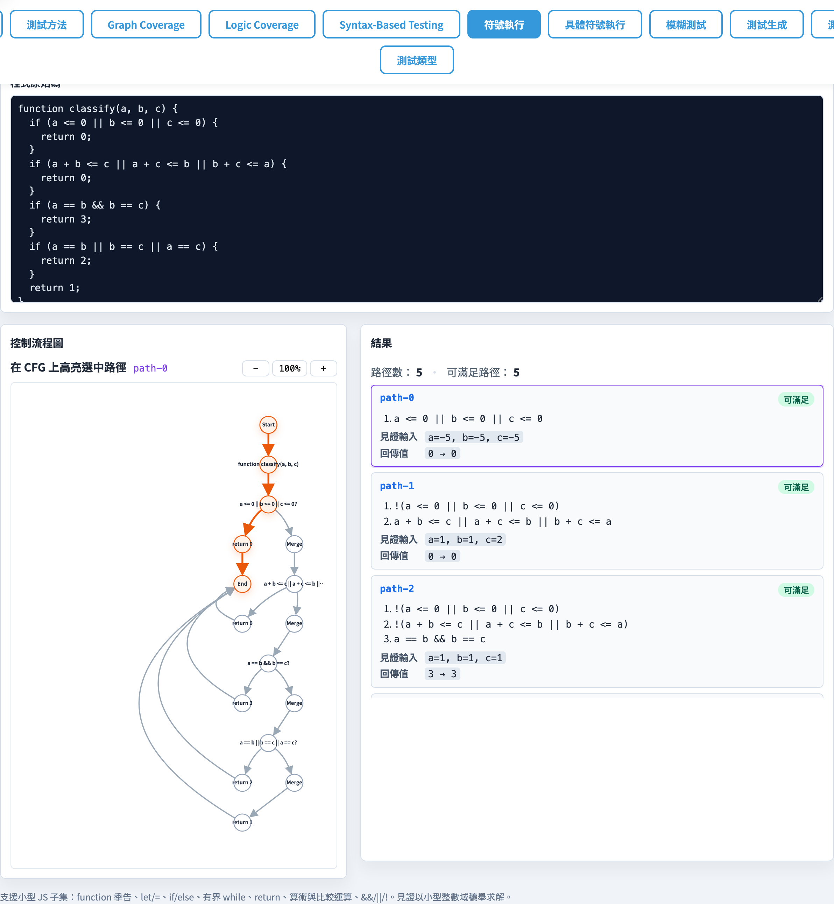
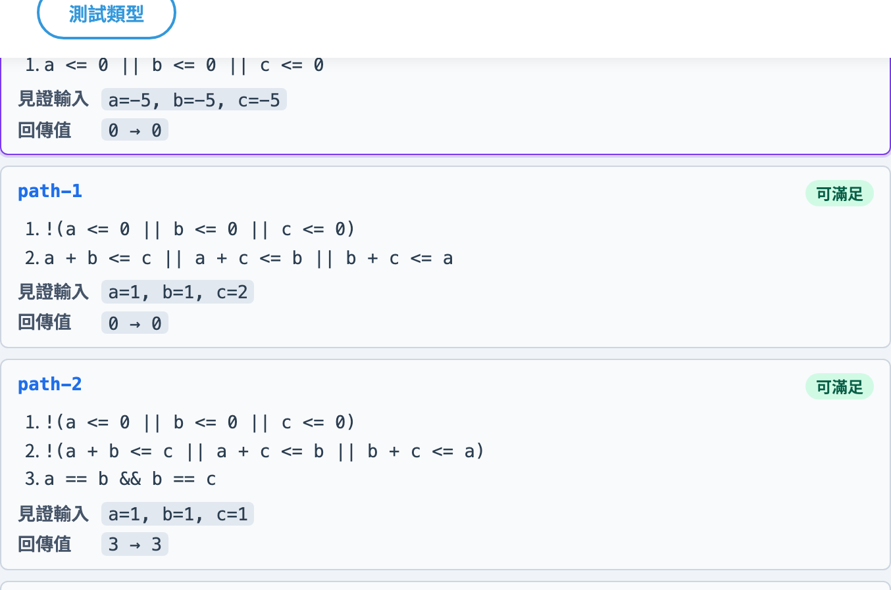
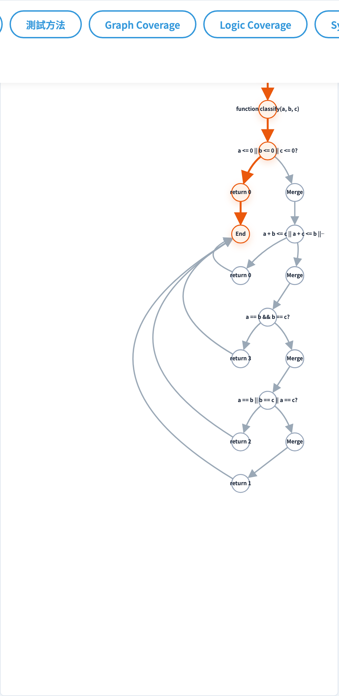

# Symbolic Execution
### 把「跑程式」變成「解條件」

軟體測試視覺化系列 #10
搭配工具：`/section-symbex`（[SymbolicExecutionExplorer](../../src/components/SymbolicExecutionExplorer.js) + [symbolicExecution.js](../../src/utils/symbolicExecution.js)）

<!-- Symbolic execution 是本系列最「數學」的方法：把程式輸入當作符號，用約束求解器找到覆蓋每條路徑的具體輸入。 -->
---

## 從 fuzz 走到 symbex

| #9 Fuzz Testing | #10 Symbolic Execution |
| --- | --- |
| 亂丟具體輸入 | 把輸入變成**符號**（`a`, `b`, `c`） |
| 走到哪算哪 | **列舉所有路徑** + 為每條路徑解可行輸入 |
| 沒方向性 | 用 **path condition** 引導搜尋 |
| 找 crash 容易、找深層分支困難 | 找深層分支容易，但路徑爆炸 |

> 觀念支點：**把分支條件視為待解的方程式**。

<!-- Fuzz 是「盲目嘗試」，symbex 是「有系統地分析」。Symbex 能保證找到每條可達路徑的輸入（如果可解）。 -->
---

## 三件事：env / pc / branches

每條路徑都是一個 3-tuple：

| 元件 | 內容 |
| --- | --- |
| `env` | `{ varName → symbolic expr }`（已替換成參數的多項式） |
| `pc` | 累積的 path condition：`[cond₁, cond₂, ...]`（一連串布林 AST）|
| `branches` | UI 用的紀錄：每個分支的 line 與 taken |

> 想像「踩著影子走 CFG」：踩到 if 就分叉成兩條，各自把條件加進 pc。

<!-- 執行狀態 = 環境（變數符號值）+ 路徑條件（走到這裡的約束）+ 分支 trace（走過哪些分支）。 -->
---

## fork 機制

```
            if (cond)
               │
               ▼
        ┌────────────┐
        │            │
        ▼            ▼
   pc += cond    pc += !cond
   走 then       走 else
```

兩條繼續往下走，各自最後 hit `return` 時 → **完成一條路徑**。

> while 迴圈用 `maxLoopUnroll` 限制展開次數（預設 3）— 每次都 fork 出「進迴圈」與「離開」兩條。

<!-- 每遇到一個條件分支，symbex 「分叉」成兩個執行狀態（true 和 false 兩條路）。這就是路徑爆炸的根源。 -->
---

## 找 witness：bounded brute-force

每條完成的路徑都有 `pc = [c₁, c₂, ...]`：

[`findWitness(pc, params, domain)`](../../src/utils/symbolicExecution.js)：

```js
for (const value combination of domain^|params|) {
  if (all pc[i] eval to true) return witness;
}
return null;
```

- `searchDomain` 預設 `[-5, 12]`（18 個值），3 參數 → 18³ = 5832 組合。
- 找不到 → `feasible: false`（infeasible path）。

> 不用 SMT solver — 教學等級夠用，學生秒懂。

<!-- 工具用有界的暴力搜尋（[-10, 10] 整數格點）找滿足路徑條件的具體值。真實 symbex 用 SMT solver（如 Z3）。 -->
---

## 為什麼 infeasible path 重要？

```js
if (x > 0) {
  if (x < 0) {     ← infeasible
    return crash;
  }
}
```

- 純結構性 coverage（#3）會說「兩個 if 都有 then/else」是 4 條路徑。
- Symbex **解 pc** 才會發現第二個 then **不可達**。
- 工具用紅色標示 `feasible: false` 的路徑 — 學生直接看到「死代碼」。

<!-- 如果一條路徑的約束不可滿足（infeasible），就代表不存在測試案例能走這條路——這本身就是重要的測試資訊。 -->
---

## 內建 4 個範例

| id | 函式 | 教學重點 |
| --- | --- | --- |
| `triangle` | 三角形分類 | 多分支 + 短路 |
| `max3` | 三數最大 | 序列 if + 變數重新賦值 |
| `abs` | 絕對值 | 最小（2 條路徑） |
| `gcd` | GCD（while）| 迴圈展開 + path explosion |

> `abs` 適合第一次接觸；`gcd` 適合展示「為什麼 max-unroll 必要」。

<!-- 四個範例覆蓋：簡單條件、多分支、巢狀條件、帶等式約束的路徑。 -->
---

## 工具：總覽



- 範例 chips：`symbex-example-{id}`。
- `symbex-source` 是程式碼編輯器；`symbex-max-unroll` 設定 while 展開上限（預設 3）。
- `symbex-summary` 顯示總路徑數、feasible 數、truncated 與否。

<!-- 左側輸入程式碼，右側是路徑列表（每條路徑有路徑條件、witness、是否 infeasible）。 -->
---

## 工具：路徑列表



- 每條路徑：`symbex-{path-id}`，列出 pc、return expression、witness 與具體執行結果。
- Feasible 綠、infeasible 灰；點任一條 → CFG 同步高亮對應 nodes。
- `symbex-feasible-count` 顯示「可解」的路徑數 — 比 `total` 小代表程式有 dead branch。

<!-- 每個路徑項顯示：路徑條件（數學式）、具體 witness（x=1, y=-3）、執行結果。點擊路徑高亮 CFG。 -->
---

## 工具：CFG 路徑高亮



- 中段 `symbex-cfg` 是和 #3 / #9 共用的 CFG 引擎。
- 點某條路徑 → 該路徑走過的節點與邊變色，從 start 一路畫到 return。
- `symbex-cfg-zoom-{in,out,reset}` 控制縮放（適合 `gcd` 這種展開後節點多的圖）。

<!-- 點擊路徑項，CFG 會用紫色高亮對應的 node 和 edge 序列。讓學生確認路徑條件和 CFG 路徑一致。 -->
---

## Path explosion

```
for (let i=0; i<n; i++)         ← n 次迴圈
  if (cond1) ...                ← 2 路
  if (cond2) ...                ← 2 路
```

純走法路徑數 = `2^(2n)` — 指數爆炸。

工具的對應措施：
1. `maxLoopUnroll`（預設 3）→ 每個 while 上限 3 次展開。
2. `maxPaths`（預設 64）→ 整體上限，超過 `truncated: true`。
3. UI 提示「結果可能不完整」。

<!-- 指數級的路徑數是 symbex 最大的挑戰。工具用深度限制（max paths）避免爆炸，但真實系統需要更複雜的策略。 -->
---

## 演算法窺探

[`symbolicExecute(sourceCode, options)`](../../src/utils/symbolicExecution.js)：

```js
1. parse(sourceCode)              → AST
2. walk(stmts, idx, env, pc, branches)
   - let / assign     → env[x] = substitute(value, env)
   - if               → fork: walk(then, pc+cond) + walk(else, pc+!cond)
   - while            → unroll up to maxLoopUnroll
   - return           → record(env, pc, branches, retExpr)
3. record() 對每條路徑呼叫 findWitness(pc) 求 concrete input
4. 回傳 { function, paths, truncated }
```

> ≈ 570 行純 JS — 含 tokenizer、parser、評估器、求解器。

<!-- 工具用遞迴 DFS 展開 AST，在每個條件分支點克隆執行狀態，累積路徑條件，最後求解。 -->
---

## 真實 symbex 系統的差異

| 維度 | 本工具 | KLEE / Angr / Triton |
| --- | --- | --- |
| 求解器 | 暴力枚舉 ±5–12 整數 | SMT (Z3, STP) |
| 支援型別 | 整數 + 布林 | 整數、浮點、bit-vector、array、string |
| 路徑探索 | DFS + maxPaths | DFS / BFS / coverage-guided |
| 外部呼叫 | 不支援 | 提供 model (libc 等) |
| 用途 | 教學 | 安全分析、自動測試生成 |

> 工具是「教科書描寫的最小版」— 換成 KLEE 後概念完全相同。

<!-- 真實系統（KLEE、Angr、S2E）用 Z3/Boolector 等 SMT solver，能處理整數、字元、指標等複雜約束。 -->
---

## 小結

- Symbex = **把輸入符號化 + 在 CFG 上 fork + 解 pc 求 witness**。
- 每條路徑都帶 `env / pc / branches` 三件套，UI 用 CFG 視覺化。
- 工具用暴力枚舉求 witness（不依賴 SMT），適合教學；真實系統用 Z3 等 solver。
- **path explosion** 是符號執行的核心挑戰 — `maxLoopUnroll` + `maxPaths` 是教學等級的因應。

<!-- Symbex 系統地覆蓋所有可達路徑，但受制於路徑爆炸。Concolic（#11）是在 fuzz 基礎上加入 symbex 的混合策略。 -->
---

## 課堂練習

1. 開 `triangle`，看路徑總數 / feasible 數。差幾條？哪幾條是 infeasible？為什麼？
2. `gcd` 範例把 `symbex-max-unroll` 從 3 改成 1 → feasible 路徑數會怎變？再改成 5？
3. 自寫含 `if (a + b == 7)` 的函式，witness 求解時間是否變慢？把 domain 改大會怎樣（這個工具預設 fix domain）？
4. 為什麼 `abs` 一定只有 2 條 feasible 路徑？是否能改寫成 3 條？

<!-- 練習 1（手動追蹤路徑條件）最重要。練習 3（infeasible 路徑）適合有代數基礎的學生。 -->
---

## 進一步閱讀

- King, J.C., *Symbolic Execution and Program Testing*（CACM, 1976）— 開山之作
- Cadar et al., *KLEE: Unassisted and Automatic Generation of High-Coverage Tests*（OSDI 2008）
- Baldoni et al., *A Survey of Symbolic Execution Techniques*（2018）
- 工具實作：
  - [src/utils/symbolicExecution.js](../../src/utils/symbolicExecution.js) — 570 行 self-contained engine
  - [src/components/SymbolicExecutionExplorer.js](../../src/components/SymbolicExecutionExplorer.js) — UI
- 下一講 → **#11 Concolic Execution**（concrete + symbolic = DART/CUTE）

<!-- KLEE 是最著名的 symbex 工具。EXE 是 KLEE 的前身，A&O §13 有詳細介紹。 -->
