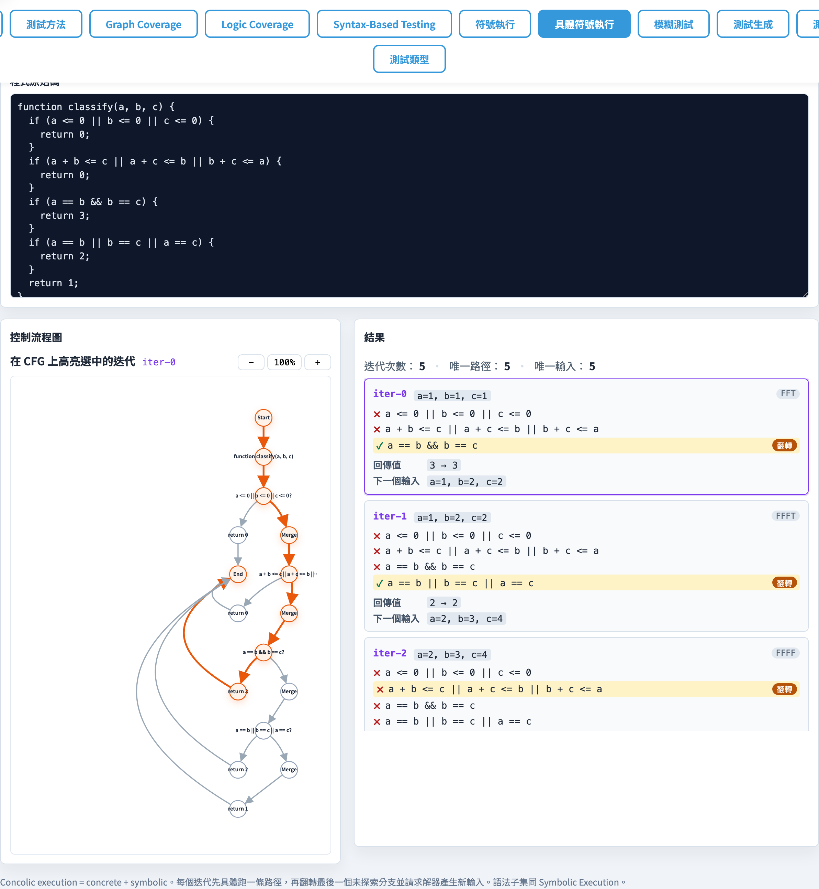
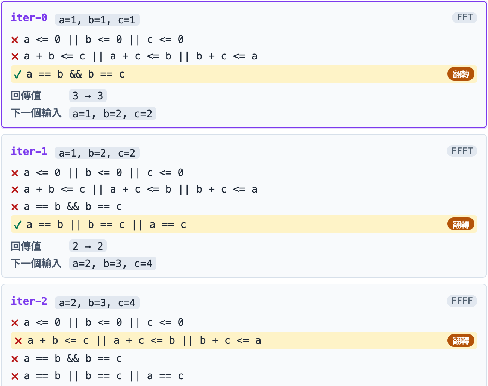
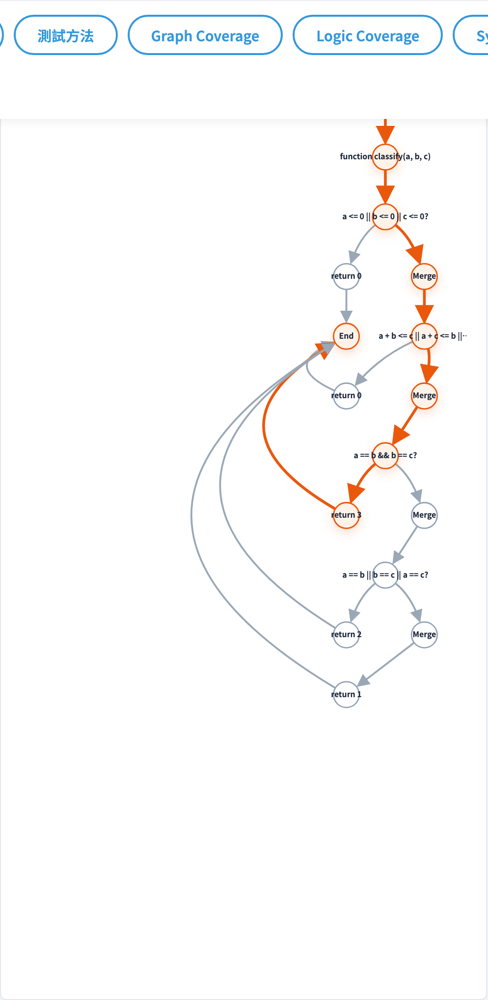

# Concolic Execution
### 具體 + 符號 — DART/CUTE 的工程平衡點

軟體測試視覺化系列 #11
搭配工具：`/section-concolic`（[ConcolicExecutionExplorer](../../src/components/ConcolicExecutionExplorer.js) + [concolicExecution.js](../../src/utils/concolicExecution.js)）

<!-- Concolic = concrete + symbolic。核心想法：用具體值執行，同時追蹤符號路徑條件，再翻轉條件找新路徑。 -->
---

## 三講對照：fuzz → symbex → concolic

| 維度 | #9 Fuzz | #10 Symbex | **#11 Concolic** |
| --- | --- | --- | --- |
| 輸入產生 | 隨機 | 解 path condition | 具體跑 + 翻分支求下一個 |
| 程式執行 | 具體 | 完全符號（沒真跑）| **具體**（真跑）+ 旁邊符號追蹤 |
| 覆蓋方向性 | 無 | 有（但會路徑爆炸）| 有（但**遵循實際 trace**）|
| 真實系統 | AFL | KLEE | DART, CUTE, jCUTE |

> Concolic 是兩者的工程妥協 — 拿到 symbex 的方向性、保留具體執行的可靠性。

<!-- Fuzz 最快但盲目；Symbex 系統但慢；Concolic 折衷：從具體執行開始，用 symbex 引導下一個輸入。 -->
---

## 名字由來

**Concolic = Concrete + Symbolic**

- Godefroid et al., *DART: Directed Automated Random Testing*（PLDI 2005）
- Sen et al., *CUTE: A Concolic Unit Testing Engine for C*（FSE 2005）

> 兩篇同年提出本質相同的方法 — 從此 concolic 成為 dynamic symbolic execution 的代名詞。

<!-- Concolic = concurrent symbolic + concrete。DART（2005）是最早提出這個名詞的論文，值得一提。 -->
---

## 核心 4 步驟（每次迭代）

```
   inputs  ── ① concrete run ──►  trace = [(cond, taken)*]
                                       │
                                       ▼ ② record symbolic conditions
                                  pc = [c₀, c₁, …, cₙ]
                                       │
                                       ▼ ③ 從後往前找未走過的分支
                                  flip c_i:  prefix(c) ∧ ¬c_i
                                       │
                                       ▼ ④ findWitness 求新 input
                                  nextInput → 下一輪
```

每輪都跑一次真實程式 → trace 一定是「實際走過」的路徑。

<!-- 每次迭代：執行 → 收集路徑條件 → 翻轉最後未探索的分支 → 求解新輸入。這四步驟是整個算法的心臟。 -->
---

## 「翻轉最後未探索分支」

```
trace:  c₀=T, c₁=F, c₂=T

  candidate path 1:  c₀ ∧ c₁ ∧ ¬c₂      ← 試這個
  candidate path 2:  c₀ ∧ ¬c₁           ← 退一步
  candidate path 3:  ¬c₀                ← 再退
```

從後往前掃 — 若 `prefix + ¬c_i` 對應的路徑 key 未見過，且 `findWitness` 成功 → 採用。

> 結果：每次迭代都「向前推進一條未走過的路徑」，自然構成 BFS 風格的 path 探索。

<!-- 「翻轉」的意思是：把路徑條件的最後一個約束取反（negation），然後求解。這保證下一次走不同的分支。 -->
---

## 與 symbex 的關鍵差異

| 維度 | symbex | concolic |
| --- | --- | --- |
| 觸發 fork | 在符號層 fork（兩條都走）| **不 fork** — 只跑具體那一邊 |
| 處理 unknown 行為 | 卡住（無法解析）| 用具體值繞過 |
| while 迴圈 | `maxLoopUnroll` 強制截斷 | 跟著具體 trace 自然停 |
| 路徑數量 | 指數爆炸 | 線性（每次 +1 條） |

> Concolic 把「探索」變成可控的 iteration loop — 工程上更接近單元測試。

<!-- Symbex 同時追蹤所有路徑（指數級空間）；Concolic 一次走一條路徑（線性空間），逐步探索。 -->
---

## 內建 4 個範例

| id | 種子（seed） | 教學重點 |
| --- | --- | --- |
| `triangle` | `a=1, b=1, c=1` | 從等邊三角形出發、翻分支探索其他三角形類型 |
| `abs` | `x=0` | 最小範例：1 步翻成 `x<0` 對偶輸入 |
| `max3` | `a=0, b=0, c=0` | 雙分支結構：4 組真假組合 |
| `middle` | `a=0, b=0, c=0` | DART 經典 benchmark（3 數中位數）|

> 每個 example 都附 `seed`，UI 在 `concolic-seed` 文字輸入框顯示初始輸入。

<!-- 四個範例和 symbex 相同，方便學生對比兩種方法找到 witness 的過程有何不同。 -->
---

## 工具：總覽 + 設定



- `concolic-example-{id}` 範例 chips；`concolic-source` 是程式碼編輯器。
- `concolic-seed` 設初始 input（格式 `a=1, b=2, ...`）；`concolic-max-iter` 設迭代上限（預設 16）。
- `concolic-summary`：總迭代數、unique paths、unique inputs。

<!-- 工具的「Seed Input」讓學生控制起點；「Max Iterations」控制探索深度。建議先用小迭代數觀察行為。 -->
---

## 工具：迭代列表



- `concolic-iters` 是有序列表：每筆 `concolic-{iter-id}` 顯示
  - 第幾輪、本輪 input、走過的 branches（含 line + symbolic condition）。
  - `negatedAt` 標出**這次翻轉**的分支 index。
  - `nextInput`：自動推導出的下一輪輸入。
- 點某筆 → CFG 高亮該輪走過的路徑。

<!-- 每個迭代項顯示：具體輸入、路徑條件、執行結果、哪個分支被翻轉。 -->
---

## 工具：CFG 同步高亮



- `concolic-cfg` 與 #3 / #9 / #10 共用 CFG 引擎。
- 不同輪走的路徑可在 UI 切換查看 — 直觀感受「逐步推進」的探索行為。
- `concolic-cfg-selected` 顯示目前對應的 iteration id。

<!-- 工具在點擊迭代項時，CFG 同步高亮該次迭代走過的路徑，讓學生追蹤探索的進程。 -->
---

## 演算法窺探

[`concolicExecute(sourceCode, options)`](../../src/utils/concolicExecution.js)：

```js
worklist = [seed]
while (worklist.length && iterations < maxIterations) {
  inputs = worklist.shift();
  trace = runConcolicOnce(fn, inputs);  // 跑一次具體 + 旁邊記符號
  for (i = trace.branches.length - 1; i >= 0; i--) {
    constraint = prefix(i) ∧ ¬trace.branches[i].symbolic;
    if (already seen path key) continue;
    witness = findWitness(constraint, params, domain);
    if (witness) { worklist.push(witness); break; }
  }
}
```

> 約 240 行：parser 重用 [symbolicExecution.js](../../src/utils/symbolicExecution.js)，只新寫 concrete runner + flip loop。

<!-- 工具用 AST 解釋器同時維護具體值（concrete）和符號表達式（symbolic），在分支點記錄兩者。 -->
---

## 路徑收斂

對固定 `maxIterations`，concolic 會：
1. 探完所有「能用 ±5–12 整數命中」的路徑後 → 自然停。
2. 若 `searchDomain` 太小、有些路徑解不出 → `truncated: false` 但 path coverage 不滿。
3. `uniquePathCount` / `uniqueInputCount` 提供整體進度感。

> 與 #10 symbex 不同：concolic 不會 enumerate 不可達路徑 — 因為每條路徑都是「跑過的事實」。

<!-- Concolic 不保證找到所有路徑（受限於迭代數），但能用有限步驟探索大量路徑，比純 fuzz 更有系統。 -->
---

## 真實系統與本工具

| 工具 | 對象 | 求解器 |
| --- | --- | --- |
| **本工具** | 自製小 JS 子集 | bounded brute-force |
| DART | C | Stanford SVC |
| CUTE | C | lp_solve |
| jCUTE | Java | Yices |
| KLEE-NUSE / SymJEx | LLVM IR / JS | Z3 |
| SAGE (Microsoft) | x86 binaries | Z3 |

> Microsoft SAGE 找出 1/3 的 Windows 7 解析器 bug — concolic 是工業界的 mainstream。

<!-- 真實系統（SAGE、DrChecker）用 Z3 求解約束，能處理字元、記憶體位址等複雜類型。本工具用整數暴力搜尋簡化示範。 -->
---

## 小結

- Concolic 把 symbex 的「全 symbolic fork」換成「**具體跑一次、翻最後一個分支**」。
- 4 步迭代：concrete run → record → flip → new input。
- 每輪 +1 條路徑，自然避開路徑爆炸；保留具體執行的可靠性。
- 工具與 #10 symbex **共用 parser + solver** — 直接對比兩種搜尋策略。

<!-- Concolic 是 fuzz + symbex 的最佳折衷：從具體執行出發，用符號分析引導下一步，避免路徑爆炸。 -->
---

## 課堂練習

1. 開 `triangle` 範例，看 16 次迭代後 unique path 數。比 #10 symbex 的 feasible 路徑數差多少？
2. 把 `abs` 的 `concolic-max-iter` 設 1 → 應該還是探到兩條路徑；為什麼？
3. `middle` 範例的 8 條真假組合中，concolic 順序是 BFS 還是 DFS？
4. 若把 `seed` 改成不合法輸入（如 `a=-1, b=-1, c=-1`），對 triangle 的探索順序有何影響？

<!-- 練習 1（追蹤迭代）是最核心的理解練習。練習 3（比較與 fuzz 的差異）適合最後的討論。 -->
---

## 進一步閱讀

- Godefroid, Klarlund, Sen, *DART: Directed Automated Random Testing*（PLDI 2005）
- Sen, Marinov, Agha, *CUTE: A Concolic Unit Testing Engine for C*（FSE 2005）
- Cadar & Sen, *Symbolic Execution for Software Testing: Three Decades Later*（CACM 2013）
- 工具實作：
  - [src/utils/concolicExecution.js](../../src/utils/concolicExecution.js) — 240 行 concrete runner + flip loop
  - 共用 [src/utils/symbolicExecution.js](../../src/utils/symbolicExecution.js) — parser、substitute、negate、findWitness
  - [src/components/ConcolicExecutionExplorer.js](../../src/components/ConcolicExecutionExplorer.js) — UI
- 系列終結 — 完整課程目錄請見 [docs/slides/index.zh-TW.md](index.zh-TW.md)

<!-- DART 論文（Godefroid 等，2005）是 concolic 的開山之作。SAGE 是 Microsoft 用於 Windows fuzzing 的 concolic 工具。 -->
