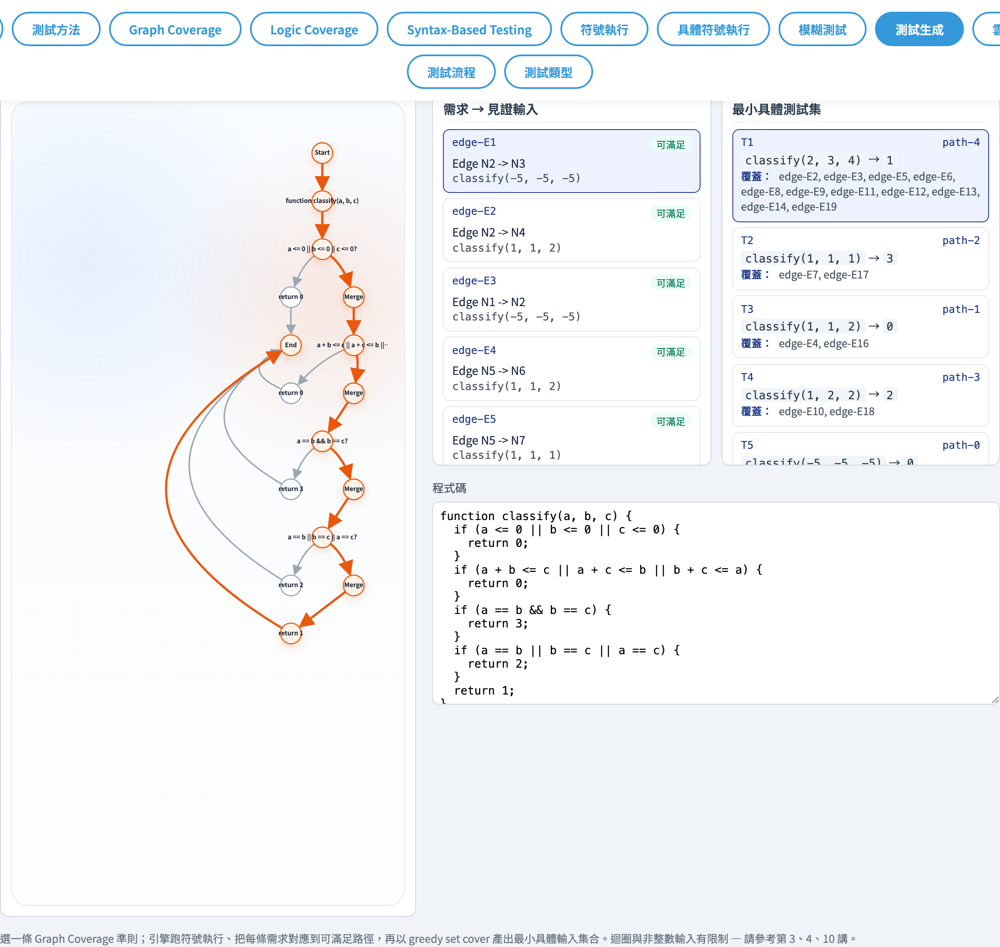
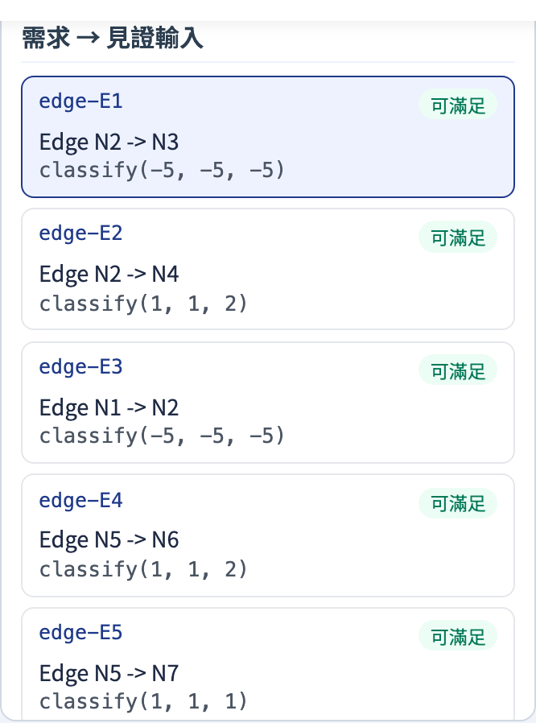
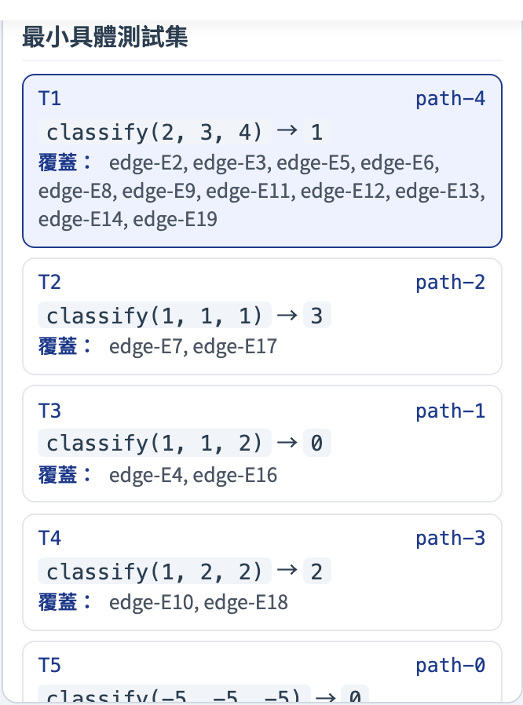
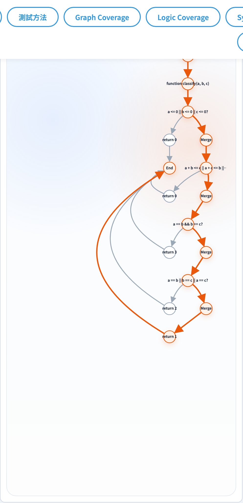

# Test Generation from Coverage
### Let Coverage Requirements Generate Their Own Test Cases

Software Testing Visualization Series #12
Tool: `/section-testgen` ([TestGenerationExplorer](../../src/components/TestGenerationExplorer.js) + [testGeneration.js](../../src/utils/testGeneration.js))

---

## Where This Lecture Fits

```
#3 Graph Coverage   ──► enumerate requirements (node / edge / prime-path / …)
#4 Data Flow Cov.   ──► enumerate du-pair requirements (all-defs / all-uses / all-du-paths)
#10 Symbolic Exec.  ──► solve path conditions for witnesses (concrete inputs)
                             ↓
#12 Test Generation ──► requirements + witnesses → minimal test set
```

> This lecture is the **bridge** between #3/#4 and #10:
> starting from **abstract structural requirements**, it automatically derives the **minimum number of concrete inputs** that collectively cover all feasible requirements.

---

## Problem Definition

Given:
- A JavaScript function (source code)
- A coverage criterion (node / edge / prime-path / all-defs / …)

Find:
1. All abstract **coverage requirements** (nodes, edges, du-pairs, …)
2. Whether each requirement is **feasible** (symbolic execution finds no witness → infeasible)
3. A **minimal test set**: every feasible requirement is covered by at least one test

> Equivalent to **greedy set cover** over feasible requirements.

---

## The Computation Pipeline

```
sourceCode
    │
    ▼ programToGraph()
  CFG / DFG
    │
    ▼ getCoverageRequirements(criterion)
  requirements[ ]
    │
    ▼ symbolicExecute() → witnessedPaths[ ]
    │       (each feasible path carries a witness + branch trace)
    ▼ mapBranchesToCfg()
  cfgNodes / cfgEdges per path
    │
    ▼ requirementCoveredByRecord() × each requirement × each path
  requirementCoverage[ ]   (feasible / infeasible + representativeWitness)
    │
    ▼ greedy set cover
  selectedTests[ ]   ← minimal test set
```

---

## Key Modules

| Module | Role | Origin |
| --- | --- | --- |
| `programToGraph.js` | JS → CFG/DFG | built in #3/#4 |
| `getCoverageRequirements` | enumerate requirements | from `graphCoverage.js` |
| `symbolicExecute` | path condition + witness | from `symbolicExecution.js` |
| `mapBranchesToCfg` | branch trace → CFG node/edge IDs | from `pathToCfg.js` |
| `requirementCoveredByRecord` | test whether a path covers a requirement | from `graphCoverage.js` (newly exported) |
| `testGeneration.js` | chains all five steps + greedy cover | **new in this lecture** |

---

## Greedy Set Cover

```
input:  feasiblePaths P, requirements R
output: minimal T ⊆ P

T = ∅
while R is not empty:
  p* = argmax_{p ∈ P} |{ r ∈ R : p covers r }|
       (tie-break: pick the path with the smallest |witness| values
        → easier inputs are easier to read in a teaching context)
  T = T ∪ { p* }
  R = R − { r : p* covers r }
```

> Not guaranteed optimal (the decision problem is NP-hard), but greedy is near-optimal in practice for typical functions and is easy to explain.

---

## 8 Coverage Criteria

| Criterion | Family | Requirement Shape |
| --- | --- | --- |
| Node Coverage | Structural | each CFG node |
| Edge Coverage | Structural | each CFG edge |
| Edge-Pair Coverage | Structural | every consecutive pair of edges |
| Prime Path Coverage | Structural | all maximal simple paths |
| Complete Path Coverage | Structural | all finite paths |
| All-Defs | Data Flow | (var, def-node) |
| All-Uses | Data Flow | (var, def-node, use-node) |
| All-DU-Paths | Data Flow | (var, simple def→use path) |

---

## Tool: Overview



- Top bar: example chips (shared with #10/#11) + criterion drop-down
- Left pane: interactive CFG (highlights change when you select a requirement or test)
- Right pane: Requirements card + Minimal Tests card

---

## Tool: Requirements Card



- Each row shows: requirement id, feasible/infeasible badge, representative witness (concrete call)
- Click a row → CFG highlights the corresponding nodes/edges

---

## Tool: Minimal Tests Card



- Each row shows: test number T₁/T₂/…, path id, concrete call + expected return value, covers list
- Click a row → CFG highlights the full execution path of that test

---

## Tool: CFG Interaction



- The CFG pane and the right cards are bidirectionally linked
- Select a requirement → highlights that requirement's nodes/edges (blue/bold)
- Select a test → highlights the complete execution path (orange/bold)
- Zoom buttons `+/−/100%` adjust the CFG scale

---

## Example: abs(x) + Edge Coverage

```js
function abs(x) {
  if (x < 0) { return -x; }
  return x;
}
```

Edge Coverage requirements:
- `E1: entry → if-node` (any input satisfies)
- `E2: if-node → return-neg-x` (x < 0)
- `E3: if-node → return-x` (x ≥ 0)
- `E4: return-neg-x → exit`
- `E5: return-x → exit`

→ Minimal test set T = { `abs(-1)`, `abs(1)` } — 2 tests cover 5 edges

---

## Example: triangle + Prime Path Coverage

Triangle Classifier `classify(a, b, c)` has 7–8 prime paths.

Symbolic execution solves each path condition in symbol space, e.g.:
- Path `a==b && b==c` → witness `(1, 1, 1)` → `classify(1,1,1)` = `"Equilateral"`
- Path `a+b <= c`     → witness `(1, 1, 3)` → `classify(1,1,3)` = `"Not a triangle"`

Greedy set cover selects the fewest tests to cover all feasible paths.

---

## Infeasible Requirements

```
requirement:  E3 (path: n1 → n2 → n3 → n5, condition: x > 0 && x < 0)
symbolic:     no witness found within depth limit
status:       infeasible
```

- Infeasible requirements are shown with a **red border** in the UI and excluded from the minimal test set
- Common causes:
  - Contradictory path condition (`x > 0 && x < 0`)
  - Bounded symbolic search exhausted before finding a witness

> Tip: the depth limit can be raised via `symbexOptions.maxDepth`, but the number of paths grows exponentially.

---

## Comparison with #10 and #11

| Aspect | #10 Symbolic Exec | #11 Concolic Exec | **#12 Test Generation** |
| --- | --- | --- | --- |
| Goal | enumerate **all feasible paths** | systematically **flip branches** | find **minimal test set covering all requirements** |
| Input | source code | source code | source code + **coverage criterion** |
| Output | path list + witnesses | iteration list + witnesses | **minimal test set** + coverage report |
| Use case | full path analysis | automated guidance | direct input to a test runner |

---

## Implementation Highlight

```js
// testGeneration.js (simplified)
export function generateTestsFromCoverage({ sourceCode, criterion }) {
  const { cfg, dfg } = programToGraph(sourceCode);
  const requirements = getCoverageRequirements(cfg, dfg, criterion);
  const { paths: witnessedPaths } = symbolicExecute(cfg, sourceCode);
  const requirementCoverage = requirements.map((req) => {
    const covered = witnessedPaths.find((p) =>
      requirementCoveredByRecord(req, { nodes: p.cfgNodes, edges: p.cfgEdges })
    );
    return { requirement: req, feasible: !!covered, witness: covered?.witness };
  });
  const selectedTests = greedySetCover(witnessedPaths, requirementCoverage);
  return { requirements, requirementCoverage, selectedTests, ... };
}
```

---

## Summary

- **Test Generation from Coverage** = requirements (#3/#4) + witnesses (#10) + greedy cover
- Automatically translates "what to test" into "test with these concrete inputs"
- Infeasible requirements are excluded automatically — no manual cleanup needed
- Supports 8 criteria covering all Graph Coverage and Data Flow Coverage categories
- Output is a **test specification**: paste directly into Jest / Pytest to run

---

## Exercises

1. Open `abs(x)` + Edge Coverage. How many tests are in the minimal set? Does it match your hand calculation?
2. Switch to `triangle-classifier` + Prime Path Coverage. Which requirements are infeasible? Why?
3. Compare the minimal test set sizes for Edge Coverage vs. All-Uses. Which requires more tests?
4. In the Source editor, add a new branch (e.g. `if (x === 0) return 0;`). Watch how requirements and tests change.
5. Try All-DU-Paths + `max3(a, b, c)`. Count how many tests are needed to cover all feasible requirements.

---

## Further Reading

- Ammann & Offutt, *Introduction to Software Testing* §3–§4 (coverage criteria)
- King, *Symbolic Execution and Program Testing* (1976)
- Tool implementation:
  - [src/utils/testGeneration.js](../../src/utils/testGeneration.js) — full pipeline (197 lines)
  - [src/utils/graphCoverage.js](../../src/utils/graphCoverage.js) — `requirementCoveredByRecord` (newly exported)
  - [src/components/TestGenerationExplorer.js](../../src/components/TestGenerationExplorer.js) — UI (389 lines)
- Full specification: [docs/Specification.zh-TW.md §12](../Specification.zh-TW.md)
- Next → **#12.2 Logic Coverage Binding** (map clause variables to program expressions, auto-solve concrete inputs)
