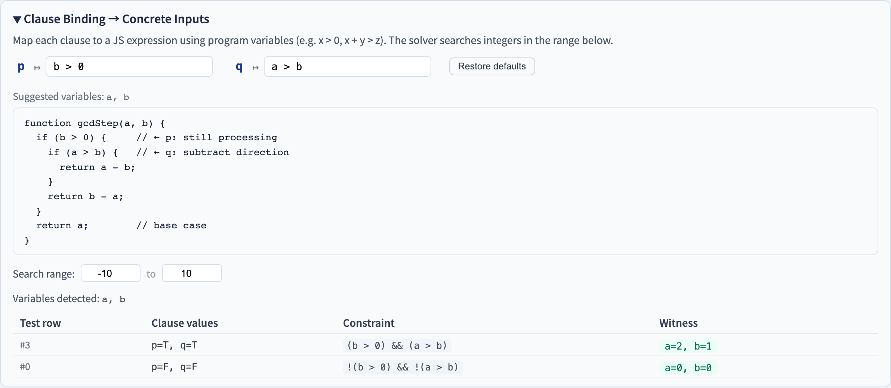
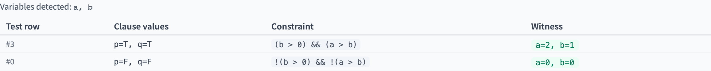

# Logic Coverage Binding
### Map Abstract Clauses to Program Variables, Auto-solve Concrete Witnesses

Software Testing Visualizer Series #13
Tool: `/section-logic` → Clause Binding sub-panel ([LogicCoverageExplorer](../../src/components/LogicCoverageExplorer.js) + [logicBinding.js](../../src/utils/logicBinding.js))

<!-- This lecture solves the "last mile" problem of Logic Coverage: mapping abstract clauses (a, b, c) to concrete program expressions so tests can actually be executed. -->
---

## The "Last Mile" Problem in Logic Coverage

Lecture #5 says:
> CACC requires test rows `(a=T, b=F)` and `(a=F, b=T)`…

But the actual program is:

```js
if (x > 0 && y < 10) { ... }
```

**Problem**: What does `a=T` mean? Which `x`? Which `y`? The tester must derive inputs manually.

> **Clause Binding** closes this gap — automatically solving concrete integer witnesses from abstract truth-table rows.

<!-- Students can compute CACC requirement tables but don't know how to generate concrete inputs satisfying "a=T, b=F." Binding bridges this gap. -->
---

## Core Concept: Three Layers of Mapping

```
Abstract layer (Logic Coverage)
  predicate: a && b
  test row:  a=T, b=F

       ↓ binding (clause → JS expression)
         a ↦ x > 0
         b ↦ y < 10

       ↓ solve (brute-force integer search)
         constraint: (x > 0) && !(y < 10)
         witness:    x=1, y=10
```

> Every coverage requirement row becomes a concrete, executable test input.

<!-- Three layers: criterion (CACC) → clause truth value combination (a=T, b=F) → concrete witness (x=1, y=10). Binding handles the second-to-third layer conversion. -->
---

## The Binding UI



- **Clause Binding** sub-panel sits below the Logic Coverage Explorer (expandable)
- Each clause (a, b, c…) has a JS expression input
- Results show a **Constraint** column (full Boolean predicate) and a **Witness** column (concrete integers)

<!-- The tool's Binding panel sits immediately below the logic coverage tool. After selecting a criterion, each requirement row shows a corresponding witness. -->
---

## Clause Binding Sub-panel Elements

| Element | Purpose |
|---------|---------|
| Clause inputs (`c ↦ …`) | Enter JS comparison expressions, e.g. `x > 0` |
| Params hint | Shows available program variables, e.g. `x, y` |
| Source code block | Annotated function body (`← a` marks which clause maps where) |
| Search range | Integer search domain (default −10 to 10) |
| Restore button | Reset to example default bindings |
| Results table | Test row / Clause values / Constraint / Witness |

<!-- Each clause (a, b, c) has an input box where students enter a JavaScript expression (e.g., x > 0). -->
---

## The Four-Column Results Table

```
┌──────────┬────────────────┬───────────────────────────┬──────────────┐
│ Test row │ Clause values  │ Constraint                │ Witness      │
├──────────┼────────────────┼───────────────────────────┼──────────────┤
│    1     │ a=T, b=F       │ (x>0) && !(y<10)          │ x=1, y=10    │
│    2     │ a=F, b=T       │ !(x>0) && (y<10)          │ x=0, y=0     │
│    3     │ a=T, b=T       │ (x>0) && (y<10)           │ x=1, y=0     │
│    4     │ a=F, b=F       │ !(x>0) && !(y<10)         │ x=0, y=10    │
└──────────┴────────────────┴───────────────────────────┴──────────────┘
```

- **Constraint**: automatically combines positive/negated clauses (`!(expr)` for False)
- **Witness**: smallest absolute-value integer solution (0, 1, −1, 2, −2, …)
- **infeasible**: shown in red when no solution exists (e.g. `x>0 && x<0`)

<!-- Four columns: row number (which requirement), clause truth values (a=T, b=F, c=T), constraint formula ((x > 0) && !(y < 10)), witness (x=1, y=10). -->
---

## The Solving Algorithm: Bounded Brute-force

**Core idea**: Cartesian-product enumeration with smallest-absolute-value-first ordering

```js
function* smallAbsFirst(min, max) {
  // yields: 0, 1, -1, 2, -2, 3, -3, ...
  for (let r = 0; r <= max - min; r++) {
    if (r === 0) yield 0;
    else { if (r <= max) yield r; if (-r >= min) yield -r; }
  }
}
```

Enumerate Cartesian products over all variables, evaluate constraint via `new Function()`:

```js
const checker = new Function(...vars, `return ${constraintStr};`);
for (const combo of cartesianSmallFirst(vars, range)) {
  if (checker(...combo)) return combo;  // ← witness found
}
```

<!-- The tool first tries an analytic solver (interval arithmetic); if that fails, it uses brute-force search over the [-10, 10] integer Cartesian product. -->
---

## Why "Smallest Absolute Value" Order?

| Search order | Witness for `z ≠ 0` | Readability |
|--------------|---------------------|-------------|
| Linear (−10, −9, …) | z=−10 | Poor (large, meaningless) |
| Smallest absolute value | **z=1** | Good (closest positive integer to 0) |

> Test witnesses should be **simple and close to boundaries** — easiest to understand and debug.

<!-- Searching from 0 upward in |x| order ensures the witness closest to 0 is found, making it easiest for students to verify by hand. -->
---

## Example Program: abs(x)

```js
function abs(x) {
  if (x < 0) {   // ← a
    return -x;
  }
  return x;
}
```

- predicate: `a` (single clause)
- binding: `a ↦ x < 0`
- CACC test set:

| Test | a | Constraint | Witness |
|------|---|-----------|---------|
| 1 | T | `(x < 0)` | x=−1 |
| 2 | F | `!(x < 0)` | x=0 |

<!-- abs(x)'s predicate is x >= 0, with one clause. Binding is straightforward: a=T → x=0, a=F → x=-1. -->
---

## Example Program: max(a, b)

```js
function max(a, b) {
  if (a > b) {   // ← p (single clause)
    return a;
  }
  return b;
}
```

- predicate: `p`
- binding: `p ↦ a > b`
- CACC test set:

| Test | p | Constraint | Witness |
|------|---|-----------|---------|
| 1 | T | `(a > b)` | a=1, b=0 |
| 2 | F | `!(a > b)` | a=0, b=0 |

<!-- max(a, b)'s predicate is a >= b, one clause. CACC needs two witnesses: a=T and a=F. -->
---

## Example Program: triangle

```js
function triangle(a, b, c) {
  if (a === b) {           // ← p
    if (b === c) return 'equilateral';  // ← q
    return 'isosceles';
  }
  ...
}
```

predicate: `p && q`; binding: `p ↦ a === b`, `q ↦ b === c`

| Test | p | q | Constraint | Witness |
|------|---|---|-----------|---------|
| 1 | T | T | `(a===b) && (b===c)` | a=0, b=0, c=0 |
| 2 | T | F | `(a===b) && !(b===c)` | a=0, b=0, c=1 |

<!-- Triangle has multiple clauses; CACC has more requirements. Have students verify each witness actually satisfies the corresponding clause truth values. -->
---

## Auto-fill from Predicate Examples

Clicking an example chip auto-fills `defaultBindings`:

```
[abs(x) branch]  →  a ↦ x < 0
[max(a,b)]       →  p ↦ a > b
[triangle p&&q]  →  p ↦ a === b, q ↦ b === c
```

- Also shows **source code** with `// ← a` annotations
- "Restore defaults" button resets bindings to example values
- Manual changes update the results immediately (200ms debounce)

<!-- Auto-fill reads the selected example's defaultBindings and fills all clause expressions with one click. Use auto-fill to quickly see results, then manually modify to learn. -->
---

## Binding Tool in Action



- Left: clause input boxes (a ↦, b ↦, c ↦)
- Middle: annotated source code (`← a` marks)
- Bottom: four-column results table (infeasible shown in red)

<!-- Live demo: select triangle → select CACC → click auto-fill. Have students match each witness table row to the corresponding textbook requirement. -->
---

## Tuning the Search Range

Default range: **[−10, 10]**; adjustable:

- If the constraint needs `x > 50`, raise max to at least 51
- Larger range = slower search (enumeration = `(max−min+1)^num_vars`)
- Recommended: start small to validate bindings, then widen for boundary values

```
Range [-10, 10], 2 variables → 21² = 441 attempts (instant)
Range [-100, 100], 3 variables → 201³ ≈ 8M attempts (~1–2 s)
```

<!-- Default search range is [-10, 10]. For expressions involving large numbers (e.g., x > 50), the analytic solver handles this case exactly without range limits. -->
---

## Limitations and Future Work

| Current | Potential improvement |
|---------|----------------------|
| Integer brute-force only | SMT solver (z3-solver-js) — arbitrary ranges, floats, strings |
| ~3 variables comfortably | Parallel Web Worker acceleration |
| Manual JS expression entry | AST-based auto-extraction of clause expressions |
| Comparison / logical ops only | Arrays, method calls, complex predicates |

> Current implementation demonstrates the core concept; SMT solver integration is a planned B1 improvement.

<!-- Limitation: the brute-force fallback can only find integer witnesses within the search range. The analytic interval solver handles simple linear constraints like x > 50 exactly. -->
---

## Summary

- **Clause Binding** connects Logic Coverage's abstract test rows to concrete program inputs.
- Three layers: clause → JS expression → integer witness.
- The Constraint column shows exactly which Boolean predicate is being solved.
- Smallest-absolute-value search produces simple, readable witnesses.
- Auto-fill and source code display lower the learning curve.

<!-- Binding turns Logic Coverage from "paper exercise" into "verifiable test inputs." Mastering this three-layer mapping is what it means to truly understand the engineering application of Logic Coverage. -->
---

## Classroom Exercises

1. Open the `triangle` example, change `p ↦ a === b` to `p ↦ a > b` — which rows become infeasible?
2. Enter predicate `a || b` (OR) with `a ↦ x > 5`, `b ↦ y > 5`. Which CACC rows produce the most interesting witnesses?
3. Shrink the search range to `[0, 2]` — does `a ↦ x < 0` become infeasible?
4. Design a RACC test set for `a && b && c` and use binding to find three concrete variable values.

<!-- Exercise 1 (manually fill bindings and verify witnesses) is the most important. Exercise 3 (expand search range) helps understand solver limitations. -->
---

## Further Reading

- Ammann & Offutt, *Introduction to Software Testing* §5 (Logic Coverage)
- Godefroid, Klarlund, Sen, *DART: Directed Automated Random Testing* (PLDI 2005) — brute-force witness pioneer
- de Moura & Bjørner, *Z3: An Efficient SMT Solver* (TACAS 2008) — next-step solver target
- Tool implementation:
  - [src/utils/logicBinding.js](../../src/utils/logicBinding.js) — solver, constraint builder, witness formatter
  - [src/components/LogicCoverageExplorer.js](../../src/components/LogicCoverageExplorer.js) — binding sub-panel UI
  - [src/data/testingData.js](../../src/data/testingData.js) — 6 example programs with default bindings
- Series continues — full index at [docs/slides/index.en.md](index.en.md)

<!-- A&O §4–5 has the complete Logic Coverage theory. The binding solver implementation is in src/utils/logicBinding.js. -->
