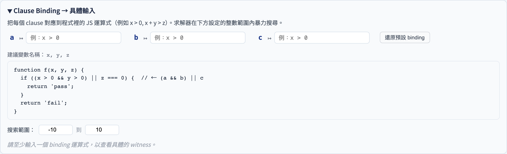

# Logic Coverage Binding
### 把抽象子句對應到程式變數，自動求解具體輸入

軟體測試視覺化系列 #13
搭配工具：`/section-logic`（[LogicCoverageExplorer](../../src/components/LogicCoverageExplorer.js) 的 Clause Binding 子面板 + [logicBinding.js](../../src/utils/logicBinding.js)）

<!-- 本講解決 Logic Coverage 的「最後一哩」問題：把抽象的子句（a、b、c）對應到具體的程式表達式，才能實際執行測試。 -->
---

## 問題：Logic Coverage 的「落地鴻溝」

#5 Logic Coverage 說：
> CACC 需要測試列 `(a=T, b=F)` 和 `(a=F, b=T)`…

但實際程式是：

```js
if (x > 0 && y < 10) { ... }
```

**問題**：`a=T` 代表「哪個 x？哪個 y？」測試人員需要手動推導。

> **Clause Binding** 解決這個落地鴻溝 — 自動從抽象布林表格求出具體整數見證。

<!-- 學生可以計算 CACC 的需求表，但不知道如何生成滿足「a=T, b=F」的具體輸入。Binding 就是填補這個鴻溝的機制。 -->
---

## 核心概念：三層對應

```
抽象層（Logic Coverage）
  predicate: a && b
  test row:  a=T, b=F

       ↓ binding（子句 → JS 表達式）
         a ↦ x > 0
         b ↦ y < 10

       ↓ 求解（brute-force integer search）
         constraint: (x > 0) && !(y < 10)
         witness:    x=1, y=10
```

> 每一行 coverage 需求都能自動變成可執行的具體測試輸入。

<!-- 三層：準則（CACC）→ 子句真值組合（a=T, b=F）→ 具體 witness（x=1, y=10）。Binding 負責第二到第三層的轉換。 -->
---

## Binding 介面



- **Clause Binding** 子面板位於 Logic Coverage Explorer 下方（可展開/收合）
- 每個子句（a, b, c…）對應一個 JS 表達式輸入框
- 右側顯示 **Constraint** 欄（完整布林謂詞）與 **Witness** 欄（具體整數值）

<!-- 工具的 Binding 面板緊接在邏輯覆蓋工具之下。選好準則後，每個需求行都有對應的 witness 顯示。 -->
---

## Clause Binding 子面板構成

| 元件 | 功能 |
|------|------|
| 子句輸入框（`c ↦ …`） | 輸入 JS 比較運算式，如 `x > 0` |
| Params hint | 顯示可用的程式變數，如 `x, y` |
| Source code 區塊 | 顯示選取範例程式原始碼（標注 `← a` 等） |
| Search range | 設定整數搜尋範圍（預設 −10 到 10）|
| Restore button | 還原為範例預設 binding |
| 結果表格 | Test row / Clause values / Constraint / Witness |

<!-- 每個子句（a, b, c）對應一個輸入框，讓學生填入 JavaScript 表達式（例如 x > 0）。 -->
---

## 結果表格四欄

```
┌──────────┬────────────────┬───────────────────────────┬──────────────┐
│ Test row │ Clause values  │ Constraint                │ Witness      │
├──────────┼────────────────┼───────────────────────────┼──────────────┤
│    1     │ a=T, b=F       │ (x>0) && !(y<10)          │ x=1, y=10    │
│    2     │ a=F, b=T       │ !(x>0) && (y<10)          │ x=0, y=0     │
│    3     │ a=T, b=T       │ (x>0) && (y<10)           │ x=1, y=0     │
│    4     │ a=F, b=F       │ !(x>0) && !(y<10)         │ x=0, y=10    │
└──────────┴────────────────┴───────────────────────────┴──────────────┘
```

- **Constraint**：自動組合正 / 反子句（`!(expr)` 代表子句為 False）
- **Witness**：最小絕對值整數解（0, 1, −1, 2, −2, …）
- **infeasible**：若無整數解（如 `x>0 && x<0`），標紅顯示

<!-- 四欄：行號（哪個需求）、子句真值組合（a=T, b=F, c=T）、約束式（(x > 0) && !(y < 10)）、witness（x=1, y=10）。 -->
---

## 求解演算法：bounded brute-force

**核心思路**：Cartesian product 窮舉 + 最小絕對值優先

```js
function* smallAbsFirst(min, max) {
  // yields: 0, 1, -1, 2, -2, 3, -3, ...
  for (let r = 0; r <= max - min; r++) {
    if (r === 0) yield 0;
    else { if (r <= max) yield r; if (-r >= min) yield -r; }
  }
}
```

對所有變數的值做 Cartesian product，用 `new Function()` 求解 constraint：

```js
const checker = new Function(...vars, `return ${constraintStr};`);
for (const combo of cartesianSmallFirst(vars, range)) {
  if (checker(...combo)) return combo;  // ← witness found
}
```

<!-- 工具先嘗試解析型解法（interval arithmetic），若失敗則用暴力搜尋 [-10, 10] 整數格點的 Cartesian product。 -->
---

## 為什麼選「最小絕對值」順序？

| 搜尋順序 | `z ≠ 0` 的見證 | 可讀性 |
|----------|----------------|--------|
| 線性（−10, −9, …）| z=−10 | 差（數值意義不明）|
| 最小絕對值優先 | **z=1** | 好（最接近 0 的正整數）|

> 測試見證應該盡量**簡單、接近邊界**，方便讀者理解條件。

<!-- 從 0 開始、依 |x| 遞增搜尋，確保找到最接近 0 的 witness，讓學生驗算時最容易手工計算。 -->
---

## 範例程式：abs(x)

```js
function abs(x) {
  if (x < 0) {   // ← a
    return -x;
  }
  return x;
}
```

- predicate: `a`（單子句）
- binding: `a ↦ x < 0`
- CACC 測試集：

| Test | a | Constraint | Witness |
|------|---|-----------|---------|
| 1 | T | `(x < 0)` | x=−1 |
| 2 | F | `!(x < 0)` | x=0 |

<!-- abs(x) 的 predicate 是 x >= 0，只有一個子句。Binding 非常直接：a=T → x=0，a=F → x=-1。 -->
---

## 範例程式：max(a, b)

```js
function max(a, b) {
  if (a > b) {   // ← p（唯一子句）
    return a;
  }
  return b;
}
```

- predicate: `p`
- binding: `p ↦ a > b`
- CACC 測試集：

| Test | p | Constraint | Witness |
|------|---|-----------|---------|
| 1 | T | `(a > b)` | a=1, b=0 |
| 2 | F | `!(a > b)` | a=0, b=0 |

<!-- max(a, b) 的 predicate 是 a >= b，一個子句。CACC 需要 a=T 和 a=F 兩個 witness。 -->
---

## 範例程式：triangle

```js
function triangle(a, b, c) {
  if (a === b) {           // ← p
    if (b === c) return 'equilateral';  // ← q
    return 'isosceles';
  }
  if (b === c) return 'isosceles';     // ← r
  if (a === c) return 'isosceles';     // ← s
  return 'scalene';
}
```

predicate: `p && q`；binding: `p ↦ a === b`, `q ↦ b === c`

| Test | p | q | Constraint | Witness |
|------|---|---|-----------|---------|
| 1 | T | T | `(a===b) && (b===c)` | a=0, b=0, c=0 |
| 2 | T | F | `(a===b) && !(b===c)` | a=0, b=0, c=1 |

<!-- triangle 有多個子句，CACC 需求較多。讓學生逐行驗算每個 witness 是否真的滿足對應的子句真值組合。 -->
---

## 自動填入（Auto-fill）

點擊預設範例 chip → 自動填入 `defaultBindings`：

```
[abs(x) branch]  →  a ↦ x < 0
[max(a,b)]       →  p ↦ a > b
[triangle p&&q]  →  p ↦ a === b, q ↦ b === c
```

- 亦顯示 **原始碼**（`// ← a` 標注哪個子句對應哪行 if）
- 「還原預設 binding」按鈕：一鍵回復出廠設定
- 手動修改後，結果立即更新（200ms debounce）

<!-- Auto-fill 讀取所選範例的 defaultBindings，一鍵填入所有子句表達式。讓學生用 auto-fill 快速看到結果，再手動修改學習。 -->
---

## Binding 工具演示


- 左欄：子句輸入框（a ↦, b ↦, c ↦）
- 中欄：程式原始碼（含 `← a` 標注）
- 下方：四欄結果表格（含 infeasible 紅字標示）

<!-- 現場選 triangle → 選 CACC → 點 auto-fill。讓學生觀察 witness 表格，找出哪一行對應教科書的哪個需求。 -->
---

## 搜尋範圍設定

預設範圍 **[−10, 10]**；可調整：

- 若 constraint 需要 `x > 50`，需把 max 調至 51 以上
- 範圍越大，搜尋越慢（窮舉量 = `(max−min+1)^變數數`）
- 建議：先用小範圍快速確認 binding 設定，再放大找邊界值

```
範圍 [-10, 10]，2 個變數 → 21² = 441 次嘗試（瞬間）
範圍 [-100, 100]，3 個變數 → 201³ ≈ 800 萬次（約 1–2 秒）
```

<!-- 搜尋範圍預設 [-10, 10]。如果子句表達式涉及大數（例如 x > 50），可以擴大範圍找到 x=51 等 witness。 -->
---

## 限制與後續

| 現況 | 可能改善 |
|------|---------|
| 整數暴力窮舉 | SMT solver（z3-solver-js）—支援任意範圍、浮點、字串 |
| 最多 ~3 個變數流暢 | 並行 Web Worker 加速 |
| 手動輸入 JS 表達式 | 從 AST 自動抽取 clause 表達式 |
| 只支援比較 / 邏輯運算 | 支援陣列索引、方法呼叫等更複雜的述詞 |

> 目前實作展示核心概念；SMT solver 整合為 B1 階段目標。

<!-- 限制：工具只能處理整數 witness，且搜尋範圍有限。解析型解法（interval arithmetic）已在 B1 版本加入，可處理 x > 50 等情況。 -->
---

## 小結

- **Clause Binding** 把 Logic Coverage 的抽象測試列連結到具體程式輸入。
- 三層對應：子句 → JS 表達式 → 整數見證。
- Constraint 欄讓學生看清楚「哪個布林謂詞被求解」。
- 最小絕對值搜尋讓見證簡單易讀。
- 範例程式自動填入 + 原始碼顯示降低學習門檻。

<!-- Binding 把 Logic Coverage 從「紙上作業」變成「可驗證的測試輸入」。掌握這個三層對應，才算真正學會 Logic Coverage 的工程應用。 -->
---

## 課堂練習

1. 開 `triangle` 範例，修改 `p ↦ a === b` 為 `p ↦ a > b`，觀察哪些列變 infeasible。
2. 手動輸入 predicate `a || b`（OR），分別設 `a ↦ x > 5`, `b ↦ y > 5`。哪些 CACC 列的 Witness 最有趣？
3. 把搜尋範圍縮到 `[0, 2]`，看 `a ↦ x < 0` 的 binding 是否出現 infeasible。
4. 對 `a && b && c` 設計一組 RACC 測試集，並用 binding 求解三個變數的具體值。

<!-- 練習 1（手填 binding 驗算 witness）最重要。練習 3（擴大搜尋範圍）適合理解 solver 限制。 -->
---

## 進一步閱讀

- Ammann & Offutt, *Introduction to Software Testing* §5（Logic Coverage）
- Godefroid, Klarlund, Sen, *DART*（PLDI 2005）— brute-force witness 的工業先驅
- de Moura & Bjørner, *Z3: An Efficient SMT Solver*（TACAS 2008）— 下一步的 solver 目標
- 工具實作：
  - [src/utils/logicBinding.js](../../src/utils/logicBinding.js) — solver、constraint builder、witness formatter
  - [src/components/LogicCoverageExplorer.js](../../src/components/LogicCoverageExplorer.js) — binding 子面板 UI
  - [src/data/testingData.js](../../src/data/testingData.js) — 6 個附 binding 的範例程式
- 系列繼續 — 完整課程目錄請見 [docs/slides/index.zh-TW.md](index.zh-TW.md)

<!-- A&O §4–5 有 Logic Coverage 的完整理論。Binding 的 solver 實作在 src/utils/logicBinding.js。 -->
