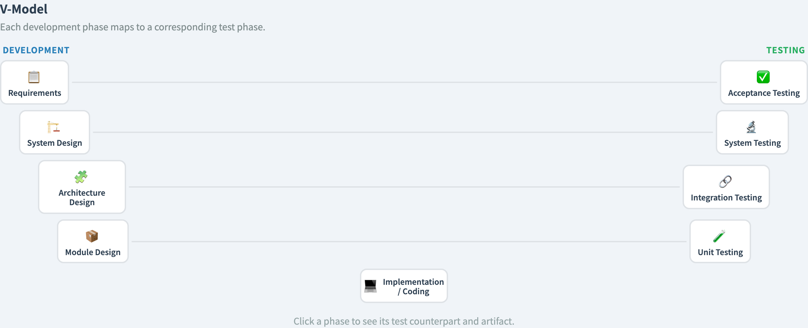
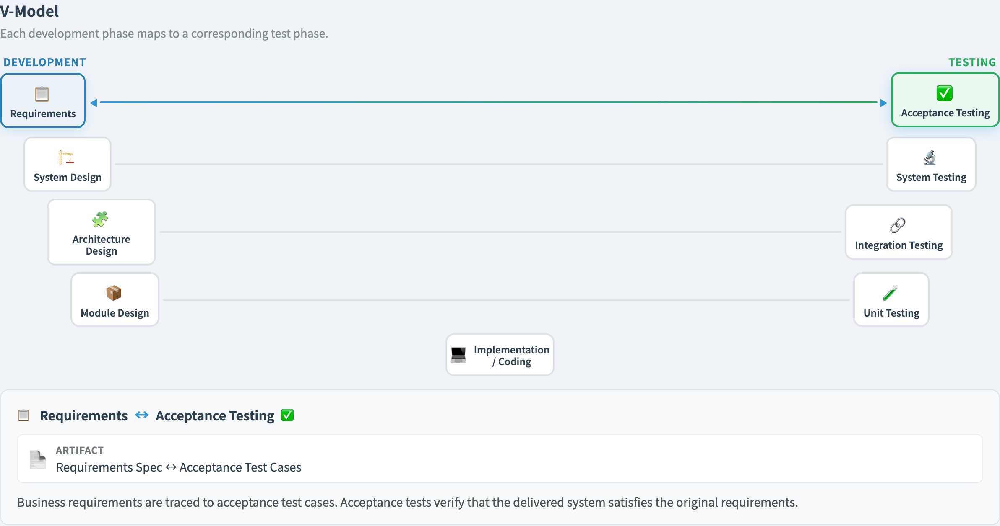
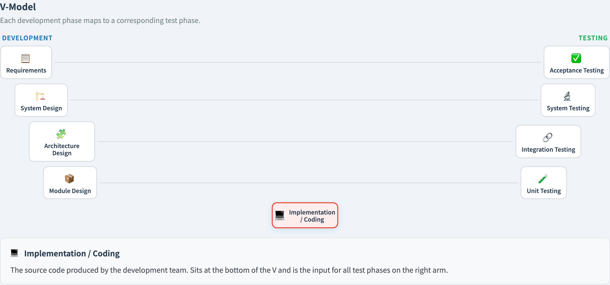

# The V-Model
### Every build phase has a matching test phase

Software Testing Visualization series #15
Companion tool: `/section-flow` ([VModelExplorer](../../src/components/VModelExplorer.js))

<!-- The V-model is the conceptual skeleton for "testing levels". Even teams that reject it as a process still use its pairing as a mental map. -->

---

## Why this lecture exists

- The cost curve (#14) said: detect defects early.
- But *which* test catches *which* defect?
- The V-model answers that by **pairing** each development artifact with the test level that validates it.
- It is a map, not a schedule — useful even on agile teams.

---

## The shape of the V

The left arm descends through **development**; the right arm rises through **testing**:

```
 Requirements ───────────────  Acceptance testing
   System design ───────────  System testing
     Architecture ─────────  Integration testing
       Module design ─────  Unit testing
              Implementation
```

Each left-arm artifact has a **horizontal partner** on the right that tests it.

---

## The four verification pairs

| Development phase | Verifying test level | Question it answers |
| --- | --- | --- |
| Requirements | Acceptance testing | Did we build the *right* system? |
| System design | System testing | Does the whole system behave as designed? |
| Architecture | Integration testing | Do the components fit together? |
| Module design | Unit testing | Does each unit do its job? |

At the bottom point sits **implementation** — where code is written.

---

## The key idea: design tests *down*, run them *up*

The arms are read in **two directions**:

- **Going down (design):** when you write a requirement, you already design its acceptance test. When you design a module, you design its unit tests.
- **Going up (execution):** code is built, then tests run unit → integration → system → acceptance.

> A test phase is *planned* opposite its development phase, long before it *runs*.

<!-- This is the single most important slide. The V-model's value is the early test DESIGN, not the late test execution. -->

---

## Verification vs validation

The V-model separates two questions students often merge:

- **Verification** — "Did we build the system *right*?"
  Each artifact matches its *specification*. (Inner pairs.)
- **Validation** — "Did we build the *right* system?"
  The system matches the *user's real need*. (The top pair: requirements ↔ acceptance.)

A system can be perfectly verified and still fail validation.

---

## Worked example: a login feature

| Phase | Artifact produced | Test designed at the same time |
| --- | --- | --- |
| Requirements | "Users authenticate with email + password" | Acceptance: a real user logs in end-to-end |
| System design | Auth service + session store | System test: login across the running system |
| Architecture | Auth API ↔ user-DB contract | Integration test: API returns the right token |
| Module design | `hashPassword()`, `verify()` | Unit test: hashing and verification logic |

Four test levels, **all designed before a line of code runs**.

---

## Strengths and limits

**Strengths**
- Every artifact has an owner test level — nothing is "untested by accident".
- Forces early test design — directly serves the #14 cost curve.

**Limits**
- Drawn as strict phases, it looks waterfall.
- Agile teams keep the *pairing* but collapse the *timeline* — the pairs all happen inside one sprint (see #M2, Sprint Cadence).

---

## Tool demonstration

In `/section-flow`, open the **V-Model Explorer**:

1. Follow the left arm down — each development phase and its artifact.
2. Follow the right arm up — each matching test level.
3. Click a pair to see the horizontal verification link.
4. Note the bottom point: implementation, where the two arms meet.

The horizontal links are the lecture's whole point — make sure every student can name all four.

---

## Tool — the full V



The left arm descends through development; the right arm rises through test levels.

---

## Tool — a verification pair



Click a pair to see the horizontal link: requirements ↔ acceptance testing.

---

## Tool — implementation, where the arms meet



The bottom point: code is written, and the climb back up begins.

---

## Summary

- The V-model **pairs** each development phase with the test level that verifies it.
- Tests are **designed downward** (with the artifact) and **run upward** (after code).
- **Verification** = built it right; **validation** = built the right thing.
- Agile keeps the pairing, drops the rigid timeline.

**In-class exercise:** pick a feature you built. Name its four test levels and what each one would check. Which level is weakest on your team?

---

## Further reading

- Course specification — testing lifecycle chapter ([Specification.zh-TW.md](../Specification.zh-TW.md))
- ISTQB Foundation syllabus — test levels and the V-model
- Tool source: [VModelExplorer.js](../../src/components/VModelExplorer.js)
- Related: **#14 Defect Cost** (why design tests early) · **#16 Testing Types** (the levels in detail)
