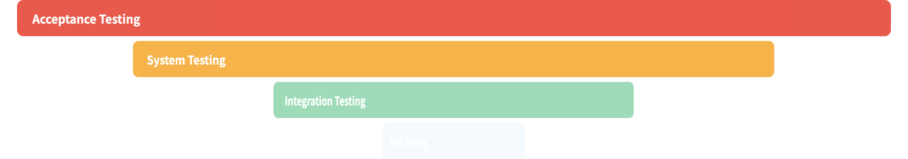
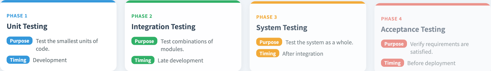

# Testing Levels & Types
### Four levels, one system — what each one is responsible for

Software Testing Visualization series #16
Companion tool: `/section-types` ([TestingTypesTable](../../src/components/TestingTypesTable.js))

<!-- This lecture turns the V-model's abstract pairs (#15) into a concrete catalogue: what each level tests, when it runs, and who owns it. -->

---

## Why this lecture exists

- The V-model (#15) named four test levels but did not detail them.
- Students often blur "unit" and "integration", or call everything "testing".
- A shared vocabulary matters: a *level* and a *type* are different axes.
- This lecture pins down the catalogue every later lecture assumes.

---

## Two independent axes

Do not confuse these:

- **Testing level** — *how much* of the system is under test:
  unit → integration → system → acceptance.
- **Testing approach** — *how much of the internals* you use:
  black-box, white-box, gray-box.

Any level can be tested with any approach. A unit test is usually white-box; an acceptance test is usually black-box — but neither is forced.

---

## The four testing levels

| Level | Purpose | When it runs |
| --- | --- | --- |
| Unit | Test the smallest units of code | During development |
| Integration | Test combinations of modules | Late development |
| System | Test the system as a whole | After integration |
| Acceptance | Verify requirements are satisfied | Before deployment |

Each level **assumes the one below it passed.** Integration tests do not re-prove that a function works — they test the *seams between* functions.

---

## What each level actually catches

- **Unit** — logic errors inside one function: a wrong branch, an off-by-one.
- **Integration** — interface defects: mismatched contracts, wrong data formats, the seam where two correct modules disagree.
- **System** — emergent behavior: performance, end-to-end flows, configuration.
- **Acceptance** — the *validation* question: is this the system the user actually wanted?

A defect type has a *cheapest level* to catch it — usually the lowest one that can.

---

## The black/white/gray-box dimension

The orthogonal axis — how much internal structure the tester uses:

| Approach | Knowledge used | Typical at |
| --- | --- | --- |
| Black-box | Inputs and outputs only | System, acceptance |
| White-box | Full internal code structure | Unit |
| Gray-box | Partial — visible interfaces/contracts | Integration |

Black-box techniques: boundary values, equivalence partitioning, decision tables.
White-box techniques: statement / branch / path coverage.

---

## Worked example: a shopping cart

| Level | A test at this level |
| --- | --- |
| Unit | `applyDiscount(100, 0.1)` returns `90` |
| Integration | The cart service calls the pricing API and stores the right total |
| System | A full checkout: add items → pay → receive confirmation |
| Acceptance | A real user completes a purchase and agrees it meets the requirement |

One feature, four levels — each catching defects the others would miss.

---

## Tool demonstration

In `/section-types`, open the **Testing Types** view:

1. Read the pyramid: the four levels stacked, widening downward.
2. The width hints at relative test *count* — many unit tests, few acceptance tests (the pyramid shape — see #17).
3. Click each level card for its purpose and timing.
4. Map each level back to its V-model partner from #15.

---

## Tool — the testing pyramid

Four levels stacked, widening downward — width hints at relative test count.

---

## Tool — the four level cards

Each card carries the level's purpose and the phase where it runs.

---

## Common confusions to avoid

- *"Integration test = several units"* — no. It tests the **interfaces**, not the units again.
- *"System test = acceptance test"* — no. System = built right; acceptance = built the right thing (verification vs validation, #15).
- *"White-box = unit test"* — usually, but not necessarily. The axes are independent.

---

## Summary

- **Level** = how much of the system; **approach** = how much of the internals. Two axes.
- Four levels: unit → integration → system → acceptance, each assuming the one below.
- Integration tests the **seams**; system tests **emergent** behavior; acceptance answers **validation**.
- The cheapest level to catch a defect is usually the lowest one that can.

**In-class exercise:** for one feature you own, write one test at each of the four levels. Which level currently has the weakest coverage?

---

## Further reading

- Course specification — testing levels chapter ([Specification.zh-TW.md](../Specification.zh-TW.md))
- ISTQB Foundation syllabus — test levels and test types
- Tool source: [TestingTypesTable.js](../../src/components/TestingTypesTable.js)
- Next: **#17 The Test Automation Pyramid** — how many tests at each level
