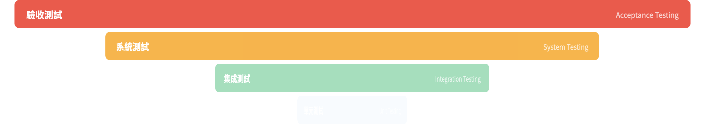
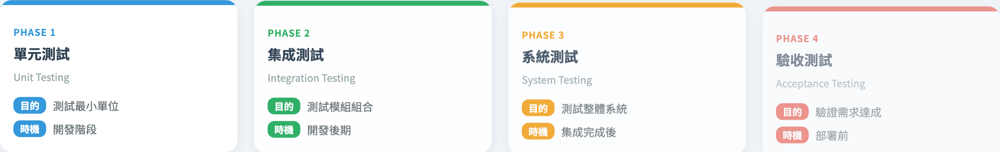

# 測試層級與類型
### 四個層級、一個系統 —— 每一層各自負責什麼

軟體測試視覺化系列 #16
搭配工具：`/section-types`（[TestingTypesTable](../../src/components/TestingTypesTable.js)）

<!-- 這一講把 V 模型（#15）抽象的配對，化為具體的目錄：每一層測什麼、何時跑、誰負責。 -->

---

## 為什麼有這一講

- V 模型（#15）點名了四個測試層級，但沒有細講。
- 學生常把「單元」與「整合」混為一談，或把一切都叫「測試」。
- 共同詞彙很重要：*層級*與*類型*是不同的軸。
- 這一講把後續每一講都預設的目錄釘下來。

---

## 兩條獨立的軸

別把這兩者混淆：

- **測試層級** —— 受測的是系統的*多大範圍*：
  單元 → 整合 → 系統 → 驗收。
- **測試取向** —— 你動用了*多少內部結構*：
  黑盒、白盒、灰盒。

任何層級都能用任何取向來測。單元測試通常是白盒、驗收測試通常是黑盒 —— 但兩者都不是被強制的。

---

## 四個測試層級

| 層級 | 目的 | 何時執行 |
| --- | --- | --- |
| 單元 | 測試最小的程式碼單位 | 開發階段 |
| 整合 | 測試模組的組合 | 開發後期 |
| 系統 | 測試整體系統 | 整合完成後 |
| 驗收 | 驗證需求是否達成 | 部署前 |

每一層都**假設它下面那一層已通過**。整合測試不會再去證明一個函式能運作 —— 它測的是函式*之間的接縫*。

---

## 每一層實際上抓的是什麼

- **單元** —— 單一函式內的邏輯錯誤：走錯分支、差一錯誤（off-by-one）。
- **整合** —— 介面缺陷：契約不符、資料格式錯誤，兩個各自正確的模組在接縫處意見不合。
- **系統** —— 湧現行為：效能、端到端流程、組態設定。
- **驗收** —— *確認*的問題：這真的是使用者想要的系統嗎？

每一種缺陷都有一個*最便宜的偵測層級* —— 通常是能抓到它的最低那一層。

---

## 黑/白/灰盒這個維度

正交的另一條軸 —— 測試者動用了多少內部結構：

| 取向 | 使用的知識 | 典型出現於 |
| --- | --- | --- |
| 黑盒 | 只有輸入與輸出 | 系統、驗收 |
| 白盒 | 完整的內部程式碼結構 | 單元 |
| 灰盒 | 部分 —— 可見的介面／契約 | 整合 |

黑盒技術：邊界值、等價類分割、決策表。
白盒技術：語句／分支／路徑覆蓋。

---

## 例題：一個購物車

| 層級 | 此層級的一個測試 |
| --- | --- |
| 單元 | `applyDiscount(100, 0.1)` 回傳 `90` |
| 整合 | 購物車服務呼叫定價 API，並存下正確的總額 |
| 系統 | 完整結帳：加入商品 → 付款 → 收到確認 |
| 驗收 | 真實使用者完成一次購買，並認可它符合需求 |

同一個功能、四個層級 —— 各自抓出其他層級會漏掉的缺陷。

---

## 工具演示

在 `/section-types` 開啟**測試類型**檢視：

1. 看那座金字塔：四個層級疊起來，越往下越寬。
2. 寬度暗示相對的測試*數量* —— 單元測試多、驗收測試少（金字塔形狀 —— 見 #17）。
3. 點每張層級卡片，看它的目的與時機。
4. 把每一層對回 #15 中它的 V 模型夥伴。

---

## 工具 —— 測試金字塔

四個層級疊起來、越往下越寬 —— 寬度暗示相對的測試數量。

---

## 工具 —— 四張層級卡片

每張卡片載明該層級的目的，以及它執行的階段。

---

## 該避免的常見混淆

- *「整合測試＝好幾個單元」* —— 不對。它測的是**介面**，不是再測一次單元。
- *「系統測試＝驗收測試」* —— 不對。系統＝建得對；驗收＝建了對的東西（驗證 vs 確認，#15）。
- *「白盒＝單元測試」* —— 通常如此，但非必然。兩條軸是獨立的。

---

## 小結

- **層級**＝系統的多大範圍；**取向**＝動用多少內部結構。兩條軸。
- 四個層級：單元 → 整合 → 系統 → 驗收，每一層假設下一層成立。
- 整合測**接縫**；系統測**湧現**行為；驗收回答**確認**問題。
- 抓一個缺陷最便宜的層級，通常是能抓到它的最低那一層。

**課堂練習：** 針對你負責的一個功能，在四個層級各寫一個測試。目前哪一層的覆蓋最弱？

---

## 延伸閱讀

- 課程規格 —— 測試層級章節（[Specification.zh-TW.md](../Specification.zh-TW.md)）
- ISTQB 基礎大綱 —— 測試層級與測試類型
- 工具原始碼：[TestingTypesTable.js](../../src/components/TestingTypesTable.js)
- 下一講：**#17 測試自動化金字塔** —— 每一層該有多少測試
