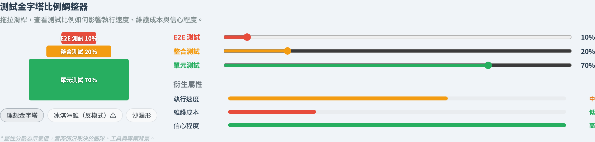
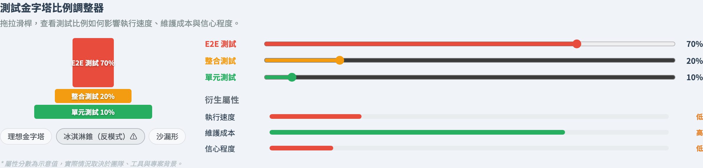

# The Test Automation Pyramid
### Not *which* levels — *how many* at each

Software Testing Visualization series #17
Companion tool: `/section-types` ([PyramidAdjusterExplorer](../../src/components/PyramidAdjusterExplorer.js))

<!-- #16 named the levels; this lecture is about their PROPORTIONS. The whole lecture is one trade-off: fast cheap narrow tests vs slow expensive broad ones. -->

---

## Why this lecture exists

- #16 said unit, integration, end-to-end exist. It did not say **how many of each.**
- A suite with the wrong proportions is slow, flaky, and expensive — even if every test passes.
- Mike Cohn's *test automation pyramid* is the shape that keeps a suite affordable.
- This lecture is about one trade-off, seen three ways.

---

## The trade-off, one test at a time

As you move *up* the levels, every test gets:

| | Unit | Integration | End-to-end |
| --- | --- | --- | --- |
| Speed | fast (ms) | medium | slow (seconds+) |
| Maintenance cost | cheap | medium | expensive |
| Realism / confidence per test | narrow | medium | broad |

No level is "best" — each buys realism with speed and cost.

---

## The pyramid shape

The healthy proportion: **many fast tests, few slow ones.**

```
        /\        E2E        ~10%   slow, broad
       /  \
      /    \    Integration  ~20%
     /      \
    /        \    Unit       ~70%   fast, narrow
   /__________\
```

A wide unit base gives fast feedback; a narrow E2E tip gives end-to-end confidence. The shape is a *cost-control* device.

---

## Anti-pattern 1: the ice-cream cone

Invert the pyramid — mostly end-to-end tests, almost no unit tests:

```
   \__________/   E2E        ~70%
    \        /
     \      /     Integration ~20%
      \    /
       \  /       Unit        ~10%
        \/
```

- The suite is **slow** — every run waits on the whole system.
- It is **flaky** — E2E tests fail for unrelated reasons.
- A failure does not localize — *which* unit broke?

---

## Anti-pattern 2: the hourglass

Plenty of unit and E2E tests — but the **integration** middle is starved:

```
   \________/    E2E         ~50%
    \      /
       ||         Integration ~10%   ← the gap
    /      \
   /________\    Unit         ~40%
```

Units pass, the system passes end-to-end — but the **seams between modules** (the integration defects of #16) go untested. Defects hide exactly in the missing middle.

---

## Three derived attributes

From any unit / integration / E2E mix, three traits follow:

- **Execution speed** — high when unit-heavy, low when E2E-heavy.
- **Maintenance cost** — high when E2E-heavy (brittle tests), low when unit-heavy.
- **Confidence** — peaks near the balanced pyramid; *both* extremes lower it (the cone is slow & flaky; an all-unit suite never tests the whole).

You are choosing a point in a three-way trade-off, not maximizing one number.

---

## Tool demonstration

In `/section-types`, open the **Pyramid Adjuster**:

1. Start on the **Ideal** preset (70 / 20 / 10) — note speed and confidence both high.
2. Switch to **Ice-cream cone** (10 / 20 / 70) — watch speed and maintenance worsen.
3. Switch to **Hourglass** (40 / 10 / 50) — confidence drops though unit % looks fine.
4. Drag the ratios yourself and find where confidence peaks.

---

## Tool — the ideal pyramid



70 / 20 / 10 — a wide unit base; speed and confidence both high.

---

## Tool — the ice-cream-cone anti-pattern



10 / 20 / 70 — inverted; the trait bars show speed and maintenance worsen.

---

## A modern caveat

- The exact 70/20/10 is a heuristic, not a law.
- Fast in-memory integration tests have made some teams favour a "testing trophy" — a fatter integration middle.
- The durable rule survives every variant: **the slower and broader a test, the fewer of them you should depend on.**

<!-- Concede the trophy debate. The pyramid's spirit — push tests down — is what matters, not the exact percentages. -->

---

## Summary

- The pyramid is about **proportions**, not which levels exist.
- Going up: slower, costlier, broader. Going down: faster, cheaper, narrower.
- **Ice-cream cone** = slow & flaky; **hourglass** = untested seams.
- Speed, maintenance and confidence are a three-way trade-off — aim for the balanced shape.

**In-class exercise:** estimate your real suite's unit / integration / E2E split. Which shape is it? What is the cheapest one test to add to move it toward the pyramid?

---

## Further reading

- Course specification — test strategy chapter ([Specification.zh-TW.md](../Specification.zh-TW.md))
- Mike Cohn, *Succeeding with Agile* (2009) — the original test automation pyramid
- Tool source: [PyramidAdjusterExplorer.js](../../src/components/PyramidAdjusterExplorer.js)
- Related: **#16 Testing Levels** · **#M4 Continuous Testing Pipeline** (tiers & feedback time)
