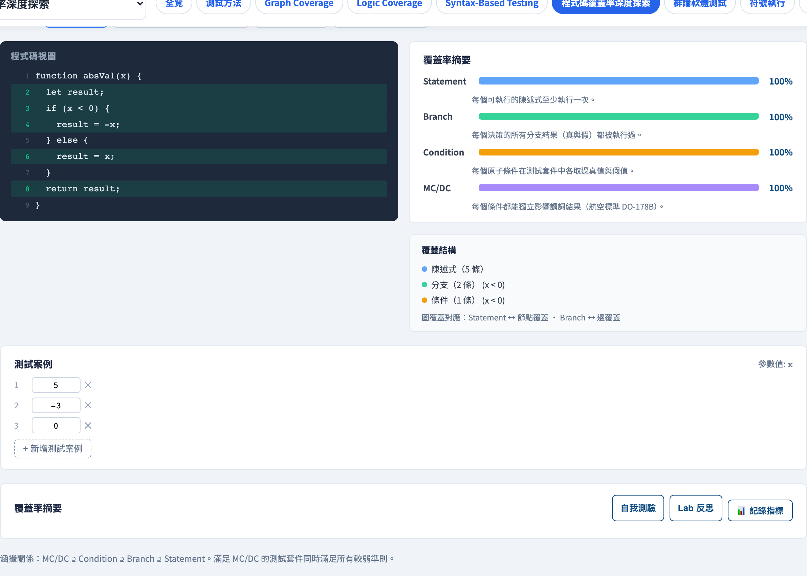
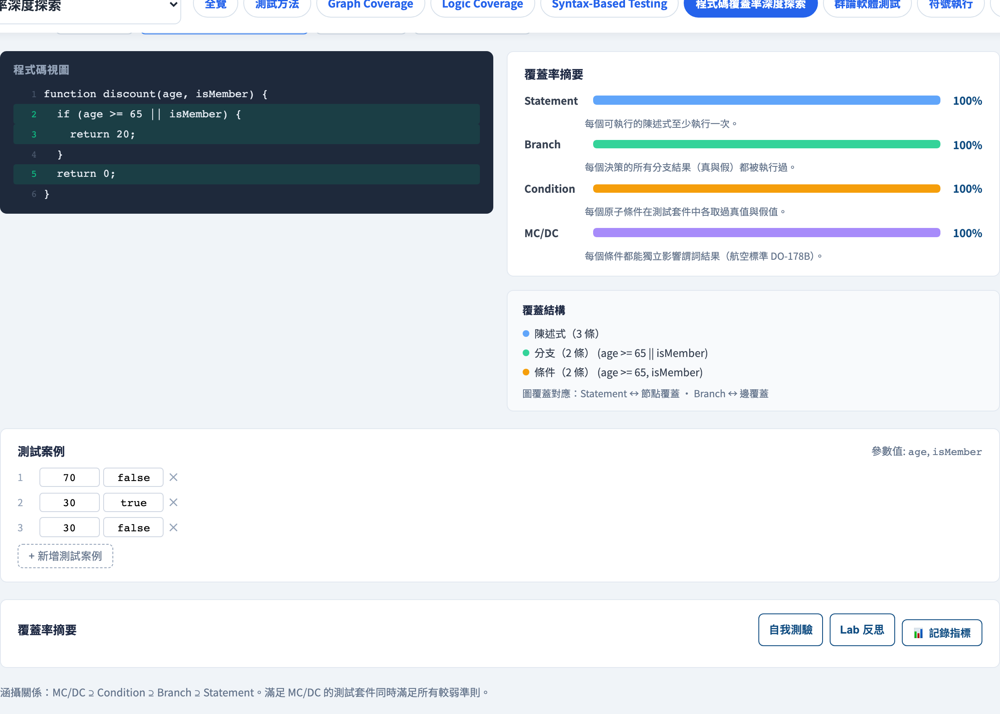

# 程式碼覆蓋準則
### 語句 · 分支 · 條件 · MC/DC

軟體測試視覺化系列 #18
搭配工具：`/section-codecov`（[CodeCoverageExplorer](../../src/components/CodeCoverageExplorer.js)）

<!-- 這一講是圖覆蓋／邏輯覆蓋的白盒對應，但落腳在覆蓋率工具每天回報的那個日常指標上。 -->

---

## 為什麼有這一講

- 「我們有 80% 覆蓋率」—— 到底是 80% 的*什麼*？
- 覆蓋率工具回報一個數字；少有學生知道它度量的是哪一個**準則**。
- 不同準則對*同一套測試*可能給出差異極大的分數。
- 這一講定義四個準則，以及把它們排序的階層。

---

## 貫穿全講的例子

一個極小的函式，只有一個複合決策：

```js
function discount(amount, isMember) {
  if (amount > 50 && isMember) {
    return amount * 0.9;   // 打九折
  }
  return amount;
}
```

一個 `if`、兩個原子條件：`amount > 50` 與 `isMember`。
我們將用四個覆蓋準則替它打分。

---

## 準則一 —— 語句覆蓋

**每一條可執行的語句至少執行一次。**

```
discount(70, true)   → 執行 if 內的 return
discount(10, false)  → 執行最後的 return
```

兩個測試 → **100% 語句覆蓋。** 每一行都執行過了。

但是：我們有沒有曾經*因為 `isMember`* 而讓 `if` 取**假**？語句覆蓋無法告訴你 —— 它只數行數。

---

## 準則二 —— 分支（決策）覆蓋

**每個決策結果 —— 真*與*假 —— 都被操練過。**

那個 `if` 必須被求值成兩個方向：

```
discount(70, true)   → if 為 TRUE
discount(10, false)  → if 為 FALSE
```

同樣這兩個測試 → **100% 分支覆蓋。** 分支涵蓋語句：覆蓋每個分支，每條語句也就被覆蓋了。

仍然隱藏著：這個決策是*複合的*。是哪個條件把它翻過去的？

---

## 準則三 —— 條件覆蓋

**每個原子條件在套件中各取過真與假。**

| 測試 | `amount > 50` | `isMember` |
| --- | --- | --- |
| `discount(70, true)` | T | T |
| `discount(10, false)` | F | F |

每個條件都當過 T 與 F → **100% 條件覆蓋。**
然而我們從沒看過 `amount>50` 為 **T** 而 `isMember` 為 **F** 的情形 —— 這是分支覆蓋*和*條件覆蓋雙雙漏掉的案例。

---

## 準則四 —— MC/DC

**修正條件／決策覆蓋（Modified Condition/Decision Coverage）：** 必須證明每個條件能**獨立地**改變決策結果 —— 固定其他條件、翻轉某一個、看著結果跟著翻。

| `amount>50` | `isMember` | 決策 |
| --- | --- | --- |
| T | T | **真** |
| F | T | 假  ← 單獨翻 `amount>50` 就翻轉了它 |
| T | F | 假  ← 單獨翻 `isMember` 就翻轉了它 |

三個測試證明**每個**條件都各自舉足輕重。MC/DC 是航空標準（DO-178C），正是為此。

---

## Subsumption（涵蓋）階層

較強的準則**涵蓋（subsume）**較弱的 —— 滿足它，就自動滿足較弱者：

```
MC/DC  ⊃  分支  ⊃  語句
            （條件覆蓋強於語句，
             但其本身並不涵蓋分支）
```

較強的準則需要更多測試、抓到更多缺陷。MC/DC 要求嚴苛 —— 保留給安全關鍵的程式碼。

---

## 為何 100% 覆蓋不等於「完整測過」

覆蓋率度量的是**測試執行了什麼**，從不是**它們檢查了什麼**。

- 一個測試可以跑過每一行卻**什麼都不斷言** —— 仍是 100% 語句覆蓋。
- 覆蓋率看不見*缺少的* `else`、未處理的案例、錯誤的需求。
- 100% 覆蓋＝「沒有程式碼未被執行」。它是**地板，不是天花板**。

> 覆蓋率告訴你哪些是你*還沒*測的。它無法告訴你哪些是你*已經*測的。

---

## 工具演示

在 `/section-codecov` 開啟**程式碼覆蓋探索器**：

1. 挑一個預設（`discount`、`absVal`、`classify`、`maxOf3`）。
2. 跑預設的測試套件 —— 看那四個百分比。
3. 找一個 **分支 100%** 但 **MC/DC 未達 100%** 的套件 —— 那個落差就是本講的重點。
4. 補上缺少的那個測試，看著 MC/DC 補滿。

---

## 工具 —— 四種準則的覆蓋率



左側程式碼、右側逐準則長條：陳述式、分支、條件、MC/DC。

---

## 工具 —— 一個雙子句述詞



`discount` 預設的 `age >= 65 || isMember` 正是分支與 MC/DC 分歧之處。

---

## 小結

- 四個準則，強度遞增：**語句 → 分支 → 條件／MC/DC。**
- **Subsumption：** 分支涵蓋語句；MC/DC 涵蓋分支。
- MC/DC 證明每個條件*獨立地*影響決策 —— 安全關鍵的標準。
- 100% 覆蓋只代表*沒有未執行的程式碼* —— 它是地板；真正在測試的是斷言。

**課堂練習：** 寫一個三條件的述詞。分支覆蓋要幾個測試？MC/DC 要幾個？（MC/DC 只需約 N+1 個，而非 2^N。）

---

## 延伸閱讀

- 課程規格 —— 白盒覆蓋章節（[Specification.zh-TW.md](../Specification.zh-TW.md)）
- RTCA DO-178C —— 航空軟體中的 MC/DC
- Ammann & Offutt, *Introduction to Software Testing* —— 邏輯覆蓋
- 工具原始碼：[CodeCoverageExplorer.js](../../src/components/CodeCoverageExplorer.js) · [codeCoverage.js](../../src/utils/codeCoverage.js)
- 相關：**#3 圖覆蓋** · **#5 邏輯覆蓋**（14 準則的完整處理）
