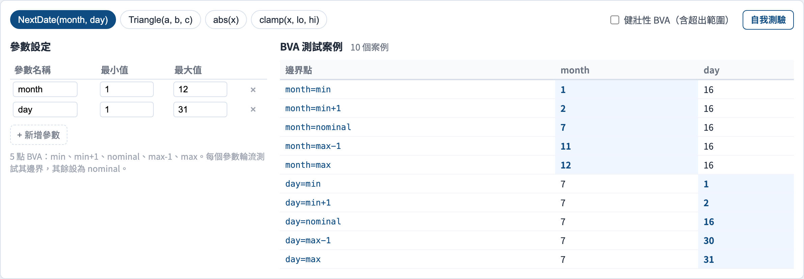
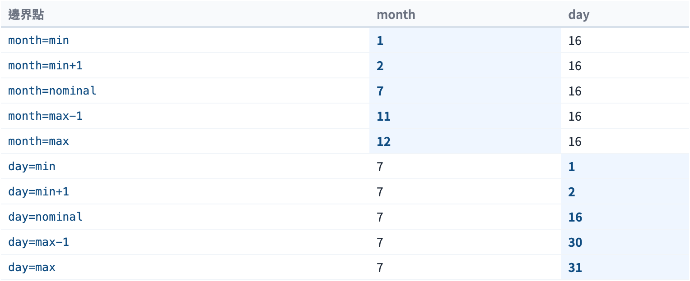

# 邊界值分析
### Bug 住在邊緣

軟體測試視覺化系列 #19
搭配工具：`/section-blackbox`（[BoundaryValueExplorer](../../src/components/BoundaryValueExplorer.js)）

<!-- 本系列第一個黑盒技術。整堂課建立在一個經驗事實上：缺陷聚集在邊界。 -->

---

## 為什麼有這一講

- 一個範圍為 `1–12` 的變數，有數千個可能值 —— 你無法全部測。
- 但缺陷**並非均勻分布**：它們聚集在**邊界**。
- 差一錯誤、`<` 對 `<=`、把 `==` 寫成 `>=` —— 全都住在邊緣。
- 邊界值分析把你的測試預算花在 bug 真正所在之處。

---

## 核心觀念

對每個輸入範圍，危險的值是**邊緣**，不是中間。

```
   ●────────────────────────────●
  min       （典型值）           max
```

中間的測試操練的是「快樂路徑」。一個*位於* `min` 或 `max`、以及剛好*在範圍外*的測試，操練的才是**決定**範圍的那段程式碼。

> 觀念支點：測那個*決策*，而非那個*區域*。

---

## 5 點邊界值分析

對一個範圍 `[min, max]`，每個變數挑五個值：

| 點 | 值 | 測什麼 |
| --- | --- | --- |
| 低於 min | `min − 1` | 下界守衛 |
| 在 min | `min` | 含端點的下緣 |
| 標稱值 | 一個典型的中間值 | 正常案例 |
| 在 max | `max` | 含端點的上緣 |
| 高於 max | `max + 1` | 上界守衛 |

變動某一個變數時，把*其他所有*變數固定在標稱值。

---

## 穩健性邊界值分析（Robustness BVA）

標準 5 點 BVA 已經包含了剛好範圍外的值。
**穩健性 BVA** 把超出範圍的案例變成一等公民 —— 它明確問：*程式拿到無效輸入時會怎樣？*

- `day = 32` 會丟出錯誤、夾擠（clamp）、還是無聲地把資料弄壞？
- 穩健性測試把 `min−1` 與 `max+1` 視為**必要**測試，而非選用。

這在輸入不可信任之處（使用者表單、API）最為關鍵。

---

## 例題：`NextDate(month, day)`

範圍：`month ∈ [1,12]`、`day ∈ [1,31]`。

變動 `month`，把 `day` 固定在標稱值（= 15）：

| month | 預期 |
| --- | --- |
| 0 | 無效 |
| 1 | 1 月 16 日 |
| 6 | 6 月 16 日 |
| 12 | 12 月 16 日 |
| 13 | 無效 |

接著重複，這次變動 `day`、把 `month` 固定在標稱值。5 點 × 2 變數。

---

## 要幾個測試？

對 *n* 個各有範圍的變數：

- **5 點 BVA：** `4n + 1` 個測試 —— 讓一個變數走過它的 5 點、其他標稱；那個全標稱的測試是共用的。
- BVA **不**測邊界*組合*（同時兩個都在 max）—— 那是成對測試（#23）的工作。

BVA 便宜、且對 *n* 是線性的 —— 它的紀律是*一次只動一個變數*。

---

## 優點與限制

**優點**
- 套件小而精準，命中缺陷密度最高的輸入。
- 與等價類分割（#20）天然搭配 —— 挑*每個分割的*邊界。

**限制**
- 假設輸入是*有序範圍* —— 對無序／類別型輸入沒用。
- 漏掉需要極端值*組合*的缺陷。
- 沒有真正順序的範圍（一個列舉）沒有有意義的邊界。

---

## 工具演示

在 `/section-blackbox` 開啟**邊界值探索器**：

1. 選一個例子（`NextDate`、`triangle`）。
2. 在 **5 點**與**穩健性** BVA 之間切換。
3. 看每個變數生成的點 —— 注意哪些在範圍內／外。
4. 加一個變數，看著測試數依 `4n + 1` 成長。

---

## 工具 —— 各參數的邊界點



每個參數的 5 個邊界點；套件數依 4n+1 成長。

---

## 工具 —— 生成的 BVA 套件



每一列就是一個邊界案例 —— min、min+1、nominal、max−1、max。

---


## 小結

- 缺陷聚集在**邊界** —— 測邊緣，不測中間。
- **5 點 BVA：** 低於 min、min、標稱、max、高於 max —— 一次一個變數。
- **穩健性 BVA** 把超出範圍的案例升格為必要測試。
- 成本是 `4n + 1`；極端值的組合不在範圍內 —— 見成對測試（#23）。

**課堂練習：** 對一個接受 `18–65` 的 `age` 欄位，列出 5 個 BVA 值。你的系統拿到 `17` 與 `66` 會怎樣？

---

## 延伸閱讀

- 課程規格 —— 黑盒設計章節（[Specification.zh-TW.md](../Specification.zh-TW.md)）
- Jorgensen, *Software Testing: A Craftsman's Approach* —— 邊界值測試
- 工具原始碼：[BoundaryValueExplorer.js](../../src/components/BoundaryValueExplorer.js)
- 下一講：**#20 等價類分割** —— 選*哪些*值，而不只是邊緣
