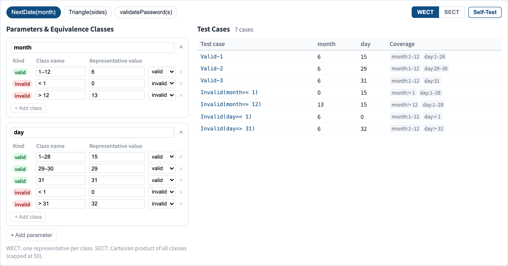
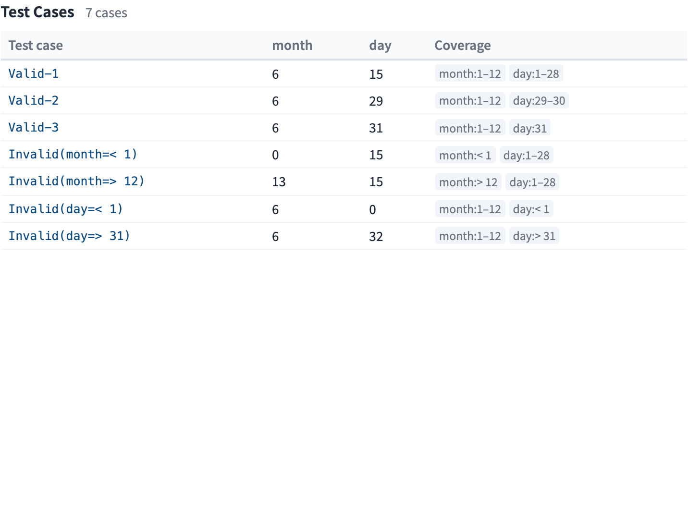

# Equivalence Partitioning
### One test per class of "the same kind of input"

Software Testing Visualization series #20
Companion tool: `/section-blackbox` ([EquivalenceClassExplorer](../../src/components/EquivalenceClassExplorer.js))

<!-- BVA (#19) tested the edges; this lecture tests the *interiors*. Together they cover an input domain. -->

---

## Why this lecture exists

- BVA (#19) tests the edges — but not *which interior values* to pick.
- The input space is huge; most values are **redundant** — the program treats them identically.
- If two inputs travel the same code path, testing both is waste.
- Equivalence partitioning groups inputs into **classes**, then tests **one representative per class.**

---

## The core idea

Partition the input domain so that, within a class, **any value is as good as any other**:

```
 month input
 │ < 1   │   1 … 12   │   > 12  │
 │invalid│   valid    │ invalid │
     ▲         ▲           ▲
   one test per class — the representative
```

If the program would handle `3` and `9` the same way, one test stands for both.

---

## Valid and invalid classes

Every input dimension splits into two kinds of class:

- **Valid classes** — inputs the program should *accept and process*.
- **Invalid classes** — inputs the program should *reject* (and reject *correctly*).

A frequent bug source: developers test the valid classes and forget the invalid ones. Each invalid class is a required test.

---

## Worked example: `NextDate(month)`

| Class | Kind | Representative |
| --- | --- | --- |
| `month < 1` | invalid | `0` |
| `month 1–12` | valid | `6` |
| `month > 12` | invalid | `13` |

Three classes → three tests. Adding `day` and `year` dimensions multiplies the classes — which raises the *combination* question below.

---

## Weak vs strong equivalence class testing

With multiple input variables, "one representative per class" can mean two things:

- **Weak ECT (WECT):** cover every class of every variable **at least once** — variables varied independently. Test count ≈ the largest class count among variables.
- **Strong ECT (SECT):** cover every **combination** of classes across variables — the Cartesian product.

WECT is cheap and single-fault-assuming; SECT is thorough but explodes combinatorially.

---

## WECT vs SECT — the trade-off

For `month` (3 classes) × `day` (3 classes):

- **WECT:** 3 tests — each test picks a fresh class for *both* variables in parallel.
- **SECT:** 3 × 3 = 9 tests — every class pair.

WECT assumes faults are **single-variable**. SECT catches **interaction** faults — at combinatorial cost. Pairwise testing (#23) is the middle ground.

---

## Equivalence partitioning + BVA together

The two black-box techniques compose:

1. **Partition** the domain into equivalence classes (this lecture).
2. For each class, take its **boundary values** (#19) *and* a nominal representative.

Partitioning decides *which regions*; BVA decides *which points within each region*. Used together they give a small, defensible suite.

---

## Tool demonstration

In `/section-blackbox`, open the **Equivalence Class Explorer**:

1. Pick an example and read its valid / invalid classes.
2. Switch between **WECT** and **SECT** — watch the test count change.
3. Edit a partition: split or merge a class and see the suite update.
4. Note the representative chosen for each class.

---

## Tool — valid and invalid classes



Each parameter partitioned into equivalence classes, each with a representative.

---

## Tool — the derived test suite



WECT versus SECT — one test per class against one per combination.

---


## Summary

- Partition the input domain into **classes the program treats alike**.
- Test **one representative per class** — and never skip the **invalid** classes.
- **WECT** = each class once (single-fault); **SECT** = every class combination (interaction faults).
- Compose with BVA (#19): partitioning picks regions, BVA picks the points.

**In-class exercise:** for a password field (length 8–64, must contain a digit), list the valid and invalid classes. How many WECT tests?

---

## Further reading

- Course specification — black-box design chapter ([Specification.zh-TW.md](../Specification.zh-TW.md))
- Jorgensen, *Software Testing: A Craftsman's Approach* — equivalence class testing
- Tool source: [EquivalenceClassExplorer.js](../../src/components/EquivalenceClassExplorer.js)
- Related: **#19 Boundary Value Analysis** · **#23 Pairwise Testing**
