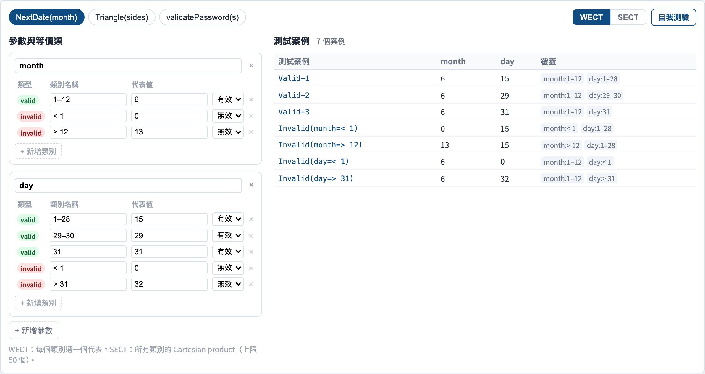
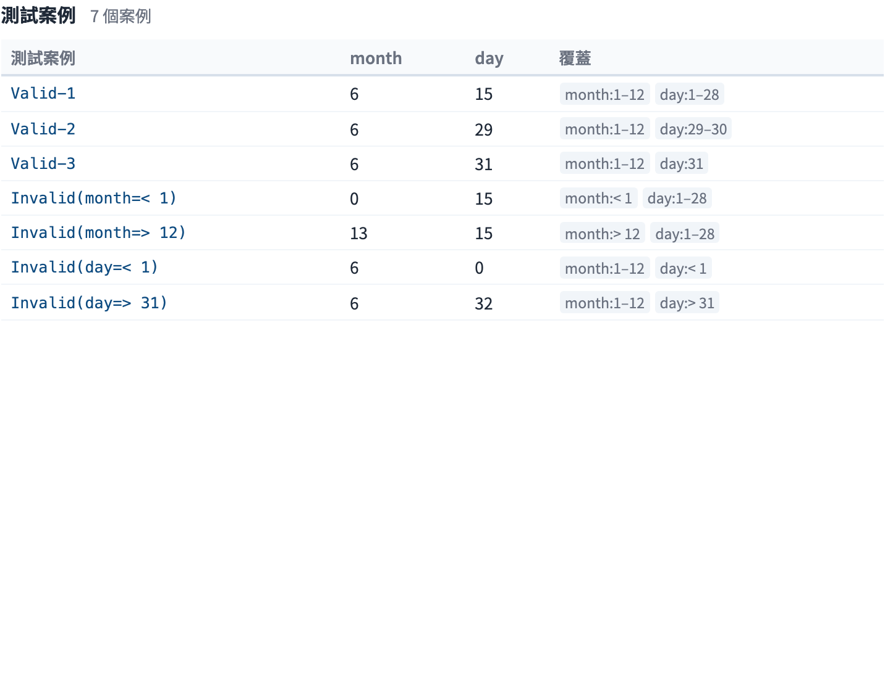

# 等價類分割
### 每一類「同一種輸入」測一個就好

軟體測試視覺化系列 #20
搭配工具：`/section-blackbox`（[EquivalenceClassExplorer](../../src/components/EquivalenceClassExplorer.js)）

<!-- BVA（#19）測邊緣；這一講測*內部*。兩者合起來覆蓋一個輸入域。 -->

---

## 為什麼有這一講

- BVA（#19）測邊緣 —— 但沒說*內部該挑哪些值*。
- 輸入空間極大；大多數值是**冗餘的** —— 程式對它們的處理一模一樣。
- 若兩個輸入走的是同一條程式路徑，兩個都測就是浪費。
- 等價類分割把輸入歸成**類別**，然後**每一類測一個代表**。

---

## 核心觀念

把輸入域分割，使得在同一類內**任一個值都和其他值一樣好**：

```
 month 輸入
 │ < 1   │   1 … 12   │   > 12  │
 │ 無效  │   有效     │  無效   │
     ▲         ▲           ▲
   每一類測一個 —— 那個代表值
```

若程式處理 `3` 與 `9` 的方式相同，一個測試就能代表兩者。

---

## 有效類與無效類

每個輸入維度都分成兩種類別：

- **有效類** —— 程式應該*接受並處理*的輸入。
- **無效類** —— 程式應該*拒絕*（而且要*正確地*拒絕）的輸入。

一個常見的 bug 來源：開發者測了有效類，卻忘了無效類。每一個無效類都是一個必要測試。

---

## 例題：`NextDate(month)`

| 類別 | 種類 | 代表值 |
| --- | --- | --- |
| `month < 1` | 無效 | `0` |
| `month 1–12` | 有效 | `6` |
| `month > 12` | 無效 | `13` |

三個類別 → 三個測試。加入 `day` 與 `year` 維度會讓類別數相乘 —— 這就帶出下面的*組合*問題。

---

## 弱 vs 強等價類測試

有多個輸入變數時，「每類一個代表」可以有兩種意思：

- **弱等價類測試（WECT）：** 每個變數的每個類別都**至少涵蓋一次** —— 變數獨立變動。測試數 ≈ 各變數中最多類別的那個數。
- **強等價類測試（SECT）：** 涵蓋跨變數的每一個類別**組合** —— 笛卡兒積。

WECT 便宜、假設單一錯誤；SECT 徹底但組合爆炸。

---

## WECT vs SECT —— 取捨

對 `month`（3 類）× `day`（3 類）：

- **WECT：** 3 個測試 —— 每個測試同時替*兩個*變數各挑一個新類別。
- **SECT：** 3 × 3 = 9 個測試 —— 每一對類別組合。

WECT 假設錯誤是**單變數**的。SECT 抓**互動**錯誤 —— 代價是組合成本。成對測試（#23）是中間路線。

---

## 等價類分割 + BVA 一起用

兩個黑盒技術可以組合：

1. **分割**輸入域成等價類（這一講）。
2. 對每一類，取它的**邊界值**（#19）*以及*一個標稱代表。

分割決定*哪些區域*；BVA 決定*每個區域內的哪些點*。兩者合用，得到一個小而站得住腳的套件。

---

## 工具演示

在 `/section-blackbox` 開啟**等價類探索器**：

1. 挑一個例子，看它的有效／無效類。
2. 在 **WECT** 與 **SECT** 之間切換 —— 看測試數變化。
3. 編輯一個分割：切開或合併一個類別，看套件更新。
4. 注意每個類別所選的代表值。

---

## 工具 —— 有效類與無效類



每個參數切成數個等價類，各有一個代表值。

---

## 工具 —— 推導出的測試套件



WECT 對 SECT —— 每類一個測試，對上每種組合一個。

---


## 小結

- 把輸入域分割成**程式一視同仁的類別**。
- **每一類測一個代表** —— 而且永不跳過**無效**類。
- **WECT** ＝ 每類一次（單一錯誤）；**SECT** ＝ 每個類別組合（互動錯誤）。
- 與 BVA（#19）組合：分割挑區域，BVA 挑點。

**課堂練習：** 對一個密碼欄位（長度 8–64、須含數字），列出有效與無效類。WECT 要幾個測試？

---

## 延伸閱讀

- 課程規格 —— 黑盒設計章節（[Specification.zh-TW.md](../Specification.zh-TW.md)）
- Jorgensen, *Software Testing: A Craftsman's Approach* —— 等價類測試
- 工具原始碼：[EquivalenceClassExplorer.js](../../src/components/EquivalenceClassExplorer.js)
- 相關：**#19 邊界值分析** · **#23 成對測試**
