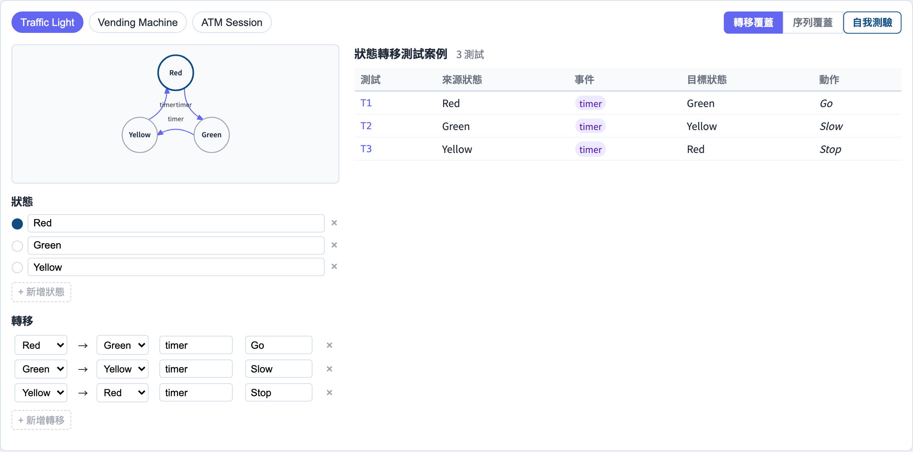
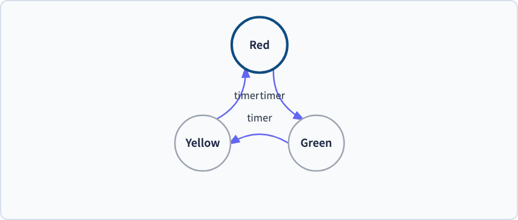

# 狀態遷移測試
### 當同一個輸入會做不同的事

軟體測試視覺化系列 #22
搭配工具：`/section-blackbox`（[StateTransitionExplorer](../../src/components/StateTransitionExplorer.js)）

<!-- 決策表（#21）處理組合邏輯；這一講處理*循序*邏輯 —— 順序與歷史都有關係。 -->

---

## 為什麼有這一講

- 決策表（#21）假設輸出只取決於**當下的輸入**。
- 但許多系統有**記憶**：媒體播放器的「播放」鍵，在播放中與暫停中意義不同。
- 同一個事件，會因**歷史**而產生不同結果。
- 狀態遷移測試把那份記憶明確建模 —— 成為一台機器。

---

## 模型：有限狀態機

四個元素：

| 元素 | 意義 |
| --- | --- |
| **狀態（State）** | 系統可以處於的一種模式 |
| **事件（Event）** | 可能造成改變的輸入 |
| **轉移（Transition）** | `(狀態, 事件) → 下一狀態` |
| **動作／輸出** | 系統在轉移時發出的東西 |

```
  紅 ──timer──▶ 綠 ──timer──▶ 黃 ──timer──▶ 紅
```

一張轉移圖*就是*測試的基礎。

---

## 例題：一個紅綠燈

狀態：`紅`、`綠`、`黃`。一個事件：`timer`。

| 從 | 事件 | 到 | 動作 |
| --- | --- | --- | --- |
| 紅 | timer | 綠 | 「行」 |
| 綠 | timer | 黃 | 「慢」 |
| 黃 | timer | 紅 | 「停」 |

三個狀態、三條轉移。真實系統（自動販賣機、ATM 交易）不過是每樣多一些。

---

## 機器上的覆蓋準則

我們要多徹底地操練這台機器？

- **狀態覆蓋** —— 每個狀態至少到訪一次。最弱。
- **轉移覆蓋** —— 每條轉移至少觸發一次。常見的基準；它涵蓋狀態覆蓋。
- **轉移對覆蓋** —— 每一對連續的轉移。抓「目標狀態錯誤」的缺陷。
- **來回／路徑覆蓋** —— 每個迴圈或完整路徑。最強、最大。

多數團隊以**轉移覆蓋**為目標，並把它當成地板。

---

## 為什麼轉移覆蓋重要

一條轉移可能**遺失**、走到**錯誤狀態**，或發出**錯誤動作**。

- *狀態覆蓋*可能從另一條路線到訪某狀態，從未測到通往它的那條壞掉的轉移。
- *轉移覆蓋*強迫每個 `(狀態, 事件)` 邊都觸發 —— 所以遺失或走錯的轉移會被抓到。

轉移圖也會暴露**無效事件** —— 在 `Idle` 時按「退出」—— 那本身就是測試。

---

## 生成測試序列

一個測試案例就是**穿過機器的一條路徑** —— 從起始狀態出發的一串事件：

```
紅 → (timer) 綠 → (timer) 黃 → (timer) 紅
```

- 每一步檢查：我們落在預期的狀態了嗎？發出了預期的動作嗎？
- 轉移覆蓋＝一組路徑，合起來觸發每一條邊。
- 這是**模型驅動測試**的黑盒源頭 —— 見整個 #L 系列。

---

## 工具演示

在 `/section-blackbox` 開啟**狀態遷移探索器**：

1. 載入**紅綠燈**（或**自動販賣機**、**ATM**）機器。
2. 看那張 SVG 狀態圖 —— 狀態是節點、轉移是邊。
3. 在**狀態覆蓋**與**轉移覆蓋**之間切換，讀生成的序列。
4. 試一個無效事件，看它沒有對應的轉移。

---

## 工具 —— 狀態機



狀態、事件與轉移，附生成的覆蓋序列。

---

## 工具 —— 狀態圖



狀態是節點、轉移是邊 —— 無效事件沒有邊。

---


## 小結

- 當行為取決於**歷史**、而非只取決於當下輸入時，用狀態遷移測試。
- 模型＝**狀態、事件、轉移、動作** —— 一台有限狀態機。
- 覆蓋階梯：狀態 ⊂ 轉移 ⊂ 轉移對 ⊂ 來回。
- **轉移覆蓋**是實務基準；一個測試案例就是穿過機器的一條路徑。

**課堂練習：** 建模一個媒體播放器（`Stopped`、`Playing`、`Paused`）。列出每一條轉移。哪些 `(狀態, 事件)` 是無效的？

---

## 延伸閱讀

- 課程規格 —— 黑盒設計章節（[Specification.zh-TW.md](../Specification.zh-TW.md)）
- Binder, *Testing Object-Oriented Systems* —— 基於狀態的測試
- 工具原始碼：[StateTransitionExplorer.js](../../src/components/StateTransitionExplorer.js)
- 相關：**#21 決策表**（組合）· **#L2 FSM 測試生成**（模型驅動）
