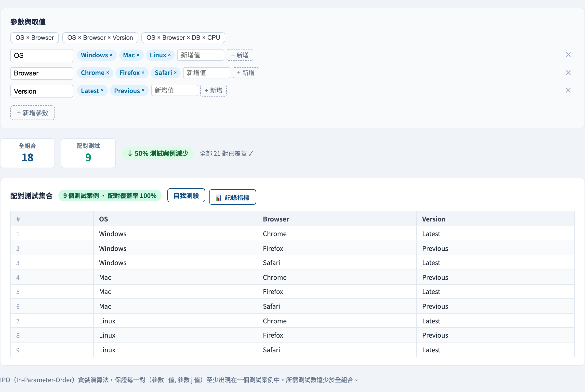
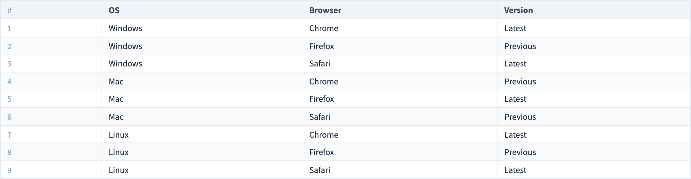

# 成對測試（Pairwise Testing）
### 測每一*對*，而非每一個*組合*

軟體測試視覺化系列 #23
搭配工具：`/section-blackbox`（[PairwiseExplorer](../../src/components/PairwiseExplorer.js)）

<!-- 這一講回答等價類分割（#20）提出的問題：如何在不做笛卡兒積的情況下測互動？ -->

---

## 為什麼有這一講

- 組態空間會爆炸：3 OS × 3 瀏覽器 × 2 版本 × 4 語系 ＝ **72** 個組合。
- 全部都測（窮舉／SECT，#20）不可行。
- 孤立地各測一個值，又會漏掉**互動**錯誤。
- 成對測試是有實證支持的中間路線。

---

## 實證觀察

對真實缺陷資料的研究（NIST 等）發現：

- 大多數互動錯誤是由**僅僅兩個**參數的互動觸發的。
- 需要三個以上參數互動才會出現的錯誤，相對罕見。

> 若大多數 bug 藏在*成對*之中，那就涵蓋**每一對** —— 然後就停在那裡。

這是一個**啟發法**，不是證明 —— 但出奇地有效。

---

## 成對覆蓋的意思

一個測試套件具有**成對（2-way）覆蓋**，若：

> 對*任兩個參數*，它們值的*每一個組合*都在*至少一個*測試中一起出現。

你不是在涵蓋每一個完整組合 —— 只涵蓋每一**對**值。同一個測試會重用它的值，一次滿足許多對。

---

## 例題：OS × 瀏覽器 × 版本

3 × 3 × 2 ＝ **18** 個窮舉組合。成對套件需要的少得多：

| 測試 | OS | 瀏覽器 | 版本 |
| --- | --- | --- | --- |
| 1 | Windows | Chrome | 最新 |
| 2 | Windows | Firefox | 前一版 |
| 3 | Mac | Chrome | 前一版 |
| 4 | Mac | Safari | 最新 |
| 5 | Linux | Firefox | 最新 |
| 6 | Linux | Safari | 前一版 |
| … | … | … | … |

約 9 個測試就涵蓋了**每一對 (OS,瀏覽器)、(OS,版本)、(瀏覽器,版本)** —— 窮舉數的一半，而且它是對數成長，不是相乘成長。

---

## 報酬：次線性成長

| 參數數 | 窮舉 | 成對 |
| --- | --- | --- |
| 3（各 3 值） | 27 | ~9 |
| 5 | 243 | ~13 |
| 10 | 59,049 | ~15 |

窮舉**相乘**成長；成對大致**對數**成長。那道差距正是這個技術存在的全部理由。

---

## 優點與限制

**優點**
- 大幅縮減測試，同時有強實證的缺陷覆蓋。
- 工具能從參數清單自動生成套件。

**限制**
- 一個**啟發法** —— 它可能漏掉一個真正的三方互動錯誤。
- 要更高保證，就用 **t-way** 覆蓋（`t = 3, 4 …`），代價更高。
- 需要先有參數模型 —— 參數爛、套件就爛。

---

## 工具演示

在 `/section-blackbox` 開啟**成對探索器**：

1. 挑一個預設（`OS × 瀏覽器`，再加上 `版本`）。
2. 比較**窮舉**數與生成的**成對**套件。
3. 任挑兩個參數 —— 確認每一對值都出現在某個測試中。
4. 加一個參數，看套件只微幅成長。

---

## 工具 —— 窮舉對上成對

參數與值，窮舉數就在縮減數旁邊。

---

## 工具 —— 成對套件

每一對值都出現在某一列 —— 只花窮舉成本的一小部分。

---

## 小結

- 大多數互動 bug 牽涉**兩個**參數 —— 所以涵蓋**每一對**。
- 成對（2-way）覆蓋：每個參數*對*的每個值組合都出現在某個測試中。
- 成長約為對數、而非相乘 —— 這是相對於窮舉／SECT 的關鍵優勢。
- 它是啟發法；當兩方保證不夠時，升到 **t-way**。

**課堂練習：** 一個表單有 4 個參數、各 3 個值。窮舉＝81。估算成對套件大小，再用工具驗證。

---

## 延伸閱讀

- 課程規格 —— 組合測試章節（[Specification.zh-TW.md](../Specification.zh-TW.md)）
- Kuhn, Kacker & Lei, *Practical Combinatorial Testing*（NIST, 2010）
- 工具原始碼：[PairwiseExplorer.js](../../src/components/PairwiseExplorer.js)
- 相關：**#20 等價類分割**（WECT vs SECT）· **#24 因果圖**
