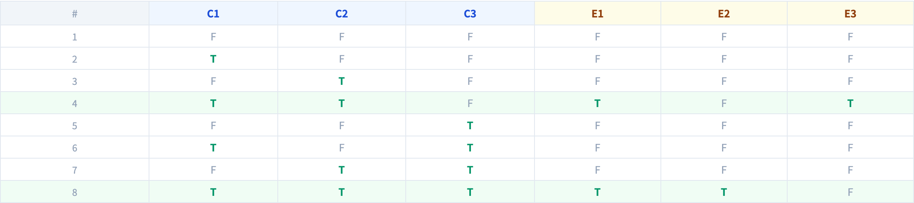

# 因果圖（Cause-Effect Graphing）
### 從邏輯規格到測試套件，有方法可循

軟體測試視覺化系列 #24
搭配工具：`/section-blackbox`（[CauseEffectExplorer](../../src/components/CauseEffectExplorer.js)）

<!-- 這一講是橋樑：它說明決策表（#21）不是憑空發明的，而是從規格的邏輯模型*推導*出來的。 -->

---

## 為什麼有這一講

- 決策表（#21）很強大 —— 但它的列是從哪來的？
- 對邏輯繁重的需求，你需要一個有紀律的方法去**萃取**條件與結果。
- 因果圖把規格建模成一個**布林網路**：原因 → 邏輯 → 結果。
- 從那個網路，你*有系統地*推導出決策表 —— 與測試 —— 而非靠猜。

---

## 原因與結果

| 術語 | 意義 |
| --- | --- |
| **原因（Cause）** | 一個獨立的輸入條件（一個布林值） |
| **結果（Effect）** | 一個獨立的輸出／系統動作 |
| **圖（Graph）** | 把原因接到結果的布林邏輯（`AND`、`OR`、`NOT`） |

```
 C1 ─┐
     AND──▶ E1
 C2 ─┘
```

把規格讀一遍；替每一個原因與每一個結果命名。

---

## 例題：一個結帳系統

**原因：** C1 使用者已登入 · C2 購物車非空 · C3 付款有效。

**結果**，每一個都是對原因的布林公式：

| 結果 | 公式 |
| --- | --- |
| E1 顯示結帳 | `C1 AND C2` |
| E2 處理訂單 | `C1 AND C2 AND C3` |
| E3 顯示錯誤 | `C1 AND C2 AND NOT C3` |

這張圖讓規格**以邏輯的形式可執行** —— 不再留下散文的含糊。

---

## 從圖到決策表

每一組原因值的組合是一欄；對每個結果公式求值：

| | C1 | C2 | C3 | E1 | E2 | E3 |
| --- | --- | --- | --- | --- | --- | --- |
| R1 | T | T | T | ✓ | ✓ | – |
| R2 | T | T | F | ✓ | – | ✓ |
| R3 | T | F | * | – | – | – |
| R4 | F | * | * | – | – | – |

因果圖**生成**決策表；決策表**生成**測試。從規格到套件，一條不斷的鏈。

---

## 約束會剪掉不可能的欄

真實的原因不總是獨立的。因果圖加上**約束（constraints）**：

- **E（互斥）** —— 這些原因中至多一個為真。
- **I（包含）** —— 至少一個為真。
- **R（要求）** —— 原因 A 為真，要求原因 B 為真。
- **O（唯一）** —— 恰好一個為真。

約束在你還沒浪費一個測試之前，就把物理上不可能的欄刪掉 —— 例如「全額付清」與「分文未付」不可能同時為真。

---

## 它在黑盒技術中的定位

- **等價類分割／BVA** —— 一次處理一個輸入*維度*。
- **因果圖** —— 處理輸入*之間的邏輯關係*。
- **決策表** —— 因果圖產生的表格形式。

因果圖是**建模**步驟；決策表是它的**產出**。當需求是一團互相牽動的布林條件時，就用它。

---

## 工具演示

在 `/section-blackbox` 開啟**因果圖探索器**：

1. 讀結帳的原因（C1–C3）與結果（E1–E3）及其公式。
2. 編輯一個結果公式，看推導出的決策表更新。
3. 加一個約束，看不可能的欄消失。
4. 從每一條存活的規則讀出一個測試案例。

---

## 工具 —— 原因、結果、公式


原因透過布林公式接到結果。

---

## 工具 —— 推導出的決策表



圖編譯成一張決策表 —— 每條存活規則一個測試。

---


## 小結

- 因果圖把規格建模為**原因 → 布林邏輯 → 結果**。
- 它*有系統地***推導**出決策表 —— 列不是用猜的。
- **約束**（E、I、R、O）刪除物理上不可能的組合。
- 鏈：規格 → 因果圖 → 決策表 → 測試案例。

**課堂練習：** 為一次 ATM 提款（卡片有效 · PIN 正確 · 餘額足夠）寫出因果公式。加一個約束。

---

## 延伸閱讀

- 課程規格 —— 黑盒設計章節（[Specification.zh-TW.md](../Specification.zh-TW.md)）
- Myers, *The Art of Software Testing* —— 因果圖
- 工具原始碼：[CauseEffectExplorer.js](../../src/components/CauseEffectExplorer.js)
- 相關：**#21 決策表測試**（產出形式）· **#5 邏輯覆蓋**
