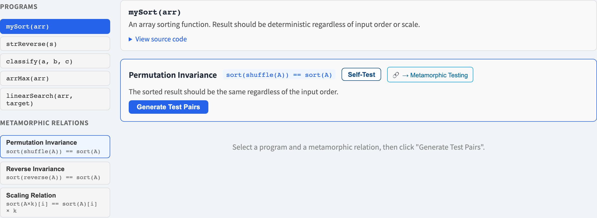
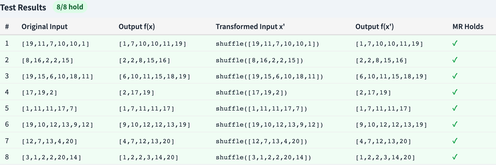

# Metamorphic Testing
### Testing when you don't know the right answer

Software Testing Visualization series #25
Companion tool: `/section-blackbox` ([MetamorphicTestingExplorer](../../src/components/MetamorphicTestingExplorer.js))

<!-- This lecture confronts the oracle problem head-on. It is the technique for software whose output you cannot independently predict. -->

---

## Why this lecture exists

- Every test needs an **oracle** — a way to know if the output is correct.
- But what is the *correct* result of a search ranking? a physics simulation? `sin(1.2345)`?
- Sometimes there is **no feasible oracle** — this is the **oracle problem**.
- Metamorphic testing tests such programs *anyway*, without ever computing the expected answer.

---

## The key idea: a metamorphic relation

Don't ask *"is this output correct?"* Ask *"do these outputs **relate** correctly?"*

A **metamorphic relation (MR)** is a property linking the outputs of *related* inputs:

```
  input x  ──f──▶  output f(x)
     │                  │
   transform        related by an MR
     │                  │
  input x' ──f──▶  output f(x')
```

You never need `f(x)` itself — only that `f(x)` and `f(x')` obey the relation.

---

## Classic examples of metamorphic relations

| Program | Transform the input… | …the output must |
| --- | --- | --- |
| `sin(x)` | `x → x + 2π` | stay equal |
| `sin(x)` | `x → π − x` | stay equal |
| Search engine | add an unrelated word | return *fewer or equal* results |
| Shortest path | add an edge | distance must *not increase* |
| `sum(list)` | shuffle the list | stay equal |

None of these needs the *true* answer — only a relation between two runs.

---

## Worked example: a `max` function

Suppose you cannot easily verify `max(list)` directly. Use MRs:

- **Permutation:** `max(shuffle(L)) == max(L)` — order must not matter.
- **Append a bigger element:** `max(L + [m]) == m` when `m > max(L)`.
- **Duplicate:** `max(L + L) == max(L)`.

Run each pair; if any relation breaks, the program has a defect — **even though you never stated the expected maximum.**

---

## A failing relation localizes the bug

If `max(shuffle(L)) ≠ max(L)`, you have learned something precise:

- The program's result **depends on input order** when it must not.
- The defect is in code sensitive to position — perhaps it returns the *last* element on a tie, or scans incompletely.

A broken MR is not just "a failure" — it names the *kind* of fault.

---

## Strengths and limits

**Strengths**
- Solves the **oracle problem** — tests the otherwise-untestable.
- MRs are reusable across many inputs and often across similar programs.
- Pairs naturally with property-based testing (#G5 / PBT).

**Limits**
- Finding good MRs needs **domain insight** — the technique does not invent them.
- A passing MR is *necessary, not sufficient*: a wrong program can still satisfy a weak relation.
- Use several MRs together — each one rules out a class of faults.

---

## Tool demonstration

In `/section-blackbox`, open the **Metamorphic Testing Explorer**:

1. Pick a program and read its metamorphic relations.
2. For one MR, see the source input, the transformed input, and both outputs.
3. Confirm the relation holds — without an expected-value column anywhere.
4. Note how one MR generates many test pairs.

---

## Tool — metamorphic relations



A program and the metamorphic relations its outputs must satisfy.

---

## Tool — source and follow-up runs



Source input, transformed input, both outputs — and no expected-value column.

---


## Summary

- The **oracle problem**: sometimes you cannot compute the expected output.
- A **metamorphic relation** links the outputs of related inputs — test the *relation*, not the value.
- A broken MR localizes the *kind* of fault; a passing MR is necessary, not sufficient.
- Use **multiple MRs**; each rules out a different fault class.

**In-class exercise:** name two metamorphic relations for a function that computes the average of a list.

---

## Further reading

- Course specification — advanced black-box chapter ([Specification.zh-TW.md](../Specification.zh-TW.md))
- Chen, Cheung & Yiu, *Metamorphic Testing* (1998); Segura et al. survey (2016)
- Tool source: [MetamorphicTestingExplorer.js](../../src/components/MetamorphicTestingExplorer.js)
- Related: **#G5 Property-Based Testing** — sampled inputs checked against properties
