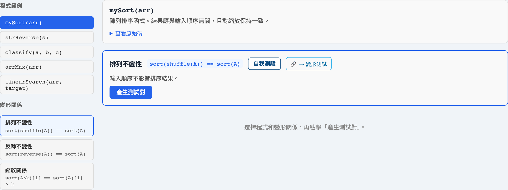
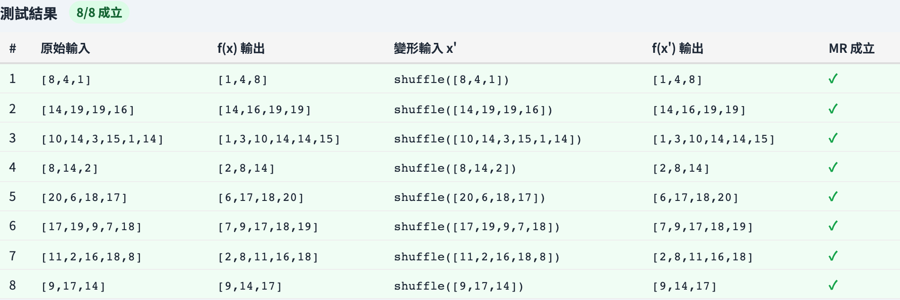

# 蛻變測試（Metamorphic Testing）
### 當你不知道正確答案時，怎麼測

軟體測試視覺化系列 #25
搭配工具：`/section-blackbox`（[MetamorphicTestingExplorer](../../src/components/MetamorphicTestingExplorer.js)）

<!-- 這一講正面迎戰預言難題（oracle problem）。它是用來測「輸出無法獨立預測」之軟體的技術。 -->

---

## 為什麼有這一講

- 每個測試都需要一個**預言（oracle）** —— 一個判定輸出是否正確的辦法。
- 但搜尋排序的*正確*結果是什麼？物理模擬呢？`sin(1.2345)` 呢？
- 有時候**根本沒有可行的預言** —— 這就是**預言難題**。
- 蛻變測試*仍然*能測這類程式 —— 從不需要算出預期答案。

---

## 關鍵觀念：蛻變關係

別問*「這個輸出對嗎？」*。要問*「這些輸出之間的**關係**對嗎？」*

一個**蛻變關係（MR）**是連結*相關*輸入之輸出的一條性質：

```
  輸入 x  ──f──▶  輸出 f(x)
     │                 │
   變換            由一條 MR 關聯
     │                 │
  輸入 x' ──f──▶  輸出 f(x')
```

你從不需要 `f(x)` 本身 —— 只需要 `f(x)` 與 `f(x')` 遵守那條關係。

---

## 蛻變關係的經典例子

| 程式 | 變換輸入… | …輸出必須 |
| --- | --- | --- |
| `sin(x)` | `x → x + 2π` | 維持相等 |
| `sin(x)` | `x → π − x` | 維持相等 |
| 搜尋引擎 | 加一個不相關的字 | 回傳*更少或相等*的結果 |
| 最短路徑 | 加一條邊 | 距離*不得增加* |
| `sum(list)` | 打亂列表 | 維持相等 |

這些都不需要*真正的*答案 —— 只需要兩次執行之間的一個關係。

---

## 例題：一個 `max` 函式

假設你無法輕易直接驗證 `max(list)`。用 MR：

- **排列：** `max(shuffle(L)) == max(L)` —— 順序必須無關緊要。
- **附加一個更大的元素：** 當 `m > max(L)` 時，`max(L + [m]) == m`。
- **重複：** `max(L + L) == max(L)`。

每一對都跑；若任一關係破裂，程式就有缺陷 —— **即使你從未說出預期的最大值。**

---

## 失敗的關係能定位 bug

若 `max(shuffle(L)) ≠ max(L)`，你學到了一件精確的事：

- 程式的結果在不該如此時，**取決於輸入順序**。
- 缺陷在對位置敏感的程式碼裡 —— 也許它在平手時回傳*最後*一個元素，或掃描不完整。

一條破裂的 MR 不只是「一個失敗」—— 它替缺陷的*種類*命名。

---

## 優點與限制

**優點**
- 解決**預言難題** —— 測那些原本無法測的東西。
- MR 可在許多輸入間重用，常也能在相似程式間重用。
- 與性質導向測試（#G5 / PBT）天然搭配。

**限制**
- 找到好的 MR 需要**領域洞察** —— 技術本身不會發明它們。
- 通過的 MR 是*必要、非充分*：錯誤的程式仍可能滿足一條弱關係。
- 一起用多條 MR —— 每一條排除一類缺陷。

---

## 工具演示

在 `/section-blackbox` 開啟**蛻變測試探索器**：

1. 挑一個程式，讀它的蛻變關係。
2. 對某一條 MR，看來源輸入、變換後的輸入，以及兩個輸出。
3. 確認關係成立 —— 任何地方都沒有「預期值」這一欄。
4. 注意一條 MR 如何生成許多測試對。

---

## 工具 —— 蛻變關係



一個程式，以及它的輸出必須滿足的蛻變關係。

---

## 工具 —— 來源與後續執行



來源輸入、變換後輸入、兩個輸出 —— 沒有預期值欄。

---


## 小結

- **預言難題**：有時你無法算出預期輸出。
- 一條**蛻變關係**連結相關輸入的輸出 —— 測那個*關係*，而非那個值。
- 破裂的 MR 定位缺陷的*種類*；通過的 MR 是必要、非充分。
- 用**多條 MR**；每一條排除不同的缺陷類別。

**課堂練習：** 為一個計算列表平均值的函式，說出兩條蛻變關係。

---

## 延伸閱讀

- 課程規格 —— 進階黑盒章節（[Specification.zh-TW.md](../Specification.zh-TW.md)）
- Chen, Cheung & Yiu, *Metamorphic Testing*（1998）；Segura 等人綜述（2016）
- 工具原始碼：[MetamorphicTestingExplorer.js](../../src/components/MetamorphicTestingExplorer.js)
- 相關：**#G5 性質導向測試** —— 對性質檢查取樣的輸入
