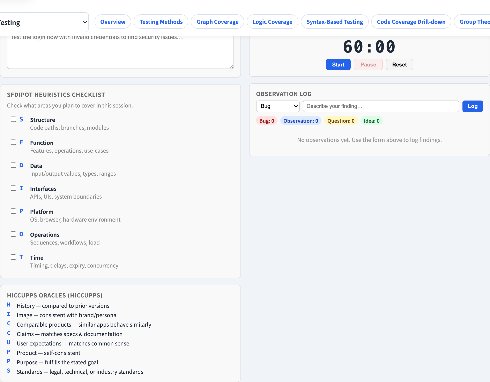
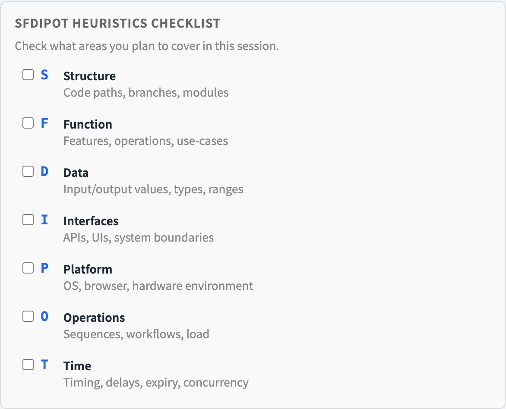

# Exploratory Testing
### Not "random clicking" — a disciplined skill

Software Testing Visualization series #26
Companion tool: `/section-blackbox` ([ExploratoryTestingExplorer](../../src/components/ExploratoryTestingExplorer.js))

<!-- The whole lecture fights one misconception: that exploratory testing is unstructured. It is structured — the structure just is not a pre-written script. -->

---

## Why this lecture exists

- Scripted techniques (#19–#24) design every test **before** running it.
- But a script only finds what its author already imagined.
- Exploratory testing **interleaves** learning, test design and execution — each test informs the next.
- The misconception to kill: exploratory ≠ unstructured. It is *disciplined*, just not *pre-scripted*.

---

## The definition

> **Exploratory testing** is simultaneous **learning**, test **design**, and test **execution** (Cem Kaner).

```
   learn ──▶ design ──▶ execute
     ▲                     │
     └─────────────────────┘
        each result feeds the next
```

The tester is the test-generation engine — adapting continuously, not following a list.

---

## Charters give it structure

An exploratory session is bounded by a **charter** — a short mission statement:

> *"Explore the **discount-code feature** with **invalid and expired codes** to discover **how it handles bad input**."*

A charter names: **what** to explore · **with which resources** · **to discover what information**. Time-boxed (e.g. 60–90 min). The charter is the structure — the steps inside it are not pre-written.

---

## SFDIPOT — a coverage model for exploration

To explore *thoroughly*, walk a model of the product. James Bach's **SFDIPOT**:

| | Dimension | Ask… |
| --- | --- | --- |
| **S** | Structure | what the product is *made of* |
| **F** | Function | what it *does* |
| **D** | Data | what it *processes* |
| **I** | Interfaces | how it is *operated* / connected |
| **P** | Platform | what it *depends on* |
| **O** | Operations | how it will be *used* in the field |
| **T** | Time | how *timing / sequence* affects it |

SFDIPOT turns "explore the product" into seven concrete angles.

---

## Heuristics — the tester's toolkit

Heuristics are reusable prompts that suggest *what to try next*. A classic set is **HICCUPPS** — does the product agree with its **H**istory, **I**mage, **C**omparable products, **C**laims, **U**ser expectations, the **P**roduct itself, the **P**urpose, **S**tandards?

Each mismatch is a candidate bug. Heuristics keep an exploratory session generating ideas instead of drying up.

---

## Where exploratory testing fits

It **complements** scripted testing — it does not replace it.

| Scripted testing | Exploratory testing |
| --- | --- |
| Repeatable, automatable | Adaptive, human-driven |
| Finds *known* risks | Finds *unanticipated* risks |
| Strong for regression | Strong for new / changed areas |

Use scripted tests for the regression net; use exploratory sessions where the risk is *unknown* — in Quadrant 3 of the agile testing quadrants (#M1).

---

## Tool demonstration

In `/section-blackbox`, open the **Exploratory Testing Explorer**:

1. Read a sample **charter** — note its mission shape.
2. Walk the **SFDIPOT** checklist — seven angles on the product.
3. Browse the **HICCUPPS** heuristics for next-test ideas.
4. Use the session timer and the observation log to keep it disciplined.

---

## Tool — a test charter and session



Charter, session timer and observation log keep exploration disciplined.

---

## Tool — the SFDIPOT touring checklist



Seven angles on the product — Structure, Function, Data, and four more.

---


## Summary

- Exploratory testing = simultaneous **learning + design + execution**, adapting as you go.
- It is **disciplined, not unstructured** — the discipline is the **charter**, not a script.
- **SFDIPOT** is a coverage model; **HICCUPPS** is a heuristic toolkit.
- It complements scripted testing — best where risk is unanticipated.

**In-class exercise:** write a charter for a feature you know. Then list one thing to try for each SFDIPOT letter.

---

## Further reading

- Course specification — exploratory testing chapter ([Specification.zh-TW.md](../Specification.zh-TW.md))
- Kaner, Bach & Pettichord, *Lessons Learned in Software Testing*
- Tool source: [ExploratoryTestingExplorer.js](../../src/components/ExploratoryTestingExplorer.js)
- Related: **#M1 Agile Testing Quadrants** (Q3 = exploratory)
