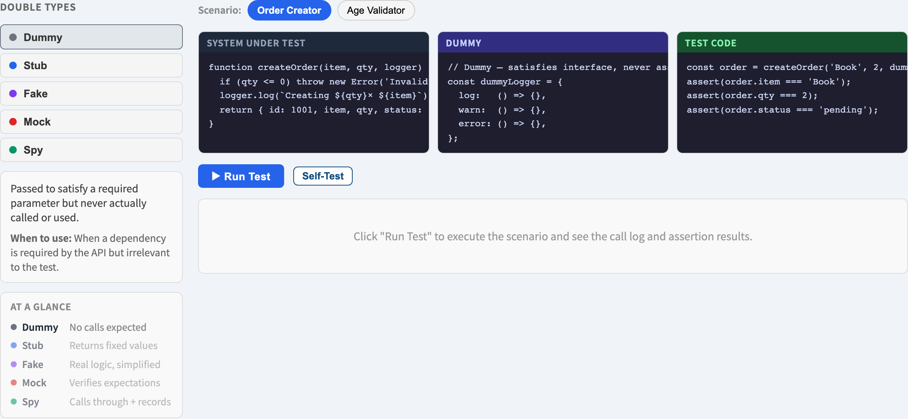
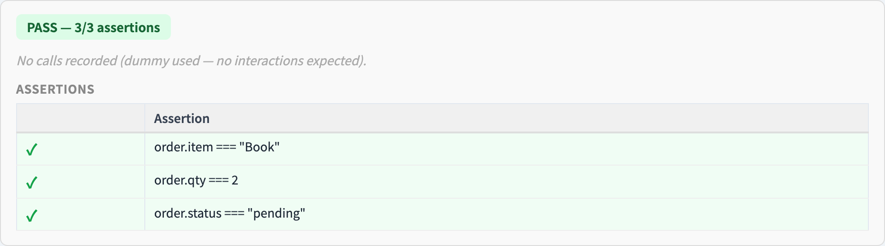

# Test Doubles
### Standing in for the dependencies

Software Testing Visualization series #27
Companion tool: `/section-blackbox` ([TestDoublesExplorer](../../src/components/TestDoublesExplorer.js))

<!-- The lecture's job: replace the vague word "mock" — which students use for everything — with five precise terms. -->

---

## Why this lecture exists

- A unit rarely runs alone: it calls a database, a payment API, a clock.
- A unit test must be **fast, deterministic and isolated** — it cannot wait on a real database.
- A **test double** stands in for a real dependency during the test.
- "Mock" is used loosely for *all* of them — this lecture gives you the five precise names.

---

## The problem: a unit and its collaborators

```
        ┌──────────────┐
        │  unit under  │──▶ payment API   (slow, real money)
        │    test      │──▶ database      (slow, shared state)
        └──────────────┘──▶ system clock  (non-deterministic)
```

Test the unit, not its collaborators. Replace each collaborator with a **double** you control.

---

## The five test doubles (Meszaros)

| Double | What it does | Used for |
| --- | --- | --- |
| **Dummy** | Passed but never used — fills a parameter slot | satisfying a signature |
| **Stub** | Returns canned answers to calls | controlling *inputs* to the unit |
| **Spy** | A stub that also **records** how it was called | checking calls *after the fact* |
| **Mock** | Pre-programmed with **expectations**; fails if they are not met | asserting interactions *as they happen* |
| **Fake** | A real, working — but simplified — implementation | a lightweight stand-in (e.g. in-memory DB) |

They form a ladder of increasing capability and coupling.

---

## State verification vs behavior verification

The five doubles split into two testing styles:

- **State verification** — run the unit, then **check the resulting state / return value**. Uses **dummies, stubs, fakes**.
- **Behavior verification** — assert that the unit **made the right calls** to its collaborators. Uses **spies and mocks**.

> *"Did it produce the right answer?"* vs *"Did it talk to its collaborators correctly?"*

---

## Worked example: an order service

`placeOrder()` validates a cart, charges a card, saves the order.

| Collaborator | Double | Why |
| --- | --- | --- |
| Logger | **Dummy** | needed in the constructor, irrelevant to the test |
| Pricing service | **Stub** | return a fixed total so the test is deterministic |
| Payment gateway | **Mock** | *assert* `charge(total)` was called exactly once |
| Order repository | **Fake** | an in-memory store — verify the order was saved |

One unit, four doubles — each chosen for what the test must control or check.

---

## The over-mocking trap

More doubles is **not** better:

- A test wired entirely to mocks tests the **wiring**, not the **behavior**.
- Such tests break on every refactor even when behavior is unchanged — **brittle** tests.
- Prefer **stubs/fakes + state verification**; reserve **mocks** for interactions that genuinely *are* the requirement (e.g. "payment must be charged exactly once").

Mock the **boundaries that matter**, not every collaborator.

---

## Tool demonstration

In `/section-blackbox`, open the **Test Doubles Explorer**:

1. Step through `dummy`, `stub`, `spy`, `mock`, `fake` — each with a code example.
2. For each, see what it replaces and what the test then checks.
3. Contrast a **stub** (controls input) with a **mock** (asserts a call).
4. Note which doubles support state vs behavior verification.

---

## Tool — the five test doubles



Dummy, stub, spy, mock, fake — each with a code example.

---

## Tool — a double in a running test



What the double replaces, and what the test then checks.

---


## Summary

- A **test double** replaces a real dependency so a unit test stays fast, isolated and deterministic.
- Five precise terms: **dummy · stub · spy · mock · fake** — "mock" is not a synonym for all of them.
- **Stubs/fakes** drive *state* verification; **spies/mocks** drive *behavior* verification.
- Avoid over-mocking — too many mocks make brittle tests that verify wiring, not behavior.

**In-class exercise:** for a function that emails a user after sign-up, which double fits the mail service — stub, mock, or fake? Justify it.

---

## Further reading

- Course specification — unit testing chapter ([Specification.zh-TW.md](../Specification.zh-TW.md))
- Meszaros, *xUnit Test Patterns* — the test double taxonomy
- Fowler, *Mocks Aren't Stubs* (2007)
- Tool source: [TestDoublesExplorer.js](../../src/components/TestDoublesExplorer.js)
- Related: **#16 Testing Levels** (unit & integration) · **#17 The Test Pyramid**
