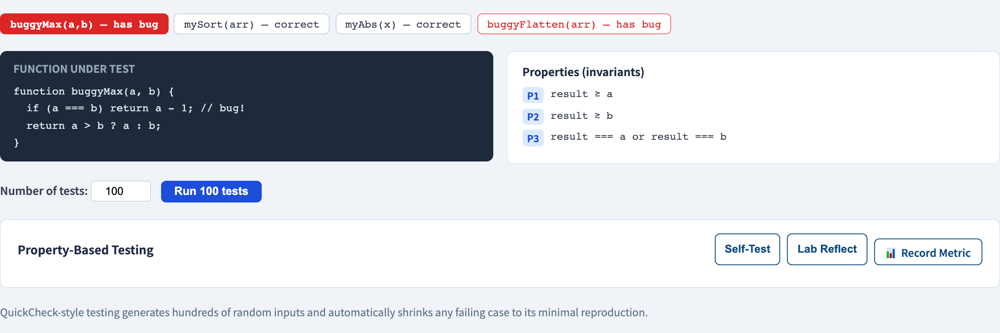
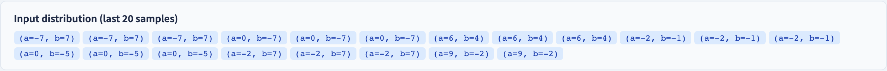

# Property-Based Testing
### State a property; let the machine hunt counter-examples

Software Testing Visualization series #29
Companion tool: `/section-pbt` ([PropertyBasedTestingExplorer](../../src/components/PropertyBasedTestingExplorer.js))

<!-- The shift from "example-based" to "property-based" thinking. The student already knows MR (#25); PBT is its operational, randomized cousin. -->

---

## Why this lecture exists

- An example-based test checks **one input** the author thought of.
- It finds bugs only in cases the author *imagined* — the corner you forgot stays untested.
- Property-based testing flips it: state a **general property**, then let a generator throw **hundreds of inputs** at it.
- The machine finds the corner you forgot.

---

## Example-based vs property-based

```
Example-based:   assert reverse([1,2,3]) == [3,2,1]
                 ↑ one input, one expected output

Property-based:  for ALL lists xs:
                     reverse(reverse(xs)) == xs
                 ↑ one property, hundreds of generated inputs
```

You stop *enumerating answers* and start *stating truths*.

---

## The three ingredients

| Ingredient | Role |
| --- | --- |
| **Generator** | Produces random inputs of the right shape (lists, ints, strings…) |
| **Property** | A boolean that must hold for *every* generated input |
| **Runner** | Runs the property on N inputs (e.g. 100); reports the first failure |

If all N pass, the property *survives*. If one fails, you have a **counter-example**.

---

## What makes a good property

Properties are often the same shapes as metamorphic relations (#25):

- **Round-trip:** `decode(encode(x)) == x`
- **Invariant:** `sort(xs)` is ordered, and is a permutation of `xs`
- **Idempotence:** `sort(sort(xs)) == sort(xs)`
- **Oracle comparison:** the fast implementation agrees with a slow, obviously-correct one
- **Algebraic law:** `abs(x) >= 0`; `length(xs ++ ys) == length(xs) + length(ys)`

A property is a truth that does not depend on *which* input you picked.

---

## Shrinking: from a mess to a minimal failure

When the generator finds a failing input, it is usually **large and noisy**:

```
fails on:  [17, -4, 88, 0, 3, -4, 51, 9]
```

The runner then **shrinks** it — repeatedly simplifying while the failure persists:

```
[17,-4,88,0,3,-4,51,9] → [-4,3,-4] → [-4,-4] → [a, a]
```

Shrinking hands you the **smallest** input that still fails — often the bug becomes obvious. This is property-based testing's killer feature.

---

## Worked example: a buggy `max`

Property: `for all a, b: max(a,b) >= a AND max(a,b) >= b`.

- The generator feeds 100 random `(a, b)` pairs.
- A `max` that mishandles negatives fails — say on `(-5, -2)`.
- Shrinking reduces it to a minimal pair like `(-1, 0)` or `(0, -1)`.
- You learn not just *that* it fails but the *simplest* case that triggers it.

---

## Strengths and limits

**Strengths**
- Explores far more of the input space than hand-written examples.
- **Shrinking** turns a random failure into a minimal, debuggable one.
- Properties double as precise, executable specifications.

**Limits**
- You must be able to *state* a property — needs the same insight as finding MRs.
- A weak property passes vacuously; randomness can miss a rare case.
- Pair with example-based tests for known critical cases.

---

## Tool demonstration

In `/section-pbt`, open the **Property-Based Testing Explorer**:

1. Pick a preset (`mySort`, `buggyMax`, …) and read its properties.
2. Run the suite — watch many generated inputs checked at once.
3. On a failing preset, watch the counter-example **shrink** to a minimal case.
4. Compare a buggy preset with a correct one.

---

## Tool — properties over generated inputs



A preset, its properties, and the generator that feeds them hundreds of inputs.

---

## Tool — a run and its shrunk counter-example



On failure, the counter-example shrinks to a minimal reproducing case.

---


## Summary

- Property-based testing replaces *one example* with *one property + many generated inputs*.
- Three parts: **generator**, **property**, **runner**.
- Good properties are round-trips, invariants, idempotence, oracle comparison, algebraic laws.
- **Shrinking** reduces a random failure to its minimal form — the headline feature.

**In-class exercise:** state two properties for a `merge(a, b)` function that merges two sorted lists.

---

## Further reading

- Course specification — property-based testing chapter ([Specification.zh-TW.md](../Specification.zh-TW.md))
- Claessen & Hughes, *QuickCheck* (2000) — the original property-based testing tool
- Tool source: [PropertyBasedTestingExplorer.js](../../src/components/PropertyBasedTestingExplorer.js) · [propertyTesting.js](../../src/utils/propertyTesting.js)
- Related: **#25 Metamorphic Testing** — properties as relations between runs
