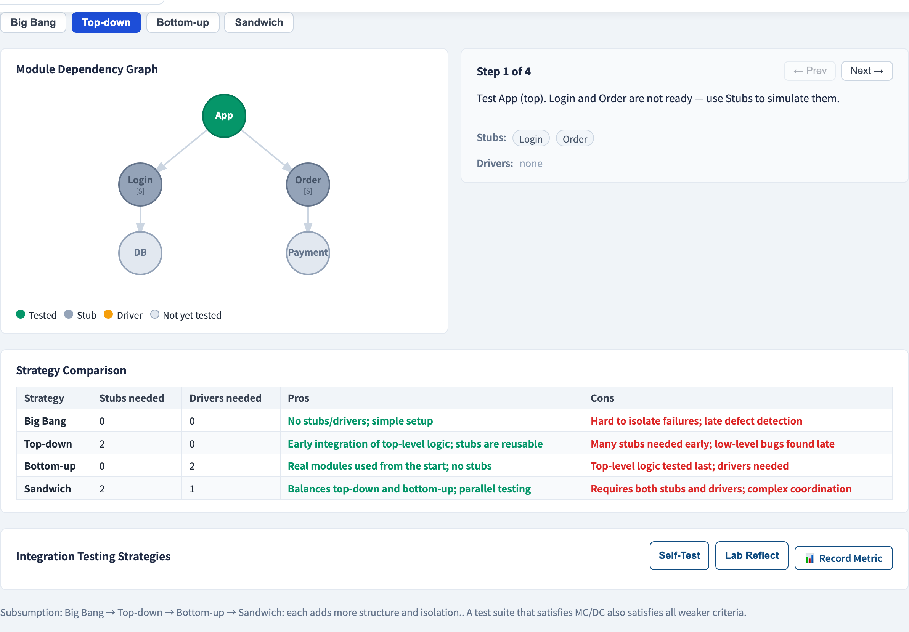
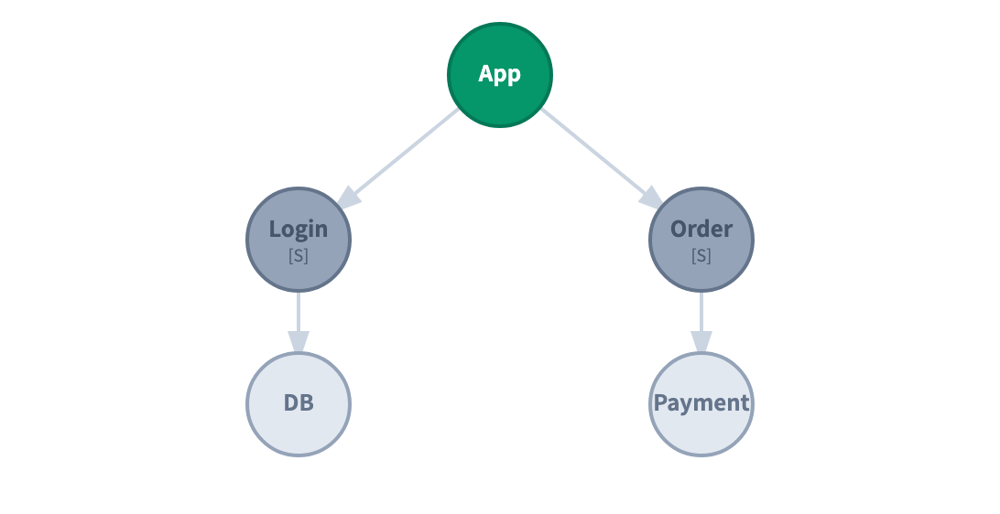

# Integration Testing
### Each module works — do they work *together*?

Software Testing Visualization series #30
Companion tool: `/section-inttest` ([IntegrationTestingExplorer](../../src/components/IntegrationTestingExplorer.js))

<!-- #16 named the integration level; this lecture is the how. The lecture's spine is the order-of-assembly question. -->

---

## Why this lecture exists

- Unit tests prove each module is correct *in isolation* (#16, #27).
- But defects also live in the **seams**: a mismatched contract, a wrong data format, an assumption one module makes about another.
- Integration testing exercises those seams.
- The central question: **in what order do we wire the modules together and test?**

---

## The module dependency graph

A system is a graph — modules call modules:

```
            App
           /    \
        Login    Order
         |         |
        DB       Payment
```

`App` depends on `Login` and `Order`; `Order` depends on `Payment`. The **assembly order** is a choice — and each choice is an integration *strategy*.

---

## Stubs and drivers — the scaffolding

To test a module before its neighbours exist, you build temporary scaffolding:

- **Stub** — stands in for a module *called by* the module under test (a *lower* dependency). It returns canned results.
- **Driver** — stands in for a module that *calls* the module under test (an *upper* caller). It invokes it with test inputs.

> Stub = "the callee isn't ready." Driver = "the caller isn't ready."

The strategy you choose determines how many of each you must build.

---

## Strategy 1 & 2: big-bang and top-down

**Big-bang** — integrate *everything at once*, then test.
- No stubs, no drivers. But a failure could be *anywhere* — it does not localize.

**Top-down** — start at `App`, work *downward*.
- Lower modules not yet integrated → replaced by **stubs**.
- Tests the top-level control flow early; needs many stubs.

---

## Strategy 3 & 4: bottom-up and sandwich

**Bottom-up** — start at the leaves (`DB`, `Payment`), work *upward*.
- Upper modules not yet present → replaced by **drivers**.
- Tests the foundational modules early; needs many drivers.

**Sandwich** — top-down *and* bottom-up meet in the middle.
- Balances stub and driver effort; common in practice.

| Strategy | Scaffolding | Localizes faults? |
| --- | --- | --- |
| Big-bang | none | poorly |
| Top-down | stubs | yes |
| Bottom-up | drivers | yes |
| Sandwich | both | yes |

---

## The trade-off

- **Big-bang** is cheapest to set up, worst to debug — a failure implicates the whole system.
- **Incremental** strategies (top-down / bottom-up / sandwich) cost scaffolding but **localize** failures: integrate one module, and a new failure is *about that module's seams*.
- More stubs/drivers = more localization = more setup cost. That is the dial.

Choose by which modules are riskiest and which are ready first.

---

## Tool demonstration

In `/section-inttest`, open the **Integration Testing Explorer**:

1. Read the module dependency graph (`App`, `Login`, `Order`, `DB`, `Payment`).
2. Switch strategy: **big-bang → top-down → bottom-up → sandwich**.
3. For each step, see which modules are tested and which are stubs / drivers.
4. Compare the stub count of top-down with the driver count of bottom-up.

---

## Tool — four integration strategies



Big-bang, top-down, bottom-up, sandwich — stepped over a module graph.

---

## Tool — the module dependency graph



Each step highlights modules under test, with their stubs and drivers.

---


## Summary

- Integration testing exercises the **seams between modules**, not the modules themselves.
- **Stub** replaces a callee not yet ready; **driver** replaces a caller not yet ready.
- Strategies: **big-bang** (no scaffolding, poor localization) vs **top-down / bottom-up / sandwich** (incremental, localizing).
- The trade-off is scaffolding cost vs fault localization.

**In-class exercise:** for the graph above, plan a top-down integration order. How many stubs at the first step?

---

## Further reading

- Course specification — integration testing chapter ([Specification.zh-TW.md](../Specification.zh-TW.md))
- Pressman, *Software Engineering: A Practitioner's Approach* — integration strategies
- Tool source: [IntegrationTestingExplorer.js](../../src/components/IntegrationTestingExplorer.js)
- Related: **#16 Testing Levels** · **#27 Test Doubles** (stubs at the unit level)
