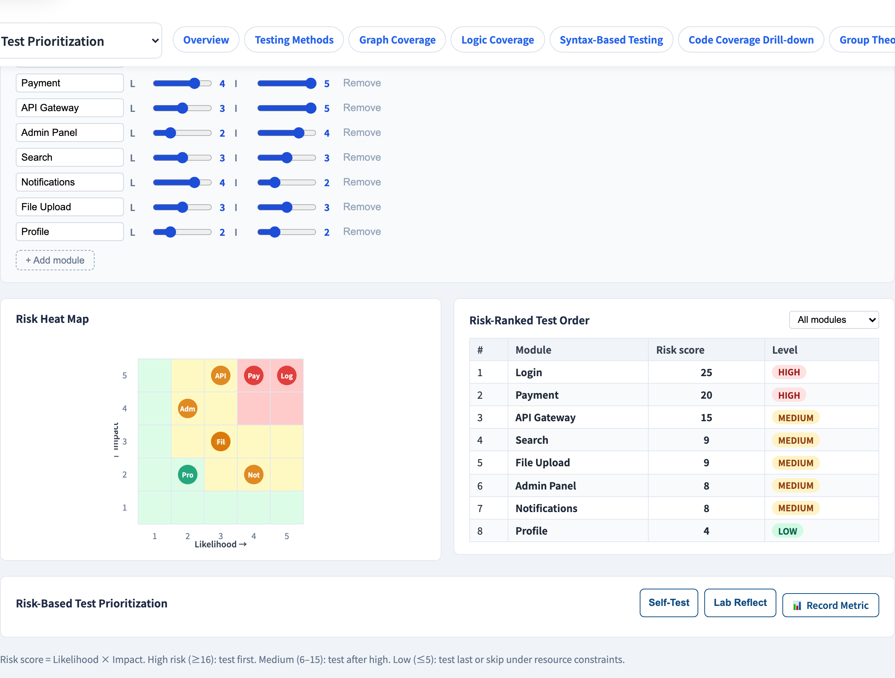
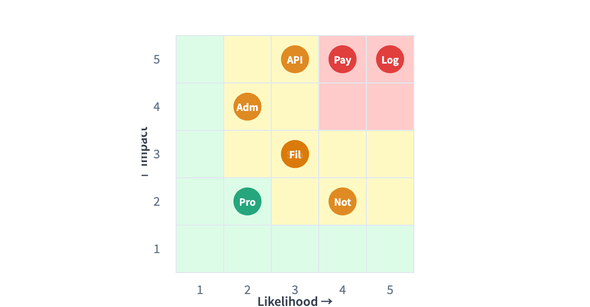

# Risk-Based Testing
### You cannot test everything — so test the riskiest first

Software Testing Visualization series #31
Companion tool: `/section-rbt` ([RiskBasedTestingExplorer](../../src/components/RiskBasedTestingExplorer.js))

<!-- A management-flavoured lecture. Every prior technique assumed "test this feature"; this one decides WHICH features get the budget. -->

---

## Why this lecture exists

- Exhaustive testing is impossible; the test budget is **always finite**.
- Treating every feature as equally important **wastes** that budget — and leaves real risk untested.
- Risk-based testing answers: *given limited time, where do we test first and hardest?*
- It makes prioritization **explicit and defensible**, not a gut feeling.

---

## What "risk" means here

Test risk has **two independent factors**:

- **Likelihood** — how probable is a defect in this area? (complexity, churn, new code, weak past quality)
- **Impact** — how bad is a failure here? (data loss, lost revenue, safety, reputation)

> Risk = **Likelihood × Impact**

A feature can be high-likelihood / low-impact (a flaky cosmetic widget) or low-likelihood / high-impact (a rarely-touched payment path) — *both* need attention, for different reasons.

---

## The risk matrix

Plot every feature on a Likelihood × Impact grid:

```
   Impact
    high │  monitor   │  TEST HARD  │
         │ ────────── │ ─────────── │
    low  │   skip     │   monitor   │
         └────────────┴─────────────┘
              low          high
                  Likelihood
```

- **Top-right** — high × high — gets the most testing.
- **Bottom-left** — low × low — gets the least.
- The two off-diagonal corners get measured judgement.

---

## Worked example: prioritizing a web app

| Feature | Likelihood | Impact | Risk |
| --- | --- | --- | --- |
| Login | 5 | 5 | **25** |
| Payment | 4 | 5 | **20** |
| API Gateway | 3 | 5 | **15** |
| Search | 3 | 3 | 9 |
| Notifications | 4 | 2 | 8 |
| Profile | 2 | 2 | 4 |

Sort by risk score. Login, Payment and the API Gateway claim the test budget first; Profile waits. The order is now a **number**, not an argument.

---

## Risk-based testing as a strategy

It is not a *technique* like BVA — it is a **prioritization layer over** all the techniques:

1. Identify features / areas; score each on likelihood and impact.
2. Rank by risk; allocate test depth proportionally.
3. For the high-risk items, apply the deep techniques (logic coverage, MC/DC, integration, exploratory).
4. **Re-score every iteration** — risk moves as code changes, incidents happen, deadlines shift.

Risk is a *living* ranking, not a one-time spreadsheet.

---

## Strengths and limits

**Strengths**
- Spends a finite budget where expected loss is highest.
- Makes "we didn't test X" a **conscious, recorded decision**, not an accident.
- Connects testing directly to business value.

**Limits**
- Scores are **estimates** — garbage in, garbage out.
- Risk is dynamic; a stale risk table is worse than none.
- A rare-but-catastrophic path can be under-weighted — review the high-impact column even when likelihood looks low.

---

## Tool demonstration

In `/section-rbt`, open the **Risk-Based Testing Explorer**:

1. Read the feature list with its likelihood and impact scores.
2. See each feature plotted on the **risk matrix**.
3. Re-score a feature and watch its risk and ranking move.
4. Read the prioritized test order off the sorted list.

---

## Tool — likelihood × impact



Each feature scored on likelihood and impact; risk is their product.

---

## Tool — the risk matrix



Features plotted on the heat-map — the top-right corner tests first.

---


## Summary

- The test budget is finite — **risk-based testing decides where it goes.**
- **Risk = Likelihood × Impact**; plot features on the risk matrix.
- It is a **prioritization layer**, applied over the concrete techniques — not a technique itself.
- Re-score every iteration; watch the high-impact column even at low likelihood.

**In-class exercise:** score three features of a product you know on likelihood and impact (1–5). Which gets tested first?

---

## Further reading

- Course specification — test strategy & risk chapter ([Specification.zh-TW.md](../Specification.zh-TW.md))
- ISTQB — risk-based testing
- Tool source: [RiskBasedTestingExplorer.js](../../src/components/RiskBasedTestingExplorer.js)
- Related: **#M6 Regression & Test Debt** (risk-based test selection) · **#M1 Agile Testing Quadrants**
