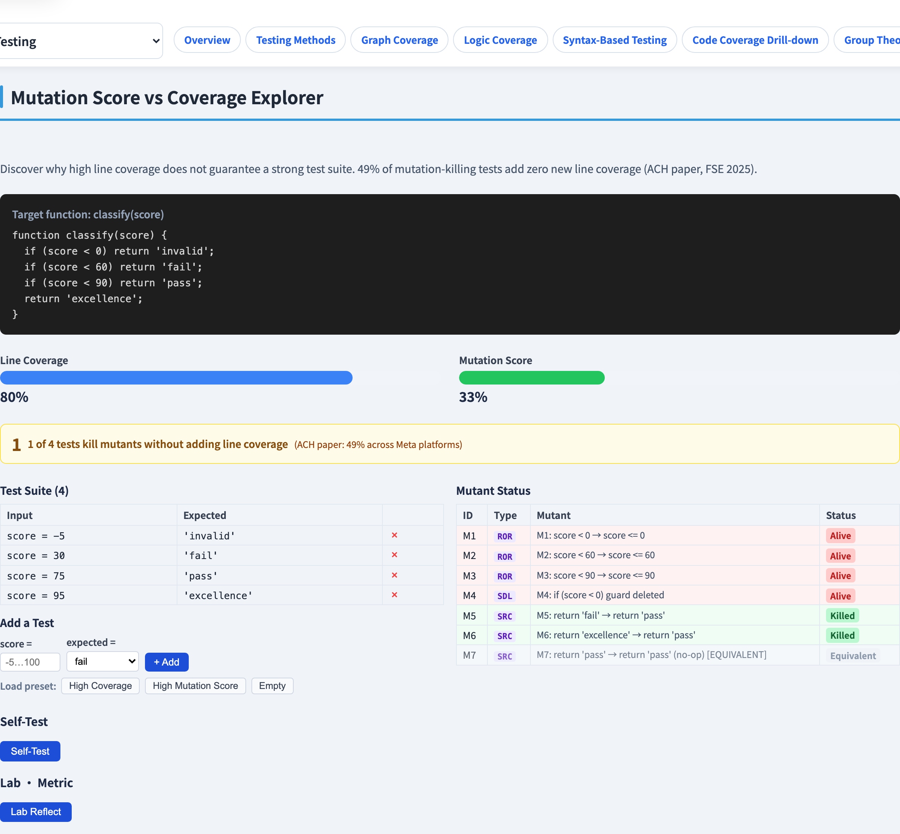

# 突變分數（Mutation Score）
### 覆蓋率說「執行過」；突變說「*測過*」

軟體測試視覺化系列 #33 · 進階測試
搭配工具：`/section-advanced`（[MutationScoreExplorer](../../src/components/MutationScoreExplorer.js)）

<!-- 這一講回答 #18 提出的限制：覆蓋率度量執行、不度量檢查。突變測試度量檢查。 -->

---

## 為什麼有這一講

- 程式碼覆蓋率（#18）告訴你某一行**跑過了** —— 不代表測試會**抓到**那裡的 bug。
- 一個測試可以執行每一行卻*什麼都不斷言*：100% 覆蓋、0% 抓錯。
- 突變測試問一個更銳利的問題：*如果我把程式弄壞，會有測試失敗嗎？*
- **突變分數**把「這個套件好不好？」化為一個數字。

---

## 觀念：植入錯誤，看誰會發現

1. 取程式與測試套件（目前是**通過**的）。
2. 做出許多有錯的小副本 —— **突變體** —— 每個改一處。
3. 對每個突變體跑套件。
4. 若有測試現在**失敗**，該突變體被**殺死**。若所有測試仍通過，它**存活**。

> 一個存活的突變體，是你套件抓不到的一個真實 bug。

---

## 突變算子

一個**突變算子**是生成一個錯誤的規則。常見的有：

| 算子 | 例子改動 |
| --- | --- |
| 關係 | `a < b` → `a <= b` |
| 算術 | `a + b` → `a - b` |
| 邏輯 | `a && b` → `a \|\| b` |
| 常數 | `return 0` → `return 1` |
| 刪除語句 | 移除一行 |

每個算子模擬一個*合理的程式設計師失誤*。把它們套遍程式碼，就得到突變體族群。

---

## 殺死、存活、等價

每個突變體最後落在三種狀態之一：

- **殺死** —— 有測試失敗 → 套件*偵測*到這個錯誤。好。
- **存活** —— 所有測試通過 → 套件*漏掉*這個錯誤。一個測試缺口。
- **等價** —— 行為與原程式相同（#32）→ *無法*被殺死。從分數中排除。

等價那一類，正是 #32 要先講的原因。

---

## 突變分數公式

$$
\text{突變分數} = \frac{\text{殺死的突變體}}{\text{突變體總數} - \text{等價突變體}}
$$

- 分母**排除**等價突變體 —— 否則分數會被不公平地壓在 100% 以下。
- 分數越高 ＝ 套件抓到越多植入的錯誤。
- 一個**存活（非等價）**的突變體，是一個可行動的待辦：寫出那個能殺死它的測試。

---

## 覆蓋率 vs 突變 —— 對照

| | 程式碼覆蓋率 | 突變分數 |
| --- | --- | --- |
| 度量 | 程式碼被**執行** | 錯誤被**偵測** |
| 會被無斷言測試騙嗎？ | 會 | 不會 |
| 成本 | 便宜 | 昂貴（套件 ×#突變體 各跑一次） |
| 回答 | 「我*跑了*什麼？」 | 「我*會抓到*什麼？」 |

突變測試是更強的訊號 —— 也是更貴的。覆蓋率是日常指標；突變分數是稽核。

---

## 工具演示

在 `/section-advanced` 開啟**突變分數探索器**：

1. 讀目標函式與它植入的突變體。
2. 挑一個測試預設 —— 看它殺死哪些、哪些存活。
3. 看分數：`殺死 / (總數 − 等價)`。
4. 加一個測試去殺死一個存活者，看分數上升。

---

## 工具 —— 植入的突變體與測試套件

一個目標函式、它的突變體，以及對每個突變體跑的套件。

---

## 工具 —— 分數儀表板

殺死 / (總數 − 等價) —— 存活者指出套件的缺口。

---

## 小結

- 突變測試植入**突變體**（小錯誤），檢查套件能否**殺死**它們。
- **突變算子**模擬合理的程式設計師失誤。
- 每個突變體是**殺死**、**存活**，或**等價**（排除）。
- **突變分數 ＝ 殺死 / (總數 − 等價)** —— 它度量*抓錯能力*，而覆蓋率只度量*執行*。

**課堂練習：** 一個測試跑了某函式但沒有 `assert`。它的語句覆蓋率是 100%。它的突變分數是多少？為什麼？

---

## 延伸閱讀

- 課程規格 —— 突變測試章節（[Specification.zh-TW.md](../Specification.zh-TW.md)）
- DeMillo, Lipton & Sayward（1978）—— 原始的突變分析
- 工具原始碼：[MutationScoreExplorer.js](../../src/components/MutationScoreExplorer.js)
- 相關：**#18 程式碼覆蓋** · **#32 等價突變體** · **#34 LLM 測試生成管線**
