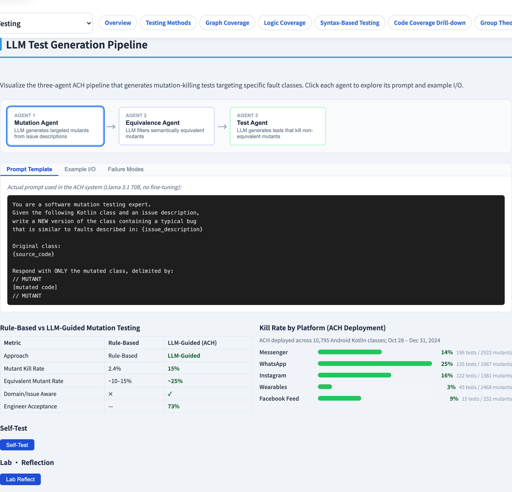
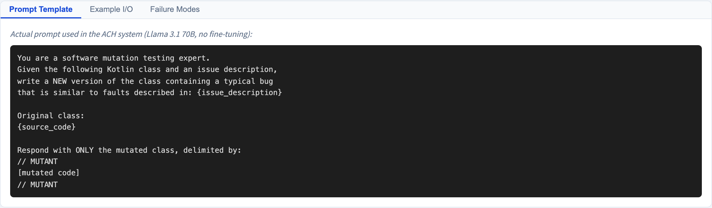

# LLM-Based Test Generation Pipeline
### Making an LLM *reliable* at writing tests

Software Testing Visualization series #34 · Advanced Testing
Companion tool: `/section-advanced` ([LLMPipelineExplorer](../../src/components/LLMPipelineExplorer.js))

<!-- Based on the ACH paper (Meta, arXiv 2501.12862). The lecture's thesis: a raw LLM is unreliable; a *pipeline around it* is not. -->

---

## Why this lecture exists

- "Ask an LLM to write tests" produces tests that *look* plausible — and often assert nothing useful.
- A test that passes but checks nothing **adds coverage and zero fault detection** (#33).
- Meta's **ACH** (Automated Compliance Hardener, arXiv 2501.12862) makes LLM test generation *reliable* by wrapping the model in a pipeline.
- The pipeline's backbone is **mutation testing** — the objective measure of #33.

---

## The problem with a raw LLM

Prompt an LLM with "write tests for this function" and you get:

- Tests that compile and pass — but with weak or tautological assertions.
- No objective signal of whether a test would *catch* anything.
- The LLM has no ground truth; "looks like a test" is not "is a good test".

ACH's fix: give the LLM a **target** — a specific fault to catch — and an **oracle** — mutation testing — to verify it did.

---

## The three-stage pipeline

ACH chains three LLM-driven stages:

```
   ┌───────────┐   ┌──────────────┐   ┌──────────────┐
   │ 1 Mutation│──▶│ 2 Equivalence│──▶│ 3 Test       │
   │ generation│   │   filtering  │   │  generation  │
   └───────────┘   └──────────────┘   └──────────────┘
```

| Stage | What it does |
| --- | --- |
| 1. Mutation | Generate candidate faults (mutants) in the target code |
| 2. Equivalence | Discard equivalent mutants (#32) — they cannot be killed |
| 3. Test generation | Generate a test that **kills** each surviving mutant |

---

## Stage 3 has a built-in oracle

The crucial design point: stage 3's success is **objectively checkable.**

- The LLM writes a test aimed at a specific surviving mutant.
- Run it: does it **pass on the original** and **fail on the mutant**?
- If yes → the test provably catches that fault — **keep it.**
- If no → discard, or re-prompt the LLM.

> The LLM proposes; **mutation testing disposes.** No human judges every test.

This is why the pipeline is reliable where a raw LLM is not.

---

## Why mutation testing is the backbone

Each pipeline stage leans on mutation concepts from #32–#33:

- Stage 1 *is* mutation generation.
- Stage 2 *is* the equivalent-mutant filter.
- Stage 3 uses **"kills the mutant"** as the accept/reject test for every generated test.

The LLM supplies *fluency* (writing idiomatic test code); mutation testing supplies *ground truth* (did it actually work). Neither alone is enough.

---

## The headline result

On Meta's codebase, ACH was applied to thousands of classes:

- Generated tests targeting specific fault types (e.g. privacy-compliance regressions).
- A **majority of generated tests were accepted by engineers** in review.
- The win is *direction*: tests aimed at real fault classes, each verified to kill a mutant — not coverage for its own sake.

(See #36 for the coverage-driven vs fault-directed comparison.)

---

## Tool demonstration

In `/section-advanced`, open the **LLM Pipeline Explorer**:

1. Step through stages 1 → 2 → 3 on a sample target.
2. At stage 2, watch equivalent mutants get filtered out.
3. At stage 3, see a generated test run against original and mutant.
4. Note the accept/reject decision is the mutation-kill check — not human taste.

---

## Tool — the three-stage LLM pipeline



Generate, filter, validate — an objective gate at every hand-off.

---

## Tool — a stage in detail



Each agent's input and output — the kill-check decides accept or reject.

---


## Summary

- A raw LLM writes plausible but unverified tests — coverage without fault detection.
- **ACH** wraps the LLM in a 3-stage pipeline: **mutation → equivalence filter → test generation**.
- Stage 3 has an **objective oracle**: a kept test must pass on the original and fail on the mutant.
- The LLM gives fluency; **mutation testing gives ground truth.**

**In-class exercise:** why can stage 3 accept/reject tests automatically, while "ask an LLM for tests" cannot?

---

## Further reading

- *Mutation-Guided LLM-based Test Generation at Meta* (arXiv 2501.12862, FSE 2025)
- Course specification — AI-assisted testing chapter ([Specification.zh-TW.md](../Specification.zh-TW.md))
- Tool source: [LLMPipelineExplorer.js](../../src/components/LLMPipelineExplorer.js)
- Related: **#32 Equivalent Mutants** · **#33 Mutation Score** · **#36 Fault-Directed Testing**
