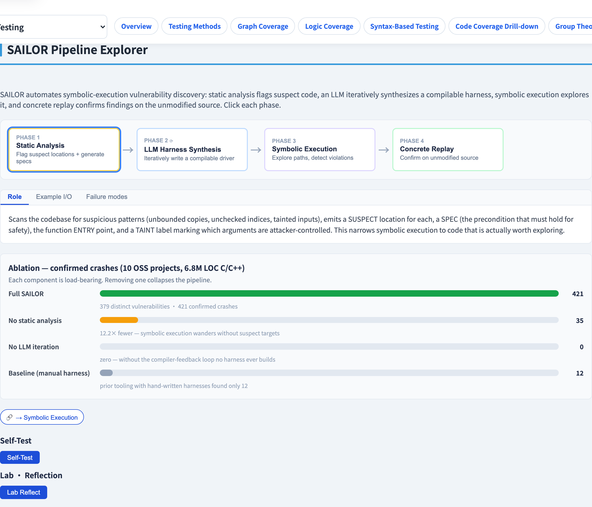
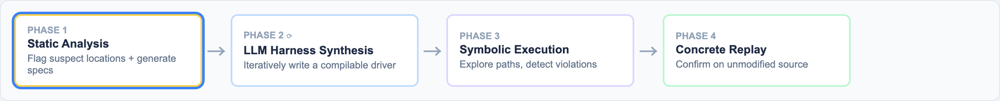

# SAILOR
### 靜態分析 ＋ LLM ＋ 符號執行，協同運作

軟體測試視覺化系列 #37 · 進階測試
搭配工具：`/section-advanced`（[SAILORPipelineExplorer](../../src/components/SAILORPipelineExplorer.js)）

<!-- SAILOR（arXiv:2604.06506）。本講論點：三個各自單獨會失敗的技術，串接起來就成功。 -->

---

## 為什麼有這一講

- 符號執行（#10）精確，但受**路徑爆炸**所苦 —— 它無法探索一切。
- 靜態分析快速且全面，卻**雜訊大** —— 它過度回報。
- LLM 流暢，卻**未經驗證** —— 它會幻覺。
- **SAILOR**（arXiv 2604.06506）把三者串接，讓每一個的強項補另一個的弱點 —— 目標是**漏洞發現**。

---

## 每個技術單獨的弱點

| 技術 | 強項 | 單獨使用的弱點 |
| --- | --- | --- |
| 靜態分析 | 快、覆蓋全程式 | 用誤報淹沒你 |
| 符號執行 | 精確、找得到真實輸入 | 路徑爆炸 —— 無法擴展 |
| LLM | 流暢、懂程式碼慣用法 | 沒有基準真相 —— 會幻覺 |

洞見：別只選一個。**串接**它們，讓每一個消化前一個的產出、並補償它的弱點。

---

## SAILOR 的四階段管線

```
 1 靜態      2 LLM 測試      3 符號       4 具體
   分析  ──▶   harness  ──▶   執行   ──▶   重播
   合成 ◀── 迭代 ──┘
```

| 階段 | 角色 |
| --- | --- |
| 1. 靜態分析 | 掃描整個程式；便宜地標出*可疑*位置 |
| 2. LLM harness 合成 | 寫一個聚焦的測試 harness 去驅動被標記的位置 |
| 3. 符號執行 | *只*探索那個 harness —— 路徑爆炸現在被界限住 |
| 4. 具體重播 | 真的執行解出的輸入 —— 確認漏洞 |

---

## 第 1 階段縮小搜尋

靜態分析先跑，因為它**便宜且全域**。

- 它無法*確認*一個 bug，但能便宜地說*「這個位置看起來有風險」*。
- 它的誤報在這裡可以容忍 —— 它是一個**過濾器**，不是判決。
- 它把一份簡短的目標清單交給階段 2–3，而非整個程式。

> 靜態分析把「到處搜尋」變成「在這裡搜尋」。

---

## 第 2 階段：LLM 寫 harness

符號執行需要一個**進入點** —— 一個設定好狀態並呼叫可疑程式碼的 harness。逐位置手寫無法擴展。

- LLM 為每個被標記的位置**合成一個聚焦的 harness**。
- 那個 harness 很小 —— 所以階段 3 的符號執行探索的是一個**有界限**的空間，閃過路徑爆炸。
- LLM 的產出*還不被信任* —— 階段 3 與 4 會驗證它。

---

## 第 3–4 階段：探索，然後證明它是真的

**第 3 階段 —— 符號執行**探索 harness 的路徑，並**求解**出一個能抵達可疑狀態的輸入（路徑條件 → SMT 求解器，如 #10）。

**第 4 階段 —— 具體重播**拿那個解出的輸入、**真的執行它**。

- 當掉／觸發漏洞 → 一個**已確認、可重現**的發現。
- 沒有 → 一個誤報；**回饋**回去（階段 2 的迭代箭頭）以精煉 harness。

重播就是那個基準真相，把一切幻覺或不精確的東西濾掉。

---

## 為什麼這條鏈有效

每個階段修正前一個的缺陷：

- 靜態分析的**雜訊** → 由符號執行 ＋ 重播*確認*真實 bug 來界限。
- 符號執行的**路徑爆炸** → 由 LLM *小而聚焦*的 harness 來界限。
- LLM 的**幻覺** → 由符號執行 ＋ 具體重播*驗證*它的 harness 來界限。

沒有單一技術被信任；被信任的是**管線**。（對照 ACH，#34 —— 同樣的哲學：LLM 提議，一個客觀檢查裁決。）

---

## 工具演示

在 `/section-advanced` 開啟 **SAILOR 管線探索器**：

1. 對一個範例目標，逐步走過階段 1 → 2 → 3 → 4。
2. 在階段 1，看靜態分析標出的可疑位置。
3. 在階段 2，讀 LLM 合成的 harness。
4. 在階段 4，看一個已確認的發現 —— 以及誤報上的迭代回饋箭頭。

---

## 工具 —— SAILOR 管線



靜態分析 → LLM harness → 符號執行 → 具體重播。

---

## 工具 —— 四個階段



每個階段界限住前一個的弱點 —— 雜訊、爆炸、幻覺。

---


## 小結

- **SAILOR** 串接靜態分析、一個 LLM、與符號執行，用於漏洞發現。
- 四階段：**靜態分析 → LLM harness 合成 → 符號執行 → 具體重播**（階段 2–3 迭代）。
- 每個階段補償前一個的弱點 —— 雜訊、路徑爆炸、幻覺。
- **具體重播**是基準真相：只有可重現的發現能存活。

**課堂練習：** SAILOR 的哪個階段防止路徑爆炸，怎麼防的？哪個階段防止你對一個幻覺出來的 harness 採取行動？

---

## 延伸閱讀

- *SAILOR: Guiding Symbolic Execution with Static Analysis and LLMs for Vulnerability Discovery*（arXiv 2604.06506, 2026）
- 課程規格 —— 符號執行章節（[Specification.zh-TW.md](../Specification.zh-TW.md)）
- 工具原始碼：[SAILORPipelineExplorer.js](../../src/components/SAILORPipelineExplorer.js)
- 相關：**#10 符號執行** · **#11 具體符號執行** · **#34 LLM 測試管線**
