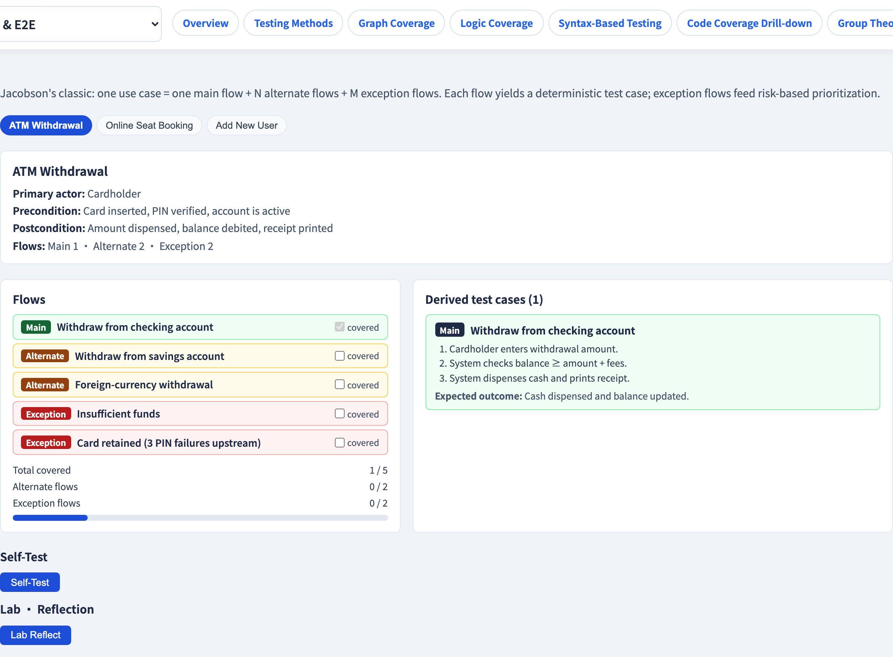
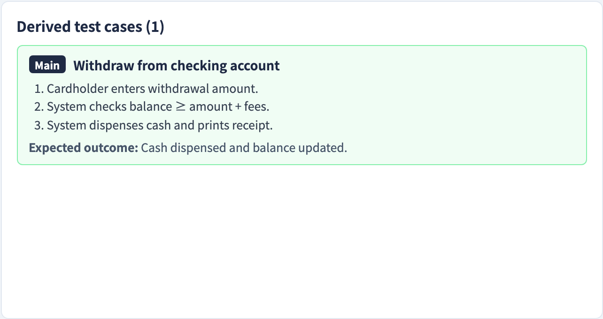

# Use-Case Test Derivation
### Every flow through a use case is a test

Software Testing Visualization series #39 · Acceptance & E2E
Companion tool: `/section-acceptance` ([UseCaseDerivationExplorer](../../src/components/UseCaseDerivationExplorer.js))

<!-- A use case is a black-box spec of a whole interaction. This lecture is the recipe for converting that interaction into a test suite. -->

---

## Why this lecture exists

- Requirements often arrive as **use cases**: a goal-oriented description of how an actor interacts with the system.
- A use case is rich — it describes the *happy path* and what happens when things go wrong.
- Each distinct path through it is a distinct behaviour — and therefore a distinct **test case**.
- This lecture is the systematic recipe: **use case → flows → test cases.**

---

## Anatomy of a use case

| Part | Meaning |
| --- | --- |
| **Actor** | Who initiates the interaction |
| **Goal** | What the actor wants to achieve |
| **Preconditions** | What must be true to start |
| **Flows** | The sequences of steps to the goal — or away from it |

Example — *ATM withdrawal*: actor = card-holder; goal = withdraw cash; precondition = card inserted.

---

## The three kinds of flow

A use case contains more than the happy path:

- **Main flow** — the success path. Everything goes right.
- **Alternate flows** — *other ways to still succeed* (e.g. choose a different account).
- **Exception flows** — *ways it fails* (wrong PIN, insufficient funds, card retained).

```
            ┌─ alternate flow ─┐
 start ──▶ main flow ──────────┴──▶ goal achieved
            └─ exception flow ──▶ goal NOT achieved
```

A common bug source: teams test the main flow and forget the exception flows.

---

## The derivation rule

> **One flow → one test scenario.**

For each flow:

- **Setup** = the use case's preconditions plus whatever steers execution into *this* flow.
- **Steps** = the flow's step sequence.
- **Expected result** = that flow's outcome (goal achieved, or the specific failure).

Cover **every** flow — main, alternate, *and* exception — and the use case is fully exercised.

---

## Worked example: ATM withdrawal

| Flow | Kind | Test scenario |
| --- | --- | --- |
| Withdraw with valid PIN, sufficient funds | main | cash dispensed, balance updated |
| Withdraw from savings instead of checking | alternate | cash dispensed from the chosen account |
| Wrong PIN entered | exception | access denied, retry offered |
| Insufficient funds | exception | transaction rejected, no cash |
| Three wrong PINs | exception | card retained |

One use case → five test scenarios — and the exception flows are *most* of them.

---

## Use cases and BDD

Use-case flows map cleanly onto Gherkin (#38):

- Each **flow** becomes a **Scenario**.
- Preconditions → **Given**; the triggering step → **When**; the outcome → **Then**.

So use-case derivation is the *analysis* step; BDD/Gherkin is one *notation* for writing the resulting scenarios down. They are complementary, not competing.

---

## Tool demonstration

In `/section-acceptance`, open the **Use-Case Derivation Explorer**:

1. Load a use case (e.g. ATM) and read its flows, colour-coded by kind.
2. See main, alternate and exception flows distinguished.
3. For each flow, read the derived test scenario.
4. Count: how many test cases came from the exception flows alone?

---

## Tool — a use case and its flows



Main, alternate and exception flows, colour-coded by kind.

---

## Tool — the derived test cases



One test scenario per flow — exception flows pull their weight.

---


## Summary

- A **use case** describes a goal-oriented interaction — actor, goal, preconditions, flows.
- It has **main**, **alternate** and **exception** flows; the exceptions are easy to forget.
- Derivation rule: **one flow → one test scenario** — cover every flow.
- Use-case derivation is the analysis; **BDD/Gherkin** is one way to write the scenarios.

**In-class exercise:** write the main, one alternate and two exception flows for "log in to a web app". How many test cases is that?

---

## Further reading

- Course specification — acceptance testing chapter ([Specification.zh-TW.md](../Specification.zh-TW.md))
- Cockburn, *Writing Effective Use Cases* (2000)
- Tool source: [UseCaseDerivationExplorer.js](../../src/components/UseCaseDerivationExplorer.js)
- Related: **#38 BDD & Gherkin** · **#40 E2E User Journeys**
