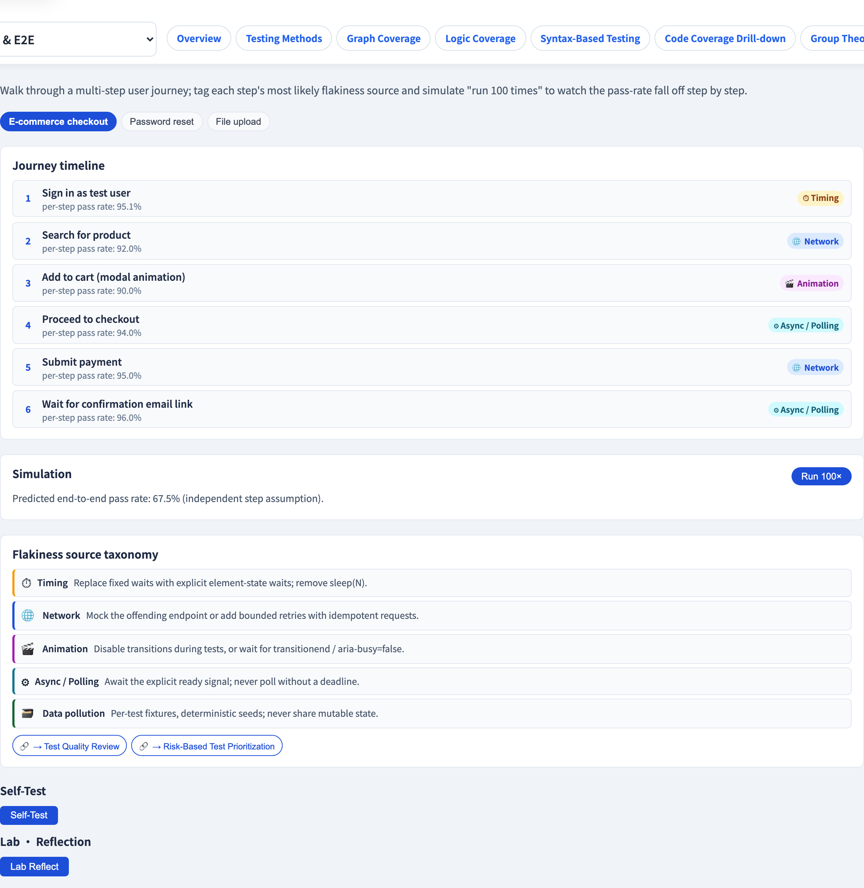

# End-to-End User Journeys
### One test, the whole system, a real user's path

Software Testing Visualization series #40 · Acceptance & E2E
Companion tool: `/section-acceptance` ([E2EUserJourneyExplorer](../../src/components/E2EUserJourneyExplorer.js))

<!-- E2E sits at the tip of the test pyramid (#17). The lecture must give it its due AND be honest about its fragility. -->

---

## Why this lecture exists

- Unit and integration tests check parts; they never prove the *whole* works for a real user.
- An **end-to-end (E2E)** test drives a complete **user journey** through the fully-running system — UI, services, database, the lot.
- It is the most realistic test there is — and, for the same reason, the slowest and most fragile.
- This lecture covers both: the power *and* the cost.

---

## What a user journey is

A journey is an ordered sequence of steps a real user takes to reach a goal:

```
 Browse ─▶ Add to cart ─▶ Checkout ─▶ Pay ─▶ Confirmation
```

- Each step touches *several* layers of the system at once.
- The test passes only if **every step** succeeds, in order, against the real stack.
- This is realism that no lower-level test can offer.

---

## Why E2E is powerful

- It exercises the system the way a **customer actually uses it** — the ultimate validation (#15).
- It catches **integration and configuration** defects that unit tests structurally cannot see.
- A green E2E journey is strong evidence the feature genuinely works.

This is why E2E sits at the **top of the pyramid** (#17) — high confidence per test.

---

## Why E2E is fragile — the failure sources

An E2E test fails for many reasons that are **not real bugs**:

| Failure source | Example |
| --- | --- |
| **Timing** | the test acts before the page finished loading |
| **Network** | a slow or dropped request to a backend |
| **Animation** | clicking an element mid-transition |
| **Test data** | a fixture changed or expired |
| **Environment** | a service was down, a config drifted |

Each source can fail *any* step — and the journey fails if *any* step fails. Long journeys multiply this risk.

---

## The compounding-fragility problem

If each step has even a small independent chance of a spurious failure, a long journey is fragile *overall*:

```
 10 steps, each 99% reliable  →  0.99¹⁰ ≈ 90% journey pass rate
```

A 10% spurious-failure rate makes the test **flaky** (#45) — and a flaky E2E test erodes trust in the whole suite. Fragility is not a detail; it is *the* design constraint.

---

## Using E2E well

- **Few, not many** — keep E2E for the handful of critical journeys (the pyramid tip, #17).
- **Push detail down** — verify edge cases at the unit/integration level; let E2E prove the *path*, not every branch.
- **Stabilize** — wait on conditions, not fixed delays; control test data; isolate the environment.
- When a journey fails, **diagnose the source** before assuming a bug (#45).

---

## Tool demonstration

In `/section-acceptance`, open the **E2E User Journey Explorer**:

1. Load a journey (e.g. `checkout`) and read its ordered steps.
2. Run it — see which step failed and the dominant failure source.
3. Toggle failure sources (timing, network, animation…) and re-run.
4. Watch the journey pass rate fall as steps or failure sources increase.

---

## Tool — an end-to-end journey



An ordered sequence of steps, simulated and scored for pass rate.

---

## Tool — the journey steps


Each step tagged with the failure sources that can break it.

---


## Summary

- An **E2E test** drives a complete **user journey** through the fully-running system — maximum realism.
- It catches integration / configuration defects and is the ultimate validation.
- It is **fragile**: timing, network, animation, data and environment can fail a step without a real bug.
- Fragility **compounds** over long journeys — keep E2E **few, critical, and stabilized**.

**In-class exercise:** for a 6-step journey where each step is 98% reliable, estimate the journey pass rate. Is that acceptable?

---

## Further reading

- Course specification — E2E testing chapter ([Specification.zh-TW.md](../Specification.zh-TW.md))
- Google Testing Blog — *Just Say No to More End-to-End Tests*
- Tool source: [E2EUserJourneyExplorer.js](../../src/components/E2EUserJourneyExplorer.js)
- Related: **#17 The Test Pyramid** · **#45 Flaky Test Diagnosis**
