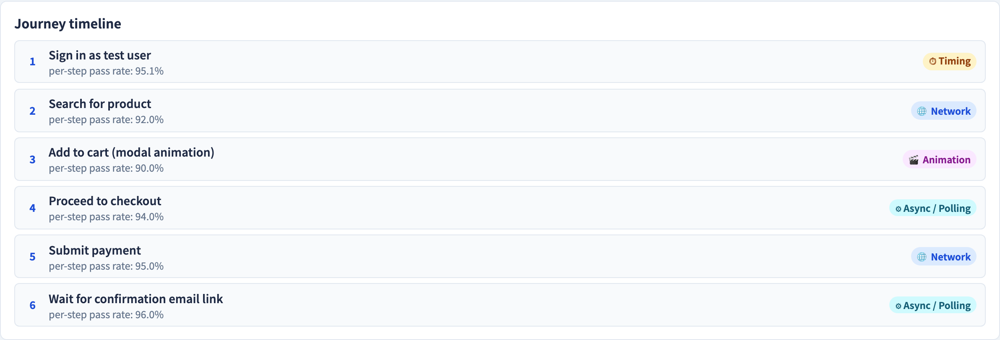

# 端到端使用者旅程
### 一個測試、整個系統、一條真實使用者的路徑

軟體測試視覺化系列 #40 · 驗收與 E2E
搭配工具：`/section-acceptance`（[E2EUserJourneyExplorer](../../src/components/E2EUserJourneyExplorer.js)）

<!-- E2E 位於測試金字塔（#17）的尖端。本講要給它應得的評價，也要誠實面對它的脆弱。 -->

---

## 為什麼有這一講

- 單元與整合測試檢查零件；它們從不證明*整體*對真實使用者能運作。
- 一個**端到端（E2E）**測試在完整運行的系統上驅動一段完整的**使用者旅程** —— UI、服務、資料庫，全部。
- 它是最真實的測試 —— 也正因如此，最慢、最脆弱。
- 這一講兩者都談：那份力量*與*那份代價。

---

## 什麼是使用者旅程

一段旅程是真實使用者為達成目標而走的有序步驟序列：

```
 瀏覽 ─▶ 加入購物車 ─▶ 結帳 ─▶ 付款 ─▶ 確認
```

- 每一步都同時觸及系統的*好幾層*。
- 測試只有在**每一步**都依序、對著真實技術堆疊成功時才通過。
- 這是任何較低層測試都給不了的真實度。

---

## E2E 為何強大

- 它以**顧客實際使用的方式**操練系統 —— 終極的確認（#15）。
- 它抓出單元測試在結構上看不見的**整合與組態**缺陷。
- 一條綠燈的 E2E 旅程，是功能真的能運作的有力證據。

這就是為什麼 E2E 位於**金字塔頂端**（#17）—— 每個測試的信心高。

---

## E2E 為何脆弱 —— 失敗來源

E2E 測試會因許多*並非真實 bug* 的原因而失敗：

| 失敗來源 | 例子 |
| --- | --- |
| **時序** | 測試在頁面載完之前就動作 |
| **網路** | 對後端的請求緩慢或被丟棄 |
| **動畫** | 在轉場進行到一半時點擊元素 |
| **測試資料** | 一份 fixture 變了或過期了 |
| **環境** | 某個服務掛了、某個組態漂移了 |

每個來源都可能讓*任何*一步失敗 —— 而只要*任一*步失敗，旅程就失敗。長旅程把這個風險放大。

---

## 脆弱性複利問題

若每一步即使只有微小、獨立的偽失敗機率，一段長旅程*整體*就很脆弱：

```
 10 步，每步 99% 可靠  →  0.99¹⁰ ≈ 90% 旅程通過率
```

10% 的偽失敗率讓測試變得**易碎（flaky）**（#45）—— 而一個易碎的 E2E 測試會侵蝕對整個套件的信任。脆弱不是細節；它*就是*那個設計約束。

---

## 善用 E2E

- **少，而非多** —— 把 E2E 留給少數幾條關鍵旅程（金字塔尖端，#17）。
- **把細節往下推** —— 在單元／整合層級驗證邊界案例；讓 E2E 證明*那條路徑*，而非每個分支。
- **穩定化** —— 等待條件、而非固定延遲；掌控測試資料；隔離環境。
- 當旅程失敗時，先**診斷來源**，再假設是 bug（#45）。

---

## 工具演示

在 `/section-acceptance` 開啟 **E2E 使用者旅程探索器**：

1. 載入一段旅程（如 `checkout`），讀它的有序步驟。
2. 跑它 —— 看哪一步失敗、以及主要的失敗來源。
3. 切換失敗來源（時序、網路、動畫…）並重跑。
4. 看著旅程通過率隨步驟數或失敗來源增加而下降。

---

## 工具 —— 一段端到端旅程


一連串有序的步驟，模擬執行並計算通過率。

---

## 工具 —— 旅程步驟



每一步標註可能讓它失敗的失敗來源。

---


## 小結

- 一個 **E2E 測試**在完整運行的系統上驅動一段完整的**使用者旅程** —— 最大的真實度。
- 它抓出整合／組態缺陷，是終極的確認。
- 它**脆弱**：時序、網路、動畫、資料、環境都能讓一步失敗而非真實 bug。
- 脆弱性會在長旅程上**複利** —— 讓 E2E 維持**少、關鍵、且穩定**。

**課堂練習：** 對一段 6 步、每步 98% 可靠的旅程，估算旅程通過率。那可接受嗎？

---

## 延伸閱讀

- 課程規格 —— E2E 測試章節（[Specification.zh-TW.md](../Specification.zh-TW.md)）
- Google Testing Blog —— *Just Say No to More End-to-End Tests*
- 工具原始碼：[E2EUserJourneyExplorer.js](../../src/components/E2EUserJourneyExplorer.js)
- 相關：**#17 測試金字塔** · **#45 Flaky 測試診斷**
