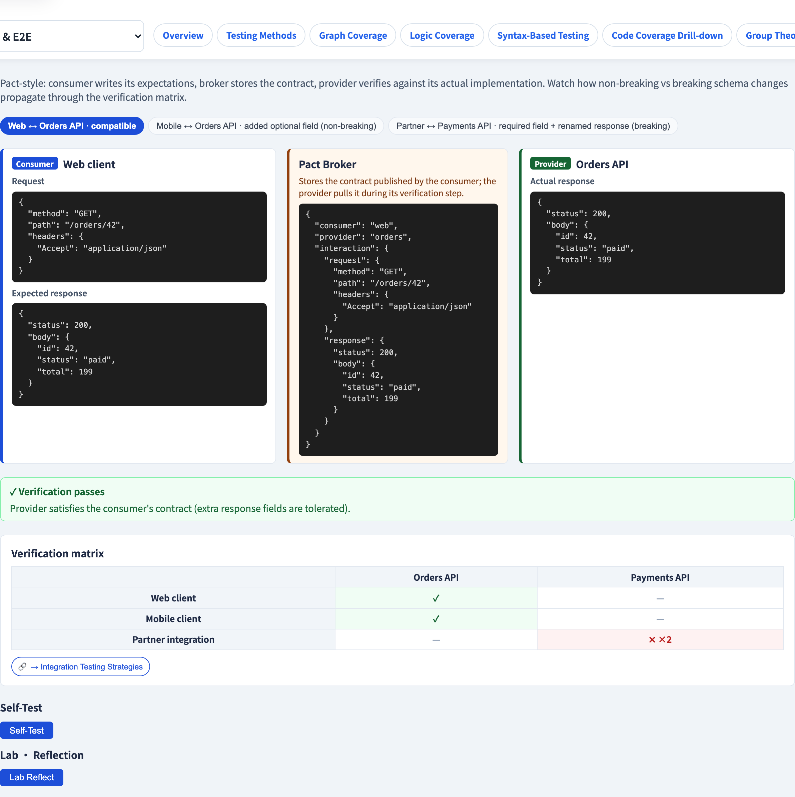
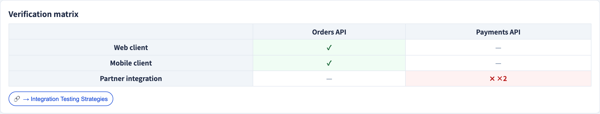

# Contract Testing
### Verify the *interface* without deploying both sides

Software Testing Visualization series #41 · Acceptance & E2E
Companion tool: `/section-acceptance` ([ContractTestingExplorer](../../src/components/ContractTestingExplorer.js))

<!-- Contract testing is the pragmatic answer to "E2E is too slow and flaky" for service-to-service integration. -->

---

## Why this lecture exists

- Microservices integrate over APIs. When a **provider** changes its API, every **consumer** can silently break.
- A full E2E environment to catch this (#40) is slow, flaky and expensive to keep running.
- **Contract testing** verifies the *interface agreement* between two services — **without** deploying both together.
- It catches breaking API changes early, fast, and on a normal CI run.

---

## Consumer and provider

| Role | Meaning |
| --- | --- |
| **Consumer** | The service that *calls* an API |
| **Provider** | The service that *implements* the API |
| **Contract** | The consumer's recorded expectation of the provider's responses |

The consumer says: *"when I call `GET /orders/42`, I expect a JSON object with `id`, `total` and `status`."* That recorded expectation **is** the contract.

---

## Consumer-driven contracts

The defining idea: the **consumer** writes the contract, from what it *actually uses*.

```
 Consumer test  ──records──▶  Contract  ──verified against──▶  Provider
   "I need id,                                                  "do I still
    total, status"                                               return those?"
```

- The contract captures only the fields the consumer **depends on** — not the whole API.
- The provider runs the contract against itself in *its own* CI.
- Neither side needs the other deployed — each tests against the **contract**.

---

## What counts as a breaking change

The provider's CI replays the contract and diffs the real response against the consumer's expectation:

| Change | Breaking? |
| --- | --- |
| Remove a field the consumer reads | **yes** |
| Rename a field | **yes** |
| Change a field's type (`number` → `string`) | **yes** |
| Make a required field optional / nullable | **yes** |
| **Add** a new field the consumer ignores | no |

> The rule: **don't take away — or change — what a consumer relies on.** Adding is safe.

---

## Where contract testing sits

It fills the gap between two unsatisfying options:

- **Unit tests with a mocked API** — fast, but the mock can *drift* from the real provider. You test a fiction.
- **Full E2E** (#40) — real, but slow and flaky.
- **Contract testing** — fast like a unit test, yet the contract is *verified against the real provider*. The mock can no longer drift.

It is the integration safety net that runs on every commit.

---

## Tool demonstration

In `/section-acceptance`, open the **Contract Testing Explorer**:

1. Read a scenario: the consumer's expectation vs the provider's actual response.
2. See the structural diff — which fields match, which differ.
3. Watch a breaking change (removed / renamed / retyped field) get flagged.
4. Add a new field and confirm it is **not** breaking.

---

## Tool — consumer expectation vs provider response



A contract scenario: what the consumer expects against what the provider sends.

---

## Tool — the structural diff



Field-by-field — a removed or retyped field is flagged as breaking.

---


## Summary

- **Contract testing** verifies the interface agreement between a **consumer** and a **provider** — without deploying both.
- **Consumer-driven**: the consumer records only the fields it depends on; the provider verifies it still honours them.
- **Breaking** = remove / rename / retype / weaken a depended-on field; **adding** is safe.
- It is the fast, non-flaky middle ground between mocked unit tests and full E2E.

**In-class exercise:** a provider renames `total` to `amount`. A consumer reads `total`. Breaking? What if the provider keeps both?

---

## Further reading

- Course specification — integration & acceptance chapter ([Specification.zh-TW.md](../Specification.zh-TW.md))
- Pact documentation — consumer-driven contract testing
- Tool source: [ContractTestingExplorer.js](../../src/components/ContractTestingExplorer.js)
- Related: **#30 Integration Testing** · **#40 E2E User Journeys**
