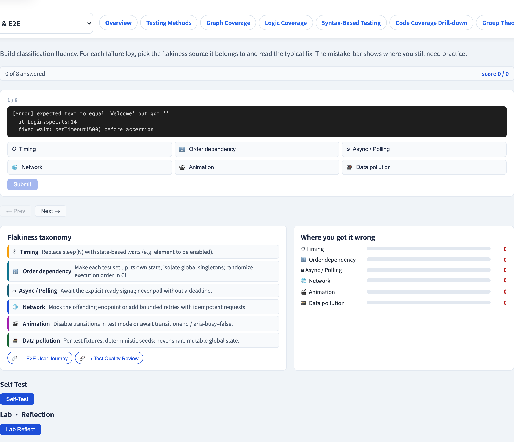
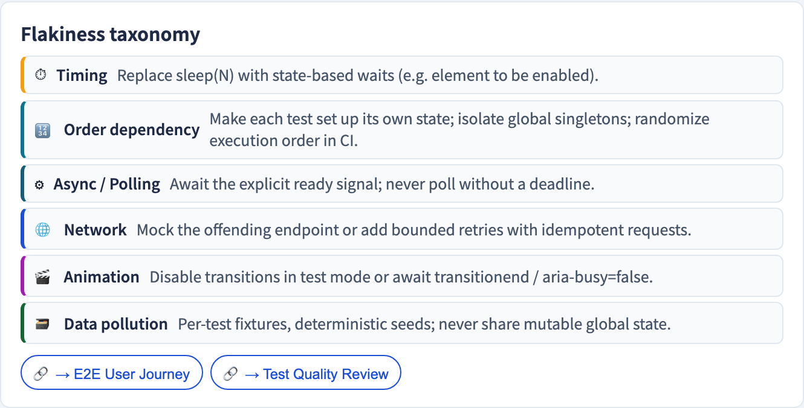

# Flaky 測試診斷
### 那個無緣無故失敗的測試 —— 而那「無緣無故」本身就是緣故

軟體測試視覺化系列 #45 · 驗收與 E2E
搭配工具：`/section-acceptance`（[FlakyDiagnosisExplorer](../../src/components/FlakyDiagnosisExplorer.js)）

<!-- 收尾驗收系列。E2E（#40）點名 flaky 是代價；這一講是如何診斷與管理它。 -->

---

## 為什麼有這一講

- 一個 **flaky 測試**在**程式碼或測試都沒有任何改動**的情況下時過時敗。
- 它是測試套件裡最具腐蝕性的東西：它訓練團隊**無視紅燈**。
- 一旦「再跑一次就好」變成習慣，一個*真實的*失敗就藏在 flake 之間。
- Flaky 不是該容忍的雜訊 —— 它是**測試裡的一個缺陷**，要去診斷並修。

---

## Flaky 測試為何如此有害

- 一個紅色的 build 不再代表「壞了」→ 團隊不再信任套件。
- 真實的回歸溜過去，被當成「大概只是 flaky」打發掉。
- CI 時間燒在重跑上。
- 信任一旦失去，重建很昂貴。

> 一個被無視的 flaky 測試，毒化整個套件的訊號。

---

## Flaky 測試分類法

Flaky 有可辨識的**成因** —— 每一種都在日誌裡留下指紋：

| 成因 | 典型症狀 |
| --- | --- |
| **時序／非同步** | 在元素／回應就緒之前就動作了 |
| **網路** | 對相依的請求緩慢或被丟棄 |
| **動畫** | 在元素轉場進行到一半時與它互動 |
| **測試順序** | 單獨跑通過、在某測試之後跑失敗（共享狀態） |
| **並行** | 平行操作之間的競態 |
| **環境／資料** | 時鐘、語系或 fixture 在兩次執行間不同 |

診斷就是**分類**：讀失敗日誌、比對指紋。

---

## 從日誌診斷

你很少親眼看著一次 flake 發生 —— 你事後從**失敗日誌**診斷它：

- 導航之後立刻*「找不到元素」* → **時序**。
- *孤立跑通過、在套件中失敗* → **測試順序**／共享狀態。
- *等待請求逾時* → **網路**。
- *因機器或時段而不同* → **環境**。

日誌是證據；分類法是那組嫌疑犯。

---

## 順序相依 —— 最狡猾的那一種

一個**單獨跑通過、卻在某測試之後失敗**的測試，是順序相依的：

```
   testB 單獨        → 通過
   testA，然後 testB → 失敗   ← testA 留下了共享狀態
```

bug 不在 `testB` —— 而在於測試**沒有被隔離**。修法：每個測試自己設置與拆卸它的狀態，使順序無法構成影響。

---

## 隔離（Quarantine）：先止血，再修

你無法立刻修好每一個 flake —— 但你必須阻止它侵蝕信任：

1. **隔離** —— 把 flaky 測試移出會阻擋的套件。build *現在*就重新可信任。
2. **排程修復** —— 隔離是一個暫留區，不是墳場。被隔離的測試仍背著一個待辦。
3. **修根因** —— 依類別：等待條件而非延遲；隔離狀態；把網路用樁替代；掌控時鐘。
4. **送回**會阻擋的套件，一旦它穩定。

> 隔離 ≠ 刪除。刪除失去覆蓋；隔離買到時間。

---

## 工具演示

在 `/section-acceptance` 開啟 **Flaky 診斷探索器**：

1. 讀一份失敗日誌樣本。
2. 把它分類進分類法 —— 把指紋比對到一個成因。
3. 用說明對照你的診斷。
4. 注意建議的修法因類別而異。

---

## 工具 —— 診斷一次 flaky 失敗



一份失敗日誌樣本，待對照 flaky 分類法分類。

---

## 工具 —— flaky 分類法



每個類別有自己的指紋 —— 以及自己建議的修法。

---


## 小結

- 一個 **flaky 測試**在沒有程式碼改動下時過時敗 —— 它**毒化**對整個套件的信任。
- Flaky 有可辨識的成因：**時序、網路、動畫、測試順序、並行、環境**。
- **診斷 ＝ 分類** —— 讀日誌、比對指紋。
- **隔離**先止血；接著依類別修**根因**。隔離不是刪除。

**課堂練習：** 一個測試約每 20 次失敗 1 次，訊息是「stale element reference」。哪一類？修法是什麼？

---

## 延伸閱讀

- 課程規格 —— 測試可靠度章節（[Specification.zh-TW.md](../Specification.zh-TW.md)）
- Google Testing Blog —— *Flaky Tests* 系列
- 工具原始碼：[FlakyDiagnosisExplorer.js](../../src/components/FlakyDiagnosisExplorer.js)
- 相關：**#40 E2E 使用者旅程** · **#M4 持續測試** · **#M6 回歸與測試債**
